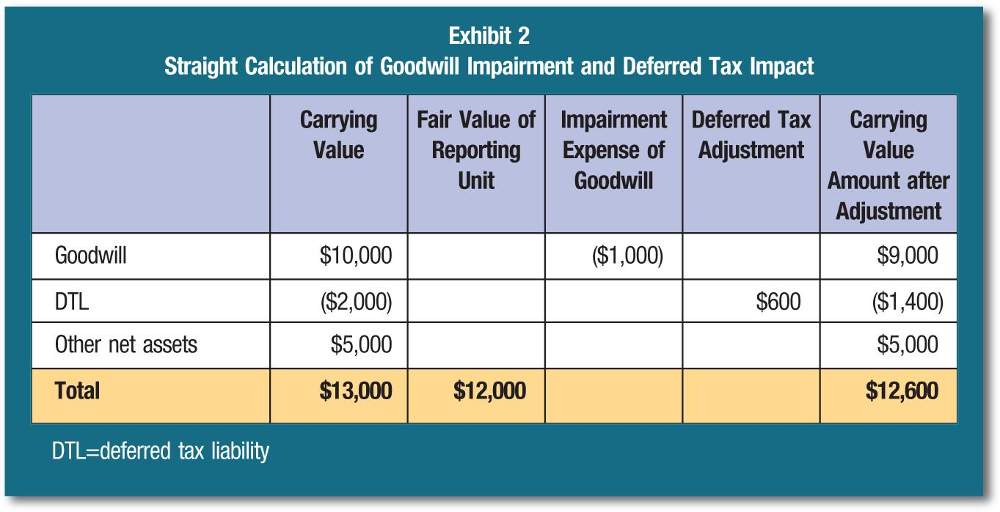

## Table of Contents

## What is goodwill in accounting?

Goodwill in accounting is an intangible asset that represents the value of a business beyond its tangible assets and liabilities. When a company is bought for more than the fair value of its net assets, the difference is recorded as goodwill on the buyer's balance sheet. This extra value can come from things like a strong brand name, good customer relationships, or a solid team of employees.

Goodwill is not something you can touch or see, but it can be very important to a business. It shows how much a company is worth because of things like its reputation or loyal customers. When a company is sold, the amount of goodwill can affect how much the buyer has to pay. Goodwill is checked every year to make sure it is still worth the amount recorded on the balance sheet, and if it's not, the value might need to be reduced.

## How is goodwill initially recorded on a company's balance sheet?

When a company buys another company, they might pay more than what the other company's assets are worth. This extra amount is called goodwill. To record goodwill on the balance sheet, the buying company first adds up all the things they can see and touch from the company they bought, like buildings, machines, and money in the bank. They also look at any debts the company has. The total value of these assets minus the debts is called the net asset value.

If the price the buying company paid is more than this net asset value, the difference is recorded as goodwill. For example, if a company pays $1 million to buy another company, and the net assets of the bought company are worth $700,000, the goodwill recorded would be $300,000. This goodwill is then listed as an intangible asset on the buyer's balance sheet, showing that they believe the company they bought is worth more than just its physical stuff.

## What is goodwill impairment?

Goodwill impairment happens when the value of goodwill on a company's balance sheet is more than what it's actually worth. Companies need to check their goodwill every year to see if it's still worth the amount they recorded. If they find out that the goodwill is not worth as much as they thought, they have to lower its value on their balance sheet. This is called an impairment.

To figure out if goodwill is impaired, companies look at the value of the part of the business that the goodwill is connected to. They compare this value to what they paid for it, including the goodwill. If the value of the business part is less than what they paid, they have to reduce the goodwill amount. This shows everyone that the company they bought isn't worth as much as they first thought, and it can affect the company's overall financial health.

## Why does goodwill impairment occur?

Goodwill impairment happens when the value of a business that a company bought goes down. When a company buys another business, they might pay more than the value of the things they can see and touch, like buildings or machines. This extra amount they pay is called goodwill. But if the business they bought doesn't do as well as expected, or if the market changes and the business is worth less, the goodwill they recorded on their balance sheet is not worth that much anymore. That's when they need to lower the value of the goodwill, which is called an impairment.

There are many reasons why the value of a business might go down, leading to goodwill impairment. For example, the business might lose important customers, or new competitors might come into the market and make it harder for the business to make money. Sometimes, the economy might not be doing well, and people are not buying as much. All these things can make the business worth less than when it was bought. When this happens, the company has to check their goodwill and see if it's still worth the amount they recorded. If it's not, they have to lower the goodwill value on their balance sheet to show the true value of the business.

## How often should a company test for goodwill impairment?

A company should test for goodwill impairment at least once every year. This is important because it helps the company make sure the value of the goodwill on their balance sheet is still correct. If the value of the business they bought goes down, they need to know about it and adjust their records.

Sometimes, a company might need to test for impairment more often than once a year. This can happen if something big changes, like if the business starts losing a lot of money or if there's a big change in the market. When these things happen, the company should check their goodwill right away to see if it's still worth the same amount.

## What are the steps to perform a goodwill impairment test?

To perform a goodwill impairment test, a company first needs to figure out the fair value of the part of the business that the goodwill is connected to. They do this by looking at the business's cash flows, market conditions, and other things that affect its value. If the fair value of this part of the business is less than its carrying amount, including the goodwill, then the company needs to do a second step to find out how much the goodwill is impaired.

In the second step, the company compares the fair value of the part of the business with the fair value of all its assets and liabilities, except for goodwill. The difference between these two values is the implied fair value of the goodwill. If this implied fair value is less than the carrying amount of the goodwill on the balance sheet, then the goodwill is impaired. The company then has to reduce the value of the goodwill on their balance sheet by the amount of the impairment, which means they have to show a loss on their income statement.

This process helps make sure that the value of the goodwill on the company's balance sheet is still correct and reflects the true value of the business they bought. If the value of the business goes down, the company needs to adjust their records to show this change.

## What is the difference between the qualitative and quantitative approaches to goodwill impairment testing?

The qualitative approach to goodwill impairment testing is a way for companies to see if they need to do a more detailed test. They look at things like how the business is doing, changes in the market, or any other signs that might mean the value of the business has gone down. If they think the value might be less than what's on their balance sheet, they go to the next step, which is the quantitative test. If they don't see any big problems, they can skip the detailed test and keep the goodwill value the same.

The quantitative approach is a more detailed way to test for goodwill impairment. In this method, companies do calculations to find out the fair value of the part of the business that the goodwill is connected to. They compare this fair value to the value on their balance sheet, including the goodwill. If the fair value is less, they need to figure out the implied fair value of the goodwill by looking at the fair value of all the assets and liabilities, except for the goodwill. If this implied value is less than the recorded goodwill, they have to reduce the goodwill value on their balance sheet. This approach is more work, but it gives a clear number to show if the goodwill is worth less than what's recorded.

## How is the fair value of a reporting unit determined during a goodwill impairment test?

To figure out the fair value of a reporting unit during a goodwill impairment test, companies look at different ways to measure value. One way is to use the market approach, where they see what similar businesses are worth in the market. Another way is the income approach, where they predict how much money the business will make in the future and figure out what that's worth now. They might also use the cost approach, which looks at how much it would cost to replace the business's assets.

After choosing an approach, companies gather information like how much money the business is making, what's happening in the market, and any other things that might affect its value. They use this information to calculate the fair value of the reporting unit. If this fair value is less than the value on the balance sheet, including the goodwill, the company needs to do more calculations to see if the goodwill is worth less than what's recorded. This helps them make sure their balance sheet shows the true value of the business.

## What are the financial reporting requirements after a goodwill impairment is recognized?

When a company finds out that their goodwill is worth less than what they recorded, they have to show this change on their financial statements. They do this by reducing the value of the goodwill on their balance sheet. This means they write down the goodwill to its new, lower value. They also have to show a loss on their income statement for the amount of the impairment. This tells everyone looking at their financial statements that the value of the business they bought went down.

After the goodwill impairment is recognized, the company needs to explain it in their financial reports. They have to tell people why the goodwill is worth less now and how they figured out the new value. This helps everyone understand what happened and why the numbers on the financial statements changed. It's important for the company to be clear about these things so that people can trust their financial information.

## How does goodwill impairment affect a company's financial statements?

When a company finds out that the goodwill they recorded is worth less than what they thought, they have to change their financial statements. They do this by lowering the value of the goodwill on their balance sheet. This means they write down the goodwill to its new, lower value. They also have to show a loss on their income statement for the amount of the impairment. This tells everyone looking at their financial statements that the value of the business they bought went down.

After the goodwill impairment is recognized, the company needs to explain it in their financial reports. They have to tell people why the goodwill is worth less now and how they figured out the new value. This helps everyone understand what happened and why the numbers on the financial statements changed. It's important for the company to be clear about these things so that people can trust their financial information.

## What are the tax implications of goodwill impairment?

When a company writes down the value of its goodwill because it's worth less than what they thought, it can affect their taxes. In many places, a company can't take a tax deduction for goodwill impairment right away. This means they can't lower their taxable income for that year just because the goodwill is worth less. They have to keep the same tax value for the goodwill until they sell the business or part of it.

But, if a company sells the business or the part with the impaired goodwill, they might be able to use the lower value to figure out their taxes. When they sell, they can compare what they paid for the business, including the goodwill, to what they sell it for. If they sell it for less than what they paid, they might be able to claim a loss on their taxes. This can help lower their tax bill, but it depends on the tax rules where the company is.

## What are the best practices for managing and minimizing the risk of goodwill impairment?

To manage and minimize the risk of goodwill impairment, companies should regularly check the value of their businesses. This means looking at how well the business is doing, what's happening in the market, and any other things that might change its value. By keeping an eye on these things, a company can see early if the value might go down and take action before it becomes a big problem. They can also use the qualitative approach to see if they need to do a more detailed test, which can save time and money if they don't see any big issues.

Another good practice is to be careful when buying other businesses. Companies should make sure they're not paying too much for the goodwill. They can do this by doing a lot of research and using experts to help them figure out a fair price. If they pay a reasonable amount, the risk of having to write down the goodwill later goes down. Also, after buying a business, companies should work on making it better and growing it, so its value stays high or goes up. This can help keep the goodwill on their balance sheet worth what they recorded.

## References & Further Reading

1. **Goodwill, Impairment Testing, and Financial Reporting:**

   - KPMG. "Goodwill Impairment Testing: Industry Insights and Accounting Standards." Available at: [KPMG Goodwill Impairment Guide](https://home.kpmg/xx/en/home/insights/2020/12/goodwill-impairment.html)
   - Financial Accounting Standards Board (FASB). "Accounting Standards Codification Topic 350 - Intangibles—Goodwill and Other." Available at: [FASB ASC 350](https://asc.fasb.org)

2. **Accounting Standards on Goodwill:**

   - International Financial Reporting Standards (IFRS). "International Accounting Standard 36 (IAS 36) – Impairment of Assets." Access at: [IFRS IAS 36](https://www.ifrs.org/issued-standards/list-of-standards/ias-36-impairment-of-assets/)
   - Generally Accepted Accounting Principles (GAAP). "Standards for Goodwill Accounting and Reporting." Refer to official summaries: [GAAP Guidelines](https://fasb.org/jsp/FASB/Page/SectionPage&cid=1218220137062)

3. **Algorithmic Trading and Finance Technology Integration:**

   - Narang, R. (2013). "Inside the Black Box: The Simple Truth About Quantitative Trading." A comprehensive book on quantitative trading strategies.
   - Aldridge, I. (2009). "High-Frequency Trading: A Practical Guide to Algorithmic Strategies and Trading Systems." Discusses various algorithmic strategies.

4. **Financial Analysis and Modern Technology:**

   - Hull, J. C. (2018). "Options, Futures, and Other Derivatives." Provides insight into derivatives and their role in present-day financial markets.
   - Fabozzi, F. J., & Fabozzi, P. (2009). "Financial Modeling of the Equity Market: From CAPM to Cointegration." Explores the intersection of finance theory and practical model applications.

5. **Technology's Role in Financial Markets:**

   - Gomber, P., Arndt, B., Lutat, M., & Uhle, T. (2011). "High-Frequency Trading." [Electronic Markets, Vol. 21, pages 205-221](https://link.springer.com/article/10.1007/s12525-011-0078-9). This article examines the impact of high-frequency trading on market efficiency.

6. **Online Learning and Resources:**

   - Coursera and edX offer modules on financial accounting principles, algorithmic trading, and the role of financial technology in market operations. Explore offerings from institutions like Wharton School or MIT Sloan School of Management for courses on modern finance strategies.

These curated sources will provide foundational knowledge and advanced insights into goodwill accounting practices, impairment testing, and the integration of [algorithmic trading](/wiki/algorithmic-trading) techniques in financial markets.

