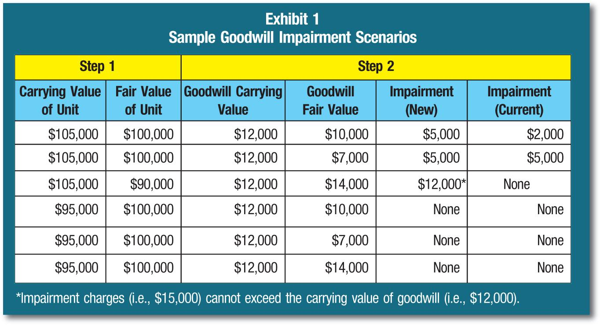

In the increasingly complex world of finance, accounting principles and automated trading solutions are converging in ways that present both challenges and opportunities. Central to this intersection is the concept of goodwill impairment testing. Goodwill, an intangible asset that often emerges during company acquisitions, requires rigorous evaluation to maintain the integrity of financial statements. Its impairment occurs when there is a significant downturn in value, necessitating a write-down to reflect its true value on the balance sheet.

Modern algorithmic trading strategies are not only about speed and efficiency but also about integrating comprehensive financial analysis. By understanding the principles governing accounting concepts like goodwill impairment, traders can refine their models with deeper financial insights, potentially enhancing decision-making accuracy. Incorporating goodwill impairment data into trading algorithms provides a nuanced perspective on a company's financial health, which can influence market predictions and risk assessments.



Our exploration will focus on unraveling these complex yet fascinating intersections, providing a comprehensive overview of how accounting methods and financial technologies synergize. This understanding is crucial, as it enables the creation of trading systems that are both technologically advanced and financially astute. As we progress, we will examine how these integrations shape strategies that meet the demands of today's dynamic financial markets.

## Table of Contents

## Understanding Goodwill and Its Impairment

Goodwill is an important intangible asset that emerges during business combinations. It appears on balance sheets when a company acquires another and pays more than the fair market value of the acquired company's identifiable net assets. This premium reflects future economic benefits that are not individually identified or separately recognized, such as brand strength, customer relations, or proprietary technology.

### Recognition of Goodwill
Upon acquisition, goodwill is recognized as the excess of the cost of acquisition over the net identifiable assets acquired and liabilities assumed. This can be expressed mathematically as follows:

$$
\text{Goodwill} = \text{Purchase Price} - (\text{Fair Value of Assets} - \text{Liabilities})
$$

The recognition of goodwill is a key aspect of the acquisition method under the International Financial Reporting Standards (IFRS) and the Generally Accepted Accounting Principles (GAAP). It represents the prospective advantages of synergy, employee talent, and customer loyalty that the acquirer anticipates.

### Evaluating Goodwill
Goodwill presents evaluation challenges due to its intangible nature and dependency on projections of future performance. It does not independently generate cash flows and is susceptible to the overall performance of the acquired entity. Consequently, maintaining its accurate valuation on financial statements is critical for informed investor perceptions and strategic decision-making.

### Goodwill Impairment
Goodwill impairment occurs when the carrying amount of goodwill surpasses its recoverable amount, the higher of fair value less costs of disposal or value-in-use. Impairment testing is mandated annually or when indicators suggest potential impairment. This testing ensures that the reported value of goodwill reflects its actual economic usefulness.

The impairment process involves assessing for indicators such as:

- Adverse economic conditions
- Changes in market dynamics
- Internal reporting metrics signaling underperformance

### Testing for Goodwill Impairment
The basic steps in goodwill impairment testing include:

1. **Qualitative Assessment**: Determining whether there is a need for further quantitative testing based on potential impairment indicators.

2. **Quantitative Testing**: If necessary, calculating the asset's recoverable amount and comparing it to the carrying amount. This involves cash flow projections and discount rate assessments.

### Importance in Financial Statements
Effective management of goodwill and its potential impairment is vital for the truthfulness of financial statements. It impacts key metrics like earnings and equity, thereby affecting credit evaluations and stock valuations. Accurate impairment testing supports integrity in reporting, ensuring stakeholders have a clear view of the company's actual financial health.

By understanding goodwill and its impairment processes, stakeholders can gain insights that aid in more precise assessment and strategy formulation.

## Performing the Goodwill Impairment Test

The goodwill impairment test is an essential process in accounting to ensure that a company's financial statements accurately reflect its asset base. This multi-step process begins with qualitative assessments and proceeds to a rigorous quantitative analysis if initial findings suggest potential impairment.

Initially, qualitative assessments involve considering both internal and external factors that may affect the asset's value. Internal factors might include changes in management strategies or restructuring within the company, while external factors could involve shifts in market conditions or competitive landscapes. Businesses need to remain vigilant to these indicators, as they can signal the need for a more detailed quantitative analysis.

If these preliminary assessments suggest that impairment might exist, the next step is to conduct a quantitative evaluation. This involves comparing the carrying value of goodwill on the balance sheet with its recoverable amount. The recoverable amount is typically the higher of the fair value minus costs of disposal and its value in use. An impairment loss is recognized if the carrying amount of the asset exceeds its recoverable amount, requiring a write-down to reflect this difference.

Mathematically, this can be expressed as:

$$
\text{Impairment Loss} = \text{Carrying Amount} - \text{Recoverable Amount}
$$

To ensure precision in the impairment testing, companies must consider various economic variables, regulatory changes, and developments within their specific sectors. This requires a thorough analysis of how such factors might impact future cash flow projections and the overall valuation of assets.

Accurate impairment testing is not merely a compliance exercise but a critical practice for maintaining transparent and truthful financial records. By reflecting the actual value of assets, businesses can provide stakeholders with a clear and accurate picture of their financial health. Implementing thorough and methodical impairment testing processes is vital for companies aiming to uphold the integrity of their financial reporting.

## Goodwill Impairment and Algo Trading: Connections and Implications

Automated trading systems have become an integral part of financial markets, employing sophisticated algorithms to analyze a plethora of financial metrics, including asset impairments. Goodwill impairment, in particular, is a crucial [factor](/wiki/factor-investing) as it directly affects a company's financial health and, consequently, its market valuation and trading strategies. Understanding its implications on [algorithmic trading](/wiki/algorithmic-trading) involves recognizing how asset valuation adjustments can refine trading models and inform decision-making processes.

Goodwill impairment is triggered when the carrying amount of goodwill exceeds its recoverable amount, necessitating a write-down. This impairment can signify potential weaknesses in a company's operational or financial prospects. For algorithmic traders, incorporating such impairment data into trading models can enhance the predictive accuracy of these models concerning market movements. For example, a significant goodwill impairment might suggest the need for a trading strategy adjustment, considering potential fluctuations in stock prices stemming from market reactions to revised financial statements.

Incorporating goodwill impairment data into algorithmic trading models involves several technical approaches. Machine learning algorithms, such as regression analysis or neural networks, can be employed to detect patterns that precede market reactions to accounting adjustments. By integrating impairment indicators into these predictive models, traders can gain insights into potential stock performance deviations. An example using Python might involve the application of regression analysis to correlate impairment announcements with subsequent stock price movements:

```python
import pandas as pd
from sklearn.linear_model import LinearRegression

# Load data
data = pd.read_csv('impairment_stock_data.csv')

# Define features and target
X = data[['impairment_value', 'market_cap', 'sector']]
y = data['stock_price_change']

# Initialize and fit the model
model = LinearRegression()
model.fit(X, y)

# Predict stock price change based on new impairment data
new_data = [[1500000, 200000000, 'technology']]  # Example input
predicted_change = model.predict(new_data)
```

As automated trading systems continue to evolve, incorporating detailed financial analyses like goodwill impairment can drive improved risk management and trading precision. An essential aspect of this integration is ensuring that models are adaptive to new financial disclosures and can adjust trading strategies dynamically. By embedding accounting metrics into trading algorithms, firms can enhance their ability to react to market conditions in real-time, providing a strategic edge in competitive markets.

Furthermore, integration of goodwill impairment data ensures that trading systems align with comprehensive financial reporting standards. This alignment aids both in mitigating the risks associated with asset impairments and in capitalizing on opportunities presented by market inefficiencies.

In summary, the intersection of goodwill impairment and algorithmic trading illustrates the broader trend of merging accounting insights with technological trading solutions. As these systems develop, they will continue to transform financial markets by enhancing both the speed and accuracy of trading decisions.

## Challenges and Best Practices in Managing Algorithmic Trading and Goodwill Impairment

Managing the intersection of algorithmic trading and goodwill impairment involves navigating a set of complex challenges that are rooted in both financial reporting and trading operations. Key challenges include effective data integration, ensuring timely and accurate real-time updates, and maintaining the regulatory compliance essential for both accounting and trading activities.

**Data Integration and Real-Time Updates**

Data integration is critical in aligning the varied datasets from financial reports and trading systems. The data generated from goodwill impairment testing needs to be seamlessly incorporated into trading algorithms to enhance decision-making. Real-time data updates offer another layer of complexity. Trading algorithms depend on up-to-date information to make accurate predictions and execute trades efficiently. Thus, integrating real-time updates from accounting systems to trading platforms is essential.

**Leveraging Technology for Data Analysis**

Modern technology presents tools that enable the sophisticated analysis required for both domains. Machine learning and [artificial intelligence](/wiki/ai-artificial-intelligence) can be harnessed to detect patterns and anomalies in financial data, providing insights that inform trading strategies. Through data analytics platforms, companies can process large datasets, ensuring that crucial details from goodwill impairment tests are not lost when used in trading algorithms.

For instance, Python libraries such as Pandas and NumPy can be employed to handle and analyze financial data:

```python
import pandas as pd
import numpy as np

# Sample data for goodwill impairment
data = {
    'Company': ['Company A', 'Company B'],
    'Impairment Value': [1500000, 950000],
    'Market Value Change': [0.05, -0.02]
}

df = pd.DataFrame(data)

# Calculate the impact on trading strategy
df['Trading Strategy Adjustment'] = df['Impairment Value'] * df['Market Value Change']

print(df)
```

**Regulatory Compliance and Continuous Learning**

Staying updated with evolving regulations is vital for managing goodwill impairments and trading strategies. Regular training on current financial reporting standards and compliance requirements is necessary. This ongoing education ensures that personnel are aware of the implications of accounting rules on trading systems and can adapt quickly to regulatory changes.

Continuous learning extends to leveraging advancements in technology to refine both accounting and trading processes. Organizations should invest in training programs that focus on these developments, ensuring staff are equipped to handle the integration of new technological solutions.

**Streamlining Processes and Reducing Errors**

Automating routine tasks can significantly reduce human error in financial reporting and trading operations. By adopting robotic process automation (RPA), companies can ensure that data from goodwill impairment tests is accurately processed and promptly fed into trading systems. Automation also frees up resources for more strategic tasks, enhancing overall efficiency and accuracy.

**Strategic Advantages and Optimization**

Embracing best practices in managing algorithmic trading with goodwill impairment information can provide strategic advantages. By optimizing their financial and trading strategies, businesses can better manage risk, predict market shifts, and improve financial outcomes. This optimization hinges on a strong alignment between financial reporting accuracy and trading system responsiveness.

In conclusion, by addressing these challenges through the adoption of technological advancements, regulatory diligence, and continuous improvement, companies can effectively manage the complexities at the intersection of accounting and trading, ensuring both financial integrity and trading success.

## Conclusion

The convergence of accounting principles and algorithmic trading signifies a promising advancement in finance, blending precision with technical innovation. This intersection demands a comprehensive understanding and prudent management, as it involves not only compliance with regulatory mandates such as goodwill impairment testing but also the strategic utilization of such accounting practices to enhance trading outcomes.

Goodwill impairment testing, traditionally viewed as a financial reporting obligation, is emerging as an integral component of modern trading strategies. It facilitates a thorough evaluation of a company's asset health, which is essential for developing informed trading decisions. The precise calculation of impairment—where the carrying amount exceeds the recoverable amount—is crucial for maintaining the integrity of financial statements and subsequently informs trading algorithms designed to adapt to market conditions.

By marrying complex accounting knowledge with advanced algorithmic systems, companies can achieve a dual goal: ensuring financial statements' accuracy and leveraging this data to gain market advantages. Such integration necessitates sophisticated software capable of real-time analysis and adjustment, reflecting market dynamics and financial realities. These systems must be robust, designed to bridge the varied elements of finance, from traditional accounting methodologies to state-of-the-art trading technologies.

As the financial landscape continues to evolve, businesses must persist in exploring and refining the interplay between accounting practices and trading solutions. The potential synergies offer opportunities for enhanced competitiveness and efficiency, positioning companies to better navigate the complexities of modern markets. In leveraging these advancements, organizations can develop not only a more accurate financial portrait but also a strategic edge in an increasingly automated trading environment.

## References & Further Reading

[1]: ["Goodwill and Other Intangible Assets (Topic 350): Accounting Standards Update."](https://viewpoint.pwc.com/dt/us/en/fasb_financial_accou/asus_fulltext/2014/asu_201402intangible/asu_201402intangible_US/asu_201402intangible_US.html) Financial Accounting Standards Board (FASB).

[2]: Kieso, D. E., Weygandt, J. J., & Warfield, T. D. (2019). ["Intermediate Accounting"](https://books.google.com/books/about/Intermediate_Accounting_IFRS.html?id=3XntDwAAQBAJ). Wiley.

[3]: Palepu, K. G., Healy, P. M., & Peek, E. (2019). ["Business Analysis and Valuation: IFRS edition"](https://books.google.com/books/about/Business_Analysis_and_Valuation_Using_Fi.html?id=IDT6DwAAQBAJ). Cengage Learning.

[4]: ["Advances in Financial Machine Learning"](https://www.amazon.com/Advances-Financial-Machine-Learning-Marcos/dp/1119482089) by Marcos Lopez de Prado

[5]: ["Machine Learning for Asset Managers"](https://www.amazon.com/Machine-Learning-Managers-Elements-Quantitative/dp/1108792898) by Marcos Lopez de Prado

[6]: ["Quantitative Investing: Strategies to exploit stock market anomalies for all investors"](https://www.amazon.com/Quantitative-Investing-Strategies-anomalies-investors/dp/0857193007) by Fred Piard