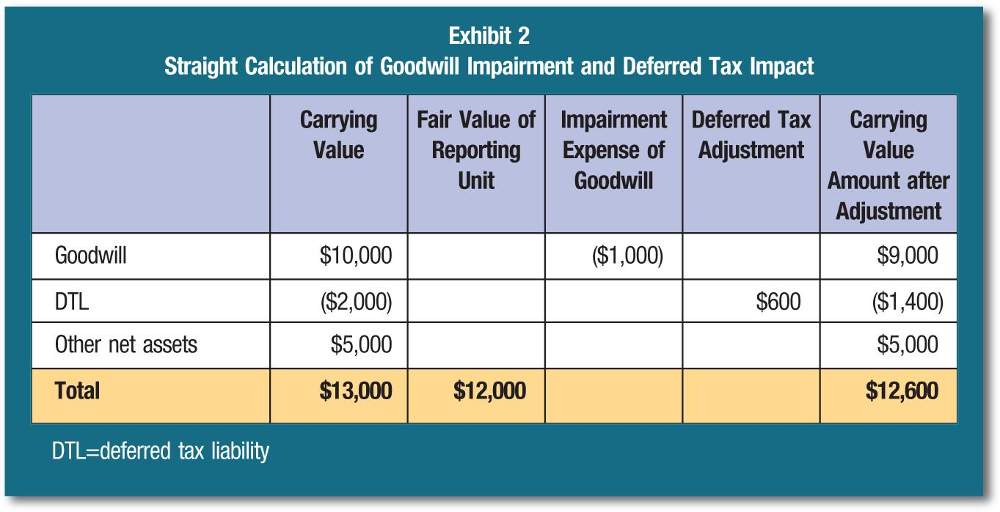

## Table of Contents

## What is goodwill impairment?

Goodwill impairment happens when the value of goodwill on a company's balance sheet goes down. Goodwill is an intangible asset that comes from buying another business for more than the value of its net assets. If the purchased business doesn't perform as well as expected, the value of goodwill might need to be reduced.

When a company thinks that the value of goodwill might be less, they do a test to see if it's true. If the test shows that the goodwill is worth less than what's on the books, the company has to lower the value of goodwill. This is called recording an impairment loss, and it makes the company's profits go down for that period.

## Why is it important to assess goodwill impairment?

It's important to assess goodwill impairment because it helps keep a company's financial statements honest and accurate. When a company buys another business, it might pay more than the actual value of what it's buying. This extra amount is called goodwill. But if the business they bought isn't doing as well as they hoped, the value of that goodwill might need to go down. By checking for impairment, the company makes sure that the numbers on their financial statements match the real value of what they own.

If a company doesn't check for goodwill impairment, it could end up showing a higher value for its assets than they're really worth. This can mislead investors and other people who look at the company's financial health. By regularly testing for impairment, the company can adjust the value of goodwill on its books to be more accurate. This helps everyone understand the true financial situation of the company and makes it easier to make smart decisions about investing or managing the business.

## How often should companies test for goodwill impairment?

Companies usually need to test for goodwill impairment at least once a year. This is a rule that helps make sure the numbers on their financial statements are correct. But, if something happens that might make the value of goodwill go down, like a big drop in the stock market or a new competitor showing up, the company should test for impairment right away, even if it's not the usual time.

By checking for goodwill impairment regularly, companies can keep their financial reports honest. This helps investors and others who look at the company's financial health to trust the numbers they see. It's important for companies to do these tests on time to avoid showing a higher value for their assets than they're really worth.

## What are the common causes of goodwill impairment?

Goodwill impairment can happen for a few common reasons. One big reason is when the business that was bought doesn't do as well as expected. This could be because it's not making as much money or because it's losing customers. Another reason is if the whole industry the business is in starts doing badly. For example, if there's a new law that makes it harder for companies in that industry to make money, the value of goodwill could go down.

Another cause of goodwill impairment is when the economy takes a hit. If there's a big economic downturn, like a recession, it can affect all businesses, making the value of goodwill drop. Also, if the company that bought the business runs into its own problems, like losing key people or having trouble with money, this can lead to goodwill impairment. All these things can make the value of the bought business less than what was paid for it, leading to a need to lower the value of goodwill on the books.

## Can you explain the difference between internal and external causes of goodwill impairment?

Internal causes of goodwill impairment come from problems inside the company that bought another business. For example, if the company doesn't manage the new business well, or if key people leave, the value of the bought business might go down. Another internal cause could be if the company that bought the business starts having financial trouble or other big problems. These internal issues can make the business they bought not perform as well as expected, leading to a need to lower the value of goodwill.

External causes of goodwill impairment come from things happening outside the company. For example, if the whole industry the bought business is in starts doing badly, like because of new laws or new competitors, this can hurt the value of the business. Another external cause could be a big economic downturn, like a recession, which can affect all businesses and lower the value of goodwill. These outside factors can make the business worth less than what was paid for it, leading to goodwill impairment.

## What is the process for testing goodwill impairment?

Testing for goodwill impairment usually involves two steps. First, the company looks at the fair value of the business unit that has the goodwill. They compare this fair value to the carrying amount, which is the value of the unit on the company's books. If the fair value is less than the carrying amount, it means there might be an impairment, and the company moves on to the second step. If the fair value is more than the carrying amount, then there's no impairment and the company doesn't need to do anything else.

In the second step, the company figures out the implied fair value of the goodwill. They do this by pretending to sell the business unit and seeing how much of the fair value would be left over after paying for all the other assets and liabilities. This leftover value is the implied fair value of the goodwill. If this implied fair value is less than the goodwill amount on the books, then the company has to lower the value of goodwill on its financial statements to match the implied fair value. This is called recording an impairment loss.

## How does the qualitative assessment for goodwill impairment work?

A qualitative assessment for goodwill impairment is a way for companies to check if they need to do a full test without doing all the math right away. They look at things like changes in the economy, new laws, or problems in their industry to see if these might have made the value of the business they bought go down. They also think about how well the business is doing and if there have been any big changes inside the company, like losing important people or having financial trouble. If they think these things might have lowered the value of the business, they decide to do the full test.

If the company decides that these factors haven't made the value of the business go down a lot, they can skip the full test. This saves them time and effort. But if they're not sure or if they think the value might be lower, they have to go ahead and do the full test to make sure their financial statements are accurate. This way, they can keep their books honest without always having to do a lot of detailed work.

## What quantitative methods are used in goodwill impairment testing?

When companies do the full test for goodwill impairment, they use numbers to figure out if the value of the business they bought has gone down. They start by finding the fair value of the business unit that has the goodwill. They compare this fair value to the carrying amount, which is what the unit is worth on their books. If the fair value is less than the carrying amount, it means there might be a problem, and they move on to the next step. If the fair value is more, then there's no problem and they don't need to do anything else.

In the next step, they figure out the implied fair value of the goodwill. They do this by pretending to sell the business unit and seeing how much money would be left after paying for all the other things the unit owns and owes. This leftover money is the implied fair value of the goodwill. If this number is less than the goodwill amount on their books, they have to lower the value of the goodwill. This means they record an impairment loss, which makes their profits go down for that time period.

## How do changes in market conditions affect goodwill impairment?

Changes in market conditions can have a big impact on goodwill impairment. If the market takes a downturn, like during a recession, it can make the value of the business a company bought go down. This is because the whole economy is doing badly, and businesses might not be making as much money. If the industry the bought business is in starts to struggle, maybe because of new laws or new competitors, this can also lower the value of the business. When these things happen, the company has to check if the goodwill on their books is still worth what they paid for it.

If the market conditions make the value of the business go down a lot, the company might have to lower the value of the goodwill. They do this by testing for impairment and seeing if the fair value of the business is less than what's on their books. If it is, they record an impairment loss, which means their profits for that time period go down. Keeping an eye on market conditions helps companies make sure their financial statements are honest and show the real value of what they own.

## What are the financial reporting requirements for goodwill impairment?

When a company finds out that the value of its goodwill has gone down, it has to follow some rules about telling people. These rules are set by groups like the Financial Accounting Standards Board (FASB) in the U.S. or the International Accounting Standards Board (IASB) for other countries. The company has to test for goodwill impairment at least once a year, but if something big happens that might make the value of goodwill go down, they should test it right away. If they find out the goodwill is worth less than what's on their books, they have to write down the value of the goodwill and show this as a loss on their income statement.

This loss is called an impairment loss, and it makes the company's profits for that time period go down. The company has to explain this loss in their financial reports, so people who look at the reports, like investors, know why the profits went down. By doing this, the company makes sure their financial statements are honest and show the real value of what they own. This helps everyone trust the numbers they see and make smart decisions about the company.

## How do goodwill impairment charges impact a company's financial statements?

When a company finds out that the value of its goodwill has gone down, it has to make a charge called a goodwill impairment charge. This charge is shown on the income statement as an expense, which makes the company's profits for that time period go down. The charge also makes the value of the assets on the balance sheet go down because the company has to lower the value of the goodwill on its books to match its new, lower value.

This can make the company look less profitable and less valuable to people who look at its financial statements, like investors. But, it's important for the company to show the real value of what it owns, so it has to make these charges when the value of goodwill goes down. By doing this, the company keeps its financial statements honest and helps everyone understand its true financial health.

## What are the strategic implications of goodwill impairment for a company's future operations?

When a company has to make a goodwill impairment charge, it can change how the company plans for the future. The charge makes the company's profits go down for that time period, which might make investors and others who look at the company's financial statements worried. They might think the company isn't doing well, which could make it harder for the company to get money from investors or borrow money from banks. This might make the company think twice about big plans like growing the business or buying other companies, because they might not have enough money to do these things.

Also, a goodwill impairment charge can make the company take a closer look at how it's running the business it bought. The company might need to change how it manages the business or find new ways to make it more successful. This could mean changing the people who are in charge, trying to sell more products, or even selling off parts of the business that aren't doing well. By fixing the problems that caused the impairment, the company can try to make the business worth more again and avoid having to make more impairment charges in the future.

## What is Financial Accounting for Goodwill Impairment?

Accounting for goodwill impairment is a crucial aspect of financial reporting, ensuring that a company's financial statements accurately reflect its financial condition. Goodwill is initially recognized as an intangible asset when a company acquires another business, and the purchase price exceeds the fair value of the identifiable net assets acquired. This excess value represents the expected future economic benefits arising from synergies, brand reputation, and other intangible assets that do not meet the criteria for separate recognition.

Financial accounting standards, namely the International Financial Reporting Standards (IFRS) and Generally Accepted Accounting Principles (GAAP), provide comprehensive guidelines to assess and report goodwill impairment. Under these frameworks, companies are required to perform impairment tests regularly to ascertain that recorded goodwill is not inflated beyond its recoverable amount. IFRS follows IAS 36, "Impairment of Assets," while GAAP adheres to ASC 350, "Intangibles—Goodwill and Other," both of which stipulate a test at least annually or more frequently if indicators of impairment are present.

The impairment test involves comparing the carrying amount of goodwill to its recoverable amount. In situations where the carrying amount exceeds the recoverable amount, an impairment loss is recognized. The recoverable amount is defined as the higher of fair value less costs of disposal and the value in use, which is often calculated using discounted cash flow models. This can be represented mathematically as:

$$
\text{Recoverable Amount} = \max(\text{Fair Value} - \text{Costs of Disposal}, \text{Value in Use})
$$

Regular impairment testing not only prevents the overstatement of assets and earnings but also fosters transparency in financial reporting. Transparent communication of impairment findings is essential to maintain stakeholder trust. Companies must disclose the assumptions and methodologies used in impairment testing in their financial statements, providing investors and analysts with insights into the rationale behind impairment decisions.

The accounting treatment of impairment losses has profound implications for a company's reported earnings and asset values. An impairment charge directly reduces the value of goodwill on the balance sheet and is recognized as an expense in the income statement, thus lowering net income for the period. This effect can alter key financial metrics and ratios, influencing investor perception and decision-making.

In conclusion, rigorous accounting for goodwill impairment is pivotal for the integrity of financial statements. By adhering to IFRS and GAAP standards, companies ensure that their financial reporting is both accurate and transparent, safeguarding investor confidence and enhancing financial stability.

## What are the implications of goodwill impairment on financial ratios?

Goodwill impairment charges significantly impact financial ratios, offering a distorted view of a company's financial condition if not accurately reported. These impairments affect key performance indicators, such as Return on Equity (ROE) and the debt-to-equity ratio, both of which are critical in assessing a company's financial health and risk profile.

**Return on Equity (ROE)** is calculated as:

$$
ROE = \frac{\text{Net Income}}{\text{Shareholder's Equity}}
$$

An impairment charge reduces net income since it's recorded as an expense. Consequently, a substantial impairment can result in a lower ROE, potentially misleading stakeholders regarding the company's profitability without reflecting the operational efficiencies or inefficiencies.

**Debt-to-Equity Ratio**, given by:

$$
\text{Debt-to-Equity Ratio} = \frac{\text{Total Liabilities}}{\text{Shareholder's Equity}}
$$

is similarly affected. As goodwill impairment decreases shareholder's equity, this ratio increases, suggesting a higher risk level and potentially affecting the firm's ability to secure finance or negotiate better credit terms.

The accurate reporting of impairment is essential for maintaining investor confidence and transparency in financial disclosures. Companies must strategically manage this reporting, ensuring proper and timely reflection of economic realities in their financial statements without compromising stakeholder trust.

Professional auditors are instrumental in maintaining the credibility of impairment assessments. Their objective assessment ensures that goodwill impairment considerations accurately reflect the company's financial standing, safeguarding against misstatements that could distort market perceptions. Auditors' expertise in evaluating these complex transactions fortifies the integrity of financial statements, promoting informed decision-making among investors and other stakeholders.

## References & Further Reading

[1]: ["IFRS Standards - IAS 36 Impairment of Assets"](https://www.ifrs.org/content/dam/ifrs/publications/pdf-standards/english/2021/issued/part-a/ias-36-impairment-of-assets.pdf) International Financial Reporting Standards.

[2]: ["FASB ASC 350 - Intangibles - Goodwill and Other"](https://viewpoint.pwc.com/dt/us/en/fasb_financial_accou/asus_fulltext/2021/asu2021-03/ASU-2021-03/asu202103.html) Financial Accounting Standards Board.

[3]: ["Valuation: Measuring and Managing the Value of Companies"](https://www.amazon.com/Valuation-Measuring-Managing-Companies-Finance/dp/1119610885) by McKinsey & Company, Tim Koller, Marc Goedhart, and David Wessels.

[4]: ["Quantitative Trading: How to Build Your Own Algorithmic Trading Business"](https://www.amazon.com/Quantitative-Trading-Build-Algorithmic-Business/dp/1119800064) by Ernest P. Chan

[5]: ["Financial Statement Analysis and Security Valuation"](https://www.mheducation.com/highered/product/Financial-Statement-Analysis-and-Security-Valuation-Penman.html) by Stephen H. Penman

[6]: ["The CFA Program Curriculum: Financial Reporting and Analysis"](https://www.cfainstitute.org/programs/cfa-program) CFA Institute.