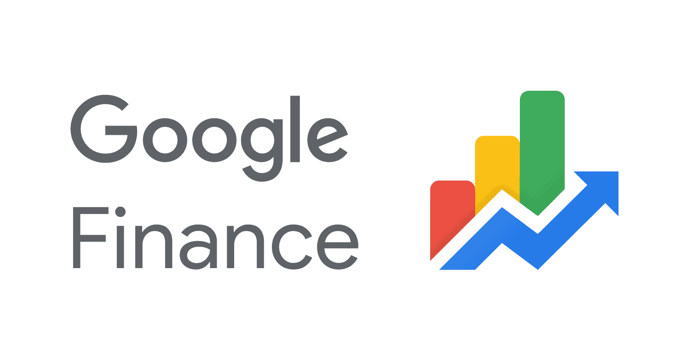

## Table of Contents

## What is the Google Finance API?

The Google Finance API is a tool that lets developers get financial data from Google. This data includes stock prices, market trends, and other financial information. Developers can use this API to build apps or websites that show real-time financial data to users.

However, Google stopped supporting the Google Finance API a few years ago. This means it's no longer available for new projects. If you need financial data, you might want to look at other APIs like those from Yahoo Finance or Alpha Vantage. These services still provide up-to-date financial information that you can use in your projects.

## How do I get started with the Google Finance API?

The Google Finance API used to be a great tool for getting financial data, but Google stopped supporting it a few years ago. This means you can't use it for new projects anymore. If you still have an old project that uses it, it might still work, but it's not reliable because Google isn't updating or fixing it.

If you're looking to build something new that needs financial data, you should check out other APIs like Yahoo Finance or Alpha Vantage. These services are still working and can give you the up-to-date financial information you need. They have easy-to-use APIs that let you pull in stock prices, market trends, and more, so you can build apps or websites that show real-time financial data to your users.

## What are the prerequisites for using the Google Finance API?

The Google Finance API used to be a tool for getting financial data like stock prices and market trends. But Google stopped supporting it a few years ago. This means you can't start using it for new projects anymore. If you had an old project that used it, it might still work, but it's not reliable because Google isn't updating or fixing it.

If you want to build something new that needs financial data, you should look at other APIs like Yahoo Finance or Alpha Vantage. These services are still working and can give you the up-to-date financial information you need. They have easy-to-use APIs that let you pull in stock prices, market trends, and more, so you can build apps or websites that show real-time financial data to your users.

To get started with these alternative APIs, you'll need to sign up for an account with the service you choose. Once you have an account, you'll get an API key that you'll use to access their data. You'll also need some basic programming skills to work with the API and integrate the data into your project.

## How do I obtain an API key for Google Finance?

The Google Finance API isn't available anymore because Google stopped supporting it a few years ago. This means you can't get an API key for it. If you had an old project that used it, it might still work, but it's not reliable because Google isn't updating or fixing it.

If you need financial data for a new project, you should look at other APIs like Yahoo Finance or Alpha Vantage. These services are still working and can give you the up-to-date financial information you need. To get started with these alternative APIs, you'll need to sign up for an account with the service you choose. Once you have an account, you'll get an API key that you can use to access their data.

## What types of data can I retrieve using the Google Finance API?

The Google Finance API used to let you get all sorts of financial data. You could pull in stock prices, which means you could see how much a company's stock was worth at any time. It also gave you information on market trends, so you could understand how the stock market was doing overall. Plus, you could get data on things like exchange rates, which is useful if you're dealing with different currencies.

But, Google stopped supporting the Google Finance API a few years ago. This means you can't use it anymore for new projects. If you're looking to build something new that needs financial data, you should check out other APIs like Yahoo Finance or Alpha Vantage. These services are still working and can give you the up-to-date financial information you need. They have easy-to-use APIs that let you pull in stock prices, market trends, and more, so you can build apps or websites that show real-time financial data to your users.

## How do I make a basic API request to fetch stock data?

To make a basic API request to fetch stock data, you need to use an API that's still working, like Yahoo Finance or Alpha Vantage. First, you sign up for an account with one of these services. Once you have an account, you'll get an API key. This key is like a password that lets you access their data. You'll use this key in your request to the API to prove you're allowed to get the data.

After you have your API key, you can make a request to the API. For example, if you want to get the current stock price for a company like Apple, you'd send a request to the API with the stock symbol "AAPL" and your API key. The API will then send back the data you asked for, like the current price of Apple's stock. You can use this data in your app or website to show real-time stock information to your users.

It's important to follow the rules of the API you're using. Each service has its own rules about how often you can make requests and what kind of data you can get. Make sure you read and follow these rules so you don't get your API key blocked.

## What are the common parameters used in Google Finance API requests?

The Google Finance API used to let you get financial data by sending requests with certain parameters. You could use parameters like the stock symbol to get data for a specific company, like "AAPL" for Apple. You could also use parameters to choose what kind of data you wanted, like the current stock price, the highest and lowest prices in the last year, or the trading [volume](/wiki/volume-trading-strategy). Another common parameter was the date range, so you could get historical data for a certain time period.

But, Google stopped supporting the Google Finance API a few years ago. This means you can't use it anymore for new projects. If you're looking to build something new that needs financial data, you should check out other APIs like Yahoo Finance or Alpha Vantage. These services are still working and can give you the up-to-date financial information you need. They have easy-to-use APIs that let you pull in stock prices, market trends, and more, so you can build apps or websites that show real-time financial data to your users.

## How can I handle errors and exceptions when using the Google Finance API?

The Google Finance API isn't working anymore because Google stopped supporting it a few years ago. This means you can't use it for new projects, and if you had an old project using it, it's not reliable anymore. If you want to build something new that needs financial data, you should look at other APIs like Yahoo Finance or Alpha Vantage. These services are still working and can give you the up-to-date financial information you need.

When you're using an API like Yahoo Finance or Alpha Vantage, you need to be ready for errors and exceptions. Sometimes, the API might not work because of a problem on their end, or maybe you made a mistake in your request. To handle these issues, you should use "try" and "catch" blocks in your code. This way, if something goes wrong, your app or website won't crash. Instead, it can show a friendly message to the user saying there's a problem and try again later. Also, make sure to check the status code of the API response. If it's not a success code (like 200), you know there's an error and you can handle it accordingly.

## What are the rate limits and quotas for the Google Finance API?

The Google Finance API used to have rate limits and quotas that told you how often you could ask for data and how much data you could get. These limits were there to make sure everyone could use the API fairly and to stop people from asking for too much data at once. But, Google stopped supporting the Google Finance API a few years ago, so you can't use it anymore for new projects.

If you want to build something new that needs financial data, you should look at other APIs like Yahoo Finance or Alpha Vantage. These services are still working and can give you the up-to-date financial information you need. They also have their own rate limits and quotas, so make sure to check their rules before you start using their APIs. This way, you can make sure your app or website works smoothly without running into problems because you asked for too much data too quickly.

## How can I use the Google Finance API to perform advanced financial analysis?

The Google Finance API used to be a great tool for doing advanced financial analysis. You could use it to get all sorts of data like stock prices, market trends, and even historical data. With this information, you could build apps or websites that showed real-time financial data to your users. You could also use the data to do things like predict how a stock might perform in the future or compare how different companies are doing.

But, Google stopped supporting the Google Finance API a few years ago. This means you can't use it anymore for new projects. If you want to do advanced financial analysis now, you should look at other APIs like Yahoo Finance or Alpha Vantage. These services are still working and can give you the up-to-date financial information you need. You can use their data to build tools that help you understand the stock market better and make smarter financial decisions.

## What are some best practices for integrating the Google Finance API into an application?

The Google Finance API used to be a great tool for getting financial data into your app. But Google stopped supporting it a few years ago, so you can't use it anymore for new projects. If you want to build something new that needs financial data, you should look at other APIs like Yahoo Finance or Alpha Vantage. These services are still working and can give you the up-to-date financial information you need. You can use their data to build tools that help you understand the stock market better and make smarter financial decisions.

When you're using a new API like Yahoo Finance or Alpha Vantage, there are some best practices you should follow. First, make sure you read and follow the rules of the API you're using. Each service has its own rules about how often you can make requests and what kind of data you can get. If you don't follow these rules, you might get your API key blocked. Second, use "try" and "catch" blocks in your code to handle errors and exceptions. This way, if something goes wrong, your app or website won't crash. Instead, it can show a friendly message to the user saying there's a problem and try again later.

## How can I stay updated with the latest changes and updates to the Google Finance API?

The Google Finance API used to be a great tool for getting financial data, but Google stopped supporting it a few years ago. This means you can't use it anymore for new projects, and there won't be any new updates or changes to it. If you're looking to stay updated with financial data APIs, you should look at other services like Yahoo Finance or Alpha Vantage. These APIs are still working and can give you the up-to-date financial information you need.

To stay informed about any changes or updates to these alternative APIs, you should sign up for their newsletters or follow their official blogs and social media accounts. This way, you'll get notifications about any new features, changes in how the API works, or updates to their data. Also, joining online communities or forums where developers talk about using these APIs can be helpful. You can learn from others and get tips on how to use the APIs better.

## References & Further Reading

[1]: ["Exploring Google Finance Data"](https://www.google.com/finance/) by Towards Data Science

[2]: ["Advances in Financial Machine Learning"](https://www.amazon.com/Advances-Financial-Machine-Learning-Marcos/dp/1119482089) by Marcos Lopez de Prado

[3]: ["Machine Learning for Algorithmic Trading"](https://github.com/PacktPublishing/Machine-Learning-for-Algorithmic-Trading-Second-Edition) by Stefan Jansen

[4]: ["Quantitative Trading: How to Build Your Own Algorithmic Trading Business"](https://www.amazon.com/Quantitative-Trading-Build-Algorithmic-Business/dp/1119800064) by Ernest P. Chan

[5]: ["Evidence-Based Technical Analysis: Applying the Scientific Method and Statistical Inference to Trading Signals"](https://www.amazon.com/Evidence-Based-Technical-Analysis-Scientific-Statistical/dp/0470008741) by David Aronson