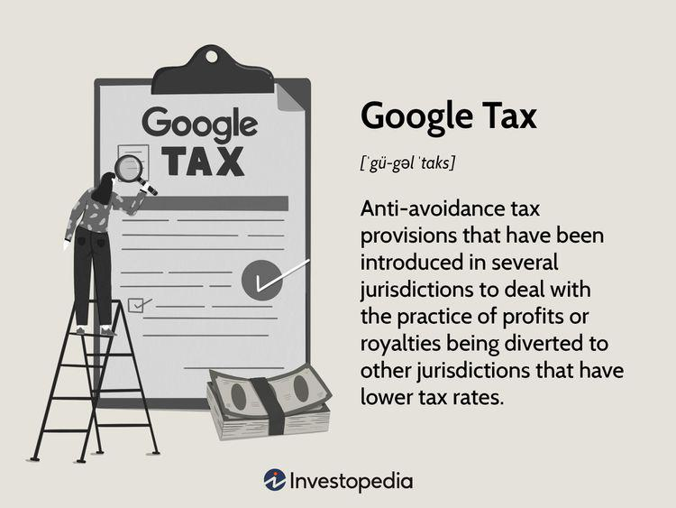

 to Online Taxes and Digital Economy

In today’s globalized digital economy, understanding online taxes has become crucial for businesses and individuals alike. The rapid expansion of internet-based commercial activities has necessitated a re-evaluation of traditional tax frameworks, which were designed for brick-and-mortar enterprises. One of the most significant developments in this field is the rise of digital taxation—a concept that seeks to address the challenges posed by the boundary-blurring nature of digital businesses.

Multinational technology companies, like Google, operate across numerous jurisdictions, complicating the determination of where value is created and thus where taxes should be levied. The evolution of digital taxation has therefore been significantly influenced by these key players, as they have created unprecedented scenarios for tax authorities worldwide. The tax strategies employed by these global enterprises have led to the development of specific tax measures, such as the Google Tax, officially known as the Diverted Profits Tax. This tax aims to prevent profit shifting and base erosion by ensuring that corporations pay a fair share of taxes in the countries where they operate.

The complexities of these taxation measures highlight the significant implications for digital enterprises. Companies engaged in online activities face increased scrutiny and the need to navigate complex regulatory environments. This includes ensuring compliance with diverse taxation rules that vary across different countries, thereby adding layers of complexity to their operations.

Digital taxation also impacts sectors beyond technology firms, especially in fields relying on digital infrastructures, such as algorithmic trading. In the financial domain, the need to process a vast amount of transactions quickly and efficiently makes these activities particularly susceptible to changes in tax policies related to digital economies. The implementation of online taxes could thus alter the economic landscape for algo trading and broader financial exchanges, affecting profitability and necessitating strategic shifts to accommodate evolving tax regulations.

In summary, as the digital economy continues to expand and evolve, the importance of comprehending the nuances of digital taxation cannot be overstated. These evolving tax measures underscore the need for businesses to remain agile and informed, ensuring compliance and strategic alignment with global regulatory trends while maintaining competitiveness in this dynamic market environment.

## Table of Contents

## Understanding Digital Taxation

Digital taxation is a contemporary fiscal mechanism aimed at addressing the economic activities generated by digital and online platforms. As digital business activities have proliferated across borders, they pose challenges to conventional tax systems predicated on physical presence or fixed establishment. Traditional taxation frameworks often fail to capture the economic value generated in locations where digital transactions occur, especially since these transactions frequently transcend national borders without the need for a physical footprint.

The justification for digital taxation rests on the premise that existing international tax rules do not adequately account for the digital economy's unique characteristics. Major tech companies, such as Google, Amazon, and Facebook, derive significant revenue from international operations without necessarily depending on physical offices in those regions. This has led to a disparity where these companies benefit economically without commensurate tax liabilities in those jurisdictions.

Governments worldwide have responded by implementing or proposing digital taxation regulations to ensure that digital companies contribute their fair share to the economies from which they profit. Notably, the European Union introduced the concept of a Digital Services Tax (DST) as an interim measure targeting large multinational tech firms. The DST typically applies to revenue generated from specific digital services, such as online advertising, digital marketplaces, and user data sales.

Several models and approaches are being discussed to address digital taxation effectively. Among them, the Organisation for Economic Co-operation and Development (OECD) has been working towards establishing a unified approach through its Base Erosion and Profit Shifting (BEPS) initiative, which includes proposals for reallocating taxing rights among countries based on where consumer interaction occurs rather than where the business is physically located. This approach aims to prevent companies from shifting profits to low-tax jurisdictions.

For businesses operating in the digital space, comprehending these different taxation approaches is crucial. Companies must ensure compliance with varied and evolving digital tax laws across jurisdictions where they operate. Understanding the scope, exemptions, and rates of digital taxes can help businesses strategically plan their operations and mitigate any potential financial risks. As the dialogue around digital taxation continues, firms must remain vigilant and adaptable to the regulatory changes shaping the digital landscape.

## What is Google Tax?

Google Tax, officially termed as the Diverted Profits Tax (DPT), is designed to ensure that multinational corporations, such as Google, pay appropriate taxes on profits derived within a particular jurisdiction. The United Kingdom introduced this measure in 2015 to counteract strategies often employed by large corporations to minimize tax liabilities through profit shifting and base erosion. These practices typically involve reallocating profits to subsidiaries in low-tax countries, thereby reducing the overall tax burden.

The primary goal of the Google Tax is to deter companies from shifting profits away from the jurisdictions where they have significant business activities. It imposes a tax rate higher than the standard corporate tax rate to discourage such behavior. For instance, the UK implemented a 25% tax rate for profits deemed to be diverted, surpassing its regular corporate tax rate.

Companies need to grasp the intricacies of Google Tax to avoid substantial fines and ensure adherence to tax regulations. The tax operates by evaluating whether a company has a taxable presence in the UK through its business dealings and the extent to which profits are artificially diverted. This evaluation often necessitates a detailed examination of a company's financial and operational structure, focusing on aspects such as transfer pricing arrangements and the economic activities undertaken in various jurisdictions.

The impact of Google Tax on multinationals like Google reveals critical insights into digital taxation. These companies must navigate increasingly complex international tax laws, balancing compliance and strategic business operations. By understanding the framework of the Google Tax, companies can better anticipate regulatory hurdles and adopt more sustainable and transparent tax practices. Such insights underscore the necessity for robust tax planning and the importance of maintaining open lines of communication with tax authorities to pre-empt any potential compliance issues.

## Implications of Digital Taxation on Algo Trading

Algorithmic trading, commonly known as algo trading, is a trading strategy that utilizes automation and algorithms to execute financial transactions at high speeds and with precision. Given its fundamental reliance on digital infrastructure, algo trading is directly affected by digital taxation policies. Digital taxation refers to the framework through which governments seek to tax digital business activities, including algorithmically executed trades.

Taxation changes targeting digital transactions can significantly affect the profitability of [algorithmic trading](/wiki/algorithmic-trading) operations. As tax policies evolve to capture revenues from cross-border digital activities, the increased cost of compliance could potentially diminish the margins that algo traders typically enjoy. For instance, new digital services taxes (DST) or transaction levies could be introduced, directly impacting the cost structures of algo trading platforms. These taxes may not only reduce profitability but could also necessitate adjustments in trading strategies to sustain competitive edge.

Moreover, traders and financial institutions engaged in algorithmic trading must modify their strategies to adapt to new tax laws. Consider the situation where a country imposes a specific tax on high-frequency trades or digital transactions, encouraging a shift towards larger, less frequent trades to minimize tax liabilities. In such scenarios, trading algorithms may need to be recalibrated to prioritize long-term holding over short-term gains, affecting the [liquidity](/wiki/liquidity-risk-premium) and dynamics of financial markets.

Additionally, the potential for increased compliance costs could influence trading strategies employed by algorithmic traders. Compliance involves not only tax payments but also substantial investments in legal and administrative processes to ensure adherence to taxation regulations. For firms operating on thin margins, these costs could lead to a reevaluation of trading activities and, possibly, a consolidation of operations to regions with more favorable tax conditions.

Staying informed about digital tax developments is crucial for firms involved in high-frequency and automated trading. This requires ongoing monitoring of tax legislation across multiple jurisdictions, as digital taxation policies can vary widely from one country to another. Companies investing in robust tracking and analytics systems will be better positioned to anticipate tax changes and respond proactively, thereby maintaining a competitive advantage in the fast-paced world of algorithmic trading.

In summary, digital taxation policies pose significant challenges and opportunities for algorithmic trading entities. By understanding these implications and adjusting strategies accordingly, algo traders can ensure compliance while optimizing their operations under evolving digital tax landscapes. This requires a commitment to strategic taxation planning, investment in compliance infrastructure, and continuous adaptation to maintain profitability and competitive standing.

## Future Trends and Challenges in Digital Taxation

The future of digital taxation is marked by a continuous evolution as nations and regulatory bodies strive to address the complexities of taxing a rapidly expanding digital economy. One of the most significant developments is the emergence of global agreements aimed at implementing minimum tax rates. This effort, led by organizations such as the Organisation for Economic Co-operation and Development (OECD), is designed to curb tax base erosion and profit shifting by ensuring that multinational corporations pay a fair share of taxes, regardless of where they are located. The OECD's proposal for a global minimum corporate tax rate seeks to establish a level playing field across countries and prevent companies from exploiting tax havens.

Standardized digital tax frameworks are also gaining traction, with nations working collaboratively to create coherent systems that can be applied internationally. This harmonization aims to simplify tax compliance for companies operating in multiple jurisdictions and reduce administrative burdens. However, achieving consensus on such frameworks presents significant challenges, as countries must navigate differing tax policies, economic interests, and concerns about national sovereignty.

A key challenge in implementing these global tax frameworks is ensuring compliance among tech giants that dominate the digital marketplace. Enforcing these policies requires robust international cooperation and compliance mechanisms to ensure that companies adhere to new regulations. This enforcement is particularly challenging given the transnational nature of digital businesses and the diverse tax regimes they encounter.

Businesses, in turn, must remain agile and well-informed to navigate this changing tax landscape. Staying updated on policy developments allows companies to adjust their strategies and operations proactively, minimizing potential disruptions. For businesses operating globally, understanding local and international tax legislation is crucial to optimizing their tax obligations and maintaining competitiveness.

Looking ahead, understanding future trends in digital taxation is essential for strategic planning within the digital economy. Companies must anticipate regulatory changes and leverage technological advancements to adapt efficiently. This foresight enables businesses to craft strategies that not only ensure compliance but also enhance their market position in an era where digital taxation will become increasingly integral to global economic governance.

## Conclusion

Digital taxation has emerged as a pivotal element in the modern global economy, significantly influencing both businesses and policymakers. At the forefront of this development is the Google Tax, which exemplifies the intricate challenges involved in effectively taxing digital enterprises. This specific tax underscores the difficulty of addressing profit shifting and base erosion, commonly employed by multinational corporations to minimize their tax liabilities across various jurisdictions.

As the digital economy becomes increasingly regulated, industries such as algorithmic trading must adapt to comply with emerging tax frameworks. Algorithmic trading, heavily dependent on digital infrastructure, faces potential impacts on profitability due to digital tax policies targeting online transactions. Consequently, traders and financial institutions are compelled to adjust their strategies to remain competitive while navigating these new tax landscapes.

Maintaining awareness of digital tax laws and remaining compliant is paramount for businesses striving for success in this evolving market. The dynamic nature of digital taxation necessitates that companies stay informed about legislative changes, forecasted trends, and international agreements which can significantly influence their operations. In this competitive digital age, forward-thinking companies recognize that successful navigation of digital taxation not only ensures compliance but also positions them advantageously within the global market. Through strategic planning and a robust understanding of digital tax complexities, businesses can secure their place as leaders in the digital economy.

## References & Further Reading

[1]: ["OECD/G20 Base Erosion and Profit Shifting Project."](https://www.oecd.org/en/publications/oecd-g20-base-erosion-and-profit-shifting-project_23132612.html) Organisation for Economic Co-operation and Development (OECD).

[2]: ["Digital Services Tax: UK Parliament Research Briefing."](https://commonslibrary.parliament.uk/research-briefings/cbp-8719/) UK House of Commons Library.

[3]: ["Tax Challenges Arising from Digitalisation – Interim Report 2018."](https://www.oecd.org/en/publications/tax-challenges-arising-from-digitalisation-interim-report_9789264293083-en.html) OECD.

[4]: Brauner, Y., & Pistone, P. (2019). ["The Dynamics of Digital Taxation: A Theoretical Perspective."](https://scholar.google.com/citations?user=oHDlIfkAAAAJ&hl=en) IBFD Yearbook on International Taxation.

[5]: ["Algorithmic Trading and Platform-Based Banking: The Future of Finance."](https://www.wallstreetzen.com/blog/best-algorithmic-trading-software/) Deloitte Financial Services Industry.