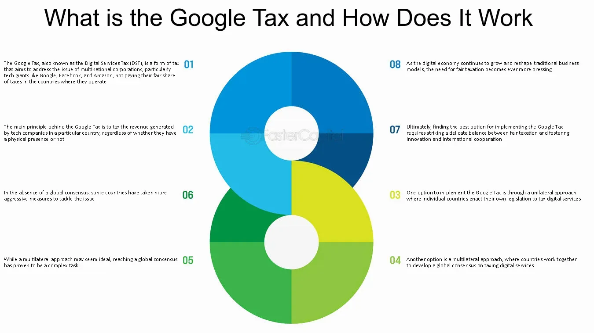

## Table of Contents

## What is the Google Tax?

The Google Tax, also known as the Diverted Profits Tax, is a tax that the UK government introduced in 2015. It aims to stop big companies like Google from moving their profits to countries with lower taxes. The tax rate is 25%, which is higher than the normal UK corporation tax rate. The idea is to make sure these companies pay their fair share of tax in the UK.

This tax came about because people were upset that big tech companies were not paying much tax in the UK, even though they made a lot of money there. The government wanted to change this. The Google Tax makes it harder for companies to use complicated ways to lower their taxes. It has made some companies think twice about how they handle their taxes in the UK.

## Why was the Google Tax introduced?

The Google Tax was introduced because many people and the government were unhappy that big companies like Google were not paying much tax in the UK. These companies were making a lot of money in the UK but were moving their profits to other countries where the taxes were lower. This made it seem like they were not paying their fair share of taxes.

To fix this problem, the UK government created the Google Tax in 2015. It is a special tax aimed at stopping companies from moving their profits around to avoid taxes. The tax rate is set at 25%, which is higher than the usual UK corporation tax. By introducing this tax, the government hoped to make sure that big companies contribute more fairly to the UK's tax revenue.

## Which countries have implemented the Google Tax?

The Google Tax, or Diverted Profits Tax, was first introduced by the United Kingdom in 2015. The UK wanted to make sure big companies like Google paid more tax on the money they made in the country. They did this because people were upset that these companies were not paying much tax, even though they earned a lot of money in the UK.

A few other countries have looked at the UK's Google Tax and thought about doing something similar. Australia, for example, introduced its own version called the Multinational Anti-Avoidance Law (MAAL) in 2016. This was also to stop big companies from moving their profits to other countries with lower taxes. Other countries have talked about it, but not many have actually put a similar tax in place yet.

## How does the Google Tax affect multinational companies?

The Google Tax makes it harder for big companies to move their money around to pay less tax. Before, these companies could send their profits to countries where taxes are lower. But now, with the Google Tax, if they do this, they have to pay a higher tax rate of 25% in the UK. This means they might have to pay more tax than they used to, which can affect how much money they keep at the end of the year.

This tax also makes these companies think more carefully about how they handle their money. They might have to change the way they do business or where they keep their profits. Some companies might even decide to pay more tax in the UK to avoid the extra hassle and cost of the Google Tax. This can make things more complicated for them, but it helps make sure they pay a fairer share of taxes where they make their money.

## What is the mechanism behind the Google Tax?

The Google Tax works by making big companies pay more tax if they try to move their profits to other countries with lower taxes. If a company makes money in the UK but tries to send that money somewhere else to pay less tax, the UK government will charge them a special tax called the Diverted Profits Tax. This tax is set at 25%, which is higher than the normal UK corporation tax rate. The idea is to stop companies from using tricky ways to avoid paying taxes in the UK.

When a company wants to move its profits, the UK's tax authorities look at the company's business to see if they are trying to avoid taxes. If they find that the company is doing this, they will apply the Google Tax. This makes companies think twice about moving their profits around because it might end up costing them more money. The goal is to make sure that big companies pay a fair amount of tax in the UK, where they earn their money.

## How is the Google Tax different from other digital taxes?

The Google Tax, also known as the Diverted Profits Tax, is different from other digital taxes because it focuses on stopping companies from moving their profits to countries with lower taxes. It was introduced by the UK in 2015 and targets big companies that try to avoid paying taxes in the UK. The tax rate is set at 25%, which is higher than the normal UK corporation tax. This makes it more expensive for companies to move their profits around, encouraging them to pay more tax in the UK.

Other digital taxes, like the Digital Services Tax that some countries have introduced, focus on taxing the revenue that companies make from digital services within a country. These taxes are usually applied to a company's income from things like online advertising, digital content, or data sales. Unlike the Google Tax, these digital taxes do not specifically target profit shifting but aim to ensure that companies pay taxes where they generate income from digital services.

## What are the revenue implications of the Google Tax for governments?

The Google Tax can bring in more money for the government. When big companies like Google have to pay the 25% tax rate instead of moving their profits to other countries, the UK government gets more tax money. This extra money can be used for things like schools, hospitals, and roads. So, the Google Tax helps the government have more money to spend on important things that people need.

But the Google Tax can also make some companies think twice about doing business in the UK. If the tax makes it too expensive for them, they might decide to move their business somewhere else where taxes are lower. This could mean less money coming into the UK from these companies in the long run. So, while the Google Tax can bring in more money right away, it might also make some companies leave, which could affect the government's revenue in the future.

## How do companies report and pay the Google Tax?

Companies have to report and pay the Google Tax if they are trying to move their profits to other countries to pay less tax. They do this by filling out special forms that the UK tax authorities ask for. These forms help the tax people check if the company is trying to avoid taxes. If they find out that a company is doing this, they will tell the company to pay the Google Tax. The company then has to pay the 25% tax rate on the money they were trying to move.

Paying the Google Tax can be a bit tricky for companies. They need to keep good records of their money and business deals to show the tax people what they are doing. If they do not report and pay the tax right, they might get in trouble and have to pay even more money in fines. So, it is important for companies to follow the rules and make sure they report and pay the Google Tax correctly.

## What are the challenges and criticisms of the Google Tax?

The Google Tax has faced some challenges and criticisms. One big challenge is that it can be hard to figure out if a company is really trying to avoid taxes. Companies have lots of ways to move their money around, and it can be tricky for the tax people to catch them. This means the government might not always get all the money they want from the tax. Another challenge is that the Google Tax might make some companies think about leaving the UK. If the tax makes it too expensive for them to do business there, they might move to another country where taxes are lower. This could mean less money for the UK in the long run.

There are also some criticisms of the Google Tax. Some people say it is not fair because it only targets big companies and not smaller ones. They think all companies should be treated the same way. Others worry that the Google Tax might make things more complicated for businesses. They have to spend more time and money figuring out how to report and pay the tax correctly. This can be a headache for companies and might make them less happy about doing business in the UK.

## How has the Google Tax impacted the global tax landscape?

The Google Tax has made other countries think about how they tax big companies. When the UK started the Google Tax in 2015, it showed other places that they could do something similar to make sure big companies pay more tax where they make their money. Some countries, like Australia, made their own versions of the Google Tax. This has started a bigger conversation around the world about how to stop companies from moving their profits to places with lower taxes.

Even though not many countries have put in a tax exactly like the Google Tax, it has helped push for changes in how taxes work globally. More countries are now talking about and trying out new ways to make sure big companies pay their fair share of taxes. The Google Tax has been a big part of this change, showing that countries can take action to stop companies from avoiding taxes. This has made the global tax landscape more focused on fairness and stopping tax avoidance.

## What are the future prospects for the Google Tax?

The future of the Google Tax looks like it might keep changing how big companies pay taxes. More countries might start using their own versions of the Google Tax to make sure companies pay taxes where they make money. This could mean that big companies will have to think more about where they do business and how they handle their money. As more places try to stop companies from moving their profits around, the Google Tax might become a bigger part of how taxes work around the world.

But there are also challenges ahead for the Google Tax. Some people think it might be hard to keep up with all the clever ways companies can move their money. Also, if too many countries start using taxes like the Google Tax, big companies might decide to move to places where taxes are lower. This could make it tricky for countries to get the money they want from these taxes. So, while the Google Tax might help make taxes fairer, it will need to keep changing to work well in the future.

## How can businesses adapt to the Google Tax regulations?

Businesses can adapt to the Google Tax by making sure they understand the rules and keep good records. They need to know that if they try to move their profits to other countries to pay less tax, they might have to pay the Google Tax instead. So, it's important for them to keep track of where their money is going and be ready to show this to the tax people if they ask. This way, businesses can make sure they are following the rules and avoid getting in trouble or having to pay extra fines.

Another way businesses can adapt is by thinking about how they do business in the UK. If the Google Tax makes it too expensive for them to move their profits around, they might need to change their plans. They could decide to pay more tax in the UK to avoid the hassle of the Google Tax, or they might even think about moving their business to another country where taxes are lower. By thinking carefully about these choices, businesses can find the best way to keep making money while following the tax rules.

## References & Further Reading

[1]: ["OECD/G20 Base Erosion and Profit Shifting Project."](https://www.oecd.org/en/publications/oecd-g20-base-erosion-and-profit-shifting-project_23132612.html) Organisation for Economic Co-operation and Development (OECD).

[2]: ["Digital Services Tax: UK Parliament Research Briefing."](https://commonslibrary.parliament.uk/research-briefings/cbp-8719/) UK House of Commons Library.

[3]: ["Tax Challenges Arising from Digitalisation – Interim Report 2018."](https://www.oecd.org/en/publications/tax-challenges-arising-from-digitalisation-interim-report_9789264293083-en.html) OECD.

[4]: Brauner, Y., & Pistone, P. (2019). ["The Dynamics of Digital Taxation: A Theoretical Perspective."](https://scholar.google.com/citations?user=oHDlIfkAAAAJ&hl=en) IBFD Yearbook on International Taxation.

[5]: ["Algorithmic Trading and Platform-Based Banking: The Future of Finance."](https://www.wallstreetzen.com/blog/best-algorithmic-trading-software/) Deloitte Financial Services Industry.