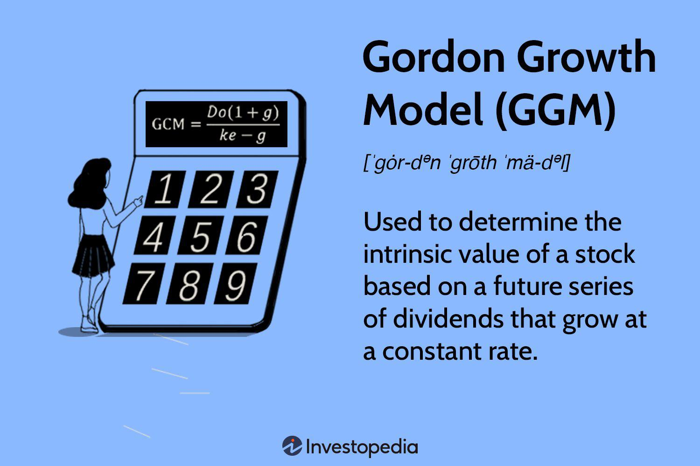

In stock valuation, determining the intrinsic value of a stock is vital for making informed investment decisions. Among the numerous models available for this purpose, the Dividend Discount Model (DDM) and its popular variant, the Gordon Growth Model (GGM), are particularly noteworthy. These models are extensively utilized for their robust framework in estimating a stock's worth based on expected future cash flows in the form of dividends.

The DDM and GGM emphasize the role of dividends in influencing a stock’s valuation, allowing investors to gain a strategic advantage by focusing on tangible financial performance metrics. Unlike models that rely heavily on speculative market trends, these dividend-based models offer a more grounded approach, aligning investments with a company's actual financial health and potential for growth.



The application of these models extends beyond traditional valuation practices, especially with their integration into algorithmic trading platforms. Algorithms equipped with the principles of DDM and GGM can process vast amounts of financial data, adjusting trading strategies in real time based on updated dividend forecasts and market conditions. This capability enhances decision-making accuracy and responsiveness, crucial in today's fast-paced trading environments.

Exploring the complexities and advantages of using the Dividend Discount Model, particularly the Gordon Growth Model, reveals their significant contributions to stock valuation. By translating complex financial projections into straightforward calculations, these models remain accessible to investors seeking to maintain stable returns while navigating the intricate landscape of stock investments.

## Table of Contents

## What is the Gordon Growth Model?

The Gordon Growth Model (GGM) offers a straightforward method to estimate the intrinsic value of a stock by assuming that dividends will grow at a constant rate indefinitely. It belongs to the broader category of the Dividend Discount Model (DDM), which calculates the value of a stock based on the present value of expected future dividends. The GGM specifically focuses on scenarios where dividends are expected to grow perpetually at a stable rate, making it an ideal tool for analyzing companies with a consistent track record of dividend growth.

Mathematically, the GGM can be expressed as:
$$
P = \frac{D_1}{r - g}
$$
where:
- $P$ denotes the intrinsic value of the stock,
- $D_1$ is the expected dividend per share in the next year,
- $r$ represents the required rate of return,
- $g$ is the constant growth rate of the dividends.

The model is particularly advantageous for evaluating mature, stable companies with predictable long-term growth in dividend payouts. Its simplicity and ease of application make it a preferred choice among financial analysts when assessing the fair value of investments with consistent dividend policies. By translating complex dividend forecasts into a basic formula, the GGM provides a clear perspective on whether a stock is fairly valued, overvalued, or undervalued, thereby aiding in the decision-making process for investors.

## Formula and Key Components

The Gordon Growth Model (GGM) employs the formula $P = \frac{D_1}{r - g}$ to calculate the intrinsic value of a stock. Here, $P$ represents the current stock price, $D_1$ stands for the expected dividend per share in the upcoming year, $r$ denotes the required rate of return, and $g$ signifies the growth rate of dividends. This formula is based on the concept that dividends are expected to grow at a constant rate indefinitely, which simplifies the valuation process by reducing future dividend flows into a single present value.

Three critical inputs are necessary for the application of this model: the expected dividend ( $D_1$ ), the dividend growth rate ( $g$ ), and the expected rate of return ( $r$ ). Each of these inputs plays a key role in determining accurate stock valuations. The expected dividend $D_1$ is derived from company forecasts or historical payment patterns. The growth rate $g$ is typically estimated based on historical dividend growth, considering the company's growth prospects and market positioning. The required rate of return $r$ reflects the investor's minimum acceptable return, influenced by the stock's risk profile and prevailing market conditions.

The GGM's structure resonates with the properties of an infinite geometric series. This mathematical relation allows for the conversion of future dividend streams into a perpetuity, where the series of expected dividends projected into the future is discounted back to its present value. By leveraging these concepts, the GGM provides a robust framework for stock valuation, making it highly useful for evaluating companies with a stable dividend history.

## Importance of the GGM in Stock Valuation

The Gordon Growth Model (GGM) offers investors a streamlined approach to determine a stock’s intrinsic value by focusing on expected future dividends and their growth. By isolating intrinsic value from market [volatility](/wiki/volatility-trading-strategies), GGM facilitates the evaluation of whether stocks are overvalued or undervalued relative to their market price. This capability helps investors make informed buying or selling decisions.

One of the primary applications of the GGM is its utility for income-focused investors. These investors prioritize steady income streams from their investments over capital gains. By concentrating on dividend distributions, the GGM provides a method to assess the long-term growth and income potential of investments. This is particularly advantageous for investors seeking stable, predictable returns.

Furthermore, the model is particularly applicable to mature companies that consistently pay dividends. Such companies typically exhibit stable growth patterns, making them well-suited for evaluation through the GGM. The model’s emphasis on dividends aligns with the characteristics of these companies, providing an insightful perspective on their long-term valuation based on reliable and consistent dividend payouts.

By employing the GGM in their analyses, investors can better understand the intrinsic value of stocks, separating their inherent worth from short-term market fluctuations and focusing on sustainable income and growth. This makes the GGM a useful tool in constructing and managing a balanced investment portfolio, especially for those prioritizing dividend income and stability.

## Assumptions and Limitations

The Gordon Growth Model (GGM) operates under a set of assumptions that can limit its applicability in certain investment scenarios. The fundamental assumption is that dividends grow at a perpetual and constant rate. This presumption works well for companies with a stable dividend payout history but is less suitable for firms with erratic or unpredictable dividend growth patterns. Companies in rapidly changing industries or those facing economic uncertainties may not maintain consistent growth rates, thus weakening the model's reliability.

A crucial requirement of the GGM is that the investor's required rate of return, denoted as 'r', must surpass the growth rate of dividends, 'g'. If $r \leq g$, the model yields nonsensical or infinite values, undermining its practical use. For example, in cases where a company's expected dividend growth is projected at 7% and the required rate of return is also 7%, the model becomes invalid since the denominator in the formula $P = \frac{D1}{r - g}$ approaches zero.

The GGM is most effectively applied to firms that exhibit consistent dividend distributions and mature companies with stable earnings growth. This specificity limits its utility for high-growth companies that typically reinvest earnings back into the business rather than distribute them as dividends. As such, the model may not fully capture the intrinsic value of companies that are expanding rapidly or that operate in high-tech or emerging industries.

Investors employing the GGM must thoroughly evaluate these assumptions, considering the financial health of the company and the broader market environment. An over-reliance on the GGM without assessing the potential variability in dividend payouts or changes in economic conditions can lead to misjudgment of a stock's intrinsic value and misguided investment decisions.

## Example Calculation Using GGM

Consider a hypothetical scenario where a company is forecasted to distribute a $3 dividend in the next year. The required rate of return for this stock is assessed at 8%, and the expected annual growth rate of dividends is 5%. Applying the Gordon Growth Model (GGM), the intrinsic value (P) of the stock can be determined using the formula:

$$
P = \frac{D1}{r - g}
$$

Substituting the given values, where $D1$ is the expected dividend ($3), $r$ is the required rate of return (0.08), and $g$ is the dividend growth rate (0.05), results in:

$$
P = \frac{3}{0.08 - 0.05} = \frac{3}{0.03} = 100
$$

Hence, the intrinsic value of the stock is calculated to be $100. If the current market price of the stock is $110, this suggests that the stock is overvalued by $10 according to the GGM. This discrepancy between the market price and the intrinsic value identifies a potential investment decision point by signaling the stock may not provide the necessary return relative to its valuation.

This example serves to demonstrate the utility of the GGM in assessing whether a stock is overvalued or undervalued, guiding investors towards more informed investment decisions. By focusing on intrinsic value derived from expected dividends, investors can gain insights into whether the price they are paying accurately reflects the stock's estimated financial performance.

## Advantages and Disadvantages

The Gordon Growth Model (GGM) offers distinct advantages in evaluating dividend-paying stocks. Its primary strength lies in its simplicity and ease of implementation, allowing investors to quickly assess the intrinsic value of stocks. By focusing on dividends, the GGM is less susceptible to short-term market fluctuations, instead emphasizing long-term company fundamentals such as dividend consistency and growth rate. This makes it a reliable tool for evaluating mature, stable companies with a track record of paying dividends. 

However, the GGM also presents notable limitations. One key drawback is its focus exclusively on dividends, potentially overlooking other critical factors that could influence stock value. These factors include brand strength, competitive positioning, and market trends, which are not captured in the model. Moreover, the GGM assumes a constant growth rate in dividends, which may not be applicable to all firms, particularly those in high-growth sectors where dividends are not consistently paid or reinvested for expansion. 

As a result, the utility of the GGM is mainly confined to established companies with a stable dividend history, thereby limiting its effectiveness for evaluating firms experiencing rapid growth or reinvesting profits. Therefore, while the GGM is a valuable tool for specific contexts, investors must consider its constraints and complement it with other valuation methods to gain a comprehensive understanding of a company's worth.

## Integration with Algorithmic Trading

Integrating the Gordon Growth Model (GGM) into [algorithmic trading](/wiki/algorithmic-trading) platforms enhances decision-making by leveraging data-driven insights. Algorithms can effectively process large volumes of market data to track dividend trends. By analyzing these minute changes, such platforms automatically adjust investment strategies, ensuring they remain aligned with the most current market conditions. This integration allows investors to focus on expected intrinsic values rather than speculative market movements, providing a strategic edge in trading decisions.

Real-time application of GGM within algorithmic trading significantly improves trading efficiency and precision. For dividend-focused equity portfolios, automated systems can quickly assess whether a stock's market price aligns with its calculated intrinsic value using the GGM. If the market price deviates notably, the algorithm can trigger a buy or sell action based on predefined criteria. For example, if a stock is undervalued according to the GGM calculation, an algorithm might initiate a buy order to capitalize on the potential value discrepancy.

To implement GGM in algorithmic trading, consider the following Python code snippet that continuously evaluates dividend-paying stocks:

```python
class Stock:
    def __init__(self, dividend, growth_rate, required_return):
        self.dividend = dividend
        self.growth_rate = growth_rate
        self.required_return = required_return

    def intrinsic_value(self):
        return self.dividend / (self.required_return - self.growth_rate)

def evaluate_stock(stock, market_price):
    intrinsic_value = stock.intrinsic_value()
    if market_price < intrinsic_value:
        return "Buy"
    elif market_price > intrinsic_value:
        return "Sell"
    else:
        return "Hold"

# Example: Analyze stock with a $3 dividend, a 5% growth, and an 8% required return
stock = Stock(dividend=3, growth_rate=0.05, required_return=0.08)
market_price = 110
decision = evaluate_stock(stock, market_price)

print(f"Decision: {decision}")  # Outputs: "Sell" if market_price is $110
```

This integration uses anticipated intrinsic values as opposed to fluctuating market sentiments, thus providing more stable and calculated trading strategies. Overall, combining the GGM with algorithmic trading embodies a strategic advancement, capable of navigating the complexities of modern financial markets while focusing squarely on fundamental financial indicators.

## Conclusion

The Dividend Discount Model (DDM), particularly its variant the Gordon Growth Model (GGM), is an essential instrument in stock value assessment and crafting investment strategies. Its primary advantage lies in translating intricate financial forecasts into clear, tangible outcomes. This simplification makes the model accessible to investors who seek to maintain stable returns, providing a straightforward method to gauge the intrinsic value of dividend-paying stocks.

As financial markets continue to evolve, integrating the GGM into algorithmic trading frameworks enhances its applicability and effectiveness. This fusion allows investors to harness both the robustness of traditional financial theory and the precision of contemporary data-driven methodologies. By continuously analyzing market data and aligning trading actions with expected intrinsic values instead of succumbing to market fluctuations, investors are better equipped to optimize their portfolios for both stability and growth.

In an ever-changing financial landscape, adaptable models like the GGM prove instrumental in supporting long-term investment decisions. They offer a structured approach to navigate uncertainties, thus ensuring that investment strategies remain relevant and effective over time. The GGM's focus on dividends and growth rates ensures that it remains a practical tool for mature companies with predictable dividend flows, balancing historical financial insights with modern trading techniques.

## Further Reading

Gordon, Myron J. "Dividends, Earnings, and Stock Prices." Review of Economics and Statistics (1959). This seminal work introduces the foundational principles behind the Dividend Discount Model, including the Gordon Growth Model, offering insights into how dividends correlate with long-term stock valuation.

Brealey, Richard A., Myers, Stewart C., and Allen, Franklin. "Principles of Corporate Finance." This comprehensive textbook covers a broad spectrum of corporate finance theories and models. It provides a detailed analysis of stock valuation methods, including discussions on dividends and growth models that aid in understanding intrinsic value assessments.

Fabozzi, Frank. "Bond Markets, Analysis, and Strategies." Although primarily focused on bond markets, this book gives invaluable insights into financial market dynamics. It includes comparative analyses of investment vehicles, which can enhance understanding of dividend strategies in equity markets.

Liu, Eric. "Equity Valuation and Portfolio Management." This book investigates into methodologies for valuing equities and managing portfolios effectively. It provides practical applications of valuation models, including the Gordon Growth Model, offering strategies that integrate market data for optimal investment decision-making.

## References & Further Reading

[1]: Gordon, Myron J. (1959). ["Dividends, Earnings, and Stock Prices."](http://piketty.pse.ens.fr/files/Gordon1959.pdf) Review of Economics and Statistics.

[2]: Brealey, Richard A., Myers, Stewart C., & Allen, Franklin. ["Principles of Corporate Finance."](https://www.mheducation.com/highered/product/Principles-of-Corporate-Finance-Brealey.html) McGraw-Hill Education.

[3]: Liu, Eric. ["Equity Valuation and Portfolio Management."](https://www.finnotes.org/publications/equity-valuation-and-portfolio-management) Wiley.

[4]: Fabozzi, Frank J. ["Bond Markets, Analysis, and Strategies."](https://books.google.com/books/about/Bond_Markets_Analysis_and_Strategies_ten.html?id=bQpNEAAAQBAJ) Pearson.