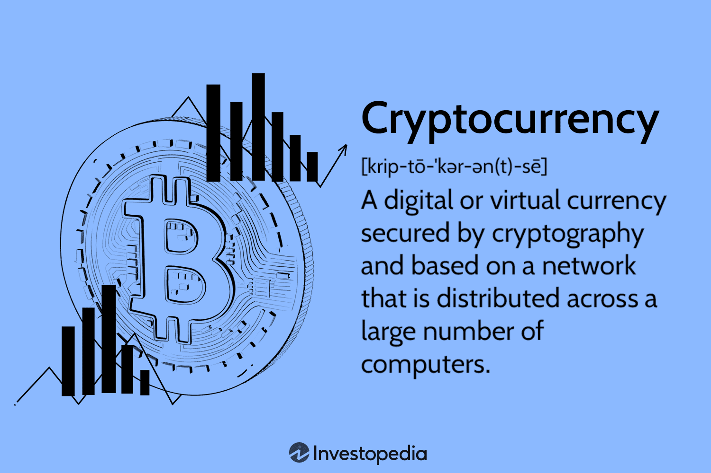

Cryptocurrency governance plays a pivotal role in the blockchain ecosystem, yet it often remains overlooked by many investors. As the blockchain landscape continues to grow and evolve, understanding the governance mechanisms that underpin these digital assets becomes paramount. This article seeks to shed light on the importance of governance in the cryptocurrency arena and its implications for investors and market dynamics.

Governance in cryptocurrencies involves a set of protocols and processes that dictate how decisions are made within a blockchain network. These decisions can cover a wide array of activities, from software upgrades to consensus mechanisms. Just as critical as the underlying technology itself, governance structures help ensure the sustainability, security, and adaptability of blockchain projects over the long term.



Key governance systems, such as on-chain and off-chain governance, offer distinct frameworks that shape how decision-making processes unfold in blockchain projects. On-chain governance entails decision-making that is embedded within the blockchain protocol, often through a transparent voting system. In contrast, off-chain governance takes place outside the blockchain, often involving community discussions and developer consensus. Understanding these systems and how they function is crucial for any investor seeking to navigate the complex cryptocurrency landscape.

Furthermore, the interaction between governance and automated trading, or algorithmic trading (algo trading), presents another layer of complexity and opportunity. Algorithmic trading involves using code to automate trade execution. It is increasingly important for traders to integrate governance developments into their strategies, as governance decisions can significantly impact market behavior and trading conditions.

In conclusion, this article explores various governance systems and their influence on cryptocurrency investments, emphasizing that knowledge of governance is equally vital to technological understanding in crafting effective long-term investment strategies. Additionally, we will explore how governance intersects with algo trading within blockchain ecosystems, providing a comprehensive view of its significance in the ever-evolving cryptocurrency market.

## Table of Contents

## What is Cryptocurrency Governance?

Cryptocurrency governance is a pivotal component within the blockchain ecosystem that outlines the procedures and frameworks for decision-making concerning a project's progression. This governance can manifest in two primary forms: on-chain and off-chain.

On-chain governance refers to a system where decisions are made and executed directly through the blockchain protocol. This is typically done via a transparent voting process where stakeholders, who may include miners, developers, or token holders, participate in making decisions that impact the blockchain's operations. These decisions can involve protocol upgrades, consensus mechanism adjustments, or other technical changes vital to maintaining the network's integrity and efficiency. On-chain governance is valued for its transparency and automation, allowing for decisions to be recorded immutably on the blockchain, thus ensuring a high degree of accountability.

In contrast, off-chain governance involves decision-making that occurs outside the blockchain's direct framework. This process often relies heavily on the community's collective inputs, expert discussions, and developer consensus. Off-chain governance can include forums, online discussions, or gatherings where stakeholders deliberate on proposals. While this system is generally more flexible and can incorporate a wider range of perspectives, it also poses challenges in terms of reaching consensus and ensuring that all voices are equitably considered.

The governance process within cryptocurrencies is a collaborative effort involving various stakeholders: the community, developers, and token holders. Each group plays a critical role in shaping the future direction and health of the blockchain. Developers often draft technical proposals or improvements that are then reviewed and voted upon by the community and token holders, whose stakes in the network give them a vested interest in its evolution.

Effective governance is essential for maintaining the smooth operation and ongoing evolution of blockchain projects. It ensures that necessary updates are implemented, security vulnerabilities are addressed promptly, and the network remains robust amidst changes in technology and market conditions. A well-structured governance model can enhance a blockchain's resilience and adaptability, ultimately contributing to its long-term success and viability.

## Why Cryptocurrency Governance Matters for Investors

Cryptocurrency governance plays a pivotal role in enhancing the stability and longevity of blockchain projects, which directly impacts investor returns. Effective governance mechanisms provide a structured way for making and implementing decisions that impact the project's future, influencing its scalability, security, and technological improvements. By having clear governance protocols, projects can mitigate risks such as unexpected forks or technical failures, which helps maintain investor confidence and potentially increase returns on investments.

A governance system empowers token holders by giving them voting rights on critical matters like protocol changes or consensus mechanism updates. This participatory approach affords investors a voice, enabling them to actively influence critical decisions that can shape the project's future. Through voting rights, investors have the opportunity to express their preferences and priorities, ensuring that the project aligns with their investment goals and risk appetite.

Conversely, ineffective governance can lead to critical consequences such as blockchain forks, security vulnerabilities, and the disenfranchisement of investors. Forks, which occur when consensus fails and the blockchain splits into distinct entities, can dilute the value of [cryptocurrency](/wiki/cryptocurrency) holdings and create uncertainty about the direction of the project. Security weaknesses, on the other hand, make the blockchain susceptible to attacks, which may result in financial loss for stakeholders. When investors are excluded from decision-making processes, it can lead to dissatisfaction and reduce the perceived legitimacy of the project, further undermining its stability and attractiveness.

Engagement in governance provides a pathway for investors to influence their investments' trajectory positively. By participating in governance processes, token holders can advocate for changes or initiatives that they believe will enhance the project's value or strategic direction. This active involvement not only aligns the interests of the investors with the project's long-term vision but also enables them to anticipate and respond to changes in the ecosystem more effectively, thus safeguarding their investments and potentially realizing higher returns.

## Types of Governance Systems

Cryptocurrency governance systems play a significant role in how decisions are made about the direction and implementation of changes within a blockchain network. There are three primary types of governance systems—on-chain, off-chain, and hybrid systems—each with unique characteristics and implications for stakeholders.

**On-chain Governance**

On-chain governance involves automated decision-making processes where voting and changes occur directly on the blockchain. This system allows for transparent and immutable recording of decisions, providing a robust framework for stakeholder participation. An on-chain governance system often employs smart contracts to facilitate decision-making processes by automating proposal submissions, voting, and implementation of changes.

For example, a typical on-chain governance mechanism may include the following steps:

1. Proposal Submission: Any network participant can propose a change or improvement to the blockchain protocol.
2. Voting Process: Token holders use their cryptocurrency holdings to vote on proposals. The weight of each vote is often proportional to the number of tokens held, ensuring that stakeholders with greater investments have a more significant say.
3. Implementation: Successful proposals are automatically implemented through smart contracts, ensuring that the agreed changes are integrated into the blockchain without requiring manual intervention.

These systems promote transparency and offer a direct link between decision-making and stakeholder interest, providing a democratic framework for protocol evolution.

**Off-chain Governance**

Off-chain governance refers to decision-making processes that occur outside the blockchain, relying on community consensus, discussions among developers, and stakeholder negotiations. While lacking the transparency of on-chain governance, off-chain methods provide flexibility and can accommodate more complex decision-making scenarios that may not be feasible through automated processes alone.

Off-chain governance typically involves:

1. Proposal Discussion: Community forums, social media platforms, and developer meetings serve as venues for discussing proposed changes. These platforms allow a diverse range of opinions and expertise to influence the decision-making process.
2. Consensus Building: Stakeholders, including developers, miners, and community members, work towards reaching a consensus on proposed changes. This can be a lengthy process but allows for comprehensive deliberation on the potential impacts of proposals.
3. Implementation: Once consensus is reached, developers update the software and nodes voluntarily adopt the changes, often requiring coordination to ensure network-wide integration.

Off-chain governance mechanisms emphasize flexibility and nuanced decision-making but may suffer from reduced transparency and potential centralization of power.

**Hybrid Systems**

Hybrid governance systems combine elements of both on-chain and off-chain governance in an attempt to leverage the strengths of each approach. These systems aim to achieve a balance between automated, transparent decision-making and the nuanced deliberation offered by community-driven discussions.

In a hybrid system, the governance process might look like this:

1. Initial Proposal Generation: A proposal might begin as an off-chain discussion within the community, allowing for diverse input and adaptation based on feedback.
2. On-chain Voting: Once refined, the proposal can be submitted for an on-chain vote, ensuring transparent and proportional stakeholder engagement.
3. Implementation: The outcome of the on-chain vote guides the eventual implementation, which might require both on-chain enforcement (via smart contracts) and off-chain coordination (among developers and node operators).

Hybrid systems seek to create a comprehensive governance strategy that addresses the limitations of standalone on-chain or off-chain systems by integrating transparency with adaptability.

Through these types of governance systems, blockchain networks can evolve in a manner that balances stakeholder interests, network integrity, and innovation. Understanding these frameworks offers insight into how changes within the blockchain ecosystem are managed and the potential impacts on cryptocurrency investors.

## Popular Governance Models in Practice

Bitcoin's governance structure is characterized by a process that primarily involves the submission and evaluation of Bitcoin Improvement Proposals (BIPs). These proposals serve as a formalized method for community stakeholders to suggest enhancements or changes to the protocol. The decision-making process revolves around miner consensus, where network participants express their approval or disapproval through mining activities that signify support for specific BIPs. This process ensures that changes to the Bitcoin protocol require broad agreement among miners, safeguarding the network against unilateral decisions.

Ethereum shares a governance model akin to Bitcoin, employing the Ethereum Improvement Proposals (EIPs) system. However, Ethereum's approach incorporates token holders more directly into the governance process. Stakeholders participate in governance by voting on significant protocol modifications using their Ether holdings, which grants them a proportional influence on decisions. This model facilitates a more inclusive governance structure, enabling the broader community to engage in the protocol's evolution actively.

Emerging blockchains such as Tezos and Polkadot have pioneered a governance model known as staked governance. This system interweaves governance and token economics by tying voting power directly to cryptocurrency holdings. In Tezos, for instance, stakeholders use their XTZ tokens to vote on protocols through a process called "baking," ensuring that those with vested interests actively shape the network's future. Similarly, Polkadot employs a system where DOT holders participate in decision-making processes, voting on referenda that dictate network upgrades and governance changes. This model incentivizes engagement by aligning the economic interests of stakeholders with governance outcomes, promoting a more decentralized and democratic ecosystem.

## Governance, Algo Trading, and Investment Strategies

Algorithmic Trading (algo trading) is a sophisticated method that utilizes pre-set rules and intricate algorithms to execute trades automatically in financial markets, including cryptocurrencies. This automation is not immune to the influences stemming from cryptocurrency governance. Understanding the interplay between governance and algo trading can serve as a powerful tool for investors seeking to optimize their strategies and adapt to ever-evolving blockchain landscapes.

Governance mechanisms can significantly impact the trading environment by altering the underlying protocol or consensus mechanisms of a blockchain. For instance, governance decisions that result in a hard fork can lead to substantial changes in the blockchain's structure, potentially affecting the market value of the associated cryptocurrencies. Such changes necessitate the adaptation of [algorithmic trading](/wiki/algorithmic-trading) strategies to mitigate risks associated with these shifts and capitalize on new opportunities.

Algorithmic traders must therefore integrate governance developments into their trading algorithms to maintain competitiveness. A proper understanding of governance structures can guide investors in adjusting their algorithms to respond proactively to anticipated changes or upgrades in the blockchain ecosystem. For example, an algorithm could be designed to automatically adjust position sizes or stop-loss levels in anticipation of a scheduled governance vote that might lead to a fork.

Python, a popular language for algorithmic trading due to its simplicity and extensive libraries, can be utilized to create reactive and adaptive trading systems. Below is a simplified Python script demonstrating the basic structure of an algorithm that could incorporate governance updates:

```python
import requests

def fetch_governance_updates():
    # Function to fetch latest governance proposals from an API
    url = 'https://api.blockchainproject.com/governance'
    response = requests.get(url)
    return response.json()

def algo_trade(governance_updates):
    for update in governance_updates:
        if update['type'] == 'fork':
            # Example action based on a fork governance update
            execute_trade(action='sell', amount=100)
        elif update['type'] == 'upgrade':
            # Example action based on a system upgrade
            execute_trade(action='adjust_stop_loss', new_threshold=0.02)

def execute_trade(action, **kwargs):
    # Function to execute trades based on the decision
    print(f"Executing trade: {action} with parameters {kwargs}")

# Simulating the algo trading strategy
governance_updates = fetch_governance_updates()
algo_trade(governance_updates)
```

Incorporating governance dynamics into algorithmic models allows traders to anticipate and react to market conditions more effectively. Investors can gain a competitive edge by aligning their trading strategies with the latest blockchain updates, thereby potentially maximizing returns while minimizing risks. As blockchains continue to evolve, the fusion of governance insights with advanced algo trading techniques will remain a key component of strategic investment planning.

## Challenges and Future Outlook

Blockchain governance is a complex but vital aspect of maintaining the integrity and functionality of cryptocurrency ecosystems. One of the primary challenges it faces is the centralization of power. In many blockchain networks, decision-making processes can be dominated by a small number of individuals or entities, such as developers, miners, or large token holders. This concentration of power can undermine the decentralized ethos of blockchain technology and may lead to biased outcomes that do not necessarily represent the broader community's interests.

Technical complexity is another significant challenge in blockchain governance. The intricate nature of blockchain protocols and smart contracts necessitates a high level of technical expertise to understand and make informed decisions. This complexity can act as a barrier to broader participation, limiting the pool of stakeholders who can effectively engage in governance activities. Furthermore, the rapidly evolving technological landscape requires continuous adaptation and learning, which can strain resources and capabilities.

Reaching community consensus is essential for effective blockchain governance but can be difficult to achieve given the diverse set of stakeholders involved. These stakeholders often have varying priorities and objectives, making consensus-building a challenging process. Disagreements and conflicts can lead to forks, where a blockchain splits into two separate networks, potentially causing confusion and reducing the network's overall utility.

Looking forward, innovations in blockchain governance models could pave the way for more democratized and efficient ecosystems. Emerging concepts like decentralized autonomous organizations (DAOs) and quadratic voting aim to distribute decision-making power more equitably and enhance community participation. These approaches leverage blockchain's inherent transparency and immutability to ensure that governance processes are fair and inclusive.

Continuous evolution and refinement of governance models are crucial for enhancing blockchain robustness against fraud and [volatility](/wiki/volatility-trading-strategies). Advanced governance mechanisms can deploy real-time monitoring and automated responses to malicious activities, thereby reducing potential vulnerabilities. By integrating robust governance frameworks, blockchain networks can achieve greater stability and secure investor confidence.

As blockchain technology continues to develop, the governance systems that underpin it must also evolve to address these challenges effectively. Keeping pace with technological advancements and fostering inclusive participation will be essential for creating resilient and trustworthy blockchain environments that can withstand external pressures and internal conflicts.

## Conclusion

Cryptocurrency governance provides investors with a distinct opportunity to exert influence over their investments while gaining deeper insights into the blockchain systems they are part of. By engaging in governance, investors can participate in decision-making processes that shape the future of a blockchain project. This involvement can enhance the life cycle management of their investments, allowing them to defend their interests actively and ensure alignment with the project's objectives.

Participation in governance processes has significant implications for investment strategies. Investors who actively engage in governance can make more informed decisions regarding potential risks and opportunities associated with a cryptocurrency project. With increased awareness of potential protocol changes, voting on governance proposals, and understanding community sentiment, investors can leverage this information to optimize their investment portfolios. This not only fosters better risk management but also opens pathways for potentially greater financial returns as investors become privy to the core aspects that will drive the future growth and stability of the projects they are invested in.

As blockchain technology and the markets associated with it continue their rapid development, the significance of governance is expected to grow. Projects with robust governance frameworks are likely to attract more investors seeking stability and transparency. As more aspects of financial systems and business operations adapt to decentralized models, effective governance will be crucial in mitigating issues like centralization of power, managing technical complexities, and achieving community consensus. Consequently, investors who appreciate and participate in the governance of their chosen blockchain projects are better positioned to capitalize on emerging trends and market opportunities, thereby contributing to a more democratized and efficient blockchain ecosystem.

## References & Further Reading

[1]: De Filippi, P., & Wright, A. (2018). ["Blockchain and the Law: The Rule of Code"](https://www.jstor.org/stable/j.ctv2867sp). Harvard University Press.

[2]: Kou, G., Olgu Akdeniz, Ö., Dinçer, H., & Yücekaya, A. (2021). ["A classification and review of data-driven decision-making methods in business operations: Machine learning and hybrid systems"](https://pubmed.ncbi.nlm.nih.gov/35024283/). European Journal of Operational Research, 293(2), 528-550.

[3]: Buterin, V. (2014). ["A Next-Generation Smart Contract and Decentralized Application Platform"](https://ethereum.org/content/whitepaper/whitepaper-pdf/Ethereum_Whitepaper_-_Buterin_2014.pdf). White Paper. Ethereum Foundation.

[4]: Narayanan, A., Bonneau, J., Felten, E., Miller, A., & Goldfeder, S. (2016). ["Bitcoin and Cryptocurrency Technologies: A Comprehensive Introduction"](https://press.princeton.edu/books/hardcover/9780691171692/bitcoin-and-cryptocurrency-technologies). Princeton University Press.

[5]: Antonopoulos, A. M. (2017). ["Mastering Bitcoin: Unlocking Digital Cryptocurrencies"](https://books.google.com/books/about/Mastering_Bitcoin.html?id=IXmrBQAAQBAJ). O'Reilly Media.