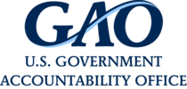

## Table of Contents

## What is the Government Accountability Office (GAO)?

The Government Accountability Office (GAO) is a special part of the United States government. It helps make sure that the government spends money wisely and follows the rules. The GAO is like a watchdog that keeps an eye on how tax dollars are used. It is led by the Comptroller General, who is chosen by the President and approved by the Senate.

The GAO does many important jobs. It checks how well government programs are working and if they are doing what they are supposed to do. If it finds problems, it gives advice on how to fix them. The GAO also helps Congress make good decisions by giving them information and reports. This way, Congress can make better laws and use money more effectively.

## When was the GAO established?

The Government Accountability Office (GAO) was established in 1921. It started when a law called the Budget and Accounting Act was passed. This law created the GAO to help keep an eye on how the government spends money.

Before 1921, there was no single group doing this job. The GAO was set up to make sure the government used money wisely and followed the rules. Over time, the GAO has grown and now does many important tasks to help the government work better.

## What is the primary function of the GAO?

The main job of the Government Accountability Office (GAO) is to watch over how the U.S. government spends money. It makes sure that the money is used wisely and that the government follows the rules. The GAO checks the work of many government programs and agencies to see if they are doing their jobs well.

The GAO also helps Congress make good decisions. It gives Congress information and reports about how government programs are working. This helps Congress make better laws and use money more effectively. The GAO is like a helpful friend to Congress, making sure that the government works the way it should.

## Who leads the GAO and how is this position appointed?

The GAO is led by a person called the Comptroller General. This person is in charge of making sure the GAO does its job well. The Comptroller General is very important because they help make sure the government uses money wisely.

The President of the United States picks the Comptroller General. After the President chooses someone, the Senate has to say it's okay. This means the Senate votes to approve the person. Once the Senate agrees, the Comptroller General can start working at the GAO.

## How does the GAO ensure government accountability?

The GAO makes sure the government is accountable by checking how it spends money and follows the rules. It looks at different government programs and agencies to see if they are doing their jobs well. If the GAO finds any problems, it tells the government how to fix them. This helps make sure that the money taxpayers give to the government is used the right way.

The GAO also helps Congress make good decisions. It gives Congress reports and information about how government programs are working. This helps Congress know where the government might need to do better. By doing this, the GAO helps make sure the government stays honest and works well for everyone.

## What types of audits and evaluations does the GAO perform?

The GAO performs different kinds of audits and evaluations to make sure the government is doing its job right. One type is financial audits, where the GAO checks if the government's money records are correct and if they are following the rules about how to spend money. Another type is performance audits, where the GAO looks at how well government programs are working. They see if the programs are reaching their goals and if they are using money in the best way possible.

The GAO also does program evaluations, which are detailed studies about how a specific government program is doing. These evaluations help the GAO understand if the program is helping people the way it should. Additionally, the GAO performs forensic audits, which are like detective work to find out if there has been any fraud, waste, or abuse of government money. By doing all these different kinds of audits and evaluations, the GAO helps make sure the government is using taxpayer money wisely and honestly.

## How does the GAO influence policy and legislation?

The GAO helps shape policy and legislation by giving Congress important information and reports. When the GAO does audits and evaluations, it finds out what is working well and what needs to be fixed in government programs. It then shares this information with Congress. This helps Congress understand where changes might be needed. By knowing the details, Congress can make better laws and policies that help the government work more effectively.

The GAO also gives suggestions on how to improve laws and programs. If the GAO sees a problem, it tells Congress how to fix it. This can lead to new laws or changes to old ones. For example, if a program is not helping people the way it should, the GAO might suggest ways to make it better. Congress can then use these ideas to create new policies or change existing ones. This way, the GAO plays a big role in making sure the government keeps improving and serving people well.

## What is the relationship between the GAO and Congress?

The GAO and Congress work closely together. The GAO helps Congress by giving them information about how the government is doing its job. When Congress needs to know if a government program is working well or if money is being spent the right way, they ask the GAO to check it out. The GAO then does audits and evaluations and tells Congress what they find. This helps Congress make good decisions about laws and how to use money.

The GAO also gives Congress ideas on how to make things better. If the GAO sees problems in a government program, they suggest ways to fix it. Congress can then use these suggestions to change laws or start new programs. This makes the government work better for everyone. The GAO is like a helpful friend to Congress, making sure the government stays honest and works well.

## Can you describe a significant historical case or investigation handled by the GAO?

One important case that the GAO looked into was about the F-35 fighter jet program. The F-35 is a very expensive airplane that the military uses. The GAO found out that the program was costing a lot more money than people thought it would. They also found that it was taking longer to finish than planned. The GAO told Congress about these problems, and this helped Congress decide what to do next about the F-35 program.

Another big investigation by the GAO was about the response to Hurricane Katrina in 2005. Hurricane Katrina was a huge storm that caused a lot of damage. The GAO looked at how the government helped people after the storm. They found out that the government was not ready and did not help people as well as they could have. The GAO gave ideas on how the government could be better prepared for future disasters. This helped make the government's emergency plans better.

## How has the role and scope of the GAO evolved over time?

The GAO was created in 1921 to make sure the government used money wisely. Back then, it mainly checked the government's money records to see if they were correct. Over the years, the GAO's job grew bigger. It started looking at how well government programs were working, not just the money part. This meant the GAO began to do more types of audits and evaluations, like performance audits and program evaluations, to see if programs were helping people the way they should.

Today, the GAO does a lot more than just check money records. It helps Congress make better laws by giving them reports and information about all parts of the government. The GAO looks at everything from health care to national defense to see if they are working well. It also gives advice on how to fix problems it finds. The GAO has become a very important part of making sure the government is honest and works well for everyone.

## What are some current challenges facing the GAO?

One of the big challenges the GAO faces today is keeping up with new technology. The government is using more and more technology in its programs, and the GAO needs to understand these new tools to check if they are being used well. This means the GAO has to keep learning and changing to make sure they can do their job properly.

Another challenge is dealing with big issues like climate change and cybersecurity. These problems are very complicated and affect many parts of the government. The GAO has to figure out how to look at these big issues and give good advice to Congress on how to handle them. This can be hard because these problems are always changing and need a lot of attention.

## How does the GAO compare to similar organizations in other countries?

The GAO in the United States is like other groups in different countries that also watch over how the government spends money and works. For example, in the United Kingdom, there is the National Audit Office (NAO). The NAO does a similar job to the GAO by checking the government's money records and seeing how well programs are doing. In Australia, the Australian National Audit Office (ANAO) does the same kind of work, making sure the government uses money wisely and follows the rules.

While these groups all have similar goals, they can work a bit differently depending on the country's rules and how their government is set up. The GAO, for example, gives a lot of reports and advice to the U.S. Congress to help them make laws. In other countries, these groups might report to different parts of the government or have different ways of sharing what they find. Even though they do things a bit differently, they all help make sure their governments are honest and work well for the people.

## References & Further Reading

[1]: U.S. Government Accountability Office. ["GAO's History"](https://www.gao.gov/about/what-gao-does) - An overview of the GAO's evolution and responsibilities.

[2]: Schacht, L. & Mallinger, T. (2017). ["Algorithmic Trading and Market Dynamics"](https://www.cmegroup.com/education/files/Algo_and_HFT_Trading_0610.pdf). Journal of Organizational Effectiveness: People and Performance.

[3]: Kirilenko, A.A., & Lo, A.W. (2013). ["Moore's Law versus Murphy's Law: Algorithmic Trading and Its Discontents"](https://www.aeaweb.org/articles?id=10.1257/jep.27.2.51). Journal of Economic Perspectives.

[4]: Marcus, A.J., & Leary, K. (2012). ["High Frequency Trading: Implications for Market Behavior"](https://www2.eecs.berkeley.edu/Pubs/TechRpts/2012/EECS-2012-144.pdf). Financial Analysts Journal.

[5]: Vigneron, P., et al. (2019). ["Algorithmic Trading and Market Quality"](https://www.cambridge.org/core/journals/journal-of-financial-and-quantitative-analysis/article/abs/algorithmic-trading-and-market-quality-international-evidence/4B96E916E3E13AFF1DF9B5FCC188F4E0). Journal of Financial Markets.