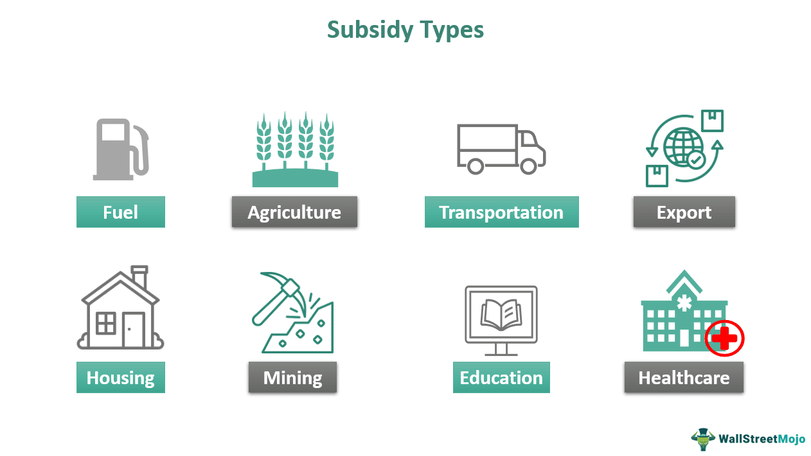

The interplay between economic aid, business support, government subsidies, and algorithmic trading is critical for analyzing the contemporary economic terrain. These elements together lay the groundwork for economic stability, foster growth, and increase competitive advantage in the global markets.

Economic aid, a crucial financial resource, assists countries and businesses in mitigating economic downturns and enhancing resilience. It encompasses various forms of funding, such as grants, loans, and technical assistance, helping stabilize economies and providing a safety net during downturns. This support plays an essential role in sustaining economic activities and encouraging the recovery of businesses.

Business support structures, often provided by government or private institutions, offer essential services and resources to businesses, particularly small and medium enterprises (SMEs). This assistance ranges from providing financial services to offering advice and training programs. By easing the functional and operational challenges, business support enables enterprises to thrive, innovate, and expand sustainably.

Government subsidies further reinforce these efforts by providing targeted financial aid to specific industries or sectors. These subsidies aim to stabilize prices, ensure sufficient supply, and enable demand across essential areas like agriculture, energy, and transportation. They can also promote sustainable and innovative practices, bolstering the adoption of cleaner technologies and sustainable practices across industries.

Algorithmic trading, on the other hand, brings a transformative dimension to financial markets. Through leveraging advanced mathematical models and computation, it facilitates rapid and efficient trades that would be otherwise impossible for human traders. By enhancing liquidity, reducing transaction costs, and improving market efficiency, algorithmic trading significantly reshapes modern financial landscapes.

Understanding the convergence of these elements is pivotal for economic progression and market efficiency. Economic aid, supported by strategic business support and government subsidies, empowers countries and entities to enhance their market presence and competitiveness. Meanwhile, algorithmic trading provides the technological backbone that underpins modern financial transactions, promoting a fair and stable trading environment.

For businesses and policymakers, a comprehensive understanding of these dynamics allows for informed decision-making capable of maximizing the benefits inherent in this synergy. Navigating this intricate interplay is essential for exploiting opportunities and crafting strategies that align with a rapidly evolving global economic environment.

## Table of Contents

## The Role of Economic Aid in Business Support

Economic aid substantially contributes to stabilizing economies during crises and supports businesses in challenging times. It is a crucial mechanism for ensuring that businesses have the financial backing necessary to endure economic turmoil and sustain their operations. This support manifests in several forms, including direct cash transfers and low-interest loans, which serve as vital tools for maintaining [liquidity](/wiki/liquidity-risk-premium) and operational continuity.

For small and medium enterprises (SMEs), the impact of economic aid is especially significant. SMEs often face difficulties in accessing traditional financing during economic downturns, making them particularly vulnerable. Economic aid allows these firms to invest in capacity building and explore market expansion opportunities, crucial for long-term sustainability and competitiveness. By facilitating access to financial resources, economic aid enables SMEs to scale operations, increase production capabilities, and enhance product offerings, thereby stimulating economic growth.

Innovation and technological advancement within industries are also incentivized by economic aid. By providing financial resources directed towards research and development, businesses can invest in new technologies and innovative processes. This drive towards innovation not only improves efficiency and productivity but also positions firms within the global market as leaders in technological advancement. Consequently, economic aid plays an essential role in fostering a culture of innovation that can lead to significant breakthroughs, benefiting entire industries and contributing to broader economic development.

Overall, economic aid functions as a catalyst for business support by promoting resilience, growth, and innovation, particularly in times of economic distress. By providing necessary financial cushioning, it strengthens the foundation upon which businesses can thrive and adapt in an ever-evolving economic landscape.

## Government Subsidies and Their Impact on Business Sectors

Government subsidies are essential tools for promoting economic growth, innovation, and competitiveness across various sectors. These financial assistance programs are designed to offset costs and encourage production in industries fundamental to a nation's prosperity, such as agriculture, energy, and transportation. By stabilizing prices and ensuring a consistent supply of goods and services, subsidies can stimulate demand and support economic stability.

Subsidies can take several forms, including direct payments, tax incentives, and grants. Direct payments provide immediate financial relief to businesses, enabling them to cover operational costs or invest in capacity expansion. Tax incentives, such as credits and deductions, reduce the fiscal burden on businesses, freeing up resources for reinvestment. Grants, often issued for research and development (R&D) activities, support innovation by funding new technologies and processes.

In the agricultural sector, subsidies can help maintain stable food supplies by supporting farmers' incomes, thus hedging against price [volatility](/wiki/volatility-trading-strategies) and unfavorable weather conditions. In the energy sector, subsidies often focus on promoting renewable energy sources to encourage the shift towards cleaner and more sustainable energy production. For instance, governments may offer tax breaks or direct support to companies that invest in solar or wind energy projects.

However, while subsidies provide significant benefits, they also pose challenges. One of the main issues is market distortion, where subsidies can lead to overproduction or artificial price suppression, disrupting the balance of supply and demand. This may result in inefficient resource allocation and hinder competition, as subsidized industries gain an unfair advantage over those without similar support.

Moreover, the fiscal burden associated with subsidies can strain public resources, diverting funds from other essential services such as healthcare and education. It is crucial for governments to carefully evaluate the economic impact and sustainability of subsidy programs to ensure they achieve desired outcomes without compromising fiscal responsibility.

In promoting sustainable practices, subsidies play a crucial role, particularly in the clean energy sector. By incentivizing the development and adoption of renewable energy technologies, subsidies contribute to reducing carbon emissions and moving towards global environmental goals. For example, tax rebates for electric vehicle purchases encourage consumers to adopt greener transportation options, subsequently reducing reliance on fossil fuels.

In conclusion, government subsidies are vital for supporting strategic industries and fostering economic resilience. However, the potential for market distortion and fiscal pressure necessitates careful management. Balancing short-term sectoral benefits with long-term economic health is essential for maximizing the effectiveness of subsidy programs.

## Algorithmic Trading: Transforming Financial Markets

Algorithmic trading involves the use of complex algorithms and software to automate trading strategies, allowing for the execution of trades at speeds and frequencies that are not achievable by human traders. This approach has significantly transformed financial markets, affecting how assets are bought and sold.

Algorithmic trading provides several advantages, including enhanced liquidity and reduced transaction costs. Liquidity refers to the ability to quickly buy or sell assets without causing a significant change in the asset's price. By facilitating a larger number of trades and increasing market participation, [algorithmic trading](/wiki/algorithmic-trading) ensures that markets remain liquid. This is crucial for maintaining market stability and allowing investors to enter and [exit](/wiki/exit-strategy) positions efficiently.

Another benefit of algorithmic trading is its potential to reduce transaction costs. Traditional trading involves manual processes that can be time-consuming and costly. By automating these processes, algorithmic trading minimizes human errors and lowers the costs associated with executing trades. In addition, it can improve market efficiency by rectifying price discrepancies swiftly and ensuring that asset prices reflect all available information.

However, algorithmic trading is not without its challenges. One of the primary concerns is the occurrence of flash crashes, which are extremely rapid market sell-offs followed by a quick recovery. These events can be triggered by algorithms reacting to market conditions in unforeseen ways, leading to large-scale, short-term market volatility. Additionally, the high-speed nature of algorithmic trading can potentially be exploited for market manipulation, where traders use algorithms to create deceptive movements in asset prices.

To address these concerns, regulatory bodies have developed rules and guidelines to enhance transparency and stability in financial markets. For instance, regulations may require traders to implement risk controls and continuously monitor the performance of their algorithms. Furthermore, measures such as circuit breakers, which temporarily halt trading under extreme conditions, have been established to prevent flash crashes.

In summary, algorithmic trading has revolutionized financial markets by providing liquidity, reducing costs, and improving efficiency. However, the risks associated with it necessitate robust regulatory frameworks to mitigate potential market disruptions and ensure fair trading practices.

## Synergy Between Economic Aid, Subsidies, and Algorithmic Trading

The collaboration among economic aid, government subsidies, and algorithmic trading establishes a robust support system that fosters growth and competitiveness in the business environment. Economic aid and subsidies provide a crucial financial foundation that helps businesses endure market fluctuations and invest in long-term growth. Subsidies, a form of government support, reduce the costs for businesses to enter or remain in specific markets, thereby stabilizing sectors such as agriculture and clean energy. By contrast, economic aid targets immediate financial needs through direct transfers or low-interest loans, allowing enterprises, particularly small and medium enterprises (SMEs), to expand and develop their operations.

Algorithmic trading complements these financial mechanisms by increasing market efficiency. It does so by leveraging sophisticated technological tools to execute trades swiftly and accurately, reducing transaction costs and meeting liquidity needs promptly. For example, high-frequency trading algorithms assess large datasets in fractions of a second, making decisions to buy or sell assets that humans would take significantly longer to analyze. This immediacy provides investors with a more balanced view of market conditions, optimizing their participation and enhancing the effectiveness of their financial strategies.

Together, these elements can drive investment towards green technology projects and other innovative endeavors. Economic aid and subsidies can lower the risk associated with new technologies by underwriting initial costs and promoting research and development. Meanwhile, algorithmic trading facilitates the flow of capital into these growing sectors, aligning financial incentives with sustainable economic practices. For instance, the integration of sustainable investment criteria into trading algorithms can prioritize assets from companies that meet environmental and social governance ([ESG](/wiki/esg-investing)) standards.

The synergy between economic aid, government subsidies, and algorithmic trading significantly bolsters the global competitiveness of domestic companies. By providing consistent funding and ensuring efficient market participation, these mechanisms enable businesses to access broader markets and enhance their offerings. Understanding the dynamics of this synergy is essential for businesses and policymakers aiming to capitalize on emerging economic opportunities. As they strive to navigate the complexities of modern markets, this tripartite collaboration offers a strategic advantage that can lead to sustained economic development and competitive positioning in the global arena.

## Conclusion

Economic aid, government subsidies, and algorithmic trading are essential components of modern economics, each playing a crucial role in supporting businesses, stabilizing economies, and transforming markets. These elements function as interconnected forces, influencing economic landscapes and shaping competitive environments across global markets.

Economic aid acts as a financial stabilizer, providing crucial support during economic downturns or crises. It ensures that businesses, especially small and medium enterprises (SMEs), have access to the resources needed to maintain operations and foster growth, thus contributing to overall economic stability. This support often comes in forms like direct cash transfers or low-interest loans, which help mitigate the adverse effects of economic disruptions.

Government subsidies, on the other hand, serve as strategic instruments in shaping industry dynamics. By offering financial assistance programs aimed at key sectors, subsidies help stabilize prices, secure supply chains, and stimulate demand. Notably, subsidies can incentivize sustainable practices, particularly in areas such as clean energy, promoting long-term economic and environmental benefits. However, the potential for market distortion and fiscal burden necessitates careful management and policy design to ensure positive outcomes.

Algorithmic trading brings technological advancement to financial markets, transforming the way assets are traded. It enhances liquidity, reduces transaction costs, and improves market efficiency by enabling rapid and efficient trade executions. However, the associated challenges, such as potential market manipulation and the risks of flash crashes, require robust regulatory frameworks to maintain market stability and integrity.

To maximize the benefits of these components, policymakers, businesses, and investors need to understand the interactions between economic aid, government subsidies, and algorithmic trading. This understanding will enable them to identify synergies and address challenges like regulatory issues and market distortions effectively. Continuous adaptation and strategic planning are crucial for navigating and succeeding in an ever-evolving economic environment. Embracing innovation while ensuring regulatory compliance will be key to leveraging these tools for sustainable economic growth and competitive advantage on the global stage.

## References & Further Reading

[1]: Lopez de Prado, M. (2018). ["Advances in Financial Machine Learning."](https://www.amazon.com/Advances-Financial-Machine-Learning-Marcos/dp/1119482089) Wiley.

[2]: Aronson, D. R. (2006). ["Evidence-Based Technical Analysis: Applying the Scientific Method and Statistical Inference to Trading Signals."](https://www.amazon.com/Evidence-Based-Technical-Analysis-Scientific-Statistical/dp/0470008741) Wiley.

[3]: Jansen, S. (2020). ["Machine Learning for Algorithmic Trading."](https://github.com/stefan-jansen/machine-learning-for-trading) Packt Publishing.

[4]: Chan, E. P. (2008). ["Quantitative Trading: How to Build Your Own Algorithmic Trading Business."](https://github.com/ftvision/quant_trading_echan_book) Wiley.

[5]: Bergstra, J., Bardenet, R., Bengio, Y., & Kégl, B. (2011). ["Algorithms for Hyper-Parameter Optimization."](https://dl.acm.org/doi/10.5555/2986459.2986743) Advances in Neural Information Processing Systems 24.

[6]: Hull, J. (2018). ["Options, Futures, and Other Derivatives."](https://www.semanticscholar.org/paper/Options%2C-Futures%2C-and-Other-Derivatives-Hull/89bdee500c8623864fc9eb7a471546aa713acc44) Pearson.

[7]: Vayanos, D., & Woolley, P. (2013). ["An Institutional Theory of Momentum and Reversal."](https://www.jstor.org/stable/23470044) The Review of Financial Studies, 26(5), 1084-1137.