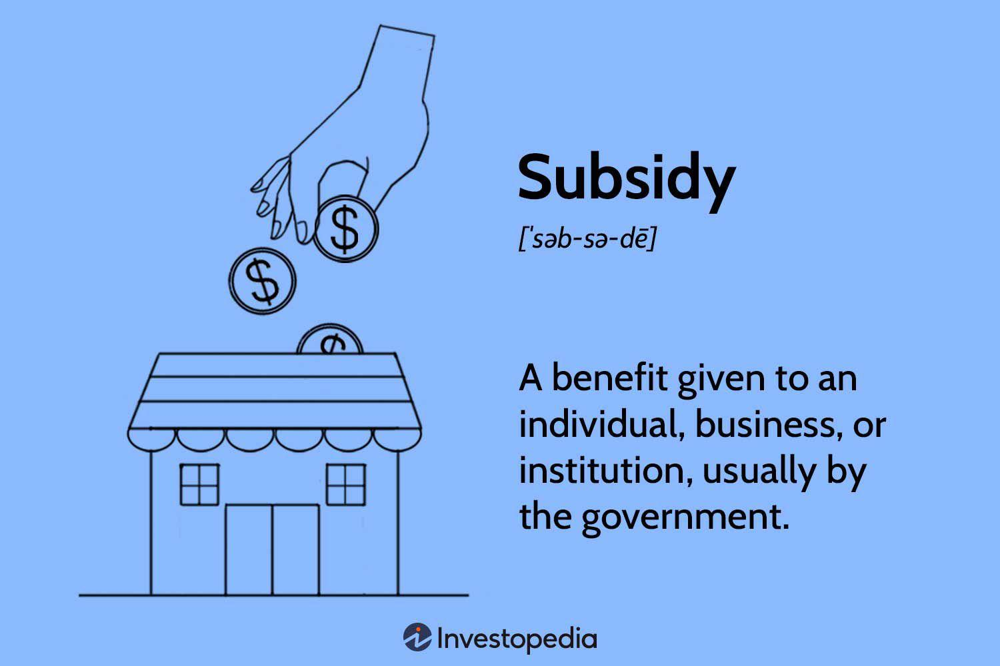

## Table of Contents

## What is a government business subsidy?

A government business subsidy is when the government gives money or help to businesses. This help can be in the form of direct cash, tax breaks, or other benefits. The main goal is to support businesses that are important for the economy or to help them grow and create jobs.

Subsidies can be given to different types of businesses, like farmers, manufacturers, or tech companies. Sometimes, the government wants to support industries that are struggling or to encourage new ones. By giving subsidies, the government hopes to make the economy stronger and help more people find work.

## What are the different types of government business subsidies?

Government business subsidies come in many forms. One type is direct financial help, where the government gives money to businesses. This can be through grants or loans with low interest rates. Another type is tax breaks, where businesses pay less tax. This can include lower corporate taxes or special deductions that reduce how much a business owes in taxes. Governments might also offer subsidies through cheaper resources, like giving businesses lower prices on energy or raw materials they need.

Another way governments help businesses is through indirect subsidies. These can be things like training programs for workers, which help businesses by making sure they have skilled employees. Governments might also build infrastructure, like roads or ports, which makes it easier for businesses to transport goods and reach customers. Sometimes, governments protect certain industries by setting rules that make it harder for foreign companies to compete, which can be seen as a form of subsidy.

These different types of subsidies aim to support businesses in various ways. They can help businesses start up, grow, or stay competitive. By giving these subsidies, governments hope to create jobs, boost the economy, and support important industries. However, it's important for governments to balance these subsidies so that they help the economy without unfairly favoring some businesses over others.

## How do businesses apply for government subsidies?

Businesses usually apply for government subsidies by filling out forms and sending them to the right government office. They need to show why they need the subsidy and how it will help them and the economy. Sometimes, they have to write a plan or a proposal. The government then looks at these applications to decide which businesses get the subsidies. It's important for businesses to follow the rules and deadlines set by the government.

Different types of subsidies might have different ways to apply. For example, if a business wants a tax break, they might need to fill out special tax forms. If they want a grant or a loan, they might need to apply through a specific government program or website. Businesses can often find help and information on government websites or by talking to government officials. It's a good idea for businesses to keep track of when and how they can apply for different subsidies.

## What are the eligibility criteria for receiving a government business subsidy?

To get a government business subsidy, a business usually needs to meet certain rules. These rules can be different depending on the type of subsidy and the country or region. Often, businesses need to show that they are in an industry the government wants to help, like farming or technology. They might also need to prove they will use the subsidy to create jobs, grow their business, or help the local economy. Sometimes, the size of the business matters, with small businesses or startups getting priority.

Another important thing is that businesses need to follow all the rules set by the government. This might mean filling out forms correctly and meeting deadlines. They also need to show they can use the money well and that they really need the help. Governments want to make sure the subsidies go to businesses that will use them to make a positive difference. So, businesses need to be clear about their plans and how the subsidy will help them and the community.

## How do government subsidies impact the economy?

Government subsidies can help the economy by supporting businesses that create jobs and drive growth. When businesses get money or help from the government, they can hire more people, buy more supplies, and expand their operations. This can lead to more jobs for people and more money moving around in the economy. For example, if a government gives a subsidy to a factory, the factory might hire more workers, and those workers will spend their money in local shops and restaurants, helping the whole community.

However, subsidies can also have some downsides. If the government gives too much money to certain businesses, it might not be fair to other businesses that don't get help. This can make it hard for new companies to start up or for smaller businesses to compete. Also, subsidies cost the government money, which comes from taxes. If the government spends a lot on subsidies, it might have less money for other important things like schools or roads. So, it's important for the government to balance giving subsidies with making sure the economy stays fair and healthy for everyone.

## Can you provide examples of successful government subsidy programs?

One good example of a successful government subsidy program is the U.S. farm subsidies. These subsidies help farmers by giving them money or help to grow crops. This is important because it makes sure there is enough food for everyone. Farmers can use the money to buy new equipment or seeds, which helps them grow more food. This program has been around for a long time and has helped keep farming strong in the U.S.

Another example is Germany's feed-in tariffs for renewable energy. This program pays people and businesses for making electricity from the sun or wind. It helps make more clean energy and has made Germany a leader in using renewable energy. People who put solar panels on their roofs or start wind farms get money from the government for the electricity they make. This has helped the environment and created many new jobs in the renewable energy industry.

## What are the potential drawbacks of government business subsidies?

Government business subsidies can have some problems. One big issue is that they can make things unfair. If the government gives a lot of money to some businesses but not others, it can be hard for the businesses that don't get help to compete. This can stop new businesses from starting up or growing, because they can't get the same help. It can also make it hard for smaller businesses to do well if big businesses get most of the subsidies.

Another problem is that subsidies cost money. The government gets this money from taxes, so if it spends a lot on subsidies, there might be less money for other important things like schools, hospitals, or roads. Sometimes, subsidies might not even work the way the government hopes. If businesses use the money in ways that don't help the economy grow or create jobs, it can be a waste of money. So, the government needs to be careful about how it gives out subsidies and make sure they really help the economy and everyone in it.

## How are government subsidies funded?

Government subsidies are paid for with money from taxes. When people and businesses pay taxes, the government uses some of that money to give subsidies to businesses. This can be money from income taxes, sales taxes, or other kinds of taxes. The government decides how much money to spend on subsidies and which businesses should get them. This can change from year to year, depending on what the government thinks is important for the economy.

Sometimes, the government might borrow money to pay for subsidies. This means they take out loans and promise to pay the money back later. This can happen if the government wants to give more subsidies than it has money for right now. Borrowing money can help the government support businesses and the economy, but it also means they have to pay back the loans with interest. So, the government needs to be careful about how much it borrows and how it uses the money.

## What role do government subsidies play in promoting innovation?

Government subsidies can help businesses try new things and come up with new ideas. When businesses get money or help from the government, they can spend more on research and development. This means they can work on new products or ways of doing things that they might not have been able to do without the extra help. For example, a company might use a subsidy to build a new kind of machine or to develop a new technology. This can lead to new inventions and improvements that help the whole economy.

However, subsidies for innovation need to be used carefully. If the government gives too much money to just a few businesses, it might not be fair to others who also have good ideas but don't get help. Also, the government needs to make sure the subsidies really lead to new inventions and not just help businesses that were going to do well anyway. When used the right way, subsidies can encourage businesses to take risks and come up with new ideas that can make the economy stronger and help everyone.

## How do government subsidies affect competition within industries?

Government subsidies can change how businesses compete in an industry. When the government gives money or help to some businesses but not others, it can make things unfair. Businesses that get subsidies might be able to lower their prices or spend more on new ideas, making it hard for businesses without subsidies to keep up. This can make it tough for new businesses to start or for small businesses to grow, because they don't have the same help. Over time, this can lead to fewer choices for customers and less competition in the industry.

However, subsidies can also help competition in some ways. If the government gives money to businesses to try new things or to help them grow, it can lead to more businesses in an industry. This can mean more choices for customers and more competition. For example, if a subsidy helps a new business start up, that business might bring new ideas or products to the market. So, while subsidies can make things unfair if they help only a few businesses, they can also help the economy by encouraging more competition and new ideas.

## What are the international perspectives on government business subsidies?

Different countries have different ideas about government business subsidies. Some countries think subsidies are good because they help businesses grow and create jobs. They see subsidies as a way to make their economy stronger and help important industries. For example, countries like Germany and the United States use subsidies to support farming and renewable energy. They believe that by helping these industries, they can make sure there is enough food and clean energy for everyone.

Other countries worry that subsidies can cause problems. They think subsidies can make it hard for businesses from other countries to compete fairly. If one country gives a lot of money to its businesses, it might make it tough for businesses from other countries to sell their products there. This can lead to arguments and disagreements between countries. Some countries even go to the World Trade Organization to complain about subsidies they think are unfair. So, while some countries see subsidies as helpful, others see them as a problem that can cause tension in international trade.

## How can the effectiveness of government business subsidies be measured and evaluated?

To measure how well government business subsidies work, people look at different things. They check if the businesses that got subsidies created more jobs, made more money, or grew bigger. They also see if the subsidies helped the economy overall, like if more people are working or if the country is making more things. Sometimes, they compare businesses that got subsidies with those that didn't to see if the subsidies made a real difference. This helps them understand if the subsidies were worth the money the government spent.

Another way to evaluate subsidies is by looking at long-term effects. People want to know if the help from the government made businesses stronger over time or if it just helped them for a little while. They also check if the subsidies led to new ideas or products that helped the economy grow. By looking at these things, governments can decide if they should keep giving subsidies, change how they give them, or stop them if they're not helping enough.

## References & Further Reading

[1]: Lopez de Prado, M. (2018). ["Advances in Financial Machine Learning."](https://www.amazon.com/Advances-Financial-Machine-Learning-Marcos/dp/1119482089) Wiley.

[2]: Aronson, D. R. (2006). ["Evidence-Based Technical Analysis: Applying the Scientific Method and Statistical Inference to Trading Signals."](https://www.amazon.com/Evidence-Based-Technical-Analysis-Scientific-Statistical/dp/0470008741) Wiley.

[3]: Jansen, S. (2020). ["Machine Learning for Algorithmic Trading."](https://github.com/stefan-jansen/machine-learning-for-trading) Packt Publishing.

[4]: Chan, E. P. (2008). ["Quantitative Trading: How to Build Your Own Algorithmic Trading Business."](https://github.com/ftvision/quant_trading_echan_book) Wiley.

[5]: Bergstra, J., Bardenet, R., Bengio, Y., & Kégl, B. (2011). ["Algorithms for Hyper-Parameter Optimization."](https://dl.acm.org/doi/10.5555/2986459.2986743) Advances in Neural Information Processing Systems 24.

[6]: Hull, J. (2018). ["Options, Futures, and Other Derivatives."](https://www.semanticscholar.org/paper/Options%2C-Futures%2C-and-Other-Derivatives-Hull/89bdee500c8623864fc9eb7a471546aa713acc44) Pearson.

[7]: Vayanos, D., & Woolley, P. (2013). ["An Institutional Theory of Momentum and Reversal."](https://www.jstor.org/stable/23470044) The Review of Financial Studies, 26(5), 1084-1137.