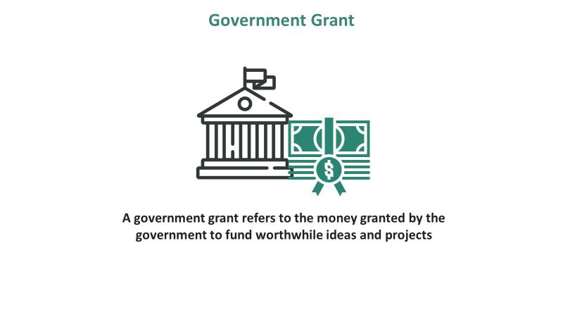

## Table of Contents

## What are government grants?

Government grants are money given by the government to people, businesses, or organizations for specific purposes. They don't have to be paid back, which makes them different from loans. Governments give out grants to help with things like education, starting a business, or doing research. They want to help people and make the community better.

To get a government grant, you usually need to apply and meet certain rules. The rules can be different depending on the grant. Sometimes, you need to show that you really need the money or that your project will help a lot of people. It can take a lot of time and work to apply, but it can be worth it because you don't have to pay the money back if you get the grant.

## What is the purpose of government grants?

Government grants are given out to help people, businesses, and organizations do things that are good for the community. The main purpose is to support projects or activities that might not happen without this extra money. For example, grants can help students go to college, small businesses start up, or researchers do important studies. By giving out these grants, the government wants to make life better for everyone and help the country grow.

Another reason for government grants is to solve specific problems or meet certain goals. Sometimes, the government sees a need in the community, like more jobs or better health care, and they use grants to encourage people to work on these issues. This way, the government can guide where the money goes and make sure it's used in the best way possible. Grants can also help spread out the money more fairly, so that different groups of people or different parts of the country can benefit.

## Who can apply for government grants?

People, businesses, and organizations can apply for government grants. This includes students who want to go to school, small business owners who need money to start or grow their business, and groups that do things like research or help the community. Anyone who meets the rules for a specific grant can apply.

The rules for who can apply can be different for each grant. Some grants are only for certain groups of people, like people from low-income families or people who live in certain areas. Other grants might be for anyone who has a good idea for a project that will help the community. It's important to read the rules carefully to see if you can apply.

Applying for a grant can take time and work. You usually need to fill out forms and write about your project or why you need the money. Sometimes, you need to show that you really need the grant or that your project will make a big difference. But if you get the grant, you don't have to pay the money back, which can be a big help.

## What types of government grants are available?

There are many types of government grants, and they can be for different things. Some grants help students pay for school. These are called education grants, and they can help with things like tuition and [books](/wiki/algo-trading-books). Other grants are for starting or growing a business. These business grants can help with costs like buying equipment or renting a space. There are also grants for doing research. These research grants help scientists and researchers study important topics and find new information.

Another type of grant is for community projects. These community grants help groups do things that make the neighborhood better, like building a park or helping people find jobs. There are also grants for the arts, which help artists and arts groups create and share their work. Some grants are for people who need help, like families who don't have a lot of money or people who need health care. These need-based grants help make sure everyone can get the help they need.

Government grants can also be for big projects that help the whole country. These might be for things like building roads or improving the environment. They can also be for helping other countries, like giving money for disaster relief or helping with development. No matter the type, all these grants are given out to help people and make life better for everyone.

## How do you find government grants that you are eligible for?

To find government grants that you are eligible for, you can start by looking on government websites. In the United States, for example, you can use the website Grants.gov to search for different types of grants. You can also check websites for your state or local government, as they often have their own grants for people who live in that area. Another way to find grants is to talk to people who work at schools, community centers, or business organizations. They might know about grants that you can apply for and can help you find them.

Once you find a grant that you might be eligible for, you need to read the rules carefully. The rules will tell you who can apply and what you need to do to apply. Make sure you meet all the requirements before you start the application. If you are not sure if you are eligible or how to apply, you can call the grant office or send them an email. They can answer your questions and help you with the application process. Finding and applying for grants can take time and work, but it can be worth it if you get the money you need.

## What are the common eligibility criteria for government grants?

Common eligibility criteria for government grants often include things like where you live, how much money you make, and what you want to use the grant for. For example, some grants are only for people who live in certain states or cities. Other grants might be for people who don't have a lot of money or who come from certain backgrounds. It's also common for grants to be for specific purposes, like going to school, starting a business, or doing research.

Another important part of eligibility is what you plan to do with the grant money. You usually need to show that your project or idea will help the community or meet the goals of the grant. This can mean writing a plan or proposal that explains your project and how it will make a difference. Sometimes, you also need to show that you have the skills or experience to do what you are planning. Reading the rules carefully and making sure you meet all the criteria is a big part of applying for a grant.

## What is the typical application process for a government grant?

To apply for a government grant, you first need to find a grant that you are eligible for. You can look on websites like Grants.gov or your state or local government's website to find different grants. Once you find a grant that you might qualify for, read the rules carefully. The rules will tell you who can apply and what you need to do to apply. If you have any questions, you can call the grant office or send them an email. They can help you understand the rules and the application process.

After you understand the rules, you can start the application. This usually means filling out forms and writing about your project or why you need the money. You might need to include things like a budget, a plan for your project, and letters of support from other people. It can take a lot of time and work to fill out the application, so make sure you start early. Once you send in your application, you will have to wait to hear back. It can take a while for the government to review all the applications and decide who gets the grants. If you get the grant, you don't have to pay the money back, which can be a big help.

## What documents are required when applying for a government grant?

When you apply for a government grant, you usually need to fill out forms and write about your project or why you need the money. These forms might ask for personal information like your name, address, and how much money you make. You might also need to write a plan that explains what you want to do with the grant money and how it will help the community. This plan is called a proposal or project description. Sometimes, you need to include a budget that shows how you will spend the money.

Other documents you might need are things like letters of support from other people or organizations that think your project is a good idea. These letters can help show that your project is important and will make a difference. You might also need to show that you have the skills or experience to do what you are planning, so you could include things like your resume or examples of your past work. It's important to read the rules carefully because different grants might need different documents. If you are not sure what you need, you can call the grant office or send them an email and they can help you.

## How long does the grant application process usually take?

The grant application process can take a long time. It usually takes a few weeks to a few months to fill out the forms and write about your project. You need to read the rules carefully and make sure you have all the documents you need. This can be a lot of work, so it's a good idea to start early. Once you send in your application, you have to wait for the government to look at it and decide if you can get the grant.

After you send in your application, it can take a few more months for the government to review all the applications and make their decisions. They have to read through a lot of applications and see which ones are the best. Sometimes, they might ask you for more information or to change something in your application. Once they make their decision, they will let you know if you got the grant. If you do get it, you don't have to pay the money back, which can be a big help.

## What are some strategies to increase the chances of a successful grant application?

To increase your chances of getting a government grant, it's important to start by carefully reading the rules and making sure you meet all the requirements. If you are not sure about something, don't be afraid to call the grant office or send them an email. They can help you understand what you need to do. When you write your application, make sure to explain your project clearly and show how it will help the community. Include all the documents they ask for, like your budget and letters of support. Starting early and giving yourself plenty of time to work on your application can also make a big difference.

Another good strategy is to get help from other people. You can ask someone who has written a successful grant application before to look at your application and give you advice. Sometimes, there are workshops or classes you can take to learn more about applying for grants. It's also a good idea to keep trying even if you don't get the grant the first time. You can learn from the feedback you get and use it to make your next application even better. Remember, getting a grant can take time and work, but it can be worth it if you get the money you need.

## How are government grants funded and managed?

Government grants are funded by the money that the government collects from taxes and other sources. When the government makes a budget, they decide how much money to set aside for grants. This money comes from taxes that people and businesses pay. Sometimes, the government also gets money from selling things like oil or natural gas. All this money goes into a big pot, and then the government decides how to use it to help people and make the country better. Grants are one way they do this.

Once the money is set aside for grants, different government offices and agencies manage it. They decide which grants to give out and who can apply for them. Each grant has its own rules and goals. The people who work at these offices look at all the applications that come in and decide which ones are the best. They make sure the money is used in the right way and that it helps the community. If someone gets a grant, they have to follow the rules and use the money for what they said they would. The government keeps track of this to make sure everything is done correctly.

## What are the reporting and compliance requirements after receiving a government grant?

After you get a government grant, you have to follow certain rules to make sure you use the money the right way. This means you need to keep good records of how you spend the money and what you do with it. You might have to write reports that explain what you did with the grant money and how your project is going. These reports help the government see if you are doing what you said you would do. Sometimes, you also need to let them know if anything changes with your project or if you need more time to finish it.

The government also checks to make sure you are following the rules. This can mean they come to visit your project or ask to see your records. They want to make sure the money is being used to help the community and that everything is going as planned. If you don't follow the rules, you might have to give the money back or you might not be able to get grants in the future. It's important to read all the rules carefully and ask for help if you are not sure what to do.

## How can one apply for government grants?

The process of applying for government grants is structured to ensure that the funding is allocated to projects that demonstrate potential for significant outcomes and compliance with governmental objectives. Here are the main steps involved:

1. **Registration**: Before an application can be submitted, organizations or individuals must register with government platforms like Grants.gov, where most U.S. federal grants are announced. This registration creates a unique profile and credential that will be used throughout the application process. It generally includes providing identification information, tax data, and banking details for the fund disbursement.

2. **Proposal Submission**: A pivotal part of the grant application is crafting a proposal that clearly articulates the project's aims, methodologies, and expected outcomes. This proposal must align succinctly with the grant's objectives. Given the competitive nature of grants, a well-written proposal can determine an application's success. The proposal should outline the project's purpose, scope, expected impact, and how it will meet the grant's specific requirements. 

    - **Proposal Writing**: The complexity of the proposal often necessitates professional expertise in grant writing. Writers experienced in this field understand the importance of using precise language to meet all detailed criteria and emphasize the project's alignment with the agency's goals. The narrative should be structured to guide reviewers logically through the project's context, objectives, and anticipated benefits. 

    - **Mathematics and Models**: For projects involving algorithmic trading, the proposal might include mathematical models that underpin the algorithmic strategies. Demonstrating proficiency in models like stochastic calculus or regression analysis can be crucial. For example, showcasing potential efficiency through algorithms such as:
$$
      P_t = P_{t-1} + \mu + \sigma \cdot \epsilon_t

$$

      where $P_t$ is the price at time $t$, $\mu$ is the drift, $\sigma$ is the volatility, and $\epsilon_t$ signifies the random shock at time $t$ can be instrumental in conveying technical feasibility.

3. **Compliance Checks**: Post-submission, applications are scrutinized for compliance with the funding agency's guidelines. This involves ensuring all necessary documents are in place and that the application adheres to specified legal and ethical standards. Verification and validation processes ensure that applicants can manage the grant responsibly if awarded.

4. **Narrative Structuring**: Successful applications invariably present a compelling narrative that communicates the project's importance in a broader context. Using case studies or preliminary data to support claims can help establish a project's credibility. A solid narrative not only includes a technical description but also articulates the societal, economic, or environmental benefits the project aims to contribute to.

Moreover, leveraging data science techniques and articulating how [algorithmic trading](/wiki/algorithmic-trading) advancements can foster market stability or efficiency will add substantial value to the proposal. Given the detailed and competitive nature of grants, comprehensively addressing every aspect of the application process maximizes the chances of successful funding.

## References & Further Reading

[1]: ["A Guide to Federal Grants for Research and Development"](https://www.grants.gov/) by the National Academies Press.

[2]: Johnson, R., & Robinson, P. (2014). ["The Impact of Algorithmic Trading on Equity Market Liquidity: Evidence from the U.K."](https://www.researchgate.net/publication/378548435_Algorithmic_Trading_and_AI_A_Review_of_Strategies_and_Market_Impact) Bank of England Financial Stability Paper No. 29.

[3]: Lopez de Prado, M. (2018). ["Advances in Financial Machine Learning"](https://www.amazon.com/Advances-Financial-Machine-Learning-Marcos/dp/1119482089).

[4]: Harris, L. E. (2003). ["Trading and Exchanges: Market Microstructure for Practitioners"](https://academic.oup.com/book/52292).

[5]: Grant, A. M., & Donovan, S. A. (2021). ["Federal Grants to State and Local Governments: A Historical Perspective on Contemporary Issues"](https://digital.library.unt.edu/ark:/67531/metadc1043325/).

[6]: ["The Complete Guide to Writing a Federal Grant Proposal"](https://www.federalgrantswire.com/writing-a-federal-grant-proposal.html) by the National Institutes of Health.