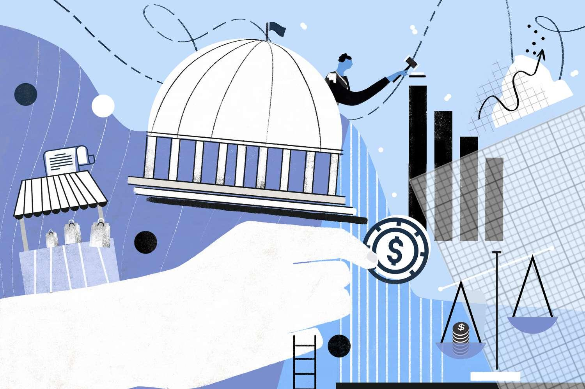

In the rapidly evolving financial landscape, the interplay between market influences, economic policy, government regulation, and algorithmic trading holds tremendous significance. These elements collectively shape the dynamics of global financial systems, requiring attention from various stakeholders, including government policymakers, financial institutions, and private investors.

Market influences encompass the forces of supply and demand, investor sentiment, and global economic events that drive price movements and volatility in financial markets. Economic policies, crafted by governments and central banks, aim to stabilize and guide economic growth through mechanisms such as fiscal policy and monetary policy. These policies influence key factors including interest rates, inflation, and employment levels, directly affecting market conditions.

Government regulation plays a crucial role in ensuring the stability, fairness, and transparency of financial markets. By implementing regulatory frameworks, governments seek to protect consumers, reduce systemic risks, and foster an environment conducive to innovation and competition. The landscape of regulation is continuously evolving, particularly in response to technological advancements and past financial crises.

Algorithmic trading, characterized by the use of computer algorithms to execute trades with precision and speed, has transformed market participation and liquidity. These algorithms leverage complex models and vast data sets to make trading decisions, impacting price discovery and market volatility. However, the rise of algorithmic trading also brings challenges, including concerns about market manipulation and the potential for systemic risks.

Understanding the interactions among these components is essential for navigating the complexities of modern financial markets. As these elements evolve and interact, they create new opportunities and challenges, shaping the future trajectory of the global economy. By examining their roles and influences, this article aims to provide a comprehensive view of the financial systems that will shape our economic future.

## Table of Contents

## Market Influence: The Driving Force

Market influence is a fundamental aspect of financial systems, driven by the forces of supply and demand, investor sentiment, and global economic events. These elements collectively shape market conditions, impacting asset prices and investment decisions. Key factors such as interest rates, international trade, and geopolitical tensions significantly affect market dynamics.

Interest rates serve as a crucial determinant of economic activity. Central banks manipulate interest rates to control inflation and stabilize currencies. Changes in interest rates alter the cost of borrowing, influencing corporate investments and consumer spending. A lower [interest rate](/wiki/interest-rate-trading-strategies) typically leads to increased borrowing and investment, while higher rates can suppress these activities. The relationship between interest rates and asset prices is often inverse; lower rates make fixed-income investments less attractive, thereby pushing investors towards equities in search of higher returns.

International trade influences market conditions by altering the flow of goods and capital. Trade agreements, tariffs, and currency fluctuations can either facilitate or hinder economic growth, impacting national and global markets. For instance, a trade surplus can strengthen a country's currency, while deficits may lead to depreciation. Geopolitical tensions, such as conflicts or trade disputes, introduce uncertainty and can lead to market [volatility](/wiki/volatility-trading-strategies). Such uncertainties prompt investors to adjust portfolios, often seeking safe-haven assets like gold or government bonds.

In recent years, digital platforms and big data analytics have expanded the scope of market influence. The proliferation of data has enabled investors to gain better insights into market trends and consumer behavior. Predictive analytics, driven by [machine learning](/wiki/machine-learning) algorithms, allows for more accurate forecasts and improved decision-making processes. 

Traditional market analysis, which primarily relied on historical data and human intuition, now integrates AI-driven insights. These technologies process vast amounts of data to identify patterns and predict future market movements, enhancing the ability to minimize investment risks. For instance, machine learning models can analyze social media sentiment to gauge public perception of a company or an economic event, influencing stock prices.

Overall, understanding market influences is crucial for predicting trends and mitigating risks. As technology continues to advance, the interplay between digital tools and traditional market factors will play an increasingly important role in shaping investment strategies. Advanced computational techniques and analytical prowess provide investors the edge needed to navigate the complexities of modern financial markets.

## Economic Policy: The Guiding Hand

Economic policy plays a pivotal role in stabilizing and directing economic growth. These policies are crafted and implemented by governments and central banks with the primary goal of fostering a stable economic environment conducive to growth and development. The implementation of economic policy is typically divided into two main categories: fiscal policy and monetary policy.

Fiscal policies encompass government taxation and spending activities. By adjusting tax rates and altering government expenditure, fiscal policy can influence the level of aggregate demand in the economy. For instance, during periods of economic downturn, governments might reduce taxes or increase public spending to stimulate demand and reinvigorate economic activity. Conversely, in times of economic overheating, increasing taxes or cutting back on government spending can help cool down the economy. The challenge lies in finding the right balance to achieve sustainable growth without causing negative side effects such as inflation or increased public debt.

Monetary policies, on the other hand, involve the management of interest rates and the money supply by central banks. A lower interest rate environment usually encourages borrowing and spending by businesses and consumers, thereby boosting economic activity. Conversely, higher interest rates can help contain inflation by discouraging borrowing and spending. Central banks use tools like open market operations, setting reserve requirements, and the discount rate to control the availability and cost of money. Effective monetary policy is crucial for maintaining price stability and ensuring sustainable economic growth.

Globalization has added layers of complexity to economic policy formulation and implementation. International trade, cross-border investments, and interconnected financial systems require synchronization and cooperation among countries to ensure that policy measures do not lead to unintended counterproductive effects on a global scale. Collaborative international economic policies are therefore essential to manage global economic interdependence effectively.

The effectiveness of economic policies in mitigating financial crises and promoting sustainable growth has been a subject of extensive debate. While well-crafted fiscal and monetary policies can prevent economic fluctuations from spiraling into crises, poorly timed or executed policies can exacerbate such situations. Policymakers are tasked with undertaking rigorous economic analyses to anticipate potential economic risks and design policies capable of addressing them.

A major ongoing challenge for policymakers is balancing short-term economic gains with long-term objectives. Immediate measures to boost economic activity can sometimes conflict with long-term goals such as fiscal sustainability, reduced carbon emissions, or social equity. Strategic foresight and meticulous planning are required to ensure that economic policies deliver not just short-lived expansions but lay the groundwork for ongoing prosperity.

Overall, economic policy serves as the guiding hand directing economies toward desired outcomes. The formulation and execution of these policies require a delicate balance, informed judgment, and an understanding of both domestic and international economic landscapes.

## Government Regulation: Ensuring Stability

Government regulation serves as a cornerstone in maintaining the fairness, efficiency, and transparency of financial markets. Regulations function primarily to protect consumers, prevent fraudulent activities, and reduce systemic risks that could destabilize the economy. Following the 2008 financial crisis, a series of reforms significantly strengthened regulatory frameworks globally, despite ongoing challenges. The aftermath of this crisis saw the introduction of critical legislation such as the Dodd-Frank Wall Street Reform and Consumer Protection Act in the United States, designed to promote market stability and transparency.

Regulations drive reform in market practices, controlling the exposure of financial institutions to high-risk financial products and ensuring comprehensive oversight. These reforms have reinforced the regulatory infrastructure by introducing stress tests for banks, establishing requirements for increased capital reserves, and improving accountability and transparency.

However, these regulations often ignite debate regarding their impact on innovation and market fluidity. Critics argue that excessive regulation can stifle innovation and impede the efficient functioning of markets. For instance, stringent capital requirements can limit banks' ability to lend, thereby constraining economic growth. Conversely, proponents advocate that a well-regulated market fosters a stable environment conducive to innovation by providing security and predictability for investors.

A pressing challenge is ensuring that these regulations keep pace with rapid technological advancements. Innovations such as blockchain, cryptocurrencies, and [algorithmic trading](/wiki/algorithmic-trading) present new regulatory challenges and opportunities. Regulators are tasked with crafting policies that accommodate new technologies while mitigating risks associated with them. Effective governance in this context involves not only adapting existing regulations but also anticipating future shifts in technology and market practices.

The role of government regulation in financial markets is crucial for sustaining economic stability. As markets evolve with technological advancements and globalization, regulatory bodies must remain vigilant, balancing the need for security with the facilitation of innovation. This dynamic requires ongoing adaptation and proactive policy making to uphold the integrity of financial systems amidst continuously shifting landscapes.

## Algorithmic Trading: A New Era

Algorithmic trading relies on computer programs to execute trades at high speeds and volumes, often completing transactions in milliseconds. This approach has fundamentally transformed market participation and [liquidity](/wiki/liquidity-risk-premium), thereby altering the mechanisms of price discovery and volatility. Through the use of advanced technologies, algorithmic trading enhances efficiency and precision in financial markets.

The sophistication of trading algorithms is continually being advanced by developments in [artificial intelligence](/wiki/ai-artificial-intelligence) (AI) and machine learning. These technologies facilitate the analysis of vast datasets to identify trends and make informed trading decisions. As a result, algorithmic trading is increasingly capable of executing complex strategies that leverage predictive analytics and real-time market data.

However, the rapid execution and opacity of algorithmic trades have raised concerns regarding market manipulation and the occurrence of flash crashes—sudden, severe price drops caused by automated trading systems. An example of this is the infamous flash crash on May 6, 2010, when the Dow Jones Industrial Average dropped about 1,000 points within minutes, only to recover those losses shortly thereafter. Incidents like this underscore the need for stricter regulatory oversight to prevent potential abuses and maintain market stability.

The benefits of algorithmic trading include increased market efficiency, reduced transaction costs, and enhanced liquidity. Yet, its risks cannot be overlooked. The potential for systemic disruptions due to algorithm malfunctions or manipulative practices presents significant challenges. Therefore, financial institutions and regulators must work collaboratively to ensure that these trading systems are robust and transparent.

As algorithmic trading continues to evolve, its role in shaping market dynamics remains pivotal. The balance between innovation and regulation will be crucial in harnessing its advantages while mitigating associated risks. Future developments are likely to focus on further integrating AI and machine learning to improve algorithm accuracy, adaptability, and compliance with regulatory standards.

## The Intersection: A Synergistic Relationship

The interplay between market forces, policies, regulations, and technology forms the backbone of modern economies, shaping financial systems and their evolution. Algorithmic trading, which uses complex mathematical models and algorithms to make trading decisions, thrives in stable regulatory environments and relies heavily on robust economic policies to function optimally. In these well-structured settings, algorithmic trading contributes to market efficiency by increasing liquidity and aiding in accurate price discovery.

Changes in regulations or economic policies can lead to significant effects on market behavior and trading technologies. For instance, a sudden shift in monetary policy, such as an unexpected change in interest rates by a central bank, can create volatility, influencing algorithmic trading strategies. Similarly, regulatory changes, such as the introduction of new compliance requirements for financial institutions, can prompt algorithm adjustments to maintain adherence to the new regulatory landscape. The interconnectedness of algorithmic trading platforms and their reliance on high-frequency decision-making mean that even minor changes in policy or regulation can cause cascading effects throughout the market, affecting liquidity provision, order flow, and possibly increasing systemic risk.

Understanding this synergy between market forces, policies, regulations, and technology is critical for anticipating shifts in the financial landscape. Stakeholders, including financial institutions, technology developers, policymakers, and regulators, must continually analyze the complex interactions within this ecosystem to make informed decisions that support market stability and integrity. This requires a clear comprehension of how technological advancements, such as improvements in artificial intelligence and machine learning, influence trading strategies and the broader financial market landscape.

Effective collaboration between the private and public sectors is essential in harnessing the benefits of algorithmic trading while mitigating associated risks. By fostering an environment that encourages open communication and cooperative efforts, both sectors can work towards mutually beneficial goals. This collaboration might include developing regulatory frameworks that encourage innovation while ensuring market stability or creating public-private partnerships to enhance the resilience of financial systems against cyber threats.

In conclusion, the intersection of market forces, policies, regulations, and technology plays a critical role in shaping contemporary financial ecosystems. Stakeholders must remain vigilant and adaptable, using data-driven insights and collaborative strategies to optimize the benefits of these interdependencies and address the challenges they present. This holistic approach will be key to ensuring the sustained growth and stability of global markets.

## Future Prospects: Navigating Uncertainty

As technology progresses, the interconnectedness of market influences, economic policies, government regulation, and algorithmic trading will increasingly shape financial systems. Emerging markets, often characterized by rapid growth and adoption of new technologies, present both opportunities and challenges for global investors and policymakers. These markets can offer substantial returns due to their high growth potential but also pose risks stemming from political instability, regulatory uncertainties, and volatile economic conditions.

Technological innovations, particularly in fields such as blockchain, artificial intelligence, and big data, continue to transform financial markets. Blockchain technology promises greater transparency and security, potentially reducing risks related to fraud and improving the efficiency of transactions. Moreover, artificial intelligence and machine learning are enhancing data analysis, risk assessment, and predictive modeling capabilities, enabling more informed investment and policy decisions.

To navigate these changes, policy reforms and regulatory adaptations will be crucial. Regulatory frameworks must evolve to address novel risks associated with technological advancements while still providing room for innovation. This includes updating existing regulations to accommodate new asset classes like cryptocurrencies and ensuring that global standards for data privacy and protection are met.

Investors and policymakers must remain adaptable, informed, and proactive. For investors, continuous learning and staying abreast of technological and market trends is vital for maintaining competitive advantage and mitigating risks. Policymakers, on the other hand, must engage with stakeholders across different sectors to ensure that policies are both comprehensive and responsive to ongoing changes.

Ultimately, fostering collaboration across sectors can lead to a more resilient and equitable financial future. By working together, governments, financial institutions, technology companies, and other stakeholders can develop integrated solutions that address shared challenges. Such cooperation can help balance the benefits of technological advancements with the need for stability and fairness in financial markets, paving the way for sustainable economic growth.

## Conclusion

The complex interaction between market influences, economic policy, government regulation, and algorithmic trading is reshaping financial markets. Understanding these relationships is essential for anyone looking to effectively navigate the constantly shifting economic landscape. Market influences, such as supply and demand dynamics, investor sentiment, and geopolitical factors, have a profound impact on asset prices and trading volumes. In parallel, economic policies implemented by governments and central banks are pivotal in pushing economic growth and maintaining market equilibrium. These policies can directly affect interest rates, inflation, and fiscal stability, which, in turn, influence investor decisions and market trends.

Moreover, government regulation ensures stability and fairness within financial markets. Regulatory frameworks are continuously evolving to mitigate systemic risks and protect market participants from fraud and manipulation. Following the 2008 financial crisis, there has been a significant emphasis on strengthening regulatory measures to prevent future collapses and ensure the resilience of financial systems. 

Algorithmic trading adds another layer of complexity to this interaction. It has revolutionized market participation through enhanced speed and efficiency in executing trades. However, it also introduces challenges such as potential market manipulation and increased volatility. As technology advances, the sophistication and prevalence of algorithmic trading will continue to grow, necessitating robust regulatory oversight and technological safeguards.

Stakeholder collaboration and adaptive strategies are key to harnessing the benefits of these interconnected factors while minimizing potential risks. Collaborative efforts between public and private sectors can lead to more robust economic strategies and regulatory approaches, promoting sustainable growth. Remaining informed and actively engaged with the latest developments in technology, policy, and market conditions is paramount for stakeholders aiming to thrive in this dynamic environment. As new challenges and opportunities emerge, adaptability and proactive decision-making will be essential in steering a [course](/wiki/best-algorithmic-trading-courses) toward a more resilient and equitable financial future.

## References & Further Reading

[1]: ["Advances in Financial Machine Learning"](https://www.amazon.com/Advances-Financial-Machine-Learning-Marcos/dp/1119482089) by Marcos Lopez de Prado

[2]: ["Quantitative Trading: How to Build Your Own Algorithmic Trading Business"](https://www.amazon.com/Quantitative-Trading-Build-Algorithmic-Business/dp/1119800064) by Ernest P. Chan

[3]: Bergstra, J., Bardenet, R., Bengio, Y., & Kégl, B. (2011). ["Algorithms for Hyper-Parameter Optimization."](https://proceedings.neurips.cc/paper/2011/file/86e8f7ab32cfd12577bc2619bc635690-Paper.pdf) Advances in Neural Information Processing Systems 24.

[4]: ["Evidence-Based Technical Analysis: Applying the Scientific Method and Statistical Inference to Trading Signals"](https://www.amazon.com/Evidence-Based-Technical-Analysis-Scientific-Statistical/dp/0470008741) by David Aronson

[5]: ["Machine Learning for Algorithmic Trading"](https://github.com/stefan-jansen/machine-learning-for-trading) by Stefan Jansen