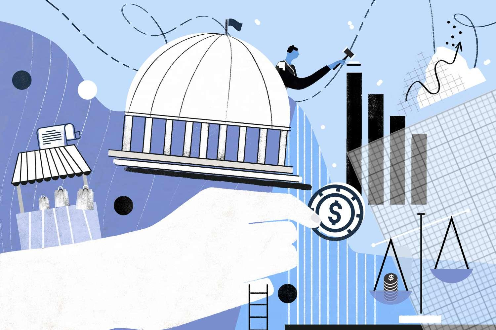

## Table of Contents

## What is a market economy?

A market economy is a type of economic system where the prices of goods and services are determined by the forces of supply and demand. In this system, people and businesses can decide what to buy, sell, and produce based on what they want and what they can afford. The government has a limited role and mainly focuses on setting rules to make sure the market works fairly.

In a market economy, competition between businesses often leads to better products and lower prices. If a business does not meet the needs of consumers, it may lose customers to other businesses that offer better options. This encourages companies to innovate and improve their products and services. However, there can be challenges, such as income inequality, where some people have much more money than others, and this can affect how much they can participate in the market.

## What does government intervention mean in the context of a market economy?

Government intervention in a market economy means that the government steps in to affect how the market works. This can happen in different ways, like making laws, setting rules, or giving money to certain businesses or people. The goal is often to make the market fairer, help people who need it, or fix problems that the market cannot solve on its own.

For example, the government might set rules to stop companies from polluting the environment. Or they might give money to people who are out of work to help them get by. Sometimes, the government also steps in to stop big companies from becoming too powerful and hurting smaller businesses or consumers. But, too much intervention can also cause problems, like making it harder for businesses to grow or innovate.

## Why might a government choose to intervene in a market economy?

A government might choose to intervene in a market economy to make things fairer and help people who need it. In a market economy, some people can end up with a lot more money than others. This can make it hard for poorer people to buy what they need. The government can step in to help by giving money to people who are out of work or by making sure everyone has access to important things like healthcare and education.

Another reason for government intervention is to fix problems that the market cannot solve on its own. For example, businesses might pollute the environment if there are no rules to stop them. The government can make laws to protect the environment and keep people safe. Also, the government might step in to stop big companies from becoming too powerful. If one company gets too big, it might raise prices or treat workers badly. The government can make rules to keep the market competitive and protect consumers and workers.

## What are some common types of government intervention in market economies?

One common type of government intervention is setting rules and regulations. Governments make laws to make sure businesses treat workers fairly, protect the environment, and keep products safe for people to use. For example, they might set rules about how much pollution a factory can make or how many hours a worker can work in a week. These rules help make the market a better place for everyone.

Another type of intervention is giving money or support to people and businesses. Governments might give money to people who are out of work so they can buy what they need. They might also give money or loans to businesses to help them grow or start up. This can help the economy by creating jobs and making sure people have money to spend.

Sometimes, governments step in to control prices or stop big companies from becoming too powerful. They might set a maximum price for things like medicine to make sure everyone can afford it. Or they might break up big companies into smaller ones to keep the market competitive. This helps make sure that no one company can control the market and hurt consumers or other businesses.

## How does government intervention affect market efficiency?

Government intervention can help make the market work better in some ways. For example, when the government sets rules to stop pollution, it helps keep the environment clean. This is good for everyone because clean air and water are important. Also, when the government gives money to people who are out of work, it helps them buy what they need. This can make the economy stronger because people have more money to spend on things.

But, government intervention can also make the market less efficient in other ways. If the government sets too many rules, it can be hard for businesses to grow or start up. This can slow down the economy because businesses might not want to take risks or try new things. Also, if the government gives money to some businesses but not others, it might not be fair. This can make some businesses do better than others, even if they are not the best at what they do. So, finding the right balance is important for making the market work well.

## What are the potential benefits of government intervention in market economies?

Government intervention can help make things fairer for everyone. In a market economy, some people might not have enough money to buy what they need. The government can step in by giving money to people who are out of work or by making sure everyone has access to important things like healthcare and education. This helps people live better lives and makes the economy stronger because people have more money to spend.

Another benefit is that government intervention can fix problems that the market cannot solve on its own. For example, without rules, businesses might pollute the environment. The government can make laws to protect the air and water, keeping everyone safe and healthy. Also, the government can stop big companies from becoming too powerful. By breaking up big companies or setting rules, the government can keep the market competitive. This helps make sure that no one company can control the market and hurt consumers or other businesses.

## What are the potential drawbacks of government intervention in market economies?

Government intervention can sometimes make it harder for businesses to grow or start up. If there are too many rules, businesses might not want to take risks or try new things. This can slow down the economy because businesses are not innovating or creating new jobs. Also, if the government gives money to some businesses but not others, it might not be fair. This can make some businesses do better than others, even if they are not the best at what they do. So, too much intervention can make the market less efficient.

Another problem is that government intervention can lead to higher costs for everyone. When the government sets rules, businesses might have to spend more money to follow them. This can make products and services more expensive for people to buy. Also, if the government gives money to people or businesses, it has to get that money from somewhere. Usually, this means higher taxes. Higher taxes can make it harder for people to keep more of their own money, which can affect how much they can spend in the market.

## Can you provide historical examples where government intervention significantly impacted a market economy?

During the Great Depression in the 1930s, the U.S. government stepped in to help fix the economy. President Franklin D. Roosevelt started the New Deal, which was a bunch of programs to help people who were out of work and to make the economy better. The government gave money to people, built new roads and buildings, and made rules to stop banks from going under. This helped a lot of people and made the economy stronger, but some people thought the government was doing too much and it slowed down businesses.

Another example is in the 1970s when the U.S. government tried to control oil prices. There was a big problem with oil from other countries, so the government set rules to keep prices from going too high. But this made it hard for oil companies to make money, and it caused long lines at gas stations. People had to wait a long time to get gas, and it made a lot of people upset. This showed that sometimes government rules can cause new problems even when they are trying to fix something.

## How do different economic theories view government intervention in market economies?

Different economic theories have different ideas about how much the government should step in to help the market. People who believe in laissez-faire economics think the government should stay out of the market as much as possible. They say that if the market is left alone, it will work best on its own. Businesses will compete, and this will make prices fair and help the economy grow. Famous economists like Adam Smith supported this idea, saying that an "invisible hand" guides the market to do what's best for everyone.

On the other hand, people who follow Keynesian economics think the government should step in more often. They believe that the market can have big problems, like when a lot of people lose their jobs or when the economy slows down. John Maynard Keynes said that the government should spend money to help people and businesses during these times. This can make the economy stronger and help everyone. So, Keynesians think that government intervention can fix problems that the market can't solve on its own.

## What are the key considerations for policymakers when deciding on government intervention?

When policymakers think about stepping into the market, they need to look at how it might help or hurt people. They want to make things fair and help people who need it, like giving money to people who are out of work or making sure everyone can go to the doctor. But they also need to think about how their actions might affect businesses. Too many rules can make it hard for businesses to grow or start up, which can slow down the economy. So, they have to find a balance between helping people and letting businesses do well.

Another big thing policymakers think about is how their actions might change the way the market works. They want to make sure the market stays competitive so that no one company can control everything. They also need to think about how their rules might affect prices. If businesses have to spend more money to follow the rules, they might charge more for their products. This can make things more expensive for people. So, policymakers have to think carefully about all these things to make the best choices for everyone.

## How does government intervention vary across different countries and economic systems?

Government intervention in market economies can be very different from one country to another. In some countries, like the United States, the government tries to stay out of the market as much as possible. They believe that businesses should be free to do what they want, and this will make the economy grow. But they still have some rules to make sure businesses treat people fairly and protect the environment. In other countries, like those in Europe, the government plays a bigger role. They might give more money to people who need it and make more rules to help everyone have a good life. This can make things fairer, but it can also make it harder for businesses to do what they want.

In countries with different economic systems, like China, the government has even more control over the market. The government might own big businesses and decide what they can do. This can help the government make sure that important things get done, like building roads or making sure everyone has a job. But it can also mean that people and businesses don't have as much freedom to choose what they want to do. In places like Cuba or North Korea, the government controls almost everything in the market. They decide what people can buy and sell, and this can make it hard for the market to work well on its own. So, how much the government steps in can change a lot depending on where you are and what kind of economic system the country has.

## What are the current debates and future trends regarding government intervention in market economies?

Right now, people are talking a lot about how much the government should help the market. Some say the government should do more to make things fair, like giving money to people who need it or making sure everyone can go to the doctor. They think this can make the economy stronger and help everyone live better lives. Others say the government should stay out of the market more. They believe that if businesses are free to do what they want, it will make the economy grow faster. They worry that too many rules can make it hard for businesses to start up or try new things.

In the future, we might see more government help in some areas. For example, with problems like climate change, the government might need to make more rules to stop businesses from polluting. Also, as technology changes, the government might need to step in to make sure new jobs are created and people can learn new skills. But, there will still be debates about how much the government should do. Finding the right balance between helping people and letting businesses grow will always be important.

## References & Further Reading

[1]: Kennedy, D. M. (1999). _Freedom from Fear: The American People in Depression and War, 1929-1945_. Oxford University Press.

[2]: Sorkin, A. R. (2009). _Too Big to Fail: The Inside Story of How Wall Street and Washington Fought to Save the Financial System—and Themselves_. Viking.

[3]: Bank for International Settlements. (2016). ["Electronic trading in fixed income markets"](https://www.bis.org/publ/mktc07.pdf), Markets Committee Publications.

[4]: Lopez de Prado, M. (2018). ["Advances in Financial Machine Learning"](https://www.amazon.com/Advances-Financial-Machine-Learning-Marcos/dp/1119482089). Wiley.

[5]: Chan, E. P. (2008). ["Quantitative Trading: How to Build Your Own Algorithmic Trading Business"](https://github.com/ftvision/quant_trading_echan_book). Wiley.