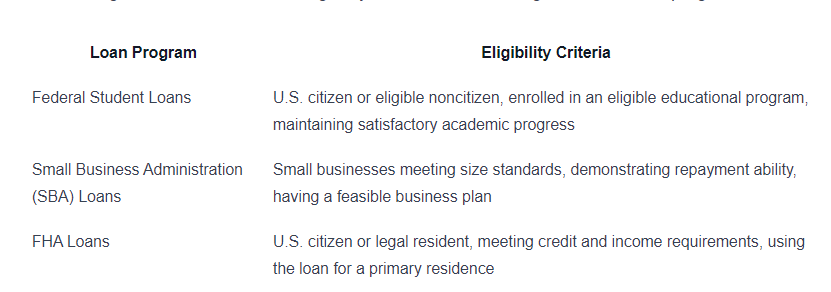

## Table of Contents

## What are government loans?

Government loans are loans that come from the government, not from banks or other private lenders. These loans are often used to help people who might not be able to get loans from other places. The government wants to help people go to school, start a business, or buy a house. So, they offer these loans with special rules that can make them easier to get.

There are different types of government loans for different needs. For example, student loans help people pay for college. Small business loans help new businesses get started. And housing loans help people buy homes. The government sets the interest rates and repayment terms, which can be lower and more flexible than those from private lenders. This makes it easier for people to borrow money and pay it back over time.

## What types of government loans are available?

There are many types of government loans that people can use for different things. One common type is student loans. These loans help people pay for college or other kinds of school. The government gives these loans to students who need money to study. Another type is small business loans. These are for people who want to start or grow a small business. The government wants to help new businesses because they can create jobs and help the economy.

Another important type of government loan is for housing. These loans help people buy homes. They are often called mortgages. The government makes these loans easier to get for people who might not be able to buy a home otherwise. There are also loans for farmers and people who live in rural areas. These loans help them buy land, equipment, or make improvements to their homes.

Lastly, there are loans for emergencies and disasters. If a big storm or other disaster happens, the government can give loans to help people fix their homes or businesses. These loans help people get back on their feet after something bad happens. Each type of loan has its own rules and ways to apply, but they all aim to help people when they need it most.

## Who is eligible for government loans?

Government loans are for people who need help paying for things like school, starting a business, or buying a home. To get these loans, you usually need to meet certain rules. For student loans, you need to be going to school and often show that you need financial help. For small business loans, you need to have a good business plan and sometimes show that you can't get a loan from a bank. For housing loans, you need to be buying a home and meet income limits set by the government.

Some loans are for special groups of people. For example, loans for farmers and people in rural areas are for those who live and work in the countryside. Disaster loans are for people who have been affected by big storms or other emergencies. To get these loans, you need to show that you were hurt by the disaster and need help to fix things. Each type of loan has its own rules, but they all try to help people who need it the most.

## How do government loans differ from private loans?

Government loans and private loans are different in some big ways. Government loans come from the government, like the federal or state government. They are made to help people who might not get loans from banks or other private lenders. These loans often have lower interest rates and better repayment terms. This means you pay less money over time and have more time to pay it back. Government loans can be for things like school, starting a business, or buying a home. They have special rules to help more people get the money they need.

Private loans come from banks, credit unions, or other companies. They usually have higher interest rates and stricter rules for who can get them. This means you might pay more money over time and have a harder time getting approved. Private loans can be used for many things, but they might not be as easy to get if you don't have a good credit score or enough money. Government loans are often a better choice for people who need help and want easier terms.

## What are the interest rates for government loans?

Government loans usually have lower interest rates than private loans. This means you pay less money over time when you borrow from the government. For example, student loans from the government might have an [interest rate](/wiki/interest-rate-trading-strategies) of around 5% or less. Small business loans can have rates that are also lower than what banks might offer. The exact rate can change based on the type of loan and what the government decides.

The interest rates for government loans are set by the government and can be fixed or variable. A fixed rate stays the same over the whole time you're paying back the loan. A variable rate can go up or down based on the economy. For example, housing loans from the government might have a fixed rate of about 3% to 4%. These rates are often lower than what you would get from a bank, making it easier for people to afford their payments.

## How can one apply for a government loan?

To apply for a government loan, you need to find the right type of loan for what you need. For example, if you want to go to school, you can apply for a student loan. If you want to start a business, look for a small business loan. You can find information about these loans on government websites like the U.S. Department of Education for student loans or the Small Business Administration for business loans. Once you know which loan you need, you can fill out an application form. You will need to give information about yourself, like your name, address, and how much money you need.

After you submit your application, the government will look at it to see if you can get the loan. They will check things like your income, credit history, and sometimes your need for the loan. If you are applying for a student loan, they might look at your family's income. For a business loan, they might want to see your business plan. If everything looks good, the government will give you the loan. You will then need to agree to the terms, like how much you will pay back and when. Once you agree, the money will be sent to you or directly to the school or business you are working with.

## What are the repayment terms for government loans?

Government loans have repayment terms that are often easier than private loans. This means you have more time to pay back the money you borrowed. For example, student loans might give you a few years after you finish school before you need to start paying them back. This time is called a grace period. The government might also let you pay less each month if you don't have a lot of money. This can help you manage your payments better.

The exact terms depend on the type of loan. For housing loans, you might have to pay back the money over 30 years. The government sets the interest rate, which can be fixed or change over time. For small business loans, the repayment terms might be shorter, like 5 to 10 years. The government wants to make sure you can pay back the loan, so they might offer different plans to fit your needs. If you have trouble paying, you can sometimes ask for more time or a lower payment.

## Are there any forgiveness or discharge options for government loans?

Yes, there are options for loan forgiveness or discharge with government loans. Forgiveness means you don't have to pay back some or all of your loan if you meet certain rules. For example, if you work in a job like teaching or nursing for a certain number of years, you might get your student loans forgiven. The government wants to help people in these jobs, so they offer this as a way to say thank you. Another way to get forgiveness is through income-driven repayment plans. If you pay your student loans based on how much money you make, and after a long time, like 20 or 25 years, you might not have to pay the rest.

Discharge is when you don't have to pay back your loan because something big happened. For example, if you become disabled and can't work, you might get your loan discharged. If your school closed before you finished your studies, you might also get your loan discharged. Sometimes, if you file for bankruptcy, you might be able to get your loan discharged, but this is very hard to do. The rules for forgiveness and discharge can be different for each type of loan, so it's important to check with the government to see what options you have.

## How do government loans impact credit scores?

Government loans can affect your credit score just like any other loan. When you apply for a government loan, the lender will check your credit. This check can cause a small, temporary drop in your credit score. Once you get the loan, if you make your payments on time, your credit score can go up. This shows lenders that you are good at paying back money. But, if you miss payments or don't pay back the loan, your credit score can go down. This can make it harder to get other loans in the future.

The impact of government loans on your credit score depends on how well you manage the loan. If you keep up with your payments and follow the terms of the loan, it can help build a good credit history. But if you struggle to pay back the loan, it can hurt your credit. It's important to understand the terms of your government loan and make sure you can meet them. This way, you can use the loan to improve your credit score instead of hurting it.

## What are the economic impacts of government loan programs?

Government loan programs can have a big impact on the economy. They help people go to school, start businesses, and buy homes. When people can do these things, it helps the economy grow. For example, student loans let more people go to college. This means more people can get good jobs and earn more money. This money can then be spent in the economy, helping businesses and creating more jobs. Small business loans help new businesses start up. These businesses create jobs and bring new ideas to the market, which can make the economy stronger.

On the other hand, government loans can also have some negative effects. If too many people can't pay back their loans, it can be bad for the economy. The government might have to use taxpayer money to cover these losses. This can lead to less money for other important things like schools or roads. Also, if too many loans are given out, it might cause inflation. This means prices go up, and money becomes less valuable. So, while government loans can help the economy grow, they need to be managed carefully to avoid these problems.

## How are government loans funded?

Government loans are funded by the government, which gets its money from taxes and other sources. When people pay taxes, some of that money goes into a big pot that the government uses to help people with loans. The government decides how much money to put into different loan programs, like student loans or small business loans. This money comes from the general budget, which is like a big plan for how to spend all the money the government has.

Sometimes, the government might borrow money to fund loan programs. They do this by selling bonds, which are like IOUs. People and other countries buy these bonds, and the government promises to pay them back with interest later. This way, the government can have more money to give out as loans without taking it directly from taxes. It's a way to help more people while spreading out the cost over time.

## What recent changes have been made to government loan policies?

The government often changes its loan policies to help more people or make them easier to use. For example, in 2023, the U.S. government made changes to student loan forgiveness rules. They said that if you work in public service jobs like teaching or nursing for 10 years and make your loan payments on time, you can get your remaining student loan forgiven. This change helps more people who work in these important jobs.

Another big change happened with small business loans. The government made it easier for small businesses to get loans during the COVID-19 pandemic. They created new programs like the Paycheck Protection Program (PPP) to help businesses keep paying their workers. These loans could be forgiven if the money was used for things like payroll and rent. This helped many businesses stay open and keep people employed during tough times.

## References & Further Reading

[1]: Lopez de Prado, M. (2018). ["Advances in Financial Machine Learning."](https://www.amazon.com/Advances-Financial-Machine-Learning-Marcos/dp/1119482089) Wiley.

[2]: Aronson, D. (2006). ["Evidence-Based Technical Analysis: Applying the Scientific Method and Statistical Inference to Trading Signals."](https://www.amazon.com/Evidence-Based-Technical-Analysis-Scientific-Statistical/dp/0470008741) Wiley.

[3]: Jansen, S. (2020). ["Machine Learning for Algorithmic Trading: Predictive models to extract signals from market and alternative data for systematic trading strategies with Python."](https://github.com/stefan-jansen/machine-learning-for-trading) Packt Publishing.

[4]: Chan, E. P. (2009). ["Quantitative Trading: How to Build Your Own Algorithmic Trading Business."](https://github.com/ftvision/quant_trading_echan_book) Wiley.

[5]: Securities and Exchange Commission (SEC). ["Regulation of NMS Stock Prices."](https://www.sec.gov/rules-regulations/2005/06/regulation-nms)

[6]: U.S. Small Business Administration (SBA). ["7(a) Loan Program."](https://www.sba.gov/funding-programs/loans/7a-loans)