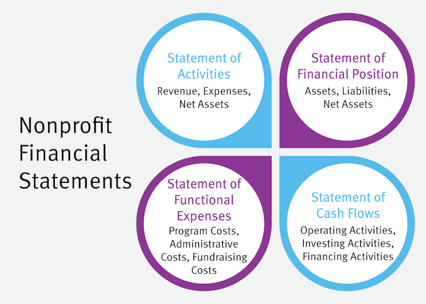

## Table of Contents

## What is the basic difference between government and nonprofit financial management?

The main difference between government and nonprofit financial management lies in their sources of funding and how they are allowed to use their money. Government financial management involves handling funds that come mostly from taxes and other public revenues. Governments have to follow strict rules about how they can spend this money, often needing to report to the public and follow specific budget laws. They focus a lot on accountability and transparency because they are managing public money.

On the other hand, nonprofit organizations get their money from donations, grants, and sometimes from fees for services they provide. Unlike governments, nonprofits have more flexibility in how they can spend their money, but they still need to be careful to use it in ways that support their mission. Nonprofits also need to be transparent and accountable, especially to their donors and the people they serve, but the rules they follow can be different from those for governments.

In summary, while both government and nonprofit financial management aim to use funds responsibly and effectively, the key differences are in where the money comes from and the specific rules and regulations they must follow. Governments deal with taxpayer money and have strict public accountability, whereas nonprofits rely on diverse funding sources and have more flexibility in spending, but still need to maintain trust with their supporters.

## How do government entities and nonprofits generate their revenue?

Government entities generate their revenue mainly from taxes. This includes income tax from people's earnings, sales tax on goods and services, and property tax on homes and land. Governments can also get money from fees, like those for licenses or permits, and sometimes from fines. Another source of revenue can be from other levels of government, like when the federal government gives money to states or local governments. All this money is used to pay for public services like schools, roads, and police and fire departments.

Nonprofits generate their revenue in different ways. A big part comes from donations, which can be from individuals, businesses, or foundations. Nonprofits also get grants, which are like gifts from governments or other organizations to support specific projects. Some nonprofits earn money by charging for the services they provide, like a fee for a class or a membership. They might also have fundraising events or sell products to raise money. All this revenue helps nonprofits [carry](/wiki/carry-trading) out their mission, whether it's helping people, protecting the environment, or supporting the arts.

## What are the key financial reporting requirements for government organizations?

Government organizations have to follow strict rules when they report their money matters. They need to show everyone how they are spending the money they get from taxes and other public sources. This is called financial reporting, and it's really important for keeping the public's trust. Governments use something called Generally Accepted Accounting Principles (GAAP) for this. They have to make detailed reports that show where the money came from and how it was spent. These reports are often shared with the public and checked by special groups to make sure everything is correct and honest.

There are two main types of reports that government organizations need to make. One is the Comprehensive Annual Financial Report (CAFR), which is a big report that gives a full picture of the government's finances for a whole year. It includes things like the government's balance sheet, income statement, and notes that explain the numbers. The other type is the Single Audit, which is required if the government gets a lot of money from the federal government. This audit looks at how the money was used and makes sure it followed all the rules. Both types of reports help make sure that the government is using public money in the right way and being open about it.

## How do nonprofits differ in their financial reporting obligations compared to government entities?

Nonprofits and government entities both have to report their finances, but they do it differently because they follow different rules. Nonprofits have to follow rules set by the Financial Accounting Standards Board (FASB), which tells them how to keep track of their money and report it. They need to make sure their financial reports are clear and honest, especially to show their donors and the public that they are using the money in a good way. Nonprofits usually need to file something called Form 990 with the IRS, which is like a yearly report that shows how much money they got, how they spent it, and other important details about their work.

Government entities, on the other hand, follow rules set by the Governmental Accounting Standards Board (GASB). Their reports are more about showing the public how tax money is being used. They have to make big reports like the Comprehensive Annual Financial Report (CAFR) that give a full picture of their finances for the year. If they get a lot of money from the federal government, they also need to do a Single Audit to make sure they followed all the rules. So, while both nonprofits and government entities need to be open about their money, the specific reports and rules they follow are different.

## What are the common budgeting practices in government financial management?

In government financial management, budgeting is a key part of making sure public money is used well. Governments usually start by figuring out how much money they expect to get from taxes and other sources. Then, they decide how to spend this money on things like schools, roads, and public safety. This process often involves a lot of people, including elected officials, who have to agree on the budget. Governments often use a method called incremental budgeting, where they look at last year's budget and make small changes for the new year. This helps keep things stable but can make it hard to find new ways to save money or do things better.

Another common budgeting practice in government is performance-based budgeting. This means that governments try to link the money they spend to the results they want to achieve. For example, they might give more money to a program that helps a lot of people and less to one that doesn't work as well. This method can help make sure that public money is used in the best way possible, but it can also be hard to measure the success of some programs. Both incremental and performance-based budgeting help governments plan how to use public money, but they do it in different ways to meet the needs of the community.

## How do nonprofits approach budgeting and what unique challenges do they face?

Nonprofits approach budgeting by first looking at their mission and the goals they want to achieve. They figure out how much money they need to do their work, like helping people or protecting the environment. They then plan how to get this money from donations, grants, and sometimes fees for services. Nonprofits often use a budget to keep track of their money throughout the year, making sure they don't spend more than they have. They also need to be ready to change their plans if they get more or less money than expected.

One unique challenge for nonprofits is that their income can be unpredictable. They might get a big donation one year but not the next, which makes it hard to plan. This means they need to be good at saving money and finding new ways to bring in funds. Another challenge is that they have to show their donors and the public that they are using the money wisely. This means they need to be very careful and clear about how they spend their money, which can take a lot of time and effort. Balancing the need to do their important work with the need to manage their money well is a big part of budgeting for nonprofits.

## What role does internal control play in managing finances for government and nonprofit organizations?

Internal control is really important for both government and nonprofit organizations when they manage their money. It's like a set of rules and checks that help make sure the money is used the right way. For governments, internal control helps keep the public's trust by making sure tax money is spent correctly and honestly. It stops mistakes and fraud, and makes sure everyone follows the rules. This is important because governments use public money, and people need to know it's being used well.

Nonprofits also need strong internal controls to manage their money well. They get money from donations and grants, and they need to show their donors that their money is being used for the good work they support. Internal controls help nonprofits avoid mistakes, keep their money safe, and make sure they are following all the rules. This helps them keep their donors' trust and focus on doing their important work. So, for both governments and nonprofits, internal control is key to managing money in a responsible and trustworthy way.

## How do government and nonprofit organizations handle auditing and compliance?

Government organizations handle auditing and compliance by following strict rules to make sure they are using public money correctly. They have to do a yearly audit, which is like a big check-up on their money. This audit is done by special people called auditors who look at everything to see if it's right. Governments also have to follow a lot of rules set by the Governmental Accounting Standards Board (GASB). If they get a lot of money from the federal government, they need to do a Single Audit to show they used the money the right way. This helps keep the public's trust and makes sure the government is being honest and fair.

Nonprofit organizations also need to be careful about auditing and compliance, but they follow different rules. They have to file a form called Form 990 with the IRS every year, which shows how they got their money and how they spent it. Nonprofits use rules from the Financial Accounting Standards Board (FASB) to keep track of their money. They might also need to have an audit if they get a lot of money from grants or if their donors ask for one. This helps them show their donors and the public that they are using the money wisely and doing their important work the right way.

## What are advanced strategies for managing cash flow in government and nonprofit sectors?

Managing cash flow in the government sector involves careful planning and forecasting to make sure there's always enough money to pay for services and projects. Governments often use a strategy called cash flow forecasting, where they predict how much money they will get from taxes and other sources and how much they need to spend. This helps them avoid running out of money at any time. Another advanced strategy is setting up a reserve fund, which is like a savings account that governments can use when they have unexpected costs or if there's a delay in getting tax money. Governments also work on improving their collection of taxes and fees to make sure money comes in on time, which helps keep their cash flow smooth and steady.

Nonprofits also need to manage their cash flow carefully because their income can be unpredictable. One advanced strategy they use is diversifying their funding sources, which means getting money from different places like donations, grants, and fees for services. This helps them have a steady flow of money even if one source dries up. Another strategy is creating a cash reserve, similar to a savings account, that they can use when they face unexpected costs or when donations are low. Nonprofits also focus on good financial planning and budgeting, making sure they spend money wisely and keep enough cash on hand to keep their important work going without interruptions.

## How can technology be leveraged to improve financial management in these organizations?

Technology can really help government and nonprofit organizations manage their money better. For example, they can use special software to keep track of their money in real time. This means they can see exactly how much money they have and where it's going at any moment. This kind of software can also help them make budgets and forecasts, so they know how much money they will need and when they will get it. This makes it easier to plan and avoid running out of money. Governments can use technology to collect taxes and fees more quickly and easily, which helps keep their cash flow steady. Nonprofits can use online tools to manage donations and grants, making it easier to see where their money is coming from and how they are spending it.

Another way technology helps is by making audits and reporting easier. Governments and nonprofits can use special programs to create reports that show how they are using their money. These programs can help them follow all the rules and make sure their reports are correct and on time. Technology can also help with internal controls, making it easier to stop mistakes and fraud. For example, they can use systems that need more than one person to approve big spending, which helps keep everything safe and honest. By using technology, both governments and nonprofits can manage their money better, be more open about how they use it, and focus more on doing their important work.

## What are the ethical considerations specific to financial management in government and nonprofit sectors?

In government financial management, ethical considerations are very important because governments use money from taxes, which comes from the public. Governments have to be honest and fair when they spend this money. They need to make sure they follow the rules and use the money for things that help the community, like schools and roads. If they don't use the money the right way, people can lose trust in the government. Governments also need to be open about how they spend the money, so everyone can see that it's being used correctly. This means they have to report their finances clearly and let people know if there are any problems.

Nonprofits also have to think about ethics when they manage their money. They get their money from donations, grants, and sometimes from fees for services they provide. It's important for nonprofits to use this money in ways that support their mission, like helping people or protecting the environment. They need to be honest with their donors and the public about how they spend the money, so people know it's being used for good. Nonprofits also have to follow rules and make sure they don't mix up their money with personal money or use it for things that don't help their mission. Being ethical helps nonprofits keep the trust of their supporters and focus on doing their important work.

## How do government and nonprofit organizations approach long-term financial planning and sustainability?

Government organizations focus on long-term financial planning and sustainability by making careful budgets and plans for the future. They look at how much money they will get from taxes and other sources over many years and decide how to spend it on things like schools, roads, and public safety. Governments often set up special funds, like savings accounts, to save money for big projects or to use when there are unexpected costs. They also try to make sure they are spending money in ways that will help the community in the long run, like investing in education or fixing old bridges. By planning ahead and saving money, governments can make sure they have enough to keep providing important services to the public.

Nonprofit organizations also need to think about the future when they manage their money. They make long-term plans to make sure they can keep doing their important work, like helping people or protecting the environment. Nonprofits look at how much money they expect to get from donations, grants, and fees for services over time and plan how to use it to meet their goals. They often set up savings accounts or reserve funds to help them through times when money is tight. Nonprofits also work on building strong relationships with their donors and finding new ways to bring in money, so they can keep going strong for a long time. By planning carefully and being smart with their money, nonprofits can keep helping their communities in the future.

## References & Further Reading

[1]: Mikesell, J. L. (2013). ["Fiscal Administration: Analysis and Applications for the Public Sector"](https://books.google.com/books/about/Fiscal_Administration.html?id=Zfx3MgEACAAJ). Cengage Learning.

[2]: Zimmerman, J. L. (2004). ["Accounting for Decision Making and Control"](https://www.amazon.com/Accounting-Decision-Making-Control-Zimmerman/dp/1259969495). McGraw-Hill Education.

[3]: Hopwood, W. S., Leiner, J. J., & Young, G. R. (2012). ["Forensic Accounting and Fraud Examination"](https://archive.org/details/forensicaccounti0000hopw_y2l0). McGraw-Hill Education.

[4]: Weishaar, J., Bayerlein, L., & Woods, M. (Eds.). (2019). ["Public Sector Accounting, Accountability and Governance: Globalising Public Sector Accountability"](https://en.wikipedia.org/wiki/%C3%8Ele-de-France). Springer Nature.

[5]: Preker, A. S., & Harding, A. (Eds.). (2003). ["Innovations in Health Service Delivery: The Corporatization of Public Hospitals"](https://www.researchgate.net/publication/280807885_Innovations_in_Health_Service_Delivery_The_Corporatization_of_Public_Hospitals) World Bank Publications.

[6]: Poister, T. H., & Streib, G. (1999). ["Performance Measurement in Municipal Government: Assessing the State of the Practice"](https://www.semanticscholar.org/paper/Performance-Measurement-in-Municipal-Government%3A-of-Poister-Streib/b846639c83afffcd50b748d12e6e58d29f1a1fad) Public Administration Review, 59(4), 325-335.

[7]: Glassman, D. M., & Spahn, K. (2012). ["Nonprofit Financial Management: A Practical Guide"](https://onlinelibrary.wiley.com/doi/abs/10.1111/j.1745-6622.2012.00381.x) John Wiley & Sons.

[8]: Madhavan, A. (2000). ["Market Microstructure: A Survey"](https://www.sciencedirect.com/science/article/pii/S1386418100000070) The Review of Financial Studies, 13(1), 3-29.

[9]: Fleishman, J. A., & Schmid,  H. (Eds.). (2012) ["Philanthropy in Practice: How Fundraising is Changing in Europe"](https://psycnet.apa.org/record/2011-29889-013) Policy Press.