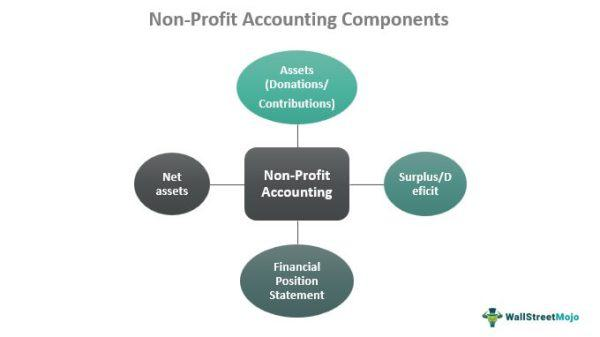

Understanding public sector budgeting and financial management is crucial for ensuring that governments and nonprofits use resources efficiently and effectively. These entities operate under distinct principles compared to private enterprises, focusing on public interest and service rather than profit maximization. While private enterprises prioritize shareholder value and profitability, public sector and nonprofit organizations aim to deliver public services and achieve societal goals within a framework of accountability and transparency.

Public sector financial management encompasses various functions, including budgeting, accounting, auditing, and financial reporting. These functions are designed to ensure that public funds are allocated and used according to established priorities and legal requirements. Public sector budgeting involves planning and allocating financial resources to meet government objectives, balancing priorities such as infrastructure, education, defense, and welfare.



Nonprofit financial management shares some similarities with its public sector counterpart, especially in terms of accountability and transparency. Nonprofits must ensure that donations and grants are used according to donors' intentions and regulatory guidelines. They rely on fund accounting to segregate financial resources for specific purposes, thereby facilitating donor confidence and sustaining organizational viability.

Another emerging aspect of financial management involves the increasing use of technology, such as algorithmic trading, which employs computer algorithms to manage investment portfolios. Though traditionally the domain of private finance, these technological advancements are making their way into public and nonprofit sectors. Algorithmic trading has the potential to optimize public fund management, enhance financial transparency, and improve investment income for nonprofits, thus supporting financial stability.

The aim of this discussion is to provide a comprehensive overview of the interconnected areas of public sector budgeting, government financial management, nonprofit financial management, and the role of innovative financial technologies. Understanding these aspects is essential for stakeholders to make informed decisions that align with the broader objectives of societal well-being and accountability.

By examining the differences and commonalities in financial management across these sectors, we can better appreciate the challenges and opportunities they face in achieving their missions. These insights will enable policymakers, managers, and stakeholders to navigate the complexities of public and nonprofit financial management more effectively.

## Table of Contents

## Public Sector Budgeting

Public sector budgeting is a fundamental process that involves the strategic planning and allocation of financial resources to achieve governmental objectives within a specified fiscal period. This process not only ensures that the essential services needed by the public are funded but also that the funds are used efficiently and responsibly.

The process begins with the formulation of policies that outline the priorities and objectives of the government. These policies serve as the foundation for developing programs and financial plans that align with the governmental goals. The budgeting cycle typically involves the preparation, approval, execution, and evaluation of the budget, making it a continuous loop aimed at ensuring fiscal responsibility and accountability.

In preparing the budget, government institutions must consider a wide range of priorities that encompass infrastructure, education, defense, and welfare. The challenge lies in balancing these competing needs within the constraints of available resources. Infrastructure investments, for instance, are crucial for fostering economic growth and providing the necessary facilities for societal functions. Education spending is imperative for human capital development, while defense budgets ensure national security. Welfare programs support societal equity and aid the disadvantaged.

The complexity of public sector budgeting is further heightened by the requirement to manage both operational and capital expenditures while adhering to fiscal constraints. Operational expenditures cover the day-to-day functioning of government entities, including salaries and maintenance costs. In contrast, capital expenditures focus on long-term investments in projects and assets that contribute to developmental goals.

To optimize the budgeting process, governments employ various analytical techniques and tools. Cost-benefit analysis, for instance, is often used to assess the potential impact of different expenditure options, allowing policymakers to prioritize funding allocations. Additionally, performance-based budgeting is becoming increasingly popular. This approach links funding to the outcomes and performance metrics of government programs, thereby promoting efficiency and accountability.

Furthermore, transparency and public participation are integral elements of public sector budgeting. Engaging citizens in the budgeting process not only enhances transparency but also builds public trust and ensures that budgeting decisions reflect the preferences and needs of the populace.

In summary, public sector budgeting is a multifaceted process that requires careful planning and execution. It involves making strategic policy decisions and prioritizing funding allocations to balance diverse societal needs while ensuring fiscal discipline and accountability.

## Government Financial Management

Government financial management is a critical process that ensures public funds are allocated and used responsibly, adhering to established budgetary and financial regulations. This involves a careful balance of monitoring expenditures against revenues and managing public debt effectively.

Monitoring expenditures involves tracking government spending against planned budgets to ensure that resources are used as intended. This is crucial for maintaining fiscal discipline and for the effective delivery of public services. Governments typically employ various tools and techniques, including financial audits and reviews, to keep expenditure in check. Budget forecasts and financial models are often used to predict future financial conditions and adjust spending accordingly.

Managing government debt is another essential component. This involves not only tracking existing debt but also planning future borrowings in a sustainable manner. Governments often issue bonds or take loans to fund infrastructure projects and other long-term investments. The key is to manage this debt in a way that does not compromise the fiscal health of the government. Debt servicing—ensuring payments on interest and principal are made timely—is crucial in maintaining a good credit rating.

A vital aspect of government financial management is the use of Comprehensive Annual Financial Reports (CAFR). These reports provide a detailed overview of a government's financial status, including audited financial statements, management's discussion and analysis, and other supplementary information. The CAFR is designed to enhance transparency and accountability, providing stakeholders with insights into the government's financial health and how effectively public funds are utilized. The CAFR serves as an essential tool for policymakers and the public to assess the government's fiscal performance and its compliance with legal and regulatory requirements.

Overall, effective government financial management is foundational to achieving transparency, accountability, and sustainability in public finances. It ensures that public resources are used efficiently to meet societal needs, thus contributing to the long-term economic stability and development of the jurisdiction.

## Nonprofit Financial Management

Nonprofit organizations rely heavily on effective financial management to ensure that their resources—primarily sourced from donations and grants—are optimally utilized. Unlike for-profit entities that focus on maximizing shareholder value, nonprofits are mission-driven, which makes the efficient allocation of resources paramount.

A key aspect of nonprofit financial management is the use of fund accounting. This accounting system differs from for-profit financial accounting by emphasizing accountability over profitability. Fund accounting allows nonprofits to segregate resources into various funds according to specific donor restrictions, project requirements, or program objectives. Each fund is treated like a separate entity, ensuring that the organization adheres to any conditions set forth by donors or governing bodies. This approach not only facilitates compliance but also enhances resource tracking and management.

Financial transparency and accountability are essential in maintaining donor confidence and ensuring the sustainability of nonprofit organizations. Transparency involves providing stakeholders with clear, accurate, and timely financial information. Nonprofits are expected to exhibit high levels of accountability to demonstrate that they act as stewards of donated funds. This is often achieved through regular audits, detailed financial statements, and the publication of annual reports. These practices build trust with donors and the community, which can lead to sustained or increased funding.

Nonprofit financial management also often incorporates budgeting and forecasting. While for-profit entities focus on revenue generation projections, nonprofits frequently build their budgets around anticipated income from donations and grants. This process requires a careful analysis of past funding trends and thorough planning to align financial resources with organizational goals. The main goal remains to maximize the effectiveness of each dollar spent, ensuring that the nonprofit’s mission can be achieved.

In sum, nonprofit financial management is centered on the strategic use of fund accounting and an unwavering commitment to financial transparency and accountability. These practices are fundamental in preserving donor trust, fulfilling the organization's objectives, and ensuring long-term viability.

## Algorithmic Trading in Finance

Algorithmic trading involves the use of computer algorithms to automatically make trading decisions, submit orders, and manage portfolios. These algorithms are designed to [carry](/wiki/carry-trading) out complex calculations at speeds and frequencies that are impossible for human traders, thereby seeking efficiency and improved investment returns. The use of algorithms in trading has become increasingly prevalent in financial markets due to their ability to analyze large datasets and execute trades at optimal times, often based on predetermined criteria or [machine learning](/wiki/machine-learning) models.

**Application in Government Finance**

For government finance, [algorithmic trading](/wiki/algorithmic-trading) can be instrumental in optimizing the management of public funds. By employing algorithms, governments can improve the precision and timing of investments, potentially increasing returns on public assets. This can help in addressing budget constraints by maximizing the yield on funds set aside for future expenditures or pension obligations. Furthermore, algorithmic trading can enhance transparency in government financial operations. As algorithms follow pre-established rules and provide an audit trail of all executed transactions, they allow for enhanced tracking and accountability of public investment activities, aligning with governmental transparency requirements.

**Benefits for Nonprofit Organizations**

Nonprofit organizations, which often rely heavily on donations and grants, face unique financial challenges. Algorithmic trading offers a promising avenue for these organizations to manage their investment portfolios more effectively, thereby generating additional income that can support their missions. By leveraging algorithms, nonprofits can manage endowments or reserve funds with a focus on risk-adjusted returns, optimizing portfolio performance in line with their ethical guidelines and mission objectives. This technological approach enables nonprofits to potentially stabilize and enhance their financial footing, allowing for sustained operational funding and project expansion.

The integration of algorithmic trading into government and nonprofit financial strategies represents a significant advancement, addressing previous inefficiencies and opening new possibilities for stability and growth. As these sectors continue to adopt modern financial technologies, the potential for improved financial management becomes increasingly tangible, offering a myriad of benefits that align with broader societal goals.

## Challenges and Opportunities

Navigating financial management in the public and nonprofit sectors requires addressing a host of challenges, while also recognizing the potential opportunities brought about by technological advancements. One of the primary challenges these sectors face is resource constraints. Government bodies and nonprofit organizations often operate under strict budget limitations, where the demand for services and programs may exceed available funding. This necessitates careful prioritization and strategic allocation of resources to meet key objectives such as health, education, and infrastructure development.

Additionally, regulatory compliance represents another significant challenge in these sectors. Public entities must adhere to a complex web of legal and regulatory requirements, which are designed to ensure transparency, accountability, and the proper use of public funds. Nonprofit organizations also face rigorous reporting standards, particularly when it comes to demonstrating how donor funds are used. Compliance not only requires substantial administrative resources but also poses the risk of legal and financial penalties if regulations are not met.

Amidst these challenges, the integration of technology offers promising opportunities for enhancing financial management practices in both the public and nonprofit sectors. Algorithmic trading, for example, can significantly impact the management of investments by providing tools for automating asset allocation and trading decisions. This technology leverages complex mathematical models and algorithms to optimize investment portfolios, potentially leading to better financial outcomes.

Python is a widely used programming language in this field, thanks to its extensive libraries that facilitate algorithmic trading. Below is a simple example of Python code that demonstrates how an algorithmic trading strategy might be implemented:

```python
import pandas as pd
import numpy as np

# Load historical financial data
data = pd.read_csv('financial_data.csv')

# Calculate moving averages
short_window = 40
long_window = 100

data['Short_MA'] = data['price'].rolling(window=short_window, min_periods=1, center=False).mean()
data['Long_MA'] = data['price'].rolling(window=long_window, min_periods=1, center=False).mean()

# Generate signals
data['Signal'] = 0.0
data['Signal'][short_window:] = np.where(data['Short_MA'][short_window:] > data['Long_MA'][short_window:], 1.0, 0.0)

# Calculate daily returns
data['Returns'] = data['price'].pct_change()

# Calculate strategy returns
data['Strategy_Returns'] = data['Signal'].shift(1) * data['Returns']

# Output the cumulative returns
cumulative_return = (data['Strategy_Returns'] + 1).cumprod().iloc[-1]
print(f"Cumulative Return: {cumulative_return}")
```

In the public sector, such strategies could optimize the management of pension funds or sovereign wealth funds, providing greater transparency and potentially enhancing returns on public investments. For nonprofit organizations, algorithmic trading can optimize endowment or reserve fund investments, ensuring sustainability and the ability to fund long-term strategic initiatives.

Furthermore, other technological advancements like blockchain and [artificial intelligence](/wiki/ai-artificial-intelligence) can also improve financial accountability and decision-making processes. Blockchain technology, for instance, can enhance transparency and reduce fraud through a distributed ledger system, enabling secure and verifiable transactions.

In conclusion, while financial management in the public and nonprofit sectors is fraught with challenges, integrating technological solutions offers substantial opportunities to drive efficiency, compliance, and better financial outcomes. Recognizing and harnessing these technologies can transform how these sectors manage their finances and achieve their societal goals.

## Conclusion

Effective financial management in the public and nonprofit sectors plays a critical role in fulfilling societal objectives and ensuring accountability. The precision and discipline involved in budgeting, fund accounting, and the adoption of emerging financial technologies are vital components that enable stakeholders to make well-informed decisions. Budgeting ensures that financial resources are allocated efficiently, allowing governments and nonprofit organizations to prioritize essential services such as infrastructure, education, and social welfare. By standing on the integrity and transparency of fund accounting, nonprofits can uphold donor confidence and sustain organizational growth.

New financial technologies, such as algorithmic trading, present opportunities to enhance efficiency and transparency in managing public and nonprofit funds. These technologies enable the optimization of portfolio management and the tracking of investment performance, contributing to financial stability. The application of algorithms, for instance, can streamline cash flow management and asset allocation, potentially leading to improved fiscal outcomes.

Moving forward, the integration of innovative financial practices can be a transformative force in addressing contemporary challenges within public and nonprofit financial management. Embracing advancements such as blockchain for secure transactions or data analytics for performance evaluations can further aid in refining financial strategies. By adopting these advancements, stakeholders can navigate resource constraints and regulatory complexities with greater agility and insight.

In conclusion, as public and nonprofit sectors continue to adapt to a rapidly changing financial landscape, the imperative to refine and enhance financial management strategies becomes ever more significant. A keen understanding of the intricacies involved in budgeting processes, fund accounting standards, and the potential benefits of technology integration will equip organizations to meet their societal mandates effectively, assuring their sustainable impact and accountability in the long run.

## References & Further Reading

[1]: Mikesell, J. L. (2013). ["Fiscal Administration: Analysis and Applications for the Public Sector"](https://books.google.com/books/about/Fiscal_Administration.html?id=Zfx3MgEACAAJ). Cengage Learning.

[2]: Zimmerman, J. L. (2004). ["Accounting for Decision Making and Control"](https://www.amazon.com/Accounting-Decision-Making-Control-Zimmerman/dp/1259969495). McGraw-Hill Education.

[3]: Hopwood, W. S., Leiner, J. J., & Young, G. R. (2012). ["Forensic Accounting and Fraud Examination"](https://archive.org/details/forensicaccounti0000hopw_y2l0). McGraw-Hill Education.

[4]: Weishaar, J., Bayerlein, L., & Woods, M. (Eds.). (2019). ["Public Sector Accounting, Accountability and Governance: Globalising Public Sector Accountability"](https://en.wikipedia.org/wiki/%C3%8Ele-de-France). Springer Nature.

[5]: Preker, A. S., & Harding, A. (Eds.). (2003). ["Innovations in Health Service Delivery: The Corporatization of Public Hospitals"](https://www.researchgate.net/publication/280807885_Innovations_in_Health_Service_Delivery_The_Corporatization_of_Public_Hospitals) World Bank Publications.

[6]: Poister, T. H., & Streib, G. (1999). ["Performance Measurement in Municipal Government: Assessing the State of the Practice"](https://www.semanticscholar.org/paper/Performance-Measurement-in-Municipal-Government%3A-of-Poister-Streib/b846639c83afffcd50b748d12e6e58d29f1a1fad) Public Administration Review, 59(4), 325-335.

[7]: Glassman, D. M., & Spahn, K. (2012). ["Nonprofit Financial Management: A Practical Guide"](https://onlinelibrary.wiley.com/doi/abs/10.1111/j.1745-6622.2012.00381.x) John Wiley & Sons.

[8]: Madhavan, A. (2000). ["Market Microstructure: A Survey"](https://www.sciencedirect.com/science/article/pii/S1386418100000070) The Review of Financial Studies, 13(1), 3-29.

[9]: Fleishman, J. A., & Schmid,  H. (Eds.). (2012) ["Philanthropy in Practice: How Fundraising is Changing in Europe"](https://psycnet.apa.org/record/2011-29889-013) Policy Press.