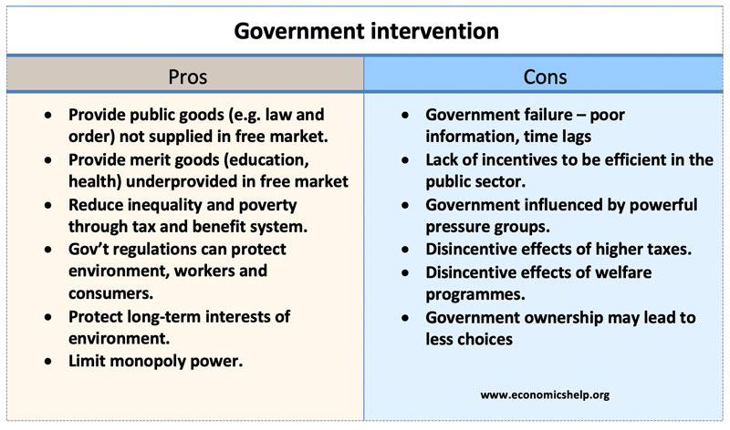

## Table of Contents

## What is government policy in the context of economics?

Government policy in economics refers to the actions and decisions made by the government that affect the economy. These policies can include setting tax rates, deciding how much to spend on public services, and creating regulations for businesses. The main goal of these policies is often to improve the economy, make it more stable, and help people live better lives.

There are different types of government policies, like fiscal policy and monetary policy. Fiscal policy involves the government changing how much it spends or how much it taxes people and businesses. For example, if the government wants to boost the economy, it might spend more on building roads or cut taxes so people have more money to spend. Monetary policy, on the other hand, is managed by a country's central bank and involves controlling the money supply and interest rates. If the central bank lowers interest rates, it can make borrowing cheaper, which might encourage businesses to invest and grow.

## How does government intervention affect the economy?

Government intervention can have a big impact on the economy. When the government steps in, it can help fix problems or make things better for people. For example, if the economy is doing badly, the government might spend more money on things like building roads or schools. This can create jobs and help people earn more money. The government can also change tax rates. If they lower taxes, people might have more money to spend, which can help the economy grow. But if the government spends too much or taxes too little, it could lead to inflation, where prices go up a lot, which can be bad for the economy.

Another way the government can affect the economy is through rules and regulations. These rules can help make sure businesses treat people fairly and don't harm the environment. For example, the government might make laws that protect workers' rights or stop companies from polluting. This can make life better for people, but it can also make it more expensive for businesses to operate. If the rules are too strict, businesses might not want to invest or grow, which can slow down the economy. On the other hand, if the rules are too loose, it might lead to problems like pollution or unfair treatment of workers. So, the government needs to find a good balance to help the economy and people at the same time.

## What are the main types of economic policies implemented by governments?

Governments use different types of economic policies to help the economy. One main type is fiscal policy. This is when the government changes how much it spends or how much it taxes. If the economy is slow, the government might spend more money on things like building roads or schools to create jobs and help people earn more. Or, it might lower taxes so people have more money to spend. But if the economy is growing too fast and prices are going up a lot, the government might spend less or raise taxes to cool things down.

Another type of economic policy is monetary policy. This is managed by a country's central bank, like the Federal Reserve in the United States. The central bank can change the amount of money in the economy and the interest rates people pay to borrow money. If the central bank wants to help the economy grow, it might lower interest rates so it's cheaper for people and businesses to borrow money. This can encourage them to spend and invest more. But if the economy is growing too fast, the central bank might raise interest rates to make borrowing more expensive and slow things down.

There are also other types of economic policies, like trade policy and regulatory policy. Trade policy involves rules about buying and selling things with other countries. The government might put tariffs, which are taxes on imports, to protect local businesses. Regulatory policy involves making rules for businesses to follow. These rules can help protect workers, consumers, and the environment. But they can also make it more expensive for businesses to operate, so the government needs to find a good balance.

## Can you explain the difference between fiscal and monetary policy?

Fiscal policy is when the government changes how much it spends or how much it taxes. If the economy is not doing well, the government might spend more money on things like building roads or schools. This can create jobs and help people earn more money. The government can also lower taxes so people have more money to spend. But if the economy is growing too fast and prices are going up a lot, the government might spend less or raise taxes to cool things down. So, fiscal policy is all about the government using its spending and taxing powers to help the economy.

Monetary policy is different because it's managed by a country's central bank, like the Federal Reserve in the United States. The central bank can change the amount of money in the economy and the interest rates people pay to borrow money. If the economy needs a boost, the central bank might lower interest rates so it's cheaper for people and businesses to borrow money. This can encourage them to spend and invest more. But if the economy is growing too fast, the central bank might raise interest rates to make borrowing more expensive and slow things down. So, monetary policy is about the central bank using money supply and interest rates to help the economy.

## What are some examples of government interventions in the market?

Governments often step into the market to help fix problems or make things better for people. One way they do this is by setting price controls. For example, during a crisis, the government might set a maximum price on things like food or gas to make sure everyone can afford them. This can help people, but it can also cause problems if businesses can't make enough money to keep selling those things. Another example is when the government gives money to businesses that are struggling, like what happened with some airlines during the COVID-19 pandemic. This can help keep people working and the economy going, but it uses taxpayer money.

Another way governments intervene is by making rules for businesses to follow. These rules can help protect workers, consumers, and the environment. For example, the government might set minimum wages to make sure workers earn enough money to live on. Or they might make laws to stop companies from polluting rivers and air. These rules can make life better for people, but they can also make it more expensive for businesses to operate. So, the government has to find a good balance to help everyone.

Governments also use subsidies to help certain industries or people. For example, they might give farmers money to help them grow more food or keep prices low for consumers. Or they might give money to people to help them buy electric cars to reduce pollution. Subsidies can help make things more affordable or encourage certain behaviors, but they can also be costly for the government and might not always work as planned.

## How do government policies influence economic growth?

Government policies can have a big impact on how fast the economy grows. One way they do this is through fiscal policy, which is when the government changes how much it spends or how much it taxes. If the economy is slow, the government might spend more money on things like building roads or schools. This can create jobs and help people earn more money, which can make the economy grow faster. The government might also lower taxes so people have more money to spend. But if the economy is growing too fast and prices are going up a lot, the government might spend less or raise taxes to cool things down. So, fiscal policy can help the economy grow by making sure people have money to spend and businesses have money to invest.

Another way government policies affect economic growth is through monetary policy, which is managed by a country's central bank. The central bank can change the amount of money in the economy and the interest rates people pay to borrow money. If the economy needs a boost, the central bank might lower interest rates so it's cheaper for people and businesses to borrow money. This can encourage them to spend and invest more, which can help the economy grow. But if the economy is growing too fast, the central bank might raise interest rates to make borrowing more expensive and slow things down. So, monetary policy can help control how fast the economy grows by making it easier or harder for people to borrow and spend money.

Government policies also influence economic growth through other ways like trade and regulatory policies. Trade policy involves rules about buying and selling things with other countries. If the government makes it easier for businesses to trade with other countries, it can help the economy grow by giving businesses more customers and helping them sell more. Regulatory policy involves making rules for businesses to follow. These rules can help protect workers, consumers, and the environment, which can make life better for people and help the economy grow in the long run. But if the rules are too strict, they might make it harder for businesses to grow and invest, which can slow down economic growth. So, the government needs to find a good balance to help the economy grow while also protecting people and the environment.

## What are the potential benefits of government intervention in the economy?

Government intervention in the economy can help fix problems and make life better for people. For example, if the economy is not doing well, the government can spend more money on things like building roads or schools. This can create jobs and help people earn more money, which can make the economy grow faster. The government can also lower taxes so people have more money to spend. By doing these things, the government can help make sure everyone has a chance to do well and the economy stays strong.

Another benefit of government intervention is that it can protect people and the environment. The government can make rules that stop businesses from polluting or treating workers unfairly. This can make life better for everyone and help keep the environment clean. The government can also give money to people who need help, like farmers or people buying electric cars. These things can make it easier for people to live and work, and they can help the economy grow in the long run.

## What are the risks and drawbacks of government economic intervention?

Government intervention in the economy can sometimes cause problems. If the government spends too much money or lowers taxes too much, it can lead to inflation, where prices go up a lot. This can make it hard for people to afford things and can hurt the economy. Also, if the government gives money to businesses that are struggling, it might use up a lot of taxpayer money. This can be risky because if those businesses don't do well, the government might lose a lot of money. So, government intervention can sometimes make things worse instead of better.

Another risk of government intervention is that it can make it harder for businesses to grow. If the government makes too many rules, it can be expensive for businesses to follow them. This can slow down the economy because businesses might not want to invest or grow if it's too hard or costly. Also, if the government tries to control prices, it can cause shortages. For example, if the government sets a maximum price on something like gas, businesses might not want to sell it because they can't make enough money. This can make it hard for people to get what they need. So, government intervention needs to be careful and balanced to avoid these problems.

## How do different economic theories view government intervention?

Different economic theories have different views on how much the government should help the economy. Some theories, like Keynesian economics, think the government should do a lot to help. They say the government can spend money and change taxes to make the economy better, especially when it's not doing well. They believe this can create jobs and help people earn more money. On the other hand, theories like classical economics think the government should not do much. They believe the economy can fix itself if the government just stays out of the way. They say that if the government does too much, it can make things worse.

Another theory, called monetarism, thinks the government should only control the money supply and interest rates. They believe this is the best way to help the economy without causing too many problems. Monetarists think that if the government spends too much or changes taxes too much, it can lead to inflation, where prices go up a lot. So, they say the government should be careful and not do too much. Each of these theories has different ideas about how the government can help the economy, and they all try to find the best way to make things better for everyone.

## What role do international organizations play in shaping government economic policies?

International organizations, like the World Bank, the International Monetary Fund (IMF), and the World Trade Organization (WTO), help shape the economic policies of governments around the world. These organizations give advice and money to countries to help them make their economies better. For example, the IMF might lend money to a country that is having money problems, but it will ask the country to make certain changes to its economic policies. These changes can include things like spending less money, raising taxes, or making it easier for businesses to work.

These organizations also help countries work together to make the world economy better. The WTO, for example, helps countries make rules about trading with each other. This can help countries sell more things to other countries and grow their economies. By working together, countries can learn from each other and make better economic policies. But sometimes, the advice from these organizations can be hard for countries to follow, and it might not always work out the way they hope. So, it's important for countries to think carefully about the advice they get and how it will help their people.

## How can government policies be evaluated for their effectiveness in economic intervention?

Government policies can be evaluated for their effectiveness by looking at how well they help the economy. One way to do this is by checking economic indicators like GDP growth, unemployment rates, and inflation. If a policy helps the economy grow, creates more jobs, and keeps prices stable, it's probably working well. For example, if the government spends more money on building roads and this leads to more jobs and higher GDP, it shows that the policy is effective. Another way to evaluate policies is by doing surveys and studies to see how people and businesses are affected. If people feel better off and businesses are doing well, it's a good sign that the policy is helping.

Sometimes, it can be hard to know if a policy is working because other things can affect the economy too. For example, if the world economy is doing badly, a country's economy might not do well even if its government policies are good. So, it's important to look at a lot of different information and compare it over time. Also, it's helpful to compare the results with what was expected when the policy was made. If the results are better than expected, the policy is probably effective. But if things don't go as planned, the government might need to change the policy or try something different.

## What advanced economic models are used to predict the outcomes of government policy interventions?

Advanced economic models help governments figure out what might happen if they change their policies. One popular model is the Dynamic Stochastic General Equilibrium (DSGE) model. It looks at how different parts of the economy, like businesses, workers, and the government, work together. The model uses math to predict how things like spending, taxes, and interest rates will affect the economy over time. It can show how a policy might help or hurt the economy, but it's not perfect because it makes some guesses about how people and businesses will act.

Another useful model is the Computable General Equilibrium (CGE) model. This model looks at the whole economy and how different parts are connected. It can show how a policy change, like a new tax or a change in spending, might affect different groups of people and businesses. The CGE model is good at showing how money moves around the economy and how policies can have different effects on different people. Like the DSGE model, it uses a lot of math and data, but it also has to make some guesses about how the economy works. Both models help governments make better decisions, but they need to be used carefully because they are not always right.

## References & Further Reading

[1] Kennedy, David M. "Freedom from Fear: The American People in Depression and War, 1929-1945." Oxford University Press, 2001.

[2] Bernanke, Ben S. "The Courage to Act: A Memoir of a Crisis and its Aftermath." W. W. Norton & Company, 2015.

[3] Hu, Angang. "China in 2020: A New Type of Superpower." Brookings Institution Press, 2011.

[4] Baumol, William J., and Wallace E. Oates. "The Theory of Environmental Policy." Cambridge University Press, 1988.

[5] ["Advances in Financial Machine Learning"](https://www.amazon.com/Advances-Financial-Machine-Learning-Marcos/dp/1119482089) by Marcos Lopez de Prado

[6] ["Evidence-Based Technical Analysis: Applying the Scientific Method and Statistical Inference to Trading Signals"](https://www.amazon.com/Evidence-Based-Technical-Analysis-Scientific-Statistical/dp/0470008741) by David Aronson

[7] ["Machine Learning for Algorithmic Trading"](https://github.com/stefan-jansen/machine-learning-for-trading) by Stefan Jansen

[8] ["Quantitative Trading: How to Build Your Own Algorithmic Trading Business"](https://www.amazon.com/Quantitative-Trading-Build-Algorithmic-Business/dp/0470284889) by Ernest P. Chan