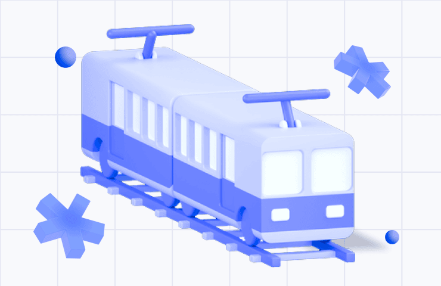

## Table of Contents

## What is government regulation in the context of the railroads sector?

Government regulation in the context of the railroads sector means that the government makes rules and laws that railroad companies must follow. These rules are made to keep people safe, make sure the railroads run well, and to be fair to everyone who uses the railroads. For example, the government might set safety standards for trains and tracks, or rules about how much railroad companies can charge for their services.

These regulations are important because they help prevent accidents and make sure that the railroads work smoothly. Without these rules, companies might try to cut corners to save money, which could lead to dangerous situations. Also, regulations help to make sure that all railroad companies compete fairly and that no one company can charge too much or treat customers badly. This way, the government helps to keep the railroads safe and reliable for everyone who uses them.

## Why is government regulation important for the railroads?

Government regulation is important for the railroads because it helps keep everyone safe. Without rules, railroad companies might try to save money by not fixing their trains or tracks properly. This could lead to accidents, like trains derailing or crashing. By making safety rules, the government makes sure that companies take care of their equipment and follow safe practices. This way, people who work on the railroads and those who travel by train are less likely to get hurt.

Regulations also make sure that the railroads run smoothly and fairly. The government sets rules about how much companies can charge for their services, so no one company can charge too much and make it hard for people to use the railroads. These rules also help make sure that all railroad companies compete fairly with each other. This is good for everyone because it keeps prices reasonable and the service reliable. In the end, government regulation helps make the railroads a safe and fair way to travel and transport goods.

## What are some historical examples of government regulation in the railroads sector?

In the United States, one of the earliest examples of government regulation in the railroads sector was the Interstate Commerce Act of 1887. This law was created because people were worried that big railroad companies were charging too much and treating customers unfairly. The Act set up the Interstate Commerce Commission (ICC), which was the first federal agency to regulate businesses. The ICC could make sure that railroad companies didn't charge different prices to different customers for the same service. This was important because it helped make things fair for everyone who used the railroads.

Another important example is the Railroad Safety Appliance Act of 1893. This law was made to make railroads safer for workers and passengers. Before this law, many railroad workers were getting hurt or killed because the trains and tracks were not safe enough. The Act required railroads to use better safety equipment, like automatic couplers and air brakes. These changes helped reduce the number of accidents and made the railroads a safer place to work and travel. Both of these laws show how the government stepped in to protect people and make sure the railroads were run fairly and safely.

## How do government regulations affect the safety of railroad operations?

Government regulations help make railroad operations safer by setting rules that railroad companies must follow. These rules include things like using safety equipment on trains, like automatic couplers and air brakes. Before these rules were made, many railroad workers got hurt or even died because the trains and tracks were not safe enough. By making sure that all companies use the right safety equipment, the government helps lower the number of accidents. This makes the railroads a safer place for everyone who works on them and everyone who travels on them.

Regulations also make sure that railroad companies keep their tracks and trains in good condition. The government checks that companies are doing regular maintenance and fixing any problems quickly. If a company tries to save money by not taking care of their equipment, it could lead to dangerous situations like trains derailing. By having rules that force companies to keep everything in good shape, the government helps prevent these kinds of accidents. This way, people can trust that the railroads are safe and reliable for moving people and goods.

## What are the economic impacts of government regulations on the railroad industry?

Government regulations can have both positive and negative economic impacts on the railroad industry. On the positive side, regulations help create a level playing field for all railroad companies. By setting rules about how much companies can charge and making sure everyone follows the same safety standards, the government helps prevent any one company from getting too much power. This can lead to more competition, which is good for the economy because it can keep prices down and improve service quality. When people and businesses know that the railroads are safe and reliable, they are more likely to use them for travel and shipping, which can help the industry grow.

On the other hand, government regulations can also add costs to railroad companies. Following safety rules and maintaining equipment to meet government standards can be expensive. Companies might need to spend money on new safety equipment, regular inspections, and training for their workers. These costs can make it harder for railroad companies to make a profit, especially for smaller companies that might not have as much money to spend. If the costs get too high, some companies might even go out of business, which could lead to fewer choices for customers and possibly higher prices. Balancing these costs and benefits is important for making sure the regulations help the railroad industry and the economy as a whole.

## How do government regulations influence competition within the railroads sector?

Government regulations help make competition fair in the railroads sector. They stop big companies from charging too much or treating customers badly. By setting rules on how much companies can charge and making sure everyone follows the same safety standards, the government makes sure that no one company can get too much power. This helps smaller companies have a chance to compete, which is good for the whole industry. When companies have to compete fairly, it can lead to better service and lower prices for everyone who uses the railroads.

But, regulations can also make it harder for companies to compete. Following all the rules can be expensive. Companies might need to spend a lot of money on safety equipment, regular checks, and training their workers. This can be tough for smaller companies that don't have a lot of money. If the costs get too high, some companies might not be able to keep up and might go out of business. This could mean fewer choices for customers and maybe even higher prices if there are fewer companies left to compete. So, it's important for the government to find a balance that keeps competition fair without making it too hard for companies to follow the rules.

## What are the current major regulatory bodies overseeing the railroads in the United States?

In the United States, the main regulatory body for railroads is the Federal Railroad Administration (FRA). The FRA is part of the Department of Transportation. It makes rules to keep railroad operations safe and reliable. The FRA checks that railroad companies follow these rules by doing inspections and investigations. It also helps make new safety technologies and works on improving the whole railroad system.

Another important body is the Surface Transportation Board (STB). The STB is in charge of making sure railroad companies compete fairly with each other. It can solve problems between companies and make decisions about things like how much companies can charge for their services. The STB helps make sure that the railroad industry works well for everyone who uses it, from big businesses to regular people.

## How do international regulations impact global railroad operations?

International regulations help make sure that railroad operations are safe and fair all around the world. Different countries work together to set rules that everyone must follow. For example, the International Union of Railways (UIC) helps create standards for things like train safety and how trains move across borders. These rules make it easier for trains to travel from one country to another without having to stop and change a lot. This is good for the economy because it makes it easier and cheaper to move goods and people around the world.

However, following international regulations can be hard for some countries. Each country might have its own rules, and making them all work together can be tricky. It can be expensive for railroad companies to meet all the different standards, especially if they want to operate in many countries. Sometimes, countries might not agree on the rules, which can slow down the process of moving goods and people. But, when countries work together and follow the same rules, it helps make the global railroad system safer and more efficient.

## What are the challenges faced by railroad companies in complying with government regulations?

Railroad companies face several challenges when they try to follow government regulations. One big challenge is the cost. Following all the rules can be expensive. Companies need to buy new safety equipment, do regular checks, and train their workers. This can be really hard for smaller companies that don't have a lot of money. If the costs get too high, some companies might not be able to keep up and might even go out of business.

Another challenge is dealing with different rules in different places. When a railroad company works in more than one country or state, they have to follow a lot of different rules. It can be hard to make sure they are meeting all the different standards. Sometimes, the rules might even be different from one part of a country to another. This can make things confusing and slow down their work. It takes a lot of effort to keep everything in line with all the different regulations.

## How do technological advancements influence the regulatory landscape for railroads?

Technological advancements change the way railroads work and also change the rules they have to follow. New technology like automatic train control systems and better ways to check the tracks can make trains safer. When new technology comes out, the government has to make new rules to make sure everyone uses it the right way. This helps keep the railroads safe and up-to-date. But it can also be hard for railroad companies to keep up with all the new rules that come with new technology.

Sometimes, new technology can make the rules easier to follow. For example, computers and sensors can help railroad companies keep track of their trains and tracks better. This can make it easier for them to do the checks that the government requires. But, it can also be expensive to buy and use new technology. Railroad companies have to spend money to get the new equipment and train their workers to use it. This can be a challenge, but in the end, it can help make the railroads safer and more efficient.

## What future regulatory changes are anticipated in the railroads sector?

In the future, people think there will be more rules about using new technology in the railroads. As trains get smarter with things like automatic control systems and better ways to watch the tracks, the government will probably make new rules to make sure everyone uses these technologies safely. This will help keep the railroads safe and up-to-date. But it might also be hard for railroad companies to keep up with all the new rules and the cost of buying and using new technology.

Another thing that might change is how the government makes sure the railroads are good for the environment. More rules might come to help reduce pollution from trains and make sure the railroads are good for the planet. This could mean using more electric trains or finding new ways to move goods that are better for the environment. These changes will help make the railroads cleaner, but they might also add new costs for railroad companies as they have to change how they do things.

## How can the effectiveness of government regulations in the railroads sector be measured and improved?

The effectiveness of government regulations in the railroads sector can be measured by looking at how safe the railroads are and how well they work. One way to do this is by checking the number of accidents and how often trains run on time. If there are fewer accidents and trains are more reliable, it means the regulations are working well. Another way is to ask people who use the railroads, like passengers and businesses, if they are happy with the service. If they say the railroads are safe and fair, it's a good sign that the regulations are effective.

To make government regulations better, the government needs to listen to what railroad companies and the people who use the railroads say. They can work together to find problems and come up with new rules that fix those problems. It's also important to keep checking if the rules are working and change them if they are not. Using new technology can help make the railroads safer and more efficient, so the government should keep up with these changes and make rules that help everyone use the new technology the right way. By doing these things, the government can make sure the railroads keep getting better and safer for everyone.

## References & Further Reading

[1]: Stigler, G. J. (1971). ["The Theory of Economic Regulation."](https://www.jstor.org/stable/3003160?read-now=1) The Bell Journal of Economics and Management Science, 2(1), 3-21.

[2]: Congressional Research Service. (2021). ["Infrastructure Investment and Jobs Act: In Brief."](https://crsreports.congress.gov/product/pdf/R/R46826/3)

[3]: Federal Railroad Administration. ["Positive Train Control."](https://railroads.dot.gov/research-development/program-areas/train-control/ptc/positive-train-control-ptc)

[4]: Carson, C. (2019). ["Railroads and American Economic Growth: Essays in Econometric History."](https://www.jstor.org/stable/2116005) Harvard University Press.

[5]: Lopez de Prado, M. (2018). ["Advances in Financial Machine Learning."](https://www.amazon.com/Advances-Financial-Machine-Learning-Marcos/dp/1119482089) Wiley.

[6]: Chandler, A. D. (1954). ["The Railroads: The Nation's First Big Business."](https://archive.org/details/railroadsnations0000chan) Virginia Quarterly Review.