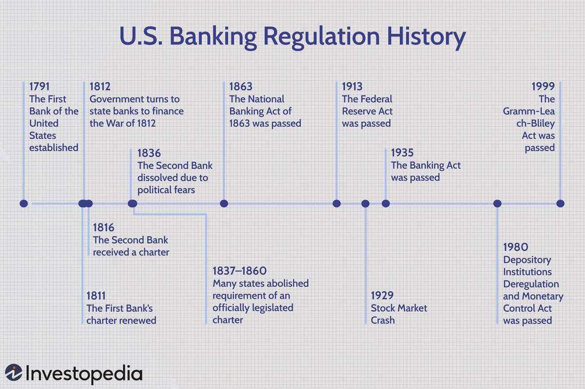

Investment banking regulation and government policy play pivotal roles in shaping the operation of financial markets and the activities of investment banks. These regulations establish the framework within which financial institutions operate, aiming to maintain market integrity, promote transparency, and protect investors. As financial markets have evolved, so too have the regulatory measures designed to monitor and control the activities of market participants. The emergence of algorithmic trading has introduced new challenges and opportunities, necessitating a proactive regulatory approach.

Algorithmic trading, a technology-driven approach to trading that leverages computer algorithms to make trading decisions and execute orders, has gained substantial prominence in financial markets. By automating the trading process, these algorithms are capable of analyzing vast amounts of data in real-time and executing trades at speeds far beyond human capacity. This provides significant advantages such as increased efficiency, reduced transaction costs, and improved liquidity. However, the rise of algorithmic trading also poses potential risks, including market manipulation, systemic disruptions, and the amplification of market volatility.



This article explores the intersection of investment banking regulations, government policies, and algorithmic trading, highlighting their implications for market dynamics and stability. Understanding how these factors interact is crucial for maintaining a balanced and resilient financial ecosystem. Market participants, including banks, traders, and regulators, must comprehend the regulatory landscape and its impact on automated trading practices to navigate this complex environment effectively. By doing so, they can ensure that the benefits of financial innovation are realized while mitigating potential risks.

The goal is to shed light on how regulations and policies are crafted to mitigate risks while encouraging financial innovation. Regulatory bodies continuously adapt their frameworks to address the changing nature of trading practices and to safeguard market stability. This involves striking a delicate balance between fostering innovation and ensuring that trading activities do not compromise the broader financial system's security and integrity. As technology continues to advance, maintaining an agile and informed regulatory approach will be essential for supporting a dynamic and sustainable financial market.

## Table of Contents

## Evolution of Investment Banking Regulation

Investment banking regulation has undergone profound changes since the 2008 global financial crisis, primarily motivated by the need to address systemic risk factors and enhance market stability. This transformation has been characterized by the introduction of significant legislative measures, most notably the Dodd-Frank Wall Street Reform and Consumer Protection Act in the United States. The Dodd-Frank Act was enacted to promote financial stability and protect consumers from abusive financial practices. Specifically, it aimed to limit the risk-taking activities of investment banks by imposing greater oversight and regulation.

A crucial component of the Dodd-Frank Act is the Volcker Rule, which prohibits banks from engaging in proprietary trading and from owning or sponsoring hedge funds or private equity funds. This rule was introduced to reduce the potential for speculative trading activities to contribute to systemic failures. By restricting these high-risk activities, the Volcker Rule seeks to enhance transparency within financial institutions and realign their focus towards traditional lending and investment services.

These regulatory measures aim to mitigate systemic risk by imposing heightened safeguards and emphasizing transparency. The emphasis on transparency is intended to ensure that both market participants and regulators have a clear view of the risks embedded within financial products and activities. The complexity of financial instruments, exemplified by derivatives and structured products, has necessitated a comprehensive regulatory approach that addresses interconnectedness and potential contagion effects across financial markets.

Additionally, the reform measures have included stricter capital requirements and [liquidity](/wiki/liquidity-risk-premium) provisions, designed to strengthen the shock-absorbing capacity of financial institutions. By mandating higher capital reserves and more rigorous stress testing, regulators aim to ensure that banks can withstand financial turbulence without necessitating government bailouts, which were a hallmark of the 2008 crisis.

The evolution of investment banking regulation reflects not only a response to past financial crises but also an adaptation to the growing complexity and globalization of financial markets. As financial products become increasingly sophisticated, and as market interconnections deepen, regulatory frameworks must evolve to anticipate and address emerging risks. This ongoing adaptation seeks to foster a balanced financial ecosystem where innovation can occur without compromising the stability and integrity of the global financial system.

## Government Policy and Its Impact on Financial Markets

Government policies fundamentally shape the financial markets by influencing the operations of investment banks, and they can significantly sway market dynamics. Monetary policies, executed by central banks, involve controlling interest rates and money supply to manage economic stability. For instance, monetary easing—lowering interest rates or purchasing government securities—injects liquidity into the financial system, boosting market confidence and encouraging investment. Similarly, fiscal policies, dictated by government budgets, directly affect economic output through taxation and public spending. Fiscal stimulus measures, such as increased infrastructure spending or tax cuts, aim to spur economic activity by enhancing disposable income and boosting aggregate demand.

Balancing these policies requires careful consideration of market stability, consumer protection, and economic growth. An optimal policy mix should mitigate systemic risks while fostering an environment conducive to sustainable growth. For example, post the 2008 financial crisis, government interventions, including bailouts and stricter regulatory frameworks, were implemented to restore market confidence and prevent future downturns.

Governments also leverage these policies to tackle macroeconomic challenges, such as inflation and unemployment. Inflation control requires tightening monetary policies, like increasing interest rates, which can dampen borrowing and spending but stabilize currency value. Conversely, in times of high unemployment, expansionary monetary and fiscal policies aim to stimulate job creation and economic recovery.

Investment banks and traders must possess a nuanced understanding of these policy impacts to tailor their strategies effectively. Interest rate fluctuations, for instance, can alter the cost of capital, influencing banks' lending activities and profitability. As such, forecasting policy movements and adjusting trading models accordingly becomes crucial in optimizing market performance and managing risks. 

In conclusion, while government policies are key tools for economic management, their implications for financial markets necessitate a strategic response from investment banks and traders to align with shifting economic landscapes.

## Algorithmic Trading: Advantages and Risk Considerations

Algorithmic trading (ALGO trading) refers to the application of computer algorithms to manage and execute a large number of trades at speeds and frequencies that human traders cannot achieve. By automating the trading process, ALGO trading offers numerous advantages, prominently including reduced transaction costs, improved liquidity, and minimization of human error in trade execution.

The cost efficiency derives from better execution pricing and reduced bid-ask spreads due to high-frequency trading activities. Liquidity within financial markets is enhanced as algorithmic traders frequently act as market makers, providing buy and sell quotations that increase trading volumes and tighten bid-ask spreads. Additionally, automation drastically reduces the likelihood of human error, leading to more consistent trading performance.

Despite these advantages, ALGO trading is accompanied by notable risks. One significant risk is systemic market disruption, which can occur if a large number of algorithms execute trades simultaneously, amplifying market [volatility](/wiki/volatility-trading-strategies). This risk is demonstrated by incidents like the Flash Crash of 2010, where rapid automated sell-offs briefly wiped out over $1 trillion in market value.

Algorithmic failures pose another risk, where errors in the trading algorithms can result in unintended trading activities. An infamous example involves Knight Capital Group's trading error in 2012, which resulted in a $440 million loss due to a flaw in their trading algorithm. Such incidents underscore the necessity for rigorous testing and validation of algorithms.

Market manipulation is also a concern, as algorithmic strategies like spoofing—placing large orders with the intent to cancel them before execution to manipulate prices—may threaten market fairness and integrity. These risks necessitate stringent regulatory oversight and robust risk management practices. Pre-trade and post-trade controls, coupled with continuous surveillance, are vital measures to detect and prevent potential abuses and systemic threats.

In conclusion, while [algorithmic trading](/wiki/algorithmic-trading) offers numerous efficiency enhancements in the financial markets, it also introduces complex risks that require meticulous management. Understanding these risks and implementing comprehensive risk management frameworks are essential for ensuring market integrity and stability, allowing financial innovation to thrive alongside regulatory safeguards.

## Regulatory Framework Governing Algorithmic Trading

The regulatory framework for algorithmic trading is structured around guidelines and mandates from major regulatory bodies, such as the Securities and Exchange Commission (SEC) and the Commodity Futures Trading Commission (CFTC) in the United States, as well as the Markets in Financial Instruments Directive (MiFID) in Europe. These frameworks focus on ensuring risk mitigation, operational resilience, and market stability in trading activities that utilize algorithms.

MiFID serves as a cornerstone in Europe for the regulation of financial markets, with specific attention to algorithmic trading. It promulgates a series of rules and guidelines that are designed to mitigate risks associated with the rapid execution and decision-making inherent in such technologies. Key components of MiFID include requirements for robust governance and the implementation of both pre-trade and post-trade risk controls to avert market disruptions and technical outages.

Governance frameworks within this regulatory landscape are critical. They establish organizational standards and protocols to ensure compliance with the applicable capital requirements and security measures. Firms engaging in algorithmic trading must maintain comprehensive records of their trading algorithms and demonstrate adherence to these frameworks. This includes implementing rigorous stress testing and having a clear understanding of the algorithms’ decision-making processes.

Pre-trade risk controls often involve mechanisms such as price and order checks to prevent erroneous trades, while post-trade controls focus on monitoring executed transactions for anomalies. The integration of these controls is crucial in preventing market abuses, such as spoofing and layering, and in maintaining the integrity of financial markets.

Regulatory bodies stress the importance of transparency and surveillance. Algorithms should be monitored continuously to ensure they function as intended, and any unconventional trading patterns should be analyzed for potential regulatory violations. Surveillance systems have been enhanced to detect and manage these risks proactively, thereby safeguarding market stability.

Overall, supervisory authorities remain focused on sustaining market stability and encouraging transparent trading practices. By harmonizing technology with diligent regulatory oversight, the framework ensures that algorithmic trading contributes positively to market efficiency without compromising systemic safety.

## Risk Management and Compliance in Automated Trading

Effective risk management is critical for addressing the operational risks inherent in algorithmic trading. Algorithmic trading, or ALGO trading, leverages technology to execute trades at high speeds, presenting unique challenges that require comprehensive risk management strategies.

One pivotal approach to risk management in ALGO trading is the implementation of robust risk controls. Regulations generally mandate that trading systems incorporate specific mechanisms to limit the size of orders, preventing drastic market impacts from erroneous trades. Additionally, automated trading systems must include 'kill switches'—emergency shutdown protocols that can halt trading in case of system malfunctions or abnormal trading patterns. These controls help protect market integrity by curbing the potential for substantial disruptions.

Compliance is another key component in managing ALGO trading risks. This involves ensuring that algorithmic trading activities are registered with the appropriate regulatory bodies, and that ongoing reporting requirements are met. Continuous monitoring of these activities is crucial to maintaining adherence to legal and regulatory standards. Financial institutions are required to maintain transparency in their algorithmic trading operations, facilitating oversight by supervisory authorities.

Furthermore, financial institutions must establish stringent governance structures to effectively oversee ALGO trading operations. This entails defining clear roles and responsibilities within the organizational framework to manage risks and ensure compliance. Governance structures should also facilitate the assessment and approval of new trading algorithms, ensuring they meet regulatory and ethical standards before deployment.

Continuous model validation stands as a critical practice in maintaining the reliability of trading algorithms. Regular testing and evaluation of algorithms help to ensure they perform as intended under different market conditions. Institutions often use [backtesting](/wiki/backtesting)—a method that applies historical data to validate the efficacy and safety of an algorithm—prior to live deployment.

System safeguards are essential for managing risks associated with ALGO trading. These safeguards might include redundancy measures, such as backup servers and data centers, to ensure uninterrupted operation. Also, cybersecurity protocols must be robust to protect against potential threats that could compromise algorithmic trading systems.

In conclusion, a structured approach to risk management and compliance is indispensable in algorithmic trading. Financial institutions, through regulatory adherence and the implementation of stringent operational controls, can effectively manage the complexities and risks associated with automated trading, thus safeguarding market stability and fostering an environment conducive to technological advancement.

## The Future of Investment Banking and Algorithmic Trading

The convergence of investment banking, government policy, and algorithmic trading is leading to a dynamic and rapidly evolving financial landscape. As technology continues to drive innovations, trading strategies are becoming increasingly sophisticated, incorporating advanced tools such as [machine learning](/wiki/machine-learning) and [artificial intelligence](/wiki/ai-artificial-intelligence) (AI). These technologies offer numerous opportunities but also present regulatory considerations that must be addressed to ensure market stability.

Machine learning and AI have the potential to revolutionize trading algorithms by enhancing predictive accuracy and adapting to market changes in real-time. For instance, machine learning models can identify complex patterns and correlations within large datasets, enabling more informed trading decisions. A basic example of such an algorithm can be illustrated with a Python snippet using a simple machine learning model:

```python
from sklearn.ensemble import RandomForestClassifier

# Sample data for demonstration purposes
X_train, X_test, y_train, y_test = load_data()

# Initialize and train the model
model = RandomForestClassifier(n_estimators=100)
model.fit(X_train, y_train)

# Predict on new data
predictions = model.predict(X_test)
```

However, while the integration of these technologies can enhance efficiency, it also raises questions about regulatory oversight. Ensuring that algorithmic trading systems remain transparent and accountable is essential to prevent market manipulation and technical failures. Regulatory frameworks will need to evolve in tandem with technological advancements, requiring collaboration between stakeholders, including regulators, financial institutions, and technology developers. This collaboration is crucial to ensure that innovation in trading aligns with regulatory goals and supports market stability.

Future developments in investment banking and algorithmic trading will focus on strengthening the robustness of financial systems. This may involve measures to enhance the security and reliability of trading platforms, as well as the implementation of advanced risk management protocols. Moreover, as trading algorithms become more complex, continuous model validation and monitoring will be vital to maintain their effectiveness and mitigate operational risks.

In summary, the future of investment banking and algorithmic trading is characterized by the interplay between technological innovation and regulatory adaptation. As these elements converge, stakeholders must work together to cultivate a resilient financial ecosystem that leverages the benefits of modern trading technologies while ensuring sound regulatory practices.

## Conclusion

The intricate relationship between investment banking regulations, government policies, and algorithmic trading is crucial to understanding modern financial markets. Regulations are designed to stabilize and protect these markets, addressing systemic risks and ensuring transparency. The implementation of frameworks such as the Dodd-Frank Act and the Volcker Rule demonstrates regulatory efforts to safeguard the financial system against excessive risk-taking by imposing stricter controls on trading activities.

In contrast, technological advancements in trading, particularly algorithmic trading, have introduced significant efficiency gains. Algorithmic trading enables rapid execution of orders, reduction in transaction costs, and minimization of human error. However, these benefits also come with challenges, including the potential for market disruptions and the need for robust risk management practices. The dual impact of regulation and algorithmic innovation necessitates a continuous engagement between policymakers, market participants, and regulators to balance innovation with regulation effectively.

To navigate the evolving regulatory landscape, investment banks and traders must remain agile and informed. This involves adapting to new regulations, understanding the implications of government policies, and integrating technological advancements into their operational frameworks. The landscape of investment banking is dynamic, requiring constant adjustment to ensure compliance and competitiveness.

Ultimately, fostering a resilient and dynamic financial ecosystem hinges on integrating sound regulatory practices with technological advancements. This integration ensures that financial systems remain robust, transparent, and efficient, capable of adapting to future challenges while safeguarding against systemic risks. Through ongoing collaboration between stakeholders, the financial sector can continue to innovate responsibly, delivering stability and growth in global markets.

## References & Further Reading

[1]: Philippon, T. (2018). ["The Economics and Regulation of Financial Markets."](https://pages.stern.nyu.edu/~tphilipp/papers/FinTech.pdf) National Bureau of Economic Research, Working Paper 26047.

[2]: Carletti, E., & Claessens, S. (2020). ["Investment Banking: The Role of Regulation and Competition."](https://www.econbiz.de/Record/the-bank-business-model-in-the-post-covid-19-world-carletti-elena/10012257229) CEPR Discussion Papers.

[3]: MacKenzie, D. (2014). ["Beating the Market? The Role of Reputation, Regulation, and Technological Innovation in the Emergence of High-Frequency Trading."](https://ycharts.com/mutual_funds/M:MFC8819.TO/annualized_daily_three_year_total_return) London School of Economics, Economy and Society, Vol 43, Issue 5.

[4]: U.S. Securities and Exchange Commission. (2010). ["Concept Release on Equity Market Structure."](https://www.sec.gov/rules-regulations/2010/01/concept-release-equity-market-structure) Release No. 34-61358.

[5]: Commodities Futures Trading Commission and Securities and Exchange Commission. (2010). ["Findings Regarding the Market Events of May 6, 2010."](https://www.sec.gov/news/studies/2010/marketevents-report.pdf) Report on the Flash Crash.

[6]: Lopez de Prado, M. (2018). ["Advances in Financial Machine Learning."](https://www.amazon.com/Advances-Financial-Machine-Learning-Marcos/dp/1119482089) Wiley.

[7]: Financial Stability Board. (2017). ["Policy Recommendations to Address Structural Vulnerabilities from Asset Management Activities."](https://www.fsb.org/2017/01/policy-recommendations-to-address-structural-vulnerabilities-from-asset-management-activities/)

[8]: U.S. Department of the Treasury. (2017). ["A Financial System That Creates Economic Opportunities: Capital Markets."](https://home.treasury.gov/system/files/136/A-Financial-System-Capital-Markets-FINAL-FINAL.pdf)

[9]: Bank for International Settlements. (2011). ["High-frequency trading in the foreign exchange market."](https://www.bis.org/publ/mktc05.pdf) Markets Committee Papers, No 11.

[10]: Barth, J. R., Prabha, A., & Apati, J. (2012). ["The Dodd-Frank Wall Street Reform and Consumer Protection Act: Background and Summary."](https://www2.owen.vanderbilt.edu/ram.pappu/CentralBanksCourseFiles/TheDoddFrankActBarthPrabhaApati.pdf) International Center for Monetary and Banking Studies.