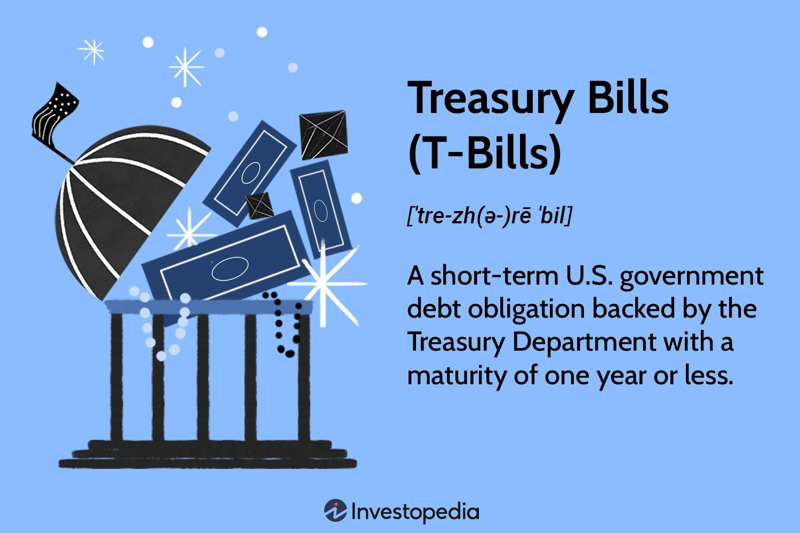

## Table of Contents

## What are government securities?

Government securities are types of investments that are issued by a government to raise money. They are considered very safe because they are backed by the government, which means the government promises to pay back the money with interest. These securities include things like treasury bills, bonds, and notes. People and organizations buy these securities as a way to lend money to the government, and in return, they get interest payments over time.

These securities help the government fund important projects and programs, like building roads or supporting schools. They also help control the amount of money circulating in the economy. When people buy government securities, they are essentially helping the government manage the economy. For investors, these securities are attractive because they are low-risk and provide a steady, if sometimes small, return on investment.

## What is the difference between T-Bills and T-Bonds?

T-Bills, or Treasury Bills, and T-Bonds, or Treasury Bonds, are both types of government securities, but they have some key differences. T-Bills are short-term investments that usually mature in less than a year, often in a few months. When you buy a T-Bill, you're not getting interest payments along the way. Instead, you buy it at a lower price than its face value and get the full face value back when it matures. The difference between what you paid and what you get back is your earnings.

On the other hand, T-Bonds are long-term investments that take much longer to mature, usually 20 to 30 years. Unlike T-Bills, T-Bonds pay interest to the investor every six months until they mature. This means you get regular payments over the years, which can be helpful if you need a steady income. When the bond finally matures, you get the face value of the bond back.

In summary, if you need your money back quickly and want to keep things simple, T-Bills might be the better choice. If you're looking for a long-term investment with regular interest payments, T-Bonds could be more suitable. Both are safe because they're backed by the government, but they serve different purposes based on how long you're willing to wait and what kind of return you're looking for.

## How are T-Bills and T-Bonds issued?

T-Bills and T-Bonds are both issued by the government to borrow money. The process starts with the government deciding it needs to raise funds. It then announces the sale of these securities, setting a date for an auction. At the auction, people and organizations can bid on the securities. For T-Bills, they bid on how much they're willing to pay for them. For T-Bonds, they bid on the interest rate they want. The government accepts the bids that meet its needs, and the securities are then issued to the highest bidders.

Once issued, T-Bills are sold at a discount and mature in a short time, like a few months to a year. When they mature, the government pays back the full face value, and the difference between what was paid and what's received is the investor's earnings. T-Bonds, on the other hand, are sold at their face value and have a much longer maturity period, often 20 to 30 years. During this time, the government makes interest payments to the bondholders every six months. When the bond matures, the government pays back the face value of the bond. Both types of securities can be bought and sold in the secondary market before they mature, giving investors flexibility.

## What are the maturity periods for T-Bills and T-Bonds?

T-Bills, or Treasury Bills, have short maturity periods. They usually come in three options: 4 weeks, 8 weeks, 13 weeks, 26 weeks, and sometimes 52 weeks. This means if you buy a T-Bill, you will get your money back in a few months to a year. Because they are short-term, T-Bills are good if you want to invest your money for a short time and get it back quickly.

T-Bonds, or Treasury Bonds, have much longer maturity periods. They typically mature in 20 or 30 years. When you buy a T-Bond, you are lending your money to the government for a long time. In return, you get interest payments every six months until the bond matures, and then you get your original investment back. T-Bonds are good if you want to invest for the long term and get regular income from interest payments.

## How can an individual invest in T-Bills and T-Bonds?

To invest in T-Bills and T-Bonds, an individual can participate in auctions held by the government. For T-Bills, you can go to the U.S. Department of the Treasury's website and use the TreasuryDirect platform to buy them directly. You'll need to create an account, and then you can bid on T-Bills during the scheduled auctions. You decide how much you want to pay, and if your bid is accepted, you'll get the T-Bills. T-Bills are sold at a discount, so you pay less than the face value and get the full amount back when they mature.

For T-Bonds, the process is similar. You can also use TreasuryDirect to buy T-Bonds at auction. You'll need to bid on the interest rate you want to receive. If your bid is accepted, you'll buy the T-Bonds at their face value and start receiving interest payments every six months until they mature. Both T-Bills and T-Bonds can also be bought and sold on the secondary market through a broker if you don't want to wait for an auction or if you want to sell them before they mature. This gives you more flexibility with your investment.

## What are the risks associated with investing in government securities?

Investing in government securities like T-Bills and T-Bonds is usually very safe because they are backed by the government. This means the government promises to pay you back with interest. But there are still some risks to think about. One risk is interest rate risk. If interest rates go up after you buy a bond, the value of your bond might go down. This is because new bonds will offer higher interest rates, making your older bond less attractive to other buyers. If you need to sell your bond before it matures, you might get less money than you paid for it.

Another risk is inflation risk. Inflation means the prices of things go up over time. If inflation goes up a lot, the interest you earn from your government securities might not keep up with the rising prices. This means the money you get back might not buy as much as it used to. This can be a problem if you are counting on that money to keep its value over time.

Lastly, there's the risk of reinvestment. When your T-Bills or T-Bonds mature or when you get interest payments, you might need to reinvest that money. If interest rates are lower when you need to reinvest, you might end up with a lower return than you expected. These risks are not as big as with other types of investments, but it's good to know about them before you decide to invest in government securities.

## How do T-Bills and T-Bonds contribute to a diversified investment portfolio?

T-Bills and T-Bonds can be a great addition to a diversified investment portfolio because they are very safe. They are backed by the government, which means there's a very low chance of losing your money. This makes them different from riskier investments like stocks, where the value can go up and down a lot. By adding T-Bills and T-Bonds to your portfolio, you can balance out the risk. If your stocks go down, the steady interest from your bonds can help cushion the fall.

These government securities also provide regular income, which can be helpful if you need money coming in regularly. T-Bonds pay interest every six months, and T-Bills give you your money back with a little extra when they mature. This can be a good way to have some money coming in while other parts of your portfolio, like stocks, might be growing over time. So, by including T-Bills and T-Bonds, you can have a mix of safety, income, and growth in your investments, making your overall portfolio more stable and balanced.

## What is the impact of interest rate changes on T-Bills and T-Bonds?

When interest rates change, it can affect T-Bills and T-Bonds in different ways. If interest rates go up after you buy a T-Bond, the value of your bond can go down. This happens because new bonds will be issued with higher interest rates, making your older bond less attractive to other buyers. If you need to sell your bond before it matures, you might have to sell it for less than what you paid for it. T-Bills, being short-term, are less affected by interest rate changes because they mature quickly, but if you're holding onto them and rates go up, the return you get when they mature might not be as good as what you could get from new T-Bills issued at the higher rate.

On the other hand, if interest rates go down after you buy a T-Bond or T-Bill, the value of your bond can go up. This is because your bond is now paying a higher interest rate than new bonds being issued. If you need to sell your bond before it matures, you might be able to sell it for more than what you paid for it. For T-Bills, the impact is smaller because they mature quickly, but you still might get a better return than what new T-Bills are offering at the lower rate. So, changes in interest rates can make a big difference in how much your government securities are worth, especially if you need to sell them before they mature.

## How are T-Bills and T-Bonds taxed?

T-Bills and T-Bonds are taxed in a simple way. The interest you earn from them is usually subject to federal income tax. This means you have to pay taxes on the money you make from your T-Bills and T-Bonds to the federal government. The interest is taxed as ordinary income, which means it's added to your other income and taxed at your regular tax rate.

However, there's some good news. The interest from T-Bills and T-Bonds is not subject to state and local taxes. This means you don't have to pay state or city taxes on the money you earn from them. This can save you some money if you live in a place with high state taxes. So, while you do have to pay federal taxes on the interest, you get a break from state and local taxes, which can make these securities more attractive.

## What is the role of government securities in monetary policy?

Government securities like T-Bills and T-Bonds play a big role in helping the government control the economy through something called monetary policy. The government and the central bank, like the Federal Reserve in the U.S., use these securities to manage how much money is circulating in the economy. When the government wants to slow down the economy and control inflation, it can sell more T-Bills and T-Bonds. This takes money out of people's hands because they use their money to buy these securities. Less money in people's hands means they spend less, which can help cool down an overheating economy.

On the other hand, when the government wants to boost the economy, it can buy back T-Bills and T-Bonds. This puts more money back into people's hands because the government pays them for the securities. With more money to spend, people and businesses can buy more things, which can help the economy grow. By buying and selling government securities, the government can control the amount of money in the economy, which is a key part of managing economic growth and keeping prices stable.

## How do T-Bills and T-Bonds affect the national debt?

T-Bills and T-Bonds are ways the government borrows money. When the government sells these securities, it gets money from people and organizations who buy them. This money becomes part of the national debt because the government has to pay it back with interest. So, every time the government issues more T-Bills and T-Bonds, it adds to the national debt.

On the other hand, when T-Bills and T-Bonds mature and the government pays them back, it reduces the national debt a little bit. But usually, the government keeps issuing new securities to keep funding its needs, so the national debt keeps growing. T-Bills and T-Bonds are important tools for managing the economy, but they also mean the government owes more money, which is the national debt.

## What advanced strategies can be used when investing in T-Bills and T-Bonds?

One advanced strategy for investing in T-Bills and T-Bonds is called laddering. This means you buy securities that mature at different times. For example, you might buy some T-Bills that mature in 4 weeks, some in 13 weeks, and some in 26 weeks. With T-Bonds, you could buy some that mature in 10 years, some in 20 years, and some in 30 years. This way, you get money back at different times. It can help you manage interest rate risk because you can reinvest the money from shorter-term securities at new rates if they go up. It also gives you regular cash flow, which can be helpful if you need money at different times.

Another strategy is to use T-Bills and T-Bonds to hedge against inflation. You can do this by investing in Treasury Inflation-Protected Securities (TIPS), which are a special kind of T-Bond. TIPS adjust their value based on inflation, so if prices go up, the value of your TIPS goes up too. This can protect your investment from losing value due to inflation. You might also use T-Bills and T-Bonds as part of a broader investment strategy, like using them to balance out riskier investments like stocks. By mixing safe investments with riskier ones, you can create a more stable portfolio that can handle different economic conditions.

## What are Treasury Bills and why are they important?

Treasury bills, commonly referred to as T-Bills, represent a cornerstone of the government's short-term borrowing strategy. These securities are designed with maturities varying from a few days up to one year, offering a short time horizon for investors. They are typically sold at a discount, with the yield determined by the difference between the purchase price and the face value that is paid at maturity. For example, if an investor purchases a T-Bill for $9,800 with a face value of $10,000 due in one year, the yield can be calculated as:

$$
\text{Yield} = \left(\frac{\text{Face Value} - \text{Purchase Price}}{\text{Purchase Price}}\right) \times 100
$$

Applying the numbers:

$$
\text{Yield} = \left(\frac{10,000 - 9,800}{9,800}\right) \times 100 \approx 2.04\%
$$

T-Bills are a favored choice for investors prioritizing safety and [liquidity](/wiki/liquidity-risk-premium). The minimal risk associated with T-Bills stems from the backing of the full faith and credit of the issuing government, ensuring investor confidence in the repayment of the principal. Additionally, their short maturities contribute to high liquidity, allowing investors to swiftly convert their holdings into cash without significant price [volatility](/wiki/volatility-trading-strategies).

These characteristics make T-Bills especially appealing for risk-averse investors who are prepared to accept lower yields in exchange for greater security and the flexibility of easy cash access. Consequently, institutional investors often prefer including T-Bills in their portfolios to balance assets by counteracting riskier investments.

From an operational perspective, governments issue T-Bills as a mechanism to efficiently manage short-term fiscal needs. By issuing these debt instruments, governments can quickly secure funding to address immediate budgetary requirements or manage cash flow mismatches within the fiscal year. This strategic issuance of T-Bills enables governments to maintain financial stability and meet obligations without diverting funds allocated for long-term projects. As a widely trusted financial instrument, T-Bills play a pivotal role in both personal finance and macroeconomic policy.

## What are Treasury Bonds and how can we explore them?

Treasury bonds (T-Bonds) are long-term debt securities issued by the U.S. Department of the Treasury with maturities ranging from 10 to 30 years. These instruments are characterized by their ability to provide fixed interest payments, also known as coupon payments, every six months. This feature makes T-Bonds particularly appealing to investors who prioritize a stable and predictable income stream. The interest earned on these bonds is subject to federal income taxes; however, it is exempt from state and local taxes, enhancing their attractiveness for tax-sensitive investors.

The inherent stability of Treasury bonds is due to their backing by the full faith and credit of the U.S. government, which significantly reduces the risk of default. As a result, T-Bonds are favored by investors with a long-term focus seeking low-risk returns. This investment is particularly relevant for portfolio diversification strategies, providing a counterbalance to more volatile asset classes such as equities.

T-Bonds also play a crucial role in the broader fiscal strategy of the U.S. government. By issuing these bonds, the government can secure funding for large-scale expenditures, including infrastructure projects and other capital-intensive initiatives. Such investments are essential for national economic development, and T-Bonds offer an effective mechanism for raising the necessary capital while spreading the repayment obligations over an extended period.

Financially, the price of T-Bonds is influenced by a variety of factors, including the prevailing interest rates in the economy. Generally, there exists an inverse relationship between bond prices and interest rates: when interest rates rise, the price of existing bonds tends to fall, and vice versa. This relationship is critical for investors to consider, as it impacts the yield of the bonds, which can be calculated using the formula:

$$
\text{Yield} = \frac{\text{Coupon Payment}}{\text{Current Price of the Bond}}
$$

Understanding these dynamics enables investors to make informed decisions regarding the timing of purchasing or selling these securities. Furthermore, Treasury bonds serve an important function in the monetary policy landscape, where the Federal Reserve may buy or sell these bonds in the open market to influence money supply and interest rates, thereby steering economic conditions in the desired direction.

Overall, Treasury bonds stand out as essential tools both for individual investors seeking stability and for governments aiming to finance essential expenditures. Their long-term maturity, coupled with the security offered by the U.S. government, ensures that T-Bonds remain integral components of financial markets and national economic strategies.

## References & Further Reading

[1]: ["Advances in Financial Machine Learning"](https://books.google.com/books/about/Advances_in_Financial_Machine_Learning.html?id=oU9KDwAAQBAJ) by Marcos Lopez de Prado

[2]: ["The Handbook of Fixed Income Securities"](https://www.mhebooklibrary.com/doi/book/10.1036/9781260473902?contentTab=true) by Frank J. Fabozzi

[3]: ["Quantitative Trading: How to Build Your Own Algorithmic Trading Business"](https://www.amazon.com/Quantitative-Trading-Build-Algorithmic-Business/dp/1119800064) by Ernest P. Chan

[4]: ["Evidence-Based Technical Analysis: Applying the Scientific Method and Statistical Inference to Trading Signals"](https://www.amazon.com/Evidence-Based-Technical-Analysis-Scientific-Statistical/dp/0470008741) by David Aronson

[5]: ["Treasury Securities and Derivatives"](https://www.wiley.com/en-us/Treasury+Securities+and+Derivatives-p-9781883249236) by Frank J. Fabozzi

[6]: ["Trading and Exchanges: Market Microstructure for Practitioners"](https://www.amazon.com/Trading-Exchanges-Market-Microstructure-Practitioners/dp/0195144708) by Larry Harris