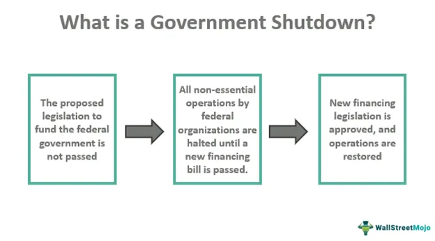

Government shutdowns have become an increasingly familiar phenomenon in recent years, exerting significant effects across various sectors of the economy. These events occur when federal agencies halt operations due to funding gaps often triggered by political deadlock. The resulting disruptions span a spectrum from delayed government contracts and unreleased economic data to furloughed employees, creating ripple effects that concern policymakers, businesses, and investors.

For policymakers, analyzing the economic consequences of shutdowns is essential for designing strategies that minimize disruption. Businesses, particularly those reliant on government contracts, must navigate uncertain cash flows, while investors face market volatility driven by shifts in economic confidence and geopolitical stability. Addressing these challenges requires a nuanced understanding of the financial markets' response mechanisms during government shutdowns.

Algorithmic trading has become a substantial component of modern financial markets, orchestrating trades through computer programs that run on predefined instructions. These systems significantly influence market dynamics, as they possess the ability to swiftly react to policy changes, including those related to government operations. Given their prominence, algorithmic trading systems serve as valuable tools for understanding market behavior during shutdowns.

This examination will investigate the intersection of government shutdowns, economic impacts, and algorithmic trading behaviors. By reflecting on historical examples of previous shutdowns, the article will demonstrate how algorithmic trading systems have responded to such scenarios. Through this analysis, we aim to provide insights into the adaptive capabilities of these systems and the broader implications for stakeholders navigating the economic landscape shaped by government interventions.

## Table of Contents

## Understanding Government Shutdowns

A government shutdown occurs when non-essential federal government offices cease operations due to a lack of allocated funding. This situation typically arises from political impasses over budgetary allocations and disagreements in federal spending priorities. Such shutdowns have far-reaching effects, both on public services and private enterprises. For instance, services deemed non-essential, such as national parks and museums, close, while essential services, like national security and public safety, continue to operate but often at reduced capacity.

The economic consequences of a government shutdown are significant and varied. Disruptions in public services hinder economic activities, leading to cascading effects in sectors reliant on government operations. For example, businesses that contract with the government may face delayed payments, impacting their cash flow and potentially leading to temporary layoffs or operational curtailments. Similarly, furloughed government employees experience a direct reduction in household income, which can lead to decreased consumer spending and negatively affect retail and service sectors.

The duration and severity of the shutdown play crucial roles in determining the extent of economic impact. Short-term shutdowns might lead to minimal disruptions, with most systems returning to normal operations relatively quickly. Conversely, prolonged shutdowns can amplify negative outcomes, leading to substantial economic slowdowns. Historical examples underscore these effects; for instance, the 1995 shutdown lasted 21 days and had considerable impacts on both macroeconomic indicators and public sentiment. Similarly, the 2018-2019 shutdown, which extended to 35 days, incurred significant economic costs, with the Congressional Budget Office estimating a reduction in gross domestic product growth for the duration of the shutdown.

Past shutdowns provide valuable data for understanding the scale of their influence on the economy. According to estimates, the 2013 shutdown cost the economy $24 billion, reducing quarterly GDP growth by 0.3 percentage points. These figures illustrate the typical consequences of a government shutdown, emphasizing the importance of timely resolution of budgetary disagreements to mitigate adverse economic impacts.

In conclusion, government shutdowns manifest as a significant interruption to economic activity, stemming from federal funding disputes. Their impact spans across various sectors, highlighting the necessity for efficient budget negotiations and policy formulations to prevent extended disruptions. By examining [statistics](/wiki/bayesian-statistics) and trends from past events, policymakers and stakeholders can better prepare and strategize to minimize the detrimental effects of future shutdowns.

## Economic Impact of Government Shutdowns

A prolonged government shutdown can significantly affect the economy by eroding consumer confidence and diminishing spending. When uncertainty prevails, households and individuals often restrain their expenditures, contributing to slower economic growth. This reduction in consumer spending can be attributed to a decline in confidence regarding future economic stability and disposable income.

Businesses with government contracts are particularly vulnerable during shutdowns, facing delays in payments that strain cash flows. These cash flow disruptions are challenging for small and medium-sized enterprises that rely on timely government payments to maintain operations. The resulting financial stress can lead to reduced investment and hiring, thereby slowing economic activity further.

Government shutdowns can result in the furlough of federal employees, leading to immediate reductions in household incomes. With affected employees temporarily out of work, consumption may decline further, exacerbating economic deceleration. These furloughs also create ripple effects across communities that depend on government workers as consumers.

Market [volatility](/wiki/volatility-trading-strategies) often intensifies during government shutdowns due to the heightened uncertainty surrounding economic policies and geopolitical stability. Financial markets respond negatively to the lack of clarity regarding fiscal and monetary policy, amplifying fluctuations in asset prices and investor sentiment. The resultant volatility can deter investments and complicate financial planning for businesses and individuals alike.

Examining historical shutdowns, such as those in 1995 and 2018, provides insights into their economic ramifications. The 1995-1996 shutdown, lasting 21 days, resulted in costs estimated at $1.4 billion, impacting GDP growth rates and consumer spending (CRS Report, RL34680). The 2018-2019 shutdown extended to 35 days, affecting 800,000 federal workers and contributing to an estimated $3 billion permanent loss to the U.S. economy (CBO Report, 2019). These events underscore the substantial disruption that prolonged shutdowns can impose on the broader economy, from individual households to the financial markets.

## Role of Algorithmic Trading in Financial Markets

Algorithmic trading, a crucial aspect of modern financial markets, uses computer programs to execute trades based on predefined criteria. This technology has transformed trading by increasing the speed, efficiency, and [volume](/wiki/volume-trading-strategy) of transactions.

### Volume and Influence

Algorithmic trading systems are responsible for a substantial portion of trading activities in global markets. According to estimates, these systems conduct approximately 60-73% of equity trading in the United States alone.[^1^] They are instrumental in foreign exchange markets as well, where speed and precision are paramount. These algorithms can process a high volume of trades, executing them in mere milliseconds, which human traders could not replicate.

### Responsiveness to Market Changes

One of the core advantages of [algorithmic trading](/wiki/algorithmic-trading) is its ability to quickly adapt to market shifts, including those triggered by government policy changes. Algorithms can be programmed to identify and respond to specific signals, such as market volatility, [interest rate](/wiki/interest-rate-trading-strategies) changes, or geopolitical events. For instance, traders might design an algorithm to monitor economic indicators and automatically adjust positions based on inflation data or central bank decisions.

### Impact on Market Liquidity and Stability

The influence of algorithmic trading extends to market [liquidity](/wiki/liquidity-risk-premium) and price stability. By providing continuous buy and sell orders, algorithms enhance market liquidity, ensuring that there are always buyers and sellers available. This, in turn, can help stabilize prices by reducing bid-ask spreads and dampening price swings. However, the role of algorithms is not without controversy. Events like the Flash Crash of 2010 demonstrated how algorithmic trading could exacerbate market volatility under certain conditions.[^2^]

### Reaction to Economic Disturbances

Understanding the behavior of algorithmic systems during economic perturbations, such as government shutdowns, is vital for market participants. Algorithmic responses to such events can vary. Some systems are designed to exploit volatility, seeking [arbitrage](/wiki/arbitrage) opportunities as uncertainty increases. Others take a more conservative approach, automatically hedging positions to mitigate potential losses.

From a risk management perspective, traders must anticipate how algorithms may behave during such disturbances. This involves analyzing historical data, stress-testing algorithms under various scenarios, and adjusting parameters to align with current market conditions. Academic research and data analysis inform these strategies, ensuring algorithms are resilient in the face of unexpected market shifts.

Overall, algorithmic trading continues to reshape financial markets, driving both opportunities and challenges in a highly dynamic environment.

[^1^]: Hendershott, T., Jones, C. M., & Menkveld, A. J. (2011). Algorithmic trading and information. The Journal of Finance, 66(1), 1-33.

[^2^]: Kirilenko, A. A., Kyle, A. S., Samadi, M., & Tuzun, T. (2017). The flash crash: The impact of high-frequency trading on an electronic market. The Journal of Finance, 72(3), 967-998.

## Algorithmic Trading Responses to Government Shutdowns

Traders often design algorithmic trading systems to swiftly respond to market signals, many of which are impacted by government policies. During a government shutdown, these systems capitalize on heightened market volatility to maximize profit potential. As uncertainty pervades financial markets, certain algorithms are programmed to identify and act on profitable arbitrage opportunities that arise from these fluctuations.

For instance, in scenarios where typical market signals such as economic reports and data releases are disrupted due to the closure of government offices, algorithms might rely more heavily on [alternative data](/wiki/best-alternative-data) sources or technical indicators to inform trading decisions. This adaptability allows algorithms to maintain trading activity even when traditional data is unavailable or delayed.

Conversely, some algorithms are configured to adopt conservative strategies to mitigate risks associated with volatility during shutdowns. These strategies often involve hedging techniques, such as adjusting stop-loss parameters or increasing the diversity of assets in a trading portfolio. By doing so, algorithms aim to protect investments from significant losses amid erratic market conditions.

Analyzing trading patterns during past government shutdowns provides valuable insights into algorithmic behavior. Historical data can highlight how algorithmic systems respond to periods of policy-induced market turbulence. For example, during the 2013 shutdown, increased trading volumes were observed in sectors sensitive to federal budget allocations, indicating that algorithms were modifying strategies based on anticipated economic shifts.

These patterns offer lessons that can enhance future trading strategies and risk management practices. By examining the algorithms' response mechanisms during shutdowns, traders and developers can refine the programming logic to better navigate similar situations in the future. This iterative learning process is essential for maintaining a competitive edge in algorithmic trading.

Furthermore, advancements in [machine learning](/wiki/machine-learning) and data analytics are increasingly being integrated into algorithmic trading systems, enhancing their capacity to process vast amounts of data and adapt to changing market conditions in real-time. These technological strides contribute to the resilience and efficiency of algorithmic trading during government shutdowns, ensuring that trading strategies remain robust and responsive.

## Case Study: A Recent Government Shutdown

Examining the most recent government shutdown, the economic impact and behavior of algorithmic trading were prominently observed. When the government shutdown commenced, the initial market reaction was characterized by heightened volatility. Market indices experienced significant fluctuations as investors reacted to the uncertainty surrounding the duration and economic consequences of the shutdown. Algorithmic trading systems, designed to respond swiftly to market signals, played a crucial role in these dynamics.

Initially, many algorithmic trading systems increased trading activity to capitalize on short-term price movements caused by the uncertainty. High-frequency trading algorithms, in particular, exploited the increased volatility to execute numerous trades more rapidly, contributing to liquidity in the markets. Some algorithms were programmed to detect specific news headlines related to the shutdown, triggering trades based on sentiment analysis.

As the shutdown persisted, some algorithmic strategies were adjusted to mitigate risks. Algorithms with conservative approaches shifted their focus towards minimizing potential losses. Portfolio rebalancing algorithms, for example, adjusted asset allocations by moving funds into less volatile assets, such as bonds or commodities, to hedge against potential downturns in the equity markets. This shift was performed automatically by the algorithms based on pre-determined risk management rules.

The long-term economic implications of the government shutdown extended beyond the stock market. Consumer confidence and spending showed signs of weakening, affecting corporate earnings reports, which influenced algorithmic trading models that incorporate [fundamental analysis](/wiki/fundamental-analysis). Furthermore, the delayed government payments and furloughed workers reduced economic activity in certain sectors, prompting some algorithms to revise forecasts of economic growth and adjust positions in related securities.

Drawing parallels with previous shutdowns, such as those in 1995 and 2018, provides insights into potential future occurrences. Historical data suggests that algorithmic trading systems adapt their strategies over time as they learn from past events. Machine learning algorithms, in particular, can be retrained using datasets generated during shutdowns to improve predictions and responsiveness in similar future scenarios.

The adaptive nature of algorithmic trading during the recent government shutdown underscores its significance in modern financial markets. As algorithms continue to evolve, they will likely play an increasingly important role in shaping market responses to policy-induced events, demanding continuous monitoring and strategic planning from market participants to harness their capabilities effectively.

## Implications for Investors and Policymakers

Investors must remain vigilant and adapt their strategies to navigate the complexities of government shutdowns. The often-unpredictable shifts in market behavior during such events necessitate a keen understanding of the relationship between macroeconomic policy and financial markets. For instance, government shutdowns can create temporary distortions in market conditions, driving volatility and altering asset valuations. Investors need to have robust risk management strategies to protect their portfolios against these fluctuations. An agile investment approach, which incorporates real-time market data analytics and flexible asset allocation, can be beneficial in maintaining portfolio stability during these periods.

Moreover, understanding macroeconomic indicators and how they link to potential policy changes is essential for making informed investment decisions. This involves not only analyzing past reactions to shutdowns but also anticipating future policy shifts that may arise from political negotiations. Investors could leverage algorithmic trading systems which can react swiftly to government shutdown-related news, capitalizing on short-term market inefficiencies.

For policymakers, recognizing the widespread economic repercussions of shutdowns is crucial. Shutdowns not only affect financial markets but also impact everyday citizens, as they may lead to delays in public services, furloughs of government employees, and overall reduction in economic activity. Policymakers should aim to minimize these disruptions by working towards timely budget resolutions and considering the coordination of fiscal policies with monetary actions to stabilize markets.

Collaboration between government entities and financial market stakeholders is essential to mitigating negative impacts. Such efforts could include providing transparent communication about potential policy outcomes and coordinating with financial institutions to ensure liquidity in the markets during shutdowns.

Developing resilience within economic systems is vital for withstanding future shutdowns. This involves building robust infrastructures, enhancing data-sharing platforms between agencies and market participants, and creating contingency plans for rapid implementation when funding gaps occur. By strengthening these systems, both investors and policymakers can better manage the uncertainties that arise from government shutdowns and ensure more stable economic conditions.

## Conclusion

Government shutdowns, though periodic, present notable economic challenges and complexities that warrant comprehensive analysis. These events can disrupt markets and cast uncertainty over economic stability. In this context, algorithmic trading has emerged as a pivotal player, shaping market responses and influencing financial dynamics during such turbulent periods.

Algorithmic trading systems, with their ability to execute trades based on pre-set conditions and react swiftly to market changes, have become integral to understanding market behavior during government shutdowns. These systems are capable of capitalizing on market volatility, providing liquidity, and maintaining price stability, which can otherwise be jeopardized in uncertain times. Thus, stakeholders must appreciate how these automated trading mechanisms respond to shutdown-induced market signals to better navigate future economic disruptions.

An in-depth understanding of past shutdown scenarios, coupled with advancements in algorithmic technology, can equip investors, businesses, and policymakers to anticipate and effectively address future challenges. Analyzing historical data and trading patterns during these events reveals valuable insights into market behaviors and allows stakeholders to develop strategies that enhance resilience against similar occurrences.

Furthermore, the ongoing evolution and research in algorithmic trading suggest a continued influence on market dynamics. As these systems become increasingly sophisticated, their role in shaping the financial landscape during government shutdowns will likely expand, providing both opportunities and challenges for market participants.

To mitigate the adverse effects of government shutdowns, continuous dialogue among policymakers, financial stakeholders, and technologists is crucial. Strategic planning and collaboration can lead to the development of robust economic systems capable of withstanding the disruptions caused by shutdowns, thereby minimizing economic fallout and ensuring a more stable financial environment. By leveraging insights from past instances and embracing innovative technology, stakeholders can better prepare for and manage the complexities posed by future government shutdowns.

## References & Further Reading

[1]: Hendershott, T., Jones, C. M., & Menkveld, A. J. (2011). ["Algorithmic Trading and Information."](https://onlinelibrary.wiley.com/doi/full/10.1111/j.1540-6261.2010.01624.x) The Journal of Finance, 66(1), 1-33.

[2]: Kirilenko, A. A., Kyle, A. S., Samadi, M., & Tuzun, T. (2017). ["The Flash Crash: The Impact of High-Frequency Trading on an Electronic Market."](https://onlinelibrary.wiley.com/doi/abs/10.1111/jofi.12498) The Journal of Finance, 72(3), 967-998.

[3]: Congressional Research Service (CRS), Report RL34680. ["Federal Funding Gaps: A Brief Overview."](https://crsreports.congress.gov/product/pdf/RS/RS20348) 

[4]: Congressional Budget Office (CBO). (2019). ["The Effects of the Partial Shutdown Ending in January 2019."](https://www.cbo.gov/system/files/2019-01/54937-PartialShutdownEffects.pdf)

[5]: Lopez de Prado, M. (2018). ["Advances in Financial Machine Learning."](https://books.google.com/books/about/Advances_in_Financial_Machine_Learning.html?id=oU9KDwAAQBAJ) Wiley.

[6]: Aronson, D. R. (2006). ["Evidence-Based Technical Analysis: Applying the Scientific Method and Statistical Inference to Trading Signals."](https://www.amazon.com/Evidence-Based-Technical-Analysis-Scientific-Statistical/dp/0470008741) Wiley.

[7]: Jansen, S. (2018). ["Machine Learning for Algorithmic Trading."](https://books.google.com/books/about/Hands_On_Machine_Learning_for_Algorithmi.html?id=tx2CDwAAQBAJ) Packt Publishing.

[8]: Chan, E. P. (2009). ["Quantitative Trading: How to Build Your Own Algorithmic Trading Business."](https://github.com/ftvision/quant_trading_echan_book) Wiley.