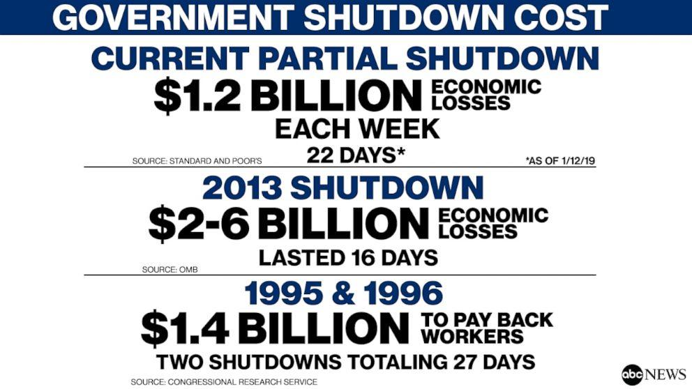

## Table of Contents

## What is a government shutdown?

A government shutdown happens when the government runs out of money to pay for its services. This occurs if the leaders in Congress cannot agree on a budget or a temporary funding plan before the current funding runs out. When this happens, many government services stop, and some workers who are not considered essential have to stay home without pay until the issue is resolved.

During a shutdown, essential services like the military, police, and emergency services keep working, but they might not get paid on time. Other services, like national parks, might close, and programs like food assistance might be affected. A shutdown can last from a few days to several weeks, depending on how quickly Congress can agree on a new budget or funding plan.

## How does a government shutdown occur?

A government shutdown happens when the government doesn't have enough money to keep running its services. This usually happens because the people in Congress can't agree on a budget or a temporary plan to keep the government funded. The budget is like a plan for how the government will spend its money, and it needs to be approved before the old one runs out. If they can't agree, the money runs out, and the government has to stop some of its work.

When the money runs out, many government workers who are not essential have to stay home without pay. Essential workers, like those in the military, police, and emergency services, keep working but might not get paid right away. Services like national parks might close, and programs that help people with food or other needs might be affected. A shutdown can last a few days or even weeks, depending on how fast Congress can agree on a new budget or funding plan.

## What are the immediate effects of a government shutdown on the economy?

When the government shuts down, it can hurt the economy right away. Many government workers who are not essential have to stay home without pay. This means they have less money to spend on things like food, gas, and other stuff they need. When people spend less money, businesses make less money, and this can slow down the whole economy. Also, some businesses that rely on government services, like those that work with national parks or government contracts, might have to close or cut back on their work.

Another immediate effect is that some important government services might stop or slow down. For example, if the government is not processing loans or benefits like food assistance, people who need these services might struggle more. This can make life harder for many families and can also affect the economy because people have less money to spend. Plus, if investors and businesses see the government shutting down, they might worry about the future and be less likely to invest or spend money, which can make the economic slowdown even worse.

## Which government services are typically affected during a shutdown?

During a government shutdown, many services that people rely on every day can be affected. Services like national parks might close, which means people can't visit them. Programs that help people with food, like SNAP (food stamps), might not work as well, making it harder for families to get the food they need. Also, things like passport processing and other government paperwork might slow down or stop completely, which can be frustrating for people who need these services.

Some government workers, who are not considered essential, have to stay home without pay. This means they can't do their jobs, and the services they provide stop. On the other hand, essential workers like those in the military, police, and emergency services keep working, but they might not get paid on time. This can cause problems for them and their families, as they might struggle to pay their bills without their regular paychecks.

## How do government shutdowns impact federal employees?

Government shutdowns have a big effect on federal employees. Many federal workers who are not considered essential have to stay home without pay during a shutdown. This means they can't go to work and they don't get their usual paychecks. This can be really hard for them because they still have to pay for things like rent, food, and bills, but they don't have any money coming in.

Essential federal employees, like those in the military, police, and emergency services, have to keep working even during a shutdown. But, just like the non-essential workers, they might not get paid on time. This can be stressful because they are still doing their important jobs, but they don't know when they will get their next paycheck. Once the shutdown is over, they usually get paid for the time they worked, but waiting can be tough on them and their families.

## What are the long-term economic consequences of a government shutdown?

A government shutdown can have big effects on the economy that last a long time. When the government shuts down, it stops spending money on many things, which means less money is going into the economy. This can slow down businesses and make people less likely to spend money. If the shutdown lasts a long time, it can hurt businesses so much that they have to lay off workers or even close down. This can lead to higher unemployment and make it harder for the economy to grow after the shutdown is over.

Also, a government shutdown can make people lose trust in the government. If people see that the government can't agree on a budget and has to shut down, they might worry about the future. This can make them less likely to invest in things like buying a house or starting a business. Investors and businesses might also be less likely to put money into the economy because they are worried about what might happen next. All of this can slow down the economy for a long time, even after the shutdown ends.

## How do government shutdowns affect small businesses?

Government shutdowns can really hurt small businesses. When the government shuts down, many federal workers don't get paid. This means they have less money to spend at local shops and restaurants. Small businesses that rely on these customers can see their sales drop a lot. Also, if a small business has a contract with the government, they might not get paid on time, which can make it hard for them to pay their own bills and keep their business running.

Another way shutdowns affect small businesses is by causing uncertainty. When the government is closed, people might worry about the future and spend less money. This can make it hard for small businesses to plan and grow. If the shutdown lasts a long time, some small businesses might have to lay off workers or even close down. This can hurt the local economy and make it harder for the community to recover after the shutdown ends.

## What role does political negotiation play in resolving a government shutdown?

Political negotiation is really important for ending a government shutdown. When the government shuts down, it's because the leaders in Congress can't agree on a budget or a temporary plan to keep the government running. To fix this, they have to talk and work together to find a solution. This means they need to negotiate, which is like trying to make a deal where both sides can agree. Sometimes this can take a long time because everyone has different ideas about what should be in the budget.

The success of these negotiations depends on how well the leaders can work together and compromise. If they can find common ground and agree on a plan, the shutdown can end quickly. But if they can't agree, the shutdown might last a long time. During this time, people and businesses suffer, so there's a lot of pressure on the leaders to come to an agreement. In the end, it's all about talking, listening, and finding a way to move forward together.

## Can you provide examples of past government shutdowns and their economic impacts?

One big government shutdown happened in 2013 and lasted for 16 days. During this time, many federal workers had to stay home without pay, and national parks were closed. The economy lost about $2 billion because people were spending less money. Small businesses near national parks lost a lot of money because they had fewer customers. After the shutdown, the government paid the workers for the time they missed, but the economy took a while to get back to normal.

Another long government shutdown happened from December 2018 to January 2019 and lasted for 35 days. This was the longest shutdown in U.S. history. Many federal workers, including those in the TSA and the Coast Guard, had to work without pay. This caused problems at airports and made travel harder. The economy lost about $11 billion, and small businesses near government offices saw fewer customers. After the shutdown, the government paid the workers, but it took time for the economy to recover from the slowdown.

These shutdowns show how much a government shutdown can hurt the economy. When federal workers don't get paid, they spend less money, which affects businesses and slows down the economy. It also shows how important it is for leaders in Congress to work together and agree on a budget to keep the government running smoothly.

## How do government shutdowns influence public perception and trust in government?

Government shutdowns can make people feel really unhappy with the government. When the government shuts down, it shows that the leaders can't agree on important things like the budget. This makes people think that the government is not working well and can't take care of the country's needs. People might feel frustrated and lose trust in the government because they see it as unable to solve problems and keep things running smoothly.

The longer a shutdown lasts, the more it can hurt how people see the government. When people can't get the services they need, like help with food or visiting national parks, they might feel let down. This can make them less likely to trust the government in the future. Also, seeing the government struggle to work together can make people feel like the leaders are more interested in fighting than helping the country, which can make trust in the government even worse.

## What economic indicators are most affected by government shutdowns?

Government shutdowns can hurt many parts of the economy, and some economic indicators show this more clearly. One big indicator is Gross Domestic Product (GDP). When the government shuts down, it stops spending money on many things, which means less money is going into the economy. This can make the GDP go down because the economy is not growing as fast. Another important indicator is unemployment. During a shutdown, some businesses might have to lay off workers because they are not making as much money. This can make the unemployment rate go up, which is bad for the economy.

Another economic indicator affected by shutdowns is consumer spending. When federal workers don't get paid, they have less money to spend on things they need, like food and gas. This means businesses make less money, and the whole economy slows down. Also, the stock market can be affected. When people see the government shutting down, they might worry about the future and sell their stocks, which can make stock prices go down. All these indicators show how a government shutdown can cause big problems for the economy.

## What preventive measures can be implemented to avoid future government shutdowns?

To avoid future government shutdowns, leaders in Congress need to work together better. They should talk more often and try to find common ground before the budget deadline comes. This means they need to be ready to compromise and not wait until the last minute to make a deal. If they can agree on a budget earlier, the government can keep running without any problems. Also, having backup plans, like temporary funding bills, can help keep the government open while they keep working on a full budget.

Another way to prevent shutdowns is by making the budget process clearer and easier to understand. If everyone knows what's going on and why certain decisions are being made, it can be easier to agree on a budget. Congress could also set rules to make sure they finish the budget on time, like penalties for missing deadlines. By making the budget process smoother and more cooperative, the government can avoid the stress and problems that come with shutdowns.

## References & Further Reading

[1]: Hendershott, T., Jones, C. M., & Menkveld, A. J. (2011). ["Algorithmic Trading and Information."](https://onlinelibrary.wiley.com/doi/full/10.1111/j.1540-6261.2010.01624.x) The Journal of Finance, 66(1), 1-33.

[2]: Kirilenko, A. A., Kyle, A. S., Samadi, M., & Tuzun, T. (2017). ["The Flash Crash: The Impact of High-Frequency Trading on an Electronic Market."](https://onlinelibrary.wiley.com/doi/abs/10.1111/jofi.12498) The Journal of Finance, 72(3), 967-998.

[3]: Congressional Research Service (CRS), Report RL34680. ["Federal Funding Gaps: A Brief Overview."](https://crsreports.congress.gov/product/pdf/RS/RS20348) 

[4]: Congressional Budget Office (CBO). (2019). ["The Effects of the Partial Shutdown Ending in January 2019."](https://www.cbo.gov/system/files/2019-01/54937-PartialShutdownEffects.pdf)

[5]: Lopez de Prado, M. (2018). ["Advances in Financial Machine Learning."](https://books.google.com/books/about/Advances_in_Financial_Machine_Learning.html?id=oU9KDwAAQBAJ) Wiley.

[6]: Aronson, D. R. (2006). ["Evidence-Based Technical Analysis: Applying the Scientific Method and Statistical Inference to Trading Signals."](https://www.amazon.com/Evidence-Based-Technical-Analysis-Scientific-Statistical/dp/0470008741) Wiley.

[7]: Jansen, S. (2018). ["Machine Learning for Algorithmic Trading."](https://books.google.com/books/about/Hands_On_Machine_Learning_for_Algorithmi.html?id=tx2CDwAAQBAJ) Packt Publishing.

[8]: Chan, E. P. (2009). ["Quantitative Trading: How to Build Your Own Algorithmic Trading Business."](https://github.com/ftvision/quant_trading_echan_book) Wiley.