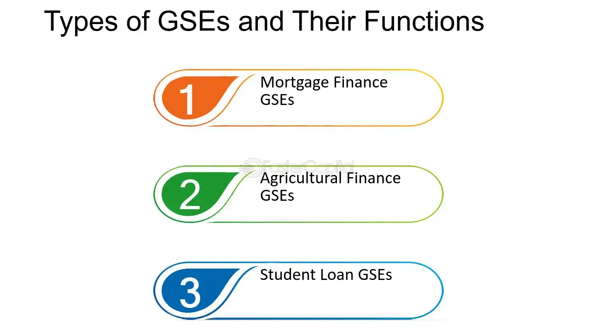

## Table of Contents

## What is a Government-Sponsored Enterprise (GSE)?

A Government-Sponsored Enterprise (GSE) is a type of financial organization created by the U.S. government to improve the flow of credit and support certain sectors of the economy. These enterprises are set up to provide financial services, like loans and mortgages, that might be hard for people to get from regular banks. They focus on areas like housing and agriculture, helping people buy homes or farmers get loans for their businesses.

Even though GSEs are created by the government, they are not fully owned by it. They operate as private companies but have special benefits, like lower borrowing costs, because of their government connection. Examples of GSEs include Fannie Mae and Freddie Mac, which help people get home loans. This setup helps the government support important parts of the economy without directly spending a lot of money.

## What are some examples of GSEs in the United States?

In the United States, some well-known examples of Government-Sponsored Enterprises (GSEs) are Fannie Mae and Freddie Mac. These two GSEs focus on the housing market. They help people buy homes by buying mortgages from banks and then selling them to investors. This makes it easier for banks to lend money to more people who want to buy homes.

Another example is the Federal Home Loan Banks (FHLBs). There are several of these banks across the country, and they help other banks and financial institutions get money to lend for housing. They do this by providing low-cost loans to these institutions, which then use the money to make more home loans.

The Farm Credit System is another GSE that helps farmers and ranchers. It provides loans and other financial services to people in agriculture. This helps them buy land, equipment, and other things they need to run their farms. These GSEs play a big role in supporting important parts of the economy like housing and agriculture.

## How are GSEs different from private companies?

GSEs are different from private companies because they were created by the government to help certain parts of the economy, like housing and farming. They get special help from the government, like lower borrowing costs, which makes it easier for them to do their work. This is not something private companies get. GSEs focus on helping people get loans for things like buying a home or running a farm, while private companies usually focus on making money for their owners.

Even though GSEs operate like private companies and are not fully owned by the government, they have a special connection to the government. This connection gives them more trust from people and lets them do things that private companies might find harder to do. For example, GSEs can help make sure more people can get home loans by buying those loans from banks and selling them to investors. Private companies do not have this kind of support and have to work harder to make money without government help.

## What is the primary purpose of a GSE?

The main goal of a Government-Sponsored Enterprise (GSE) is to help parts of the economy that the government thinks are important, like housing and farming. GSEs do this by making it easier for people to get loans. For example, they can help someone buy a home by buying the loan from a bank and then selling it to investors. This way, banks can lend more money to more people who want to buy homes.

GSEs are different from regular companies because they get special help from the government. This help makes it cheaper for GSEs to borrow money, which lets them do more to support the economy. Even though GSEs work like private companies, their special connection to the government helps them do things that private companies might find harder to do. This setup helps the government support important parts of the economy without spending a lot of money directly.

## How are GSEs funded?

GSEs get their money from borrowing and selling securities. They borrow money from investors by selling bonds and other financial products. These bonds are seen as safe because GSEs have a special connection to the government. This connection makes investors feel more confident about lending money to GSEs, which means GSEs can borrow at lower interest rates than regular companies.

GSEs also make money by buying loans from banks and then selling them to investors. For example, they might buy home loans from banks and package them into securities that they sell to investors. This helps GSEs keep their money flowing and helps banks lend more money to people who want to buy homes or run farms. This way, GSEs can keep supporting important parts of the economy without needing direct money from the government.

## What role do GSEs play in the economy?

GSEs help the economy by making it easier for people to get loans for important things like buying a home or running a farm. They do this by buying loans from banks and then selling them to investors. This way, banks can lend more money to more people. GSEs focus on areas like housing and farming, which are important for the economy. By helping people in these areas, GSEs make sure that more people can buy homes or start farming, which helps the economy grow.

GSEs are different from regular companies because they get special help from the government. This help makes it cheaper for GSEs to borrow money, which lets them do more to support the economy. Even though GSEs work like private companies, their special connection to the government gives them more trust from people and investors. This setup helps the government support important parts of the economy without spending a lot of money directly.

## What are the benefits of GSEs to the public?

GSEs help people by making it easier to get loans for buying a home or running a farm. They do this by buying loans from banks and then selling them to investors. This way, banks can lend more money to more people. For example, if you want to buy a house, a GSE like Fannie Mae or Freddie Mac might buy your loan from the bank. This helps the bank have more money to lend to other people who want to buy homes. This makes it easier for more people to become homeowners.

GSEs also help the economy by supporting important areas like housing and farming. When more people can buy homes or start farming, it helps the economy grow. GSEs get special help from the government, like lower borrowing costs, which lets them do more to help people. This special help makes it easier for GSEs to support the economy without the government spending a lot of money directly. So, GSEs play a big role in making sure that important parts of the economy keep working well.

## What are the risks associated with GSEs?

GSEs can be risky because they borrow a lot of money to do their work. If something goes wrong, like a lot of people can't pay back their loans, GSEs might lose money. This can make it hard for them to pay back what they borrowed. Because GSEs have a special connection to the government, people might think the government will help them if they get into trouble. This can make GSEs take more risks than they should, thinking they won't fail.

Another risk is that if GSEs get into big trouble, it could affect the whole economy. If a GSE fails, it might make people lose trust in the financial system. This could make it harder for people to get loans, which can slow down the economy. The government might need to step in to help, which could cost a lot of money. So, while GSEs help many people, they also [carry](/wiki/carry-trading) risks that could have big effects on everyone.

## How are GSEs regulated by the government?

The government keeps an eye on GSEs to make sure they are doing their job right and not taking too many risks. There are special agencies set up to watch over GSEs. For example, the Federal Housing Finance Agency (FHFA) looks after Fannie Mae and Freddie Mac. These agencies make rules that GSEs have to follow, like how much money they can borrow and what kind of loans they can buy. This helps make sure GSEs are helping people get loans safely and not putting the whole economy in danger.

If a GSE gets into trouble, the government can step in to help. This is because GSEs have a special connection to the government, and the government wants to make sure they keep supporting important parts of the economy like housing and farming. The government can give GSEs money or take over their management if needed. This way, the government tries to keep GSEs stable and make sure they keep helping people get loans without causing big problems for the economy.

## What impact do GSEs have on financial markets?

GSEs play a big role in financial markets by making it easier for people to get loans for things like buying a home or running a farm. They do this by buying loans from banks and then selling them to investors. This helps banks have more money to lend to other people. When GSEs buy and sell these loans, it helps keep the money flowing in the financial markets. This can make the markets more stable because it helps more people get the money they need.

However, GSEs can also bring risks to the financial markets. Because they borrow a lot of money to do their work, if something goes wrong, like a lot of people can't pay back their loans, GSEs might lose money. This could make it hard for them to pay back what they borrowed. Since GSEs have a special connection to the government, people might think the government will help them if they get into trouble. This can make GSEs take more risks than they should, which could affect the whole financial market if they fail.

## What controversies or criticisms have been associated with GSEs?

GSEs have been criticized because some people think they take too many risks. They borrow a lot of money to help people get loans, but if a lot of people can't pay back their loans, GSEs might lose money. This could make it hard for them to pay back what they borrowed. Because GSEs have a special connection to the government, people might think the government will help them if they get into trouble. This can make GSEs feel safe to take more risks than they should, which could be bad for the economy if they fail.

Another criticism is that GSEs get special help from the government, like lower borrowing costs. Some people think this is not fair to private companies that don't get this help. They say it gives GSEs an advantage in the market, which can make it harder for private companies to compete. This special help can also make GSEs too important to fail, which means the government might have to spend a lot of money to save them if they get into big trouble.

## How have GSEs evolved over time, and what might their future look like?

GSEs have changed a lot since they started. At first, they were made to help people get loans for important things like buying homes or running farms. Over time, they grew bigger and started doing more things. For example, during the 2008 financial crisis, the government had to help Fannie Mae and Freddie Mac because they were in big trouble. After that, the government put them under more control to make sure they didn't take too many risks. Now, GSEs still help people get loans, but they have to follow more rules to stay safe.

In the future, GSEs might keep changing to meet new needs. The government might make more rules to make sure they don't cause big problems again. Some people think GSEs should do less and let private companies do more. Others think GSEs are still important for helping people get loans. Whatever happens, GSEs will probably keep playing a big role in the economy, but they might have to work in new ways to stay safe and helpful.

## References & Further Reading

[1]: Bergstra, J., Bardenet, R., Bengio, Y., & Kégl, B. (2011). ["Algorithms for Hyper-Parameter Optimization."](https://dl.acm.org/doi/10.5555/2986459.2986743) Advances in Neural Information Processing Systems 24.

[2]: ["Advances in Financial Machine Learning"](https://www.amazon.com/Advances-Financial-Machine-Learning-Marcos/dp/1119482089) by Marcos Lopez de Prado

[3]: ["Evidence-Based Technical Analysis: Applying the Scientific Method and Statistical Inference to Trading Signals"](https://www.amazon.com/Evidence-Based-Technical-Analysis-Scientific-Statistical/dp/0470008741) by David Aronson

[4]: ["Machine Learning for Algorithmic Trading"](https://github.com/stefan-jansen/machine-learning-for-trading) by Stefan Jansen

[5]: ["Quantitative Trading: How to Build Your Own Algorithmic Trading Business"](https://books.google.com/books/about/Quantitative_Trading.html?id=j70yEAAAQBAJ) by Ernest P. Chan