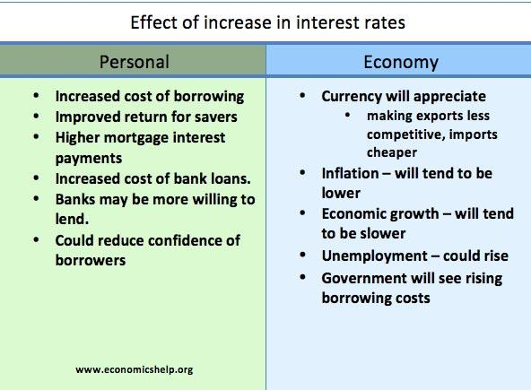

## Table of Contents

## What is inflation and why is it a concern for governments?

Inflation is when the prices of things we buy, like food and clothes, go up over time. It means that the money we have can buy less stuff than before. Imagine if a candy bar costs $1 now, but next year it costs $1.10. That's inflation. It happens because the amount of money in the economy grows faster than the stuff we can buy with it.

Governments worry about inflation because it can make life harder for people. When prices go up, people might not be able to afford what they need, like food or rent. This can lead to unhappiness and even protests. Also, if inflation is too high, it can make the country's money worth less compared to other countries' money. This can hurt businesses that sell things to other countries and make it harder for the government to manage the economy. So, governments try to keep inflation at a level that is not too high or too low.

## What are the common causes of inflation?

Inflation can happen for a few main reasons. One big reason is when there's too much money chasing too few goods. This can happen when the government prints more money or when people get more money to spend, maybe from raises or government help. When everyone has more money, they want to buy more stuff, but if there isn't enough stuff to go around, prices go up.

Another reason for inflation is when the costs of making things go up. This can happen if the price of raw materials like oil or metal goes up, or if workers want more pay. When it costs more to make things, businesses might raise their prices to cover these costs. This kind of inflation is called cost-push inflation.

Sometimes, inflation can also start because people expect prices to go up. If everyone thinks prices will be higher next month, they might buy things now before the prices go up. This rush to buy can push prices up even more. This is called demand-pull inflation, and it can keep going if people keep expecting prices to rise.

## How do governments measure inflation?

Governments measure inflation by looking at how much the prices of things people buy change over time. They use something called a Consumer Price Index (CPI). The CPI is like a big list of things people usually buy, like food, clothes, and gas. Every month, people check the prices of these things in different places and compare them to last month's prices. If the prices are higher, it means there's inflation.

Sometimes, governments also use other ways to measure inflation. One way is the Producer Price Index (PPI), which looks at the prices businesses pay for things they need to make their products. Another way is the GDP Deflator, which looks at the prices of all the things made in a country. These different ways help governments understand inflation better and make good decisions about the economy.

## What are the basic tools governments use to combat inflation?

Governments have a few main ways to fight inflation. One way is by using something called monetary policy. This is when the central bank, like the Federal Reserve in the U.S., changes how much money is in the economy. They can do this by raising interest rates. When interest rates go up, borrowing money becomes more expensive. This means people and businesses might spend less, which can slow down the economy and help stop prices from going up so fast.

Another way governments fight inflation is through fiscal policy. This means they can change how much they spend and how much they tax. If the government spends less money or raises taxes, there's less money for people to spend. This can also help slow down the economy and reduce inflation. Sometimes, the government might use both monetary and fiscal policies together to keep inflation under control.

## Can you explain how monetary policy helps in controlling inflation?

Monetary policy helps control inflation by changing how much money is available in the economy. When there's too much money, people spend more, and prices go up. So, the central bank can raise interest rates to make borrowing money more expensive. When borrowing costs more, people and businesses borrow less and spend less. This slows down the economy a bit and helps stop prices from rising so fast.

Another way monetary policy works is by controlling the money supply directly. The central bank can do things like selling government bonds to take money out of the economy. When people buy these bonds, they give their money to the central bank, so there's less money for them to spend. This also helps to slow down spending and keep inflation in check. By using these tools, the central bank can manage how fast prices are going up and keep the economy stable.

## What role does fiscal policy play in managing inflation?

Fiscal policy helps manage inflation by changing how much the government spends and how much it taxes. When the government wants to slow down inflation, it can spend less money. When the government spends less, there's less money going into the economy. This means people and businesses have less money to spend, which can help stop prices from going up so fast.

The government can also raise taxes to fight inflation. When taxes go up, people have less money to spend. With less money to spend, people buy fewer things, which can help slow down the economy and keep prices from rising too quickly. By using these tools, the government can help control inflation and keep the economy stable.

## How do supply-side policies help in reducing inflationary pressures?

Supply-side policies help reduce inflation by making it easier for businesses to produce more goods and services. When businesses can make more stuff, there's more for people to buy. If there's more of something, the price usually goes down because there's not as much competition to buy it. Governments can help by lowering taxes on businesses or making it easier to start new ones. This can lead to more production, which means more supply and less pressure on prices to go up.

Another way supply-side policies help is by improving how efficiently things are made. Governments can invest in things like better roads, ports, or technology that help businesses work better. When businesses can make things more cheaply, they don't have to raise prices as much. This can keep inflation lower because the cost of goods doesn't go up as fast. By focusing on increasing supply and improving efficiency, supply-side policies can help keep prices stable and fight inflation.

## What are the potential impacts of inflation control measures on economic growth?

When governments try to control inflation, it can affect how fast the economy grows. If the government raises interest rates or taxes to slow down inflation, it can make people and businesses spend less. When people spend less, businesses might sell fewer things and make less money. This can slow down the economy because businesses might not want to grow or hire more people. So, while these measures can help keep prices from going up too fast, they can also make the economy grow more slowly.

On the other hand, if inflation is very high and out of control, trying to stop it can actually help the economy in the long run. High inflation can make people unsure about the future, and this uncertainty can stop them from spending and investing. By using measures to control inflation, the government can make people feel more confident about the economy. When people feel more confident, they might spend and invest more, which can help the economy grow over time. So, while controlling inflation might slow things down at first, it can lead to a stronger, more stable economy later on.

## How do governments balance inflation control with unemployment rates?

Governments have to balance controlling inflation with keeping unemployment low. When they raise interest rates to fight inflation, it can make borrowing money more expensive. This can slow down the economy because people and businesses might spend less. If businesses spend less, they might not need as many workers, which can lead to higher unemployment. So, if the government tries too hard to stop inflation, it might cause more people to lose their jobs.

On the other hand, if the government does nothing about inflation, prices can keep going up. When prices go up too fast, it can make people feel unsure about the future. This uncertainty can make people spend less and businesses invest less, which can also lead to higher unemployment. So, governments need to find a middle ground. They need to control inflation enough to keep prices stable, but not so much that it hurts the economy and causes more people to lose their jobs. It's a tricky balance, but it's important for keeping the economy healthy.

## What are some advanced strategies used by governments to predict and preempt inflation?

Governments use fancy computer models to predict inflation. These models look at a lot of different things, like how much people are spending, how much businesses are making, and even things like the weather that can affect food prices. By putting all this information together, the models can guess what might happen to prices in the future. Governments also look at what's happening in other countries because what happens there can affect prices at home. If they see prices going up in another country, they might start to get ready for inflation at home.

Sometimes, governments use something called "forward guidance" to help stop inflation before it starts. This is when the central bank tells everyone what it plans to do about interest rates in the future. If people know that the central bank might raise rates if prices start to go up, they might be more careful about spending too much. This can help keep prices from rising too fast. Governments also keep a close eye on what businesses and workers are doing. If they see that businesses are planning to raise prices or workers are asking for higher wages, they might step in early to stop inflation from getting out of control.

## How do international factors influence a government's ability to control inflation?

International factors can make it harder for a government to control inflation. For example, if the price of oil goes up in another country, it can make things more expensive at home because we need oil to make and move stuff. Also, if other countries' money gets stronger compared to our money, it can make things we buy from them more expensive. This can push up prices even if the government is trying to keep them down. So, what happens in other countries can affect our prices and make it trickier for the government to manage inflation.

Sometimes, the government has to think about what other countries are doing with their money. If a lot of countries are raising their interest rates, our government might have to do the same to keep our money from getting too weak. This can help stop prices from going up too fast, but it can also slow down our economy. It's like a big puzzle where what one country does can change what other countries need to do to keep their prices stable.

## What are the long-term versus short-term effects of different inflation control strategies?

In the short term, when governments try to control inflation, they often raise interest rates or cut spending. This can make borrowing money more expensive, so people and businesses spend less. When they spend less, prices might not go up as fast, which helps stop inflation. But this can also slow down the economy right away. Businesses might sell less and might not hire as many people, which can lead to higher unemployment. So, in the short term, fighting inflation can make things tough for people and businesses.

In the long term, controlling inflation can be good for the economy. If inflation stays high for a long time, it can make people feel unsure about the future. They might spend less and businesses might not want to invest in new things. By keeping inflation under control, the government can make people feel more confident. When people feel good about the future, they might spend and invest more, which can help the economy grow over time. So, even though fighting inflation might hurt in the short term, it can lead to a stronger, more stable economy in the long run.

Different strategies can have different effects. For example, using monetary policy like raising interest rates can have a quick impact on inflation but might slow down the economy more in the short term. On the other hand, using fiscal policy like changing taxes and spending might take longer to affect inflation but could be less harsh on the economy right away. Governments have to think about both the short-term and long-term effects when choosing how to fight inflation, trying to find a balance that keeps prices stable without hurting the economy too much.

## References & Further Reading

[1]: Bordo, M. D., & Levin, A. T. (2017). ["Central Bank Digital Currency and the Future of Monetary Policy."](https://www.nber.org/papers/w23711) National Bureau of Economic Research.

[2]: Mishkin, F. S. (2019). ["The Economics of Money, Banking, and Financial Markets."](https://www.pearsonhighered.com/assets/preface/0/1/3/4/0134855388.pdf) Pearson.

[3]: Taylor, J. B. (1993). ["Discretion versus Policy Rules in Practice."](https://web.stanford.edu/~johntayl/Onlinepaperscombinedbyyear/1993/Discretion_versus_Policy_Rules_in_Practice.pdf) Carnegie-Rochester Conference Series on Public Policy.

[4]: Zhang, M., & Zhang, S. (2020). ["Machine Learning Algorithms for algo trading."](https://www.sciencedirect.com/science/article/pii/S0926337324010014) Computers & Electrical Engineering.

[5]: Keynes, J. M. (1936). ["The General Theory of Employment, Interest and Money."](http://keynes-general-theory.com/generaltheory.pdf) Palgrave Macmillan.