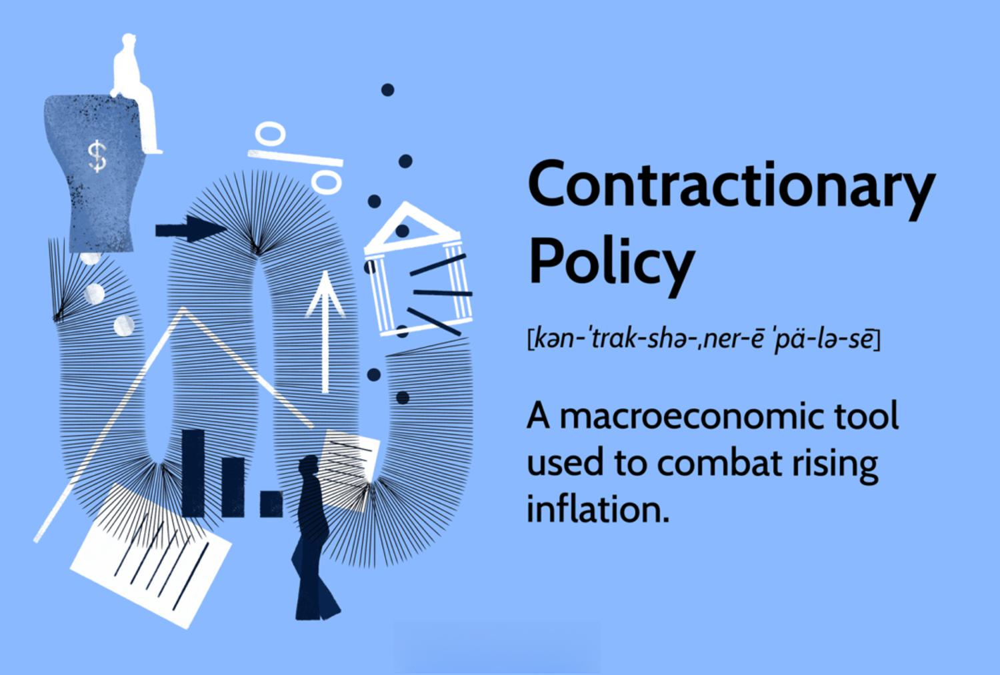

Economic policy plays a crucial role in maintaining the stability and growth of a nation's economy, and in recent years, inflation control has emerged as a primary focus for governments worldwide. Inflation, if unchecked, can erode purchasing power and destabilize economies, hence the importance of its effective management. Governments and central banks are employing various strategies to manage inflation, such as monetary policies, fiscal adjustments, and regulatory measures to ensure a stable economic environment. Central banks, for instance, often manipulate interest rates to regulate the money supply and control inflationary pressures. The relationship can be represented through the equation $M \times V = P \times Q$, where $M$ is the money supply, $V$ is the velocity of money, $P$ is the price level, and $Q$ is the real output, illustrating how changes in money supply can influence inflation.

Algorithmic trading, or algo trading, is a rapidly growing trend in financial markets, employing computer algorithms to execute trades at optimal speeds and prices, significantly enhancing the efficiency and precision of trading activities. This method utilizes data-driven approaches and often incorporates machine learning techniques to analyze market trends and execute strategies faster than human traders. Python libraries such as NumPy and Pandas are commonly used for data manipulation and analysis in this domain, allowing traders to implement complex algorithms quickly and accurately.



This article explores the intersection of economic policy, inflation control, and algorithmic trading, providing insights into how these components interact within modern financial systems. The convergence of traditional economic policies with advanced algorithmic strategies exemplifies the evolution of finance, enabling more dynamic responses to fluctuating economic conditions. Understanding the synergy between these elements is essential for policymakers, investors, and financial analysts as they navigate today's complex economic environment, highlighting the need for continuous adaptation and innovation to maintain economic stability and growth. 

The collaboration between economic theories and technological advancements in algorithmic trading presents a promising avenue for more effective inflation management and economic resilience. As global financial systems become increasingly interconnected, leveraging these strategic approaches will be critical in fostering sustainable economic development.

## Table of Contents

## The Importance of Inflation Control in Economic Policy

Inflation control is a fundamental component of economic policy, primarily because unchecked inflation can severely disrupt economic stability and lead to social unrest. High or accelerating inflation erodes consumer purchasing power, increases uncertainty, and diminishes the real value of money, affecting both households and businesses. When inflation is high, people's ability to purchase goods and services declines, resulting in diminished standards of living. Moreover, unpredictable inflation can discourage savings and investment, undermining economic growth.

Governments employ a range of tools, including both monetary and fiscal policy measures, to manage and mitigate inflationary pressures. Monetary policy is often the frontline defense against inflation. Central banks, like the Federal Reserve in the United States or the European Central Bank, use various instruments to influence inflation. One primary approach is altering interest rates. By raising interest rates, borrowing becomes more expensive, which tends to reduce spending and investment, thereby cooling down an overheating economy.

Central banks can also control the money supply through open market operations. By selling government bonds, they can absorb excess [liquidity](/wiki/liquidity-risk-premium) from the banking system, which tends to increase interest rates and curb inflation. Conversely, buying government bonds injects liquidity, lowering interest rates and potentially stimulating the economy if inflation is under control.

Fiscal policy, managed by the government, involves adjusting tax rates and government spending. Cutting taxes or increasing public spending can stimulate economic activity, often useful in combating deflationary pressures rather than inflationary ones. Conversely, raising taxes or cutting spending can help reduce aggregate demand, potentially easing inflationary pressure.

Effective inflation control is crucial in maintaining consumer purchasing power over the long term. When inflation is kept within acceptable parameters, savings tend to retain their value, and both consumers and businesses can plan for the future with greater certainty. This stability fosters an environment conducive to long-term investment, which is essential for sustainable economic growth.

Uncontrolled inflation can potentially spiral into hyperinflation, a scenario characterized by extremely rapid and out-of-control price increases. Hyperinflation can devastate an economy, eroding the public's confidence in the currency and leading to a breakdown in normal economic transactions. Such economic chaos can result in severe social and political consequences, exemplified by historical instances in countries like Zimbabwe and the Weimar Republic in Germany.

Thus, maintaining inflation at a moderate and predictable level is a key aim of economic policy, ensuring that the economy functions smoothly, public confidence in the currency remains intact, and the conditions necessary for economic growth and development are upheld. This underscores the significant role policymakers and central banks play in carefully balancing the economic levers at their disposal to manage inflation effectively.

## Government Strategies for Inflation Control

Governments utilize a variety of strategies to manage inflation, employing both monetary and fiscal policy measures to stabilize price levels and maintain economic balance. 

Monetary policy often serves as a primary tool for controlling inflation. By manipulating the money supply and interest rates, central banks aim to influence economic activity and maintain stable price levels. For instance, by raising interest rates, borrowing becomes more expensive, which tends to decrease consumer spending and investment, thus reducing inflationary pressures. Conversely, lowering interest rates can stimulate economic activity by making borrowing cheaper, potentially increasing inflation if not carefully managed. The effectiveness of these tactics relies heavily on accurate forecasting and timely adjustments to interest rates and money supply.

Fiscal policy is another essential mechanism for managing inflation. Governments may decide to alter tax rates and adjust public spending to influence the demand and supply dynamics within the economy. For example, reducing taxes can increase disposable income for consumers, boosting demand and potentially increasing inflation if not balanced by other measures. Conversely, increasing taxes can reduce disposable income and curb inflation by decreasing consumer demand. Similarly, government spending cuts can reduce demand within the economy, exerting downward pressure on inflation.

To enhance the effectiveness and predictability of these policies, many governments adopt policy frameworks such as inflation targeting. This approach involves setting explicit inflation rate objectives, typically communicated through a central bank. By announcing these targets, governments aim to manage public and market expectations regarding future inflation, thereby stabilizing consumption and investment behavior. Successful inflation targeting requires a transparent and responsive policy mechanism that can adapt to shifting economic conditions.

Global cooperation and coordination are increasingly important in managing inflation due to the interconnectedness of modern economies. International collaborations through forums such as the G20 or the International Monetary Fund can facilitate the sharing of best practices and coordination of policy measures, which helps mitigate global inflationary pressures. By aligning national policies with international frameworks, countries can collectively work toward stabilizing global economic conditions.

In summary, effective management of inflation requires a blend of monetary and fiscal policy interventions, transparent frameworks like inflation targeting, and international cooperation. These combined strategies are crucial for creating a stable economic environment that fosters sustainable growth and minimizes inflationary [volatility](/wiki/volatility-trading-strategies).

## The Role of Algorithmic Trading in Modern Financial Markets

Algorithmic trading, commonly known as algo trading, is a transformative force in contemporary financial markets, characterized by the employment of complex algorithms to execute trading decisions. This innovation enhances trading efficiency by enabling the rapid execution of intricate strategies which can react to market fluctuations within milliseconds. Such speed and precision are achieved through the use of high-frequency trading ([HFT](/wiki/high-frequency-trading-strategies)), a subset of algo trading, which leverages advanced computer systems and networks to transact a large number of orders at lightning speeds.

Algo trading is credited with minimizing human error and optimizing decision-making, as algorithmic models can continuously analyze market data to identify profitable opportunities. This automated approach provides enhanced liquidity and ensures fair pricing by reducing the bid-ask spread, which benefits both traders and the market. By enabling market participants to execute trades seamlessly and with greater accuracy, algo trading has contributed to the increased efficiency of financial systems worldwide.

Despite its advantages, algo trading has sparked concerns regarding market volatility. There is apprehension that automated systems could amplify price swings, potentially leading to financial instability. The "flash crash" phenomenon, where markets plunge precipitously and recover within a short time, is often attributed to the high-speed nature of algo trading. These events highlight the risks associated with the automation of trading activities and the potential for cascading effects in the market due to algorithmic errors or malfunctions.

Nevertheless, algo trading continues to expand as an integral component of the global financial landscape. Its growth is driven by the demand for improved trading performance and the proliferation of data analytics technologies, including [artificial intelligence](/wiki/ai-artificial-intelligence) and [machine learning](/wiki/machine-learning). These technologies enable the creation of more sophisticated models that can adapt to dynamic market conditions, thus reinforcing the role of [algorithmic trading](/wiki/algorithmic-trading) in fostering efficient and resilient financial markets.

As algo trading evolves, regulatory bodies are focusing on developing frameworks to mitigate associated risks, ensuring that the benefits of innovation are realized without compromising market stability. The ongoing challenge is to balance the rapid advancements in trading technology with necessary oversight to protect the integrity of global financial systems.

## Impact of Inflation on Algo Trading Strategies

Inflation affects algorithmic trading strategies primarily by altering asset prices, interest rates, and market volatility. These changes require traders to continuously adapt their algorithms to maintain performance and hedge against inflationary pressures.

Firstly, inflation directly impacts asset prices. As inflation rises, commodities like gold, oil, and other tangible goods often see increased demand as investors seek to preserve value. Algorithmic traders might adapt by incorporating inflation-sensitive assets into their portfolios. This involves adjusting algorithms to dynamically allocate investments in response to inflation indicators. For instance, traders could use [momentum](/wiki/momentum)-based strategies to capture trends in commodities during inflationary periods.

Interest rates, often adjusted by central banks to counter or control inflation, significantly influence trading strategies. An increase in interest rates typically leads to higher borrowing costs, potentially reducing consumer spending and business investment. Algorithmic strategies might incorporate [interest rate](/wiki/interest-rate-trading-strategies) forecasts to optimize bond trading or to adjust leverage in equity portfolios. A potential approach is using regression analysis to predict interest rate changes based on economic data, thereby allowing algorithms to preemptively reposition assets.

Market volatility often rises with inflation, presenting both challenges and opportunities for algorithmic trading. Increased volatility can lead to wider spreads and less predictable market movements, making it essential for algorithms to manage risk precisely. Volatility-based strategies, such as those using the VIX (Volatility Index) as a gauge, can help in adapting to these conditions by scaling position sizes or changing stop-loss limits. Incorporating machine learning models to forecast volatility can also enhance the adaptability of trading strategies.

Central bank policies and official inflation announcements are crucial for algorithmic traders. They offer data points that can trigger significant market movements. Many algotrading strategies incorporate event-driven algorithms designed to respond swiftly to these announcements. For example, a trader might code an algorithm in Python to monitor economic news feeds in real-time and execute trades based on predefined criteria or thresholds. Here is a simple Python snippet illustrating how an algorithm might monitor and react to such events:

```python
import requests
import datetime

def fetch_central_bank_announcements(api_endpoint):
    # Fetch announcements from a hypothetical economic events API
    response = requests.get(api_endpoint)
    return response.json()

def trade_based_on_inflation_data(inflation_data):
    if inflation_data['value'] > threshold:
        # Logic to adjust portfolio or execute trades
        execute_trade(order_type='sell', amount=100)

api_endpoint = "https://api.example.com/economic-events"
threshold = 2.5  # Set an inflation threshold

announcement_data = fetch_central_bank_announcements(api_endpoint)
today = datetime.date.today()

for data in announcement_data:
    if data['date'] == today and data['type'] == 'inflation':
        trade_based_on_inflation_data(data)
```

Successful algorithmic traders must integrate economic indicators with their models to enhance decision-making and risk management. This integration allows for better responses to changing economic conditions, ensuring that trading strategies remain robust and effective even amidst fluctuating inflation. By incorporating economic fundamentals into algorithmic systems, traders can create strategies that not only react to price changes but also anticipate them based on broader economic trends.

## Future Outlook: Aligning Economic Policy and Algo Trading

As financial markets evolve, the intersection of economic policy and algorithmic trading is expected to grow significantly deeper. This relationship is profoundly influenced by advancements in artificial intelligence (AI) and machine learning (ML), which are poised to enhance the capabilities of algorithmic trading systems in managing inflation-related risks. AI and ML enable these systems to parse vast datasets, recognize patterns, and make predictions about market trends with unprecedented speed and accuracy. They are also used to develop predictive models that adjust trading strategies dynamically in response to shifts in economic indicators, including inflation rates.

For effective governance of markets influenced by algorithmic trading, a collaborative effort between policymakers and financial institutions is crucial. Regulatory frameworks must be designed to ensure market stability and integrity, balancing innovation with risk management. This involves setting robust guidelines to prevent potential issues such as excessive volatility or unfair trading practices that could arise from automated systems. Furthermore, transparency and accountability in algorithmic operations need to be emphasized to maintain investor confidence.

Aligning algorithmic trading practices with economic policy goals is essential for creating a more resilient and efficient financial system. This means integrating macroeconomic indicators within algorithmic models, ensuring that trading activities reflect broader economic objectives such as sustainable growth and inflation control. When algorithms are aligned with policy directives, they can facilitate quicker market adjustments in response to policy changes, thus stabilizing markets.

The future outlook emphasizes the importance of continuous innovation and strategic alignment. This involves not only technological advancements in trading systems but also the development of cross-disciplinary knowledge among stakeholders such as policymakers, economists, and technologists. By maintaining an ongoing dialogue and fostering cooperation, the benefits of both economic policy and algorithmic trading can be harnessed to build a more robust global financial landscape.

Ultimately, a balanced approach that leverages the strengths of algorithmic trading while adhering to sound economic policy principles will be pivotal in navigating the complexities of modern financial markets. The integration of these domains promises not only to improve the efficiency and responsiveness of financial systems but also to support broader economic stability and growth.

## Conclusion

Inflation control is a critical element in fostering economic stability and growth. For governments, maintaining a predictable inflation rate is paramount to protecting consumer purchasing power and sustaining investor confidence. Algorithmic trading emerges as a potent tool in managing these financial market complexities. By leveraging sophisticated algorithms and real-time data analysis, traders can adapt to rapidly changing market conditions, potentially offering avenues to hedge against inflation-driven volatility. 

However, the integration of algorithmic trading brings forth challenges concerning regulation and market stability. Ensuring that these technologies operate within a robust regulatory framework is crucial to prevent potential adverse impacts, such as flash crashes or manipulative trading behaviors that could undermine market integrity.

A synergy between governmental strategies and cutting-edge trading technologies is vital for effective inflation management. Policymakers must engage in continuous discourse with economists and technologists to craft regulations that harness the benefits of algorithmic trading while mitigating risks. This ongoing dialogue is essential for aligning trading practices with broader economic policy goals.

Looking to the future, the thoughtful integration of economic policy and algorithmic trading holds promise for constructing a more resilient and efficient global financial system. By fostering collaboration across disciplines, stakeholders can ensure that these advancements contribute positively to economic stability and growth, paving the way for a robust financial landscape.

## References & Further Reading

[1]: Bordo, M. D., & Levin, A. T. (2017). ["Central Bank Digital Currency and the Future of Monetary Policy."](https://www.nber.org/papers/w23711) National Bureau of Economic Research.

[2]: Mishkin, F. S. (2019). ["The Economics of Money, Banking, and Financial Markets."](https://www.pearsonhighered.com/assets/preface/0/1/3/4/0134855388.pdf) Pearson.

[3]: Taylor, J. B. (1993). ["Discretion versus Policy Rules in Practice."](https://web.stanford.edu/~johntayl/Onlinepaperscombinedbyyear/1993/Discretion_versus_Policy_Rules_in_Practice.pdf) Carnegie-Rochester Conference Series on Public Policy.

[4]: Zhang, M., & Zhang, S. (2020). ["Machine Learning Algorithms for algo trading."](https://www.sciencedirect.com/science/article/pii/S0926337324010014) Computers & Electrical Engineering.

[5]: Keynes, J. M. (1936). ["The General Theory of Employment, Interest and Money."](http://keynes-general-theory.com/generaltheory.pdf) Palgrave Macmillan.