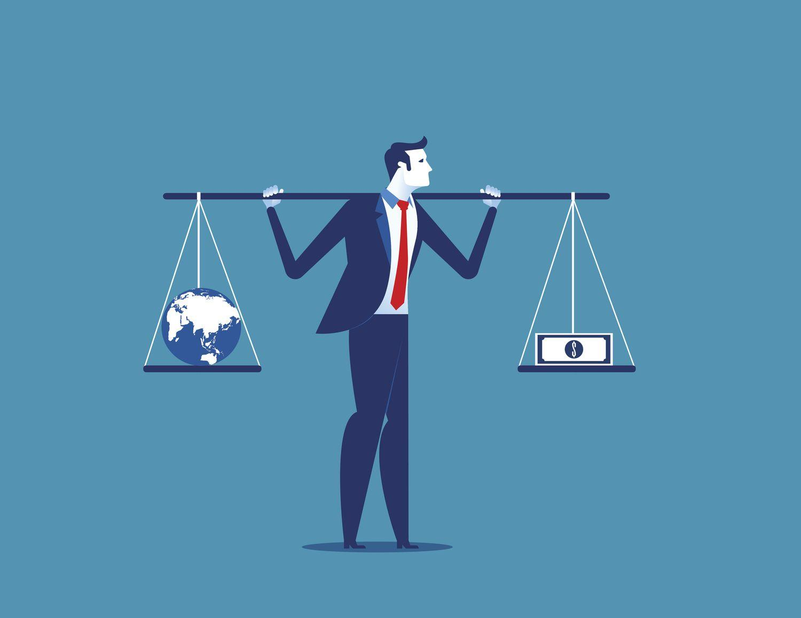

Economic policy, capitalism, government role, and algorithmic trading are pivotal concepts that shape contemporary financial and economic landscapes. **Economic policy** refers to the strategic decisions and actions undertaken by a government to influence its economy's functioning. These policies typically involve fiscal measures, such as taxation and government spending, and monetary measures, like interest rates and money supply. Economic policies serve to stabilize economies, foster growth, and minimize unemployment.

**Capitalism** is an economic system characterized by private ownership of capital goods, market-based allocation of resources, competitive markets, and profit motive. It promotes efficient allocation of resources and innovation due to competition but also necessitates regulations to maintain fairness and prevent market failures.

The **role of government** in capitalist economies is dual-faceted: as a regulator setting rules to ensure market efficiency and as a facilitator to provide services that markets do not efficiently provide, such as public goods. Governments craft economic policies to balance economic growth with social welfare, showcasing their crucial role in economic systems.

**Algorithmic trading** refers to the use of computer algorithms to automate trading decisions in financial markets. It involves complex mathematical models and the use of high-powered computing to execute trades at speeds and frequencies beyond human capability. Algorithmic trading has gained prominence due to its ability to enhance market efficiency and liquidity, reduce transaction costs, and manage large volumes of trade data.

Grasping the interplay between these elements is vital. Economic policies shape the functioning of capitalist markets, while the government's regulatory capacity influences trading practices, including algorithmic trading. Algorithmic trading, propelled by technological advances, impacts market liquidity and volatility, posing new challenges and opportunities for policy formulation.

This article aims to explore the dynamic interactions among economic policy, capitalism, government roles, and algorithmic trading, shedding light on how these factors collectively influence economic frameworks. The growing significance of algorithmic trading will be addressed, focusing on its implications for market operations. Subsequent sections will delve into understanding economic policies in capitalist systems, the nuanced role of the government, the impact of algorithmic trading, regulatory challenges, and future perspectives on economic policymaking in tech-driven economies. Understanding these intersections is crucial for developing adaptive policies that accommodate ongoing economic and technological transformations.

## Table of Contents

## Understanding Economic Policies in Capitalist Systems

Economic policy in a capitalist economy encompasses the strategic approaches and actions taken by a government to influence its nation's economic performance. The key objectives of economic policy within a capitalist framework include promoting efficient resource allocation, maintaining economic stability, fostering economic growth, and ensuring a fair distribution of income, although the latter often receives less emphasis compared to other objectives under capitalism.

The government plays a pivotal role in shaping economic policy through both monetary and fiscal policies. Monetary policy involves managing the nation's money supply and interest rates, primarily executed by a central bank, such as the Federal Reserve in the United States. These measures aim to control inflation, stabilize the currency, and achieve sustainable employment levels. Fiscal policy, on the other hand, entails the use of government spending and taxation to influence the economy. By adjusting tax rates and government spending, a government can stimulate economic growth or curb inflation during different phases of the business cycle.

Government policies profoundly impact capital markets and economic growth. For instance, expansionary monetary policy, which involves lowering interest rates, can reduce borrowing costs for businesses and consumers, leading to increased investment and consumption. This spurs economic growth and boosts capital markets as more funds flow into stocks and other financial instruments. Conversely, contractionary policies can have the opposite effect, slowing down growth to address inflationary pressures.

Successful economic policies in capitalist nations often balance the pursuit of growth, stability, and welfare. For example, during the late 20th century, the economic policies of the United States under President Ronald Reagan, known as "Reaganomics," implemented tax cuts, deregulation, and a reduction in government spending on domestic programs. These policies aimed to stimulate economic growth, which they achieved to some extent by encouraging private sector investment. However, they also sparked debates regarding income inequality and trade deficits.

Another example is Germany's social market economy, which combines free-market principles with social policies to safeguard a certain level of social welfare. This model has been successful in maintaining Germany's economic stability and growth while addressing social inclusion.

Balancing regulation and free-market forces is a nuanced aspect of economic policy. Excessive regulation can stifle innovation and efficiency, potentially hampering economic growth. Nevertheless, inadequate regulation can lead to market failures, as evidenced by the 2008 financial crisis, which stemmed from unregulated financial products and excessive risk-taking. Thus, finding an optimal balance is crucial to leveraging the benefits of capitalism while mitigating its potential downsides. This balance ensures that markets operate fairly and competitively while providing necessary protections against systemic risks.

## The Role of Government in Capitalist Economies

The role of government in capitalist economies involves a complex interplay between regulatory oversight and facilitation of economic activities. At its core, the government serves as both a regulator, establishing the rules and constraints necessary to ensure market integrity, and a facilitator, promoting conditions conducive to economic growth and innovation.

One of the primary challenges governments face is achieving a balance between economic growth and social welfare. Capitalist economies thrive on the principles of free-market competition and innovation. However, unregulated markets can lead to disparities in wealth and access to resources, prompting governmental action to address social equity. This balance is crucial, as excessive regulation can stifle economic activity, while too little regulation might result in social unrest and inequality.

Government intervention can significantly impact market efficiency and competition. Monetary and fiscal policies, such as [interest rate](/wiki/interest-rate-trading-strategies) adjustments and government spending, directly influence economic stability. For instance, during economic downturns, governments might lower interest rates or increase public spending to stimulate demand. However, these interventions must be carefully managed to avoid long-term negative consequences, such as inflation or debt accumulation.

There are several case studies that illustrate the significant influence of government actions on capitalist economies. The New Deal in the United States during the Great Depression is one such example, where government intervention through a series of programs and policies aimed to restore economic stability and confidence. Similarly, the deregulation efforts in various industries, such as telecommunications and energy, have shown how reducing government constraints can lead to increased competition and consumer benefits.

In dynamic global markets, governments face the challenge of crafting policies that are flexible and responsive to rapid technological and economic changes. The rise of digital currencies, for instance, necessitates new regulatory frameworks to manage the implications on traditional banking systems and monetary policy. Moreover, governments must consider the global nature of today’s economies, where international cooperation is often required to tackle issues such as climate change and international trade disputes.

In conclusion, the dual role of government as both regulator and facilitator is pivotal in ensuring a balanced approach that fosters economic growth while safeguarding social welfare. As economies continue to evolve, particularly with the integration of new technologies, governments must adapt their strategies to maintain efficiency, promote competition, and advance societal well-being.

## Capitalism and the Growth of Algorithmic Trading

Algorithmic trading refers to the use of computer algorithms to automatically make trading decisions, submit orders, and manage those orders after submission. These algorithms are pre-programmed with a set of rules to determine when to buy or sell, what quantities, and at what price points. In capitalist financial markets, where the aim is often to maximize profit through efficient decision-making processes, [algorithmic trading](/wiki/algorithmic-trading) has gained prominence due to its ability to quickly analyze large data sets and execute trades at speeds and frequencies unmatched by human traders.

Technological advancements, particularly in computing power, data processing capabilities, and communication speeds, have significantly facilitated the growth of algorithmic trading. High-frequency trading ([HFT](/wiki/high-frequency-trading-strategies)), a subset of algorithmic trading, exemplifies this evolution by leveraging state-of-the-art technology to enter and [exit](/wiki/exit-strategy) positions in fractions of a second. The rise of [machine learning](/wiki/machine-learning) and [artificial intelligence](/wiki/ai-artificial-intelligence) further enhances algorithmic trading strategies by allowing systems to learn from market data and improve decision-making processes over time.

The impact of algorithmic trading on market [liquidity](/wiki/liquidity-risk-premium) and [volatility](/wiki/volatility-trading-strategies) is a subject of extensive analysis. On one hand, algorithmic trading can enhance liquidity by narrowing bid-ask spreads and providing a steady stream of buy and sell orders, which contributes to market efficiency. On the other hand, its propensity to react to market movements can lead to increased volatility, particularly during periods of market stress. Events like the Flash Crash of May 6, 2010, highlighted the potential for algorithmic trading to contribute to dramatic swings in market prices.

The benefits associated with algorithmic trading include improved accuracy in trade execution, reduced transaction costs, and the ability to exploit market inefficiencies rapidly. However, these benefits come with risks such as system failures, the potential for exacerbated market disruptions, and regulatory challenges. The complexity of these algorithms can also make it difficult to anticipate their behavior under novel market conditions, leading to systemic risk.

Algorithmic trading strategies typically involve techniques such as statistical [arbitrage](/wiki/arbitrage), [market making](/wiki/market-making), [trend following](/wiki/trend-following), and mean reversion. Statistical arbitrage, for instance, attempts to exploit price discrepancies across correlated securities, while market making involves providing liquidity by continuously quoting buy and sell prices. These strategies operate optimally in capitalist environments where market transparency and competition prevail, allowing participants to leverage rapid information processing for profit maximization.

In conclusion, the rise of algorithmic trading within capitalist financial markets underscores the intersection of technological innovation and economic structures. While it offers considerable benefits in terms of efficiency and cost reduction, it also necessitates careful consideration of the risks and regulatory challenges it presents.

## Regulatory Challenges and Opportunities

Algorithmic trading, characterized by the use of computer algorithms to automate trading strategies, has introduced significant challenges and opportunities for financial market regulators worldwide. The complexities inherent in algorithmic trading arise from the high-speed nature of transactions and the sophisticated strategies employed, which can sometimes lead to unpredictable market behaviors.

One of the principal regulatory challenges is ensuring market stability while fostering an environment conducive to innovation. High-frequency trading (HFT), a subset of algorithmic trading, can amplify market volatility and has been implicated in incidents like the 2010 "Flash Crash." Regulators must navigate the delicate balance of mitigating such risks without hampering technological advancements that can drive efficiency and liquidity.

Effectively regulating algorithmic trading requires a nuanced approach that encompasses both domestic and international dimensions. On the domestic front, governments can implement stringent monitoring systems and require greater transparency in algorithmic strategies. Platforms such as circuit breakers and kill switches can be employed to halt trading in the event of erratic market movements. Implementing guidelines that mandate the disclosure of algorithmic strategies could also enhance market integrity.

International cooperation is crucial due to the global nature of financial markets. Disparate regulations across countries can create loopholes that traders exploit, undermining market fairness. Collaborative frameworks among international regulatory bodies can help establish coherent standards that address cross-border trading activity. The International Organization of Securities Commissions (IOSCO) plays a pivotal role in facilitating such cooperation by promoting uniform regulatory measures across different jurisdictions.

Adapting regulatory frameworks to keep pace with technological advancements presents another challenge. Rapid technological evolution requires regulators to be agile and forward-thinking. Machine learning and artificial intelligence (AI), increasingly integrated into trading systems, complicate oversight due to their capacity for autonomous decision-making and their opacity. Regulators might consider adopting technology-driven solutions themselves, such as real-time data analytics and machine learning tools, to enhance surveillance and enforcement capabilities.

Despite these challenges, algorithmic trading also presents opportunities to improve market oversight and ensure fair competition. Enhanced data collection and analysis can provide regulators with deeper insights into trading patterns and anomalies. Regulatory sandboxes offer a controlled environment where new trading technologies and strategies can be tested, allowing regulators and firms to understand their implications without the risk of market disruption.

In conclusion, while the complexity of algorithmic trading poses significant regulatory challenges, it also offers opportunities for innovation in market oversight. Through effective regulation, international cooperation, and the strategic adoption of technological tools, governments can foster a secure and competitive trading environment. This balanced approach not only safeguards market integrity but also encourages sustainable financial innovation.

## The Future of Economic Policy and Algorithmic Trading

## The Future of Economic Policy and Algorithmic Trading

The relationship between economic policy and algorithmic trading in capitalist systems is expected to undergo significant transformation. As algorithmic trading continues to influence financial markets, its interaction with economic policy warrants careful consideration.

### Potential Shifts in Government Roles and Regulatory Strategies

Governments may need to redefine their roles to address the complexities introduced by algorithmic trading. Traditional regulatory approaches might become insufficient as algorithmic trading leverages massive datasets and advanced computing power, operating at speeds incomprehensible to human traders. Consequently, there could be a shift towards more dynamic regulatory frameworks that incorporate real-time monitoring and machine learning to detect irregularities and prevent market abuse.

Furthermore, regulators might focus on ensuring transparency in trading algorithms to prevent systemic risks without stifling innovation. This may include requiring firms to disclose key aspects of their algorithms or limit the speed at which trades can be executed. Collaborative efforts between governments and private sectors could prove essential in addressing the transnational nature of financial markets influenced by algorithmic trading.

### The Evolving Relationship between Technological Innovation and Economic Policy-Making

The integration of cutting-edge technologies, such as distributed ledger technology and artificial intelligence, into economic policy-making could reshape the economic landscape. As these technologies become more prevalent, policymakers might incorporate them to enhance decision-making processes and improve regulatory efficiencies.

For instance, economic policies could increasingly utilize AI for predictive analytics, enabling more responsive and adaptive measures to economic changes. Moreover, blockchain could revolutionize transparency in financial activities, offering enhanced security and traceability, which are key concerns in algorithmic trading.

### Ethical Implications of Algorithmic Trading on Society and Economies

Algorithmic trading introduces several ethical considerations. The potential for exacerbating inequality is one such issue, as entities with access to advanced technologies and data can capitalize on market opportunities that less equipped participants cannot. This disparity could prompt debates on the fairness of financial markets and lead to calls for policies promoting more equitable access to trading technology.

Additionally, the replacement of human traders with machines may raise concerns about employment in the financial sector, triggering discussions on workforce displacement. Ethical trading guidelines and frameworks might become integral components of regulatory policies, guiding the responsible use of algorithmic technologies.

### Preparing for the Future of a Tech-Driven Capitalist Economy

To navigate a future characterized by fast-paced technological advancements, governments and financial institutions need to foster environments that encourage both innovation and responsible practice. Anticipating future trends, such as the potential for quantum computing to radically alter trading dynamics, will be essential for staying ahead of technological disruption.

Educational initiatives focusing on financial technology and its ethical implications could play a pivotal role in preparing the workforce for a tech-driven economy. Furthermore, fostering international cooperation in setting standards and sharing best practices will be vital to managing the global impacts of algorithmic trading.

In conclusion, the interplay between economic policy, algorithmic trading, and technological innovation will be crucial in shaping the future of capitalist economies. By adopting flexible, forward-thinking regulatory frameworks and promoting ethical considerations, policymakers can help ensure sustainable growth in this evolving landscape.

## Conclusion

In this article, we explored the complex interplay between economic policy, capitalism, government roles, and algorithmic trading, underscoring how these elements are deeply interconnected in shaping modern economies. Economic policies in capitalist systems not only set the stage for market operations but also influence the trajectory of financial markets where algorithmic trading has become increasingly significant. Governments, acting as both regulators and facilitators, face the challenging task of fostering growth while ensuring market stability and fairness.

Algorithmic trading, driven by technological advancements, has transformed financial markets, offering both opportunities and challenges. It enhances market liquidity and efficiency but also introduces risks that require vigilant oversight. The regulatory landscape must evolve alongside these technological shifts, balancing innovation with the need for robust market integrity.

The importance of adaptable and forward-thinking economic policies has been emphasized throughout the discussion, as these policies can leverage technological progress to achieve sustainable economic growth. As economies continue to change, driven by advancements in algorithmic trading and other technological innovations, policymakers must remain proactive to harness these developments effectively.

Continuing exploration of the interaction between economic policies and algorithmic trading is crucial. Ensuring that regulatory frameworks are not only responsive but also anticipatory will be vital in addressing the ethical implications and societal impacts of these technologies. Looking forward, a balanced approach that encourages innovation while safeguarding market principles will be essential for fostering a sustainable and equitable economic future in tech-driven capitalist economies.

## References & Further Reading

[1]: Shleifer, A., & Vishny, R. W. (1997). ["The Limits of Arbitrage."](https://onlinelibrary.wiley.com/doi/full/10.1111/j.1540-6261.1997.tb03807.x) The Journal of Finance, 52(1), 35-55.

[2]: Baker, D., Jackson, R., & Lin, J. (2005). ["Debunking the Myth of Free Market Dynamism: How Capitalism Can Work Better."](https://journals.sagepub.com/doi/10.1177/0164027511403159?icid=int.sj-abstract.citing-articles.74) Center for Economic and Policy Research.

[3]: Stiglitz, J. E. (2009). ["The Global Crisis, Social Protection and Jobs."](https://onlinelibrary.wiley.com/doi/abs/10.1111/j.1564-913X.2009.00046.x) International Labour Review, 148(1-2), 1-13.

[4]: Gomber, P., Arndt, B., Lutat, M., & Uhle, T. (2011). ["High-Frequency Trading."](https://papers.ssrn.com/sol3/papers.cfm?abstract_id=1858626) ZEW Discussion Paper No. 11-057, Center for European Economic Research.

[5]: LeBaron, B. (2001). ["A Builder's Guide to Agent-Based Financial Markets."](https://www.researchgate.net/publication/227623843_A_builder's_guide_to_agent-based_financial_markets) Quantitative Finance, 1(2), 254-261.