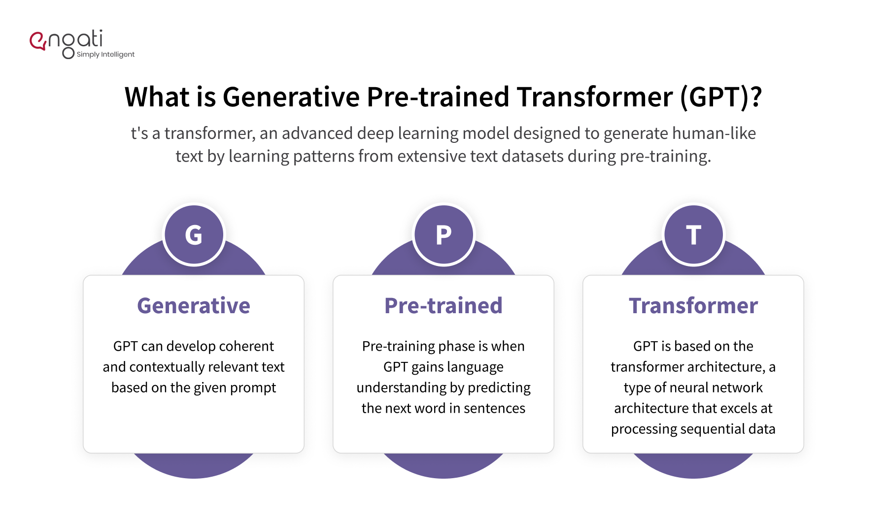

## Table of Contents

## What is a Generative Pre-Trained Transformer (GPT)?

A Generative Pre-Trained Transformer, or GPT, is a type of artificial intelligence model that can understand and generate human-like text. It works by learning patterns from a huge amount of text data. Once trained, it can predict what words should come next in a sentence, which helps it generate new text that sounds like it was written by a person. The "transformer" part of GPT refers to a specific kind of neural network architecture that is really good at handling sequences of data, like words in a sentence.

GPT models are trained in two main steps. First, they go through a pre-training phase where they learn from a large dataset, like books or internet text, to understand language. During this phase, the model learns to fill in missing words in sentences, which helps it grasp grammar and context. After pre-training, the model can be fine-tuned for specific tasks, like answering questions or writing stories. This fine-tuning uses smaller, task-specific datasets to make the model better at what it needs to do. Thanks to this process, GPT can be used for a wide range of applications, from chatbots to content creation.

## How does GPT differ from other AI models?

GPT models are different from other AI models because they focus a lot on understanding and making text that sounds like it was written by a person. They do this by using a special kind of neural network called a transformer, which is really good at understanding the order of words in sentences. This helps GPT models to understand context and create text that makes sense. Other AI models might use different kinds of neural networks, like recurrent neural networks (RNNs), which can also handle sequences but are not as good at capturing long-distance relationships between words as transformers are.

Another big difference is how GPT models are trained. They start with a pre-training phase where they learn from a huge amount of text, like books or internet articles. During this phase, they learn to predict missing words in sentences, which helps them understand grammar and context. After pre-training, they can be fine-tuned for specific tasks, like answering questions or writing stories. This two-step process makes GPT models very flexible and good at many different language tasks. Other AI models might not use this two-step process, or they might be trained for specific tasks from the start, which can make them less versatile.

## What are the main applications of GPT in everyday technology?

GPT models are used in many everyday technologies to help with tasks that involve understanding and creating text. One common use is in chatbots and virtual assistants, like Siri or Alexa. These assistants use GPT to understand what you're saying and give you helpful answers. For example, if you ask a question, the assistant can use GPT to figure out what you mean and give you a good response. Another use is in writing tools, where GPT can help you write emails, reports, or even stories by suggesting words or finishing sentences for you.

Another way GPT is used is in translation services. When you use an app to translate text from one language to another, GPT can help make the translation sound more natural and correct. It does this by understanding the context of the text and choosing the right words. Also, GPT is used in content creation, like writing news articles or social media posts. Companies can use GPT to quickly create lots of content that sounds like it was written by a person, which saves time and effort.

Lastly, GPT is used in search engines to improve how they understand and respond to your queries. When you type something into a search engine, GPT can help it understand what you're really looking for and give you better results. It can also help with autocomplete features, suggesting what you might type next based on what you've already written. This makes searching the internet faster and more accurate.

## Can you explain the training process of a GPT model?

The training process of a GPT model starts with a phase called pre-training. During pre-training, the model learns from a huge amount of text, like [books](/wiki/algo-trading-books) or internet articles. It tries to predict missing words in sentences. For example, if it sees a sentence like "The cat is on the ___," it will try to guess the missing word, like "roof" or "mat." This helps the model learn grammar and understand how words fit together in different contexts. The model keeps doing this over and over with lots of different sentences, getting better at predicting words each time.

After pre-training, the model goes through a phase called fine-tuning. In this phase, the model is trained on smaller, specific datasets that are related to the tasks it will do. For example, if the model will be used to answer questions, it will be trained on a dataset of questions and answers. During fine-tuning, the model learns to do the specific task better by adjusting its predictions based on the new data. This two-step process of pre-training and fine-tuning makes the GPT model very flexible and good at many different language tasks.

## What is the significance of 'pre-training' in GPT?

Pre-training is a really important part of how a GPT model learns to understand and create text. During pre-training, the model looks at a huge amount of text, like books or internet articles. It tries to guess missing words in sentences, which helps it learn how words fit together and understand grammar and context. This is like a kid learning to speak by hearing lots of conversations. The more text the model sees, the better it gets at predicting words and understanding language.

This pre-training phase is what makes GPT models so good at many different language tasks. It gives the model a strong base of knowledge about language before it starts working on specific jobs. After pre-training, the model can be fine-tuned for things like answering questions or writing stories, but it's the pre-training that makes it so flexible and powerful. Without pre-training, the model wouldn't be able to understand language as well or create text that sounds like it was written by a person.

## How does the transformer architecture work in GPT?

The transformer architecture in GPT helps the model understand and create text by looking at the whole sentence at once, instead of one word at a time. It does this using something called "self-attention," which lets the model see how different words in a sentence relate to each other. For example, if the sentence is "The cat is on the roof," the model can see that "roof" is important to "on" and "cat." This helps the model understand the sentence better and predict what words should come next.

Transformers are good at understanding long sentences because they can see relationships between words that are far apart. They use something called "positional encoding" to keep track of where each word is in the sentence. This helps the model know that "roof" comes after "on" and "cat," which is important for understanding the sentence. By using self-attention and positional encoding, the transformer architecture makes GPT models really good at understanding and creating text that sounds like it was written by a person.

## What are the ethical considerations when using GPT?

When using GPT, it's important to think about ethical issues. One big concern is that GPT can sometimes create text that is not true or is biased. This can happen because the model learns from the internet, where there can be a lot of wrong or unfair information. If people use GPT to write news articles or answer questions, they need to check the information to make sure it's correct and fair. Otherwise, they might spread false or biased information without knowing it.

Another ethical issue is privacy. When GPT is used to understand and create text, it might see private information that people don't want to share. Companies that use GPT need to be careful to protect this information and not use it in ways that could harm people. They should follow rules about data privacy and be open about how they use the data they collect. By thinking about these ethical issues, we can use GPT in a way that is safe and fair for everyone.

## How has the performance of GPT evolved across its versions?

The performance of GPT has gotten a lot better with each new version. The first version, called GPT-1, was good at understanding and creating text, but it had some problems. It could sometimes make mistakes or create text that didn't make sense. As the versions went on, like GPT-2 and GPT-3, the models got bigger and were trained on more data. This made them better at understanding context and creating text that sounds more like a person wrote it. For example, GPT-3 has a lot more parameters than GPT-1, which means it can understand and create more complex text.

One big change in the newer versions of GPT is how they handle different tasks. Earlier versions, like GPT-1, were good at one thing, like answering questions, but not as good at others, like writing stories. But with versions like GPT-3, the model can do many different tasks well. This is because the newer models have been trained on a wider variety of text and can be fine-tuned for specific jobs more easily. This makes them more flexible and useful for lots of different things, from helping with homework to writing news articles.

## What are the limitations of current GPT models?

Current GPT models, while very advanced, still have some limitations. One big issue is that they can sometimes create text that is not true or is biased. This happens because they learn from the internet, where there can be a lot of wrong or unfair information. If people use GPT to write news articles or answer questions, they need to check the information to make sure it's correct and fair. Otherwise, they might spread false or biased information without knowing it. Another problem is that GPT models can be tricked into saying things they shouldn't. For example, if someone asks the model to say something harmful or rude, it might do it if the request is worded in a clever way.

Another limitation is that GPT models can struggle with understanding long and complex texts. While they are good at looking at whole sentences at once, they can still miss important details or misunderstand the context if the text is very long or complicated. This can make them less useful for tasks that need a deep understanding of a lot of information, like summarizing a long report or answering questions about a detailed document. Also, GPT models use a lot of computer power and energy to run, which can make them expensive and not very good for the environment.

## How can businesses implement GPT in their operations?

Businesses can use GPT in many ways to make their work easier and better. One way is by using GPT in customer service. They can create chatbots that use GPT to talk to customers, answer their questions, and solve their problems. This can save time and money because the chatbot can handle many customers at once, and it never needs a break. Another way businesses can use GPT is in writing and content creation. They can use it to write emails, reports, or social media posts quickly and easily. This can help them share information with customers and employees faster and in a way that sounds like a person wrote it.

Another important use of GPT for businesses is in data analysis and understanding. GPT can help businesses understand what customers are saying in reviews or on social media. By looking at this information, businesses can learn what customers like and don't like, and make better decisions. GPT can also help with translating text into different languages, which can be useful for businesses that work with people from many different countries. By using GPT in these ways, businesses can work more efficiently and connect better with their customers.

## What advancements are expected in future versions of GPT?

Future versions of GPT are expected to get even better at understanding and creating text. They will be trained on even more data and will have more parameters, which will help them understand context and create text that sounds more like a person wrote it. They might also be better at handling different tasks, like answering questions, writing stories, and even understanding long and complicated texts. This could make them more useful for businesses and other organizations that need to understand and create a lot of text.

Another big advancement that might happen is making GPT models more ethical and fair. Future versions could be better at spotting and fixing false or biased information. They might also be better at protecting privacy and following rules about data use. This would make them safer and more trustworthy for everyone to use. By making these improvements, future GPT models could be even more helpful and reliable in many different situations.

## How does GPT handle different languages and cultural nuances?

GPT models can understand and create text in many different languages because they are trained on a lot of text from around the world. When someone uses GPT to translate text or talk to people in different languages, it tries to make the text sound natural and correct. It does this by learning how words fit together in different languages and understanding the context of the text. But, GPT can sometimes make mistakes, especially with languages it hasn't seen as much. It might not always get the right words or understand the grammar perfectly, but it keeps getting better as it learns more.

Understanding cultural nuances is harder for GPT because these can be very specific and different from one place to another. GPT tries to learn about these nuances from the text it sees, but it can sometimes miss important details or get them wrong. For example, it might not understand a joke or a saying that is common in one culture but not in another. As GPT models get trained on more and more diverse text, they are getting better at understanding these cultural differences, but there is still a lot to learn.

## References & Further Reading

[1]: Vaswani, A., Shazeer, N., Parmar, N., Uszkoreit, J., Jones, L., Gomez, A. N., Kaiser, Ł., & Polosukhin, I. (2017). ["Attention is All You Need."](https://arxiv.org/abs/1706.03762) arXiv preprint arXiv:1706.03762.

[2]: Brown, T., Mann, B., Ryder, N., Subbiah, M., Kaplan, J., Dhariwal, P., Neelakantan, A., Shyam, P., Sastry, G., Askell, A., & others. (2020). ["Language Models are Few-Shot Learners."](https://arxiv.org/abs/2005.14165) arXiv preprint arXiv:2005.14165.

[3]: Radford, A., Wu, J., Child, R., Luan, D., Amodei, D., & Sutskever, I. (2019). ["Language Models are Unsupervised Multitask Learners."](https://cdn.openai.com/better-language-models/language_models_are_unsupervised_multitask_learners.pdf) OpenAI.

[4]: Devlin, J., Chang, M. W., Lee, K., & Toutanova, K. (2018). ["BERT: Pre-training of Deep Bidirectional Transformers for Language Understanding."](https://arxiv.org/abs/1810.04805) arXiv preprint arXiv:1810.04805.

[5]: Bommasani, R., Hudson, D. A., Adeli, E., Altman, R., Arora, S., von Arx, S., Bernstein, M. S., Bohg, J., Bosselut, A., Brunskill, E., & others. (2021). ["On the Opportunities and Risks of Foundation Models."](https://arxiv.org/abs/2108.07258) arXiv preprint arXiv:2108.07258.