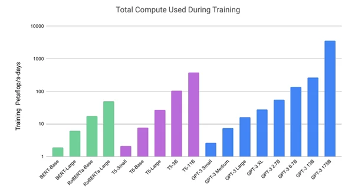

Generative Pretrained Transformer, or GPT, is a cutting-edge language model developed by OpenAI. Created to understand and generate human-like text, GPT has its origins in transformer architecture, which first emerged in the seminal paper "Attention is All You Need" by Vaswani et al. in 2017. GPT models leverage vast amounts of textual data, encompassing diverse genres and complexities, to learn the nuances of language and context. By doing so, they excel in producing text that mirrors human writing styles and responds dynamically to user inputs.



These models have significantly influenced various tech domains, showcasing their versatility and impact. In natural language processing (NLP), GPT models enhance chatbots and virtual assistants, turning them into more intuitive and effective tools for customer service and personal use. In the field of content creation, marketers and writers use GPT to generate ideas, write articles, and even draft scripts, saving considerable time and effort. Additionally, GPT's ability to process and respond to complex queries makes it indispensable in research and data analysis, providing users with insights extracted from vast data sets.

Algorithmic trading (also known as algo trading) involves using complex algorithms to make trading decisions at speeds beyond human capability. Integrating GPT into this arena presents significant advantages. Firstly, GPT's proficiency in processing and synthesizing large volumes of financial news and reports allows for an enriched understanding of market sentiments and trends. Furthermore, GPT models can generate predictive analytics by identifying subtle patterns and anomalies in historical trading data. These predictive capabilities enable traders to develop more robust strategies that potentially maximize returns and minimize risks. As financial markets become increasingly data-driven, the fusion of GPT with algorithmic trading offers a powerful toolset for modern traders seeking to stay ahead of the competition.


## Table of Contents


## Understanding GPT Models

Generative Pretrained Transformers (GPT) are a class of machine learning models that have gained significant attention due to their ability to produce human-like text based on input data. Developed by OpenAI, these models have revolutionized natural language processing tasks by leveraging a transformer-based architecture.

**Structure and Functioning of GPT Models**

GPT models are built upon the transformer architecture, which was introduced in the paper "Attention is All You Need" by Vaswani et al. in 2017. This architecture relies heavily on mechanisms known as self-attention and positional encodings to process sequential data and generate outputs.

The key innovation in GPT models is the use of self-attention, which allows the model to weigh the significance of each word in a sentence relative to others. This capability is crucial for understanding context, which enables GPT to generate coherent and contextually appropriate text. The model processes input data through multiple layers of transformers, each comprising a multi-head self-attention mechanism and position-wise feed-forward networks. This structure allows the model to consider the entirety of the input when generating predictions, effectively capturing long-range dependencies in the text.

In simple mathematical terms, the self-attention mechanism can be described as:

$$
\text{Attention}(Q, K, V) = \text{softmax}\left(\frac{QK^T}{\sqrt{d_k}}\right)V
$$

where $Q$, $K$, and $V$ are the query, key, and value matrices derived from the input, and $d_k$ is the dimensionality of the key vectors. This formula calculates a weighted sum of the values, where the weights are obtained by evaluating the similarity between queries and keys.

**How GPT Processes Information and Generates Human-like Text**

The pretrained nature of GPT models means they are initially trained on vast amounts of text data, learning a wide array of language patterns during this phase. When deployed, they utilize these learned patterns to generate text. The process involves using the input text to transform through the attention mechanisms and decoder-only architecture of the GPT, predicting subsequent words or sentences iteratively based on previous tokens.

This approach allows GPT to generate text that is remarkably consistent and contextually relevant, mimicking human-like conversation and writing. The inherent versatility of the GPT models makes them applicable in a variety of tasks, from simple text completion to more complex applications like creative writing or summarization.

**Latest Advancements: GPT-3 and GPT-4**

The latest advancements in GPT technology have been marked by the introduction of GPT-3 and GPT-4. GPT-3, released by OpenAI in 2020, consists of 175 billion parameters, making it one of the largest language models at the time. It exhibits impressive text generation capabilities and requires minimal fine-tuning to adapt to specific tasks, leveraging its vast pretraining knowledge.

GPT-4, though not publicly detailed as GPT-3, is anticipated to build upon the capabilities of its predecessor with even more parameters and improved performance in terms of language understanding and generation. The continued scaling and enhancement of these models aim to provide more accurate and nuanced responses, broadening the applicability across different fields, including [algorithmic trading](/wiki/algorithmic-trading) and more.

In conclusion, the architecture and capabilities of GPT models represent a significant leap forward in AI's ability to process and generate human-like text, with ongoing advancements promising even greater integration into a variety of practical applications.


## The Role of AI in Algo Trading

Algorithmic trading, popularly known as algo trading, refers to the use of computer algorithms to automate trading decisions in financial markets. This approach leverages the power of computers to execute trades at speeds and frequencies that would be impossible for a human trader to achieve. Algo trading offers numerous advantages, such as increased efficiency, reduced transaction costs, and the ability to manage multiple markets simultaneously. By minimizing human intervention, algorithmic trading reduces the emotional and psychological [factor](/wiki/factor-investing)s that often lead to poor trading decisions.

The incorporation of [artificial intelligence](/wiki/ai-artificial-intelligence) (AI) and [machine learning](/wiki/machine-learning) (ML) into algo trading has further transformed the landscape, allowing for more sophisticated and adaptive trading strategies. AI and ML algorithms are capable of analyzing vast amounts of data, identifying patterns, and making data-driven predictions with a level of precision and speed unattainable by traditional methods. These technologies enable traders to capture market opportunities that arise within milliseconds, providing a significant edge in today’s fast-paced financial environment.

A notable contribution of AI in algo trading is its ability to handle diverse data types—from historical price data to sentiment analysis from news articles and social media. Machine learning models can learn from past market behavior to predict future trends, offering the potential to maximize returns. By harnessing natural language processing (NLP) capabilities, AI systems can process unstructured text data, allowing traders to better understand market sentiment and potential event impacts.

There have been several instances where AI has successfully enhanced trading outcomes. For example, JPMorgan Chase's "LOXM" AI trading system was designed to execute orders quickly and efficiently, ultimately aiming to improve pricing and execution quality for clients. Similarly, Renaissance Technologies, a pioneer in using mathematical and statistical models for trading, has consistently outperformed traditional [hedge fund](/wiki/hedge-fund-trading-strategies)s, showcasing the potential of machine-driven strategies.

AI is not only improving the accuracy of trading signals but also evolving the risk management process. It can model potential risks by simulating various market conditions, thereby reducing the likelihood of unexpected losses. AI-driven algorithms are also adept at adapting to market changes, learning from every transaction to refine strategies continuously.

In summary, the integration of AI and machine learning into algorithmic trading elevates the precision, efficiency, and adaptability of trading strategies. As these technologies continue to advance, they offer promising prospects for achieving superior returns and mitigating risks in financial markets.


## Integrating GPT in Algo Trading

Integrating GPT models into algorithmic trading presents a significant advantage by allowing the processing and analysis of vast amounts of financial data efficiently. GPT, with its capacity to understand and generate human-like text, can synthesize diverse datasets ranging from textual news reports, earning call transcripts, and market sentiment analyses to structured numerical data, like historical price movements and trading [volume](/wiki/volume-trading-strategy)s.

One of the core capabilities of GPT in algo trading is its ability to generate predictions based on data trends and patterns. By employing natural language processing, GPT models can discern subtle patterns and sentiment shifts within unstructured data, which traditional analytical methods might overlook. For instance, a GPT model can analyze the sentiment of recent news articles about a specific company or industry, expanding its analysis rapidly across thousands of news sources.

Moreover, GPT can be utilized to perform sentiment analysis on platforms such as Twitter or financial news websites. This involves collecting text data, preprocessing it to extract sentiment features, and then generating predictions about potential market movements based on this sentiment. Here is a hypothetical Python function snippet illustrating how this might be implemented using a pre-trained GPT model:

```python
from transformers import GPT2Tokenizer, GPT2Model

def predict_market_sentiment(text_data):
    tokenizer = GPT2Tokenizer.from_pretrained("gpt2")
    model = GPT2Model.from_pretrained("gpt2")

    inputs = tokenizer(text_data, return_tensors='pt', truncation=True, padding='max_length', max_length=512)
    outputs = model(**inputs)

    # Example function to convert model output to sentiment score
    sentiment_score = convert_output_to_sentiment(outputs)

    return sentiment_score

def convert_output_to_sentiment(outputs):
    # Custom logic to interpret model outputs as sentiment
    # This part is highly customized based on model configuration
    return outputs.last_hidden_state.mean().item()
```

Such predictions allow traders to anticipate market movements and adjust their strategies accordingly. This capability is invaluable in high-frequency trading scenarios where time is critical.

Examples of how GPT assists traders include generating summaries of financial reports, which can highlight critical insights and implications for trading strategies, or adapting trading algorithms based on inferred sentiment changes in related news or social media data. It can also provide insights on historical data patterns, suggesting potential trends or [volatility](/wiki/volatility-trading-strategies) in asset prices and offering recommendations on stop-loss limits, portfolio rebalancing, or entry and [exit](/wiki/exit-strategy) points.

By integrating GPT models, traders are empowered with enhanced decision-making tools that combine human-level linguistic understanding with the computational efficiency and power of AI, enabling sophisticated, data-driven strategy development that can adapt in real-time to the ever-changing market landscape.


## Challenges and Considerations

Integrating GPT models into algorithmic trading systems comes with several challenges that practitioners must consider. One primary concern is data quality and model biases. For GPT models to generate reliable insights and predictions, they require large volumes of high-quality data. Poor data quality can lead to inaccurate predictions and misguided trading decisions. Biases inherent in the training data can also influence the model's output, causing it to favor certain outcomes without a factual basis. These biases might arise from historical market trends that do not hold in current conditions or from incomplete data that don't represent the broader financial environment.

Regulatory and ethical considerations are also significant when using AI-driven trading systems. Financial markets are heavily regulated to prevent market manipulation, insider trading, and other unethical practices. The use of AI models, including GPT, can complicate these issues, as pinpointing accountability for autonomous decision-making remains challenging. Ensuring that AI models comply with existing regulations requires continuous oversight and adjustment, particularly as regulations evolve to address new technological capabilities.

The importance of human oversight and hybrid models cannot be overstated to ensure the reliability of AI in trading contexts. Although GPT models can process and analyze large datasets efficiently, the nuance and expertise of human traders are crucial in interpreting model outputs and making strategic decisions. Combining AI capabilities with human insight creates a hybrid model that leverages the strengths of both. Human oversight helps mitigate risks associated with model errors or unexpected market conditions, ensuring that AI tools serve as robust assistants rather than standalone decision-makers. This approach not only improves the reliability of AI systems in trading but also fosters trust among users and stakeholders in deploying such advanced technologies.


## The Future of GPT in Algo Trading

As we look toward the future, the integration of GPT and evolving AI models in the financial sector promises to reshape investment strategies significantly. Key trends suggest that AI will not just augment, but potentially redefine how trading is conducted.

Firstly, the continuous improvement in natural language processing allows GPT models to analyze vast amounts of unstructured financial data from news articles, reports, and social media in real-time. This capability provides traders immediate insights into market sentiment, regulatory changes, or macroeconomic impacts that are difficult to quantify with traditional data alone. By identifying these patterns, GPT models can assist traders in making faster and more informed decisions, leading to strategies that are both proactive and reactive to market shifts.

Moreover, as AI models grow in sophistication, there is an increasing trend toward hyper-personalization in trading strategies. Evolving AI capabilities can tailor investment strategies based on an individual trader's historical performance data and risk preferences. This personalization allows traders to benefit from automated systems that adapt to their unique style, rather than forcing themselves into a one-size-fits-all model. Over time, this adaptability could enhance portfolio performance by optimizing returns while managing risks better.

The collaboration between AI and human traders is set to become more nuanced. While AI can process and analyze data faster than any human, there remains a significant advantage in human intuition, especially during periods of market turmoil where quantitative models may struggle. Future systems are likely to integrate GPT and similar models as part of a hybrid approach, where AI handles data analysis and predictions while human oversight and intuition guide strategic decision-making. This collaboration not only ensures more robust trading strategies but also mitigates the risks associated with over-reliance on AI systems.

The implications of these advancements are profound. By leveraging GPT, trading entities can create dynamic strategies that are responsive to real-time changes and personalized at scale. In doing so, there's potential for a significant reshaping of the investment landscape, where the blend of AI efficiency and human ingenuity propels the next generation of trading innovation. The future appears to be moving towards a partnership model where AI enhances human capabilities, leading to more sophisticated and reliable trading systems.


## Conclusion

GPT models have shown considerable promise in enhancing algorithmic trading by bringing advanced natural language processing capabilities to the forefront of financial markets. These models effectively process and analyze vast amounts of unstructured financial data, including news articles, market reports, and social media sentiment. By understanding complex language patterns, GPT can generate insights and predictions that are invaluable for making informed trading decisions.

The integration of GPT into trading algorithms is not just about processing text but also about recognizing data trends and predicting market shifts. GPT's ability to generate human-like text enables it to produce market commentary and analysis, providing traders with a deeper understanding of potential market movements. As a result, these models can aid in the development of sophisticated trading strategies that are highly responsive to real-time information.

However, the potential of GPT in transforming trading practices is not just theoretical. Examples of successful AI applications in trading demonstrate that continued exploration and research into integrating GPT can yield substantial benefits. By leveraging GPT's capabilities, traders can develop more robust and adaptive strategies, ultimately leading to enhanced trading performance.

Looking forward, GPT holds the potential to revolutionize the trading landscape by offering innovative solutions that combine AI's computational power with human strategic insights. As AI models continue to evolve, we can anticipate even greater synergies between human traders and automated systems, leading to more efficient and effective trading operations. It is crucial for researchers and industry professionals to keep pushing the boundaries of what is possible with GPT, continuously refining and expanding its applications in algo trading.


## References & Further Reading

[1]: Vaswani, A., Shazeer, N., Parmar, N., Uszkoreit, J., Jones, L., Gomez, A. N., Kaiser, Ł., & Polosukhin, I. (2017). ["Attention is All You Need."](https://arxiv.org/abs/1706.03762) Advances in Neural Information Processing Systems.

[2]: Hochreiter, S., & Schmidhuber, J. (1997). ["Long Short-Term Memory."](https://www.bioinf.jku.at/publications/older/2604.pdf) Neural Computation, 9(8), 1735–1780.

[3]: Lopez de Prado, M. (2018). ["Advances in Financial Machine Learning."](https://www.amazon.com/Advances-Financial-Machine-Learning-Marcos/dp/1119482089) Wiley.

[4]: Goodfellow, I., Bengio, Y., & Courville, A. (2016). ["Deep Learning."](https://www.deeplearningbook.org/) MIT Press.

[5]: Chan, E. (2008). ["Quantitative Trading: How to Build Your Own Algorithmic Trading Business."](https://www.amazon.com/Quantitative-Trading-Build-Algorithmic-Business/dp/0470284889) Wiley.

[6]: Jansen, S. (2020). ["Machine Learning for Algorithmic Trading - Second Edition."](https://www.packtpub.com/product/machine-learning-for-algorithmic-trading-second-edition/9781839217715) Packt Publishing.

[7]: Aronson, D. R. (2006). ["Evidence-Based Technical Analysis: Applying the Scientific Method and Statistical Inference to Trading Signals."](https://www.wiley.com/en-gb/Evidence-Based-Technical-Analysis:-Applying-the-Scientific-Method-and-Statistical-Inference-to-Trading-Signals-p-9780470008744) Wiley.