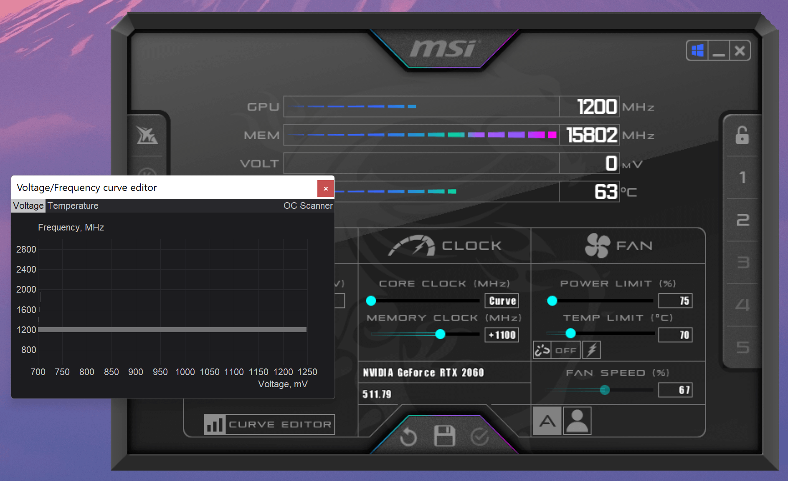

## Table of Contents

## What is a GPU and how does it work in general computing?

A GPU, or Graphics Processing Unit, is a special kind of computer chip that's really good at handling graphics and images. It was originally made to help computers show pictures and videos on screens. The GPU can do a lot of small tasks at the same time, which makes it faster than a regular computer chip, called a CPU, when it comes to drawing and moving things on a screen.

In general computing, GPUs are not just used for graphics anymore. They are now used to help with other big jobs like scientific research, machine learning, and even playing video games. Because a GPU can handle many small tasks at once, it can speed up calculations that would take a long time on a regular CPU. This makes computers with GPUs much faster and more powerful for certain kinds of work.

## How does cryptocurrency mining work?

Cryptocurrency mining is like solving a puzzle to add new transactions to a cryptocurrency's record book, called the blockchain. Miners use powerful computers to guess a special code that lets them add a new page to the blockchain. When they solve the puzzle, they get to add the transactions and earn some of the cryptocurrency as a reward. This process helps keep the cryptocurrency system safe and working properly because it's hard for one person to control everything.

The computers used for mining need to do a lot of calculations very quickly. That's why miners often use GPUs or special chips called ASICs, which are even better at solving these puzzles. The more powerful the computer, the more guesses it can make per second, and the better chance the miner has of solving the puzzle first and getting the reward. But mining uses a lot of electricity, so it can be expensive and not everyone can do it.

## Why are GPUs preferred for cryptocurrency mining over CPUs?

GPUs are preferred for cryptocurrency mining because they can do many calculations at the same time, much faster than CPUs. When you're mining cryptocurrency, you need to guess a special code very quickly. A GPU can make a lot more guesses per second than a CPU, which means it has a better chance of solving the puzzle and getting the reward. This is because GPUs were designed to handle lots of small tasks at once, like drawing many pixels on a screen, which is similar to the kind of work needed for mining.

CPUs, on the other hand, are good at doing one task at a time but not as good at handling many tasks at once. They can still be used for mining, but they are much slower compared to GPUs. This makes mining with CPUs less efficient and less profitable. So, if you want to mine cryptocurrency more effectively, using a GPU or even a specialized mining chip like an ASIC is the way to go.

## What are the key factors that affect GPU performance in mining?

The main things that affect how well a GPU works for mining are its hash rate and power use. The hash rate is how many guesses the GPU can make in a second. A higher hash rate means the GPU can try more codes and has a better chance of solving the puzzle first. But, a GPU that uses a lot of power might not be the best choice if the electricity cost is high. You need to find a good balance between how fast the GPU can mine and how much it costs to run it.

Another important thing is the type of cryptocurrency you're mining. Different cryptocurrencies use different puzzle types, and some GPUs are better at solving certain kinds of puzzles. Also, the GPU's memory and how fast it can move data around inside itself can make a big difference. If the GPU has a lot of memory and can move data quickly, it can mine more efficiently. So, when [picking](/wiki/asset-class-picking) a GPU for mining, you need to think about all these things to get the best performance.

## How do you measure GPU utilization in mining?

To measure how well a GPU is working while mining, you look at something called the hash rate. The hash rate tells you how many guesses the GPU can make every second. A higher hash rate means the GPU is working harder and doing more mining work. You can use special software to check the hash rate and see how much the GPU is being used. This helps you understand if the GPU is working as well as it should be.

Another way to measure GPU utilization is by looking at the power use. When a GPU is working hard at mining, it uses more electricity. You can use a power meter to see how much electricity the GPU is using. If the power use is high, it usually means the GPU is working hard. But, you have to think about the cost of electricity too, because if it's too high, it might not be worth it to mine with that GPU.

## What are the most popular GPUs used for cryptocurrency mining?

Some of the most popular GPUs used for cryptocurrency mining are made by companies like NVIDIA and AMD. From NVIDIA, the GeForce RTX 30 series, especially models like the RTX 3060 Ti and RTX 3080, are very popular because they have a good balance of high hash rates and power efficiency. These GPUs can mine many different cryptocurrencies effectively. AMD also has popular GPUs like the Radeon RX 5700 XT and RX 6800 XT, which are known for their strong performance in mining and good value for money.

Choosing the right GPU for mining depends on what cryptocurrency you want to mine and how much you want to spend. For example, if you're mining Ethereum, the NVIDIA RTX 3080 might be a good choice because it has a high hash rate for Ethereum mining. But if you're on a tighter budget, the AMD RX 5700 XT could be a better option because it's less expensive but still performs well. It's important to think about the cost of the GPU and the electricity it uses to make sure mining is profitable.

## How can you optimize GPU settings for better mining performance?

To make your GPU work better for mining, you need to change some settings to get the best performance. One important setting is the GPU's clock speed. You can increase the clock speed to make the GPU work faster, but be careful because if you push it too hard, it might get too hot or even break. Another setting to look at is the memory clock speed. Increasing this can help the GPU move data around more quickly, which is good for mining. You can use special software like MSI Afterburner or EVGA Precision X1 to change these settings.

Also, you should keep an eye on the GPU's temperature. If it gets too hot, it might slow down or stop working to protect itself. You can use fans or even liquid cooling to keep it cool. Another thing to think about is the power limit. Sometimes, you can let the GPU use a bit more power to mine faster, but again, be careful not to use too much because it might not be worth the extra electricity cost. By carefully adjusting these settings, you can make your GPU mine more efficiently and get more cryptocurrency.

## What are the common issues faced when using GPUs for mining and how to troubleshoot them?

When you use GPUs for mining, you might run into some common problems. One big issue is overheating. If your GPU gets too hot, it might slow down or stop working to protect itself. To fix this, you can add more fans or use liquid cooling to keep the GPU cool. Another problem is that the GPU might not work as fast as you want it to. This can happen if the settings are not right. You can use software like MSI Afterburner to change the clock speed and memory settings to make the GPU work faster, but be careful not to push it too hard or it might break.

Another issue is that the GPU might use too much power, making mining less profitable because of high electricity costs. You can adjust the power limit in your GPU settings to find a good balance between speed and power use. Sometimes, the GPU might not be recognized by the mining software, which can be frustrating. To fix this, make sure your drivers are up to date and that the mining software is set up correctly. If you still have problems, you might need to restart your computer or check the connections to make sure everything is plugged in right.

## How does the choice of cryptocurrency affect GPU utilization?

The kind of cryptocurrency you choose to mine can really change how much your GPU works. Different cryptocurrencies use different math puzzles, and some GPUs are better at solving certain kinds of puzzles. For example, if you're mining Ethereum, a GPU like the NVIDIA RTX 3080 might work really well because it's fast at solving the puzzles Ethereum uses. But if you switch to mining a different cryptocurrency, like Monero, the same GPU might not be as good because Monero uses a different kind of puzzle that might be better for other GPUs.

Also, some cryptocurrencies are more popular and have more miners working on them. This means there's more competition, and your GPU might not solve the puzzle as often. For example, if lots of people are mining Bitcoin, your GPU might not be able to keep up with all the other miners. On the other hand, if you mine a less popular cryptocurrency, your GPU might solve the puzzles more often because there's less competition. So, choosing the right cryptocurrency can help your GPU work better and be more profitable.

## What are the long-term effects of continuous mining on GPU lifespan?

When you use a GPU for mining all the time, it can wear out faster than if you just used it for playing games or working. Mining makes the GPU work very hard, and it can get really hot. If it stays hot for a long time, it can hurt the inside parts of the GPU. Also, mining can make the GPU use a lot of power, which can wear out the parts that handle electricity. Over time, this can make the GPU less good at its job or even stop working completely.

To make your GPU last longer while mining, you need to take good care of it. You can use fans or special cooling systems to keep it from getting too hot. It's also a good idea to check the settings and make sure the GPU isn't working too hard all the time. If you take breaks from mining and let the GPU cool down sometimes, it can help it last longer. But even with good care, mining will still make the GPU wear out faster than normal use.

## How do advanced cooling solutions impact GPU efficiency in mining?

Advanced cooling solutions can make a big difference in how well a GPU works for mining. When a GPU is mining, it gets very hot because it's working so hard. If it stays too hot, it might slow down or stop to protect itself. Good cooling, like using extra fans or liquid cooling, can keep the GPU from getting too hot. This means the GPU can keep working at its best speed without slowing down, which helps it mine more cryptocurrency.

Using advanced cooling also helps the GPU last longer. When a GPU is cooler, it doesn't wear out as fast. This is important because mining can make the GPU work harder than normal, which can make it break sooner. By keeping the GPU cool, you can mine for a longer time without having to worry about it getting damaged. So, good cooling not only makes mining more efficient but also helps keep your GPU in good shape for the future.

## What are the future trends in GPU technology specifically for cryptocurrency mining?

In the future, GPU technology for cryptocurrency mining is likely to get even better. Companies like NVIDIA and AMD are always working on new GPUs that are faster and use less power. These new GPUs will have higher hash rates, which means they can guess more codes per second and mine more cryptocurrency. They might also use less electricity, making mining more profitable because you won't have to pay as much for power. Another trend could be GPUs that are made just for mining, with special features that make them even better at solving the puzzles used in cryptocurrencies.

Another thing that might happen is the use of more advanced cooling systems. As GPUs get faster, they can get really hot, so better cooling will be important. We might see more GPUs using liquid cooling or other new ways to stay cool. This will help the GPUs keep working at their best without slowing down or getting damaged. Overall, the future of GPU technology for mining looks promising, with faster, more efficient, and cooler GPUs coming out to help miners get more cryptocurrency.

## What is Cryptocurrency Mining and How Does it Work?

Cryptocurrency mining is a fundamental process that underpins the operation of blockchain networks, primarily through the validation and recording of transactions. At its core, mining involves miners using computational power to solve complex cryptographic puzzles. Successful resolution of these puzzles allows miners to add a block to the blockchain, for which they are rewarded with newly minted cryptocurrency tokens. This financial incentive plays a pivotal role in securing and maintaining the decentralized nature of most blockchain networks.

The most prevalent mechanism underlying cryptocurrency mining is Proof of Work (PoW). In PoW, miners compete to solve computationally difficult problems that require significant processing power and energy consumption. Bitcoin, the pioneering cryptocurrency, uses PoW to ensure transparency, fairness, and security in the transaction validation process. The conceptual basis of PoW can be expressed through the cryptographic hash function, where miners must find a nonce such that:

$$
\text{hash}(block\_header + nonce) < \text{target}
$$

Here, the hash function outputs a fixed-length string of characters, which the network sets as a target for miners to achieve. The difficulty of finding a suitable nonce increases as more miners join the network, which inherently adjusts the target to ensure that blocks are mined approximately every ten minutes.

Other consensus mechanisms exist, such as Proof of Stake (PoS), Delegated Proof of Stake (DPoS), and Proof of Authority (PoA), each offering different trade-offs in terms of energy efficiency, scalability, and security. These alternatives often aim to address the high energy consumption and environmental impact associated with PoW. In PoS, for instance, validators are chosen to create new blocks based on the number of coins they hold and are willing to 'stake' rather than through computational work.

Understanding these mechanisms and their implications is crucial for prospective miners, as they directly impact the choice of [cryptocurrency](/wiki/cryptocurrency) to mine and the strategies employed. For example, networks like Ethereum, historically associated with PoW, have transitioned to PoS (with Ethereum 2.0) to enhance scalability and reduce environmental costs.

Before considering specific hardware or trading strategies, a solid grasp of these mining fundamentals is essential. This foundation enables miners to make informed decisions about the types of cryptocurrencies they wish to engage with and the necessary technological investments to optimize their mining operations effectively.

## References & Further Reading

[1]: Eyal, I., & Sirer, E. G. (2014). ["Majority is not Enough: Bitcoin Mining is Vulnerable."](https://dl.acm.org/doi/10.1145/3212998) Financial Cryptography and Data Security, FC 2014.

[2]: Narayanan, A., Bonneau, J., Felten, E., Miller, A., & Goldfeder, S. (2016). ["Bitcoin and Cryptocurrency Technologies: A Comprehensive Introduction."](https://press.princeton.edu/books/hardcover/9780691171692/bitcoin-and-cryptocurrency-technologies) Princeton University Press.

[3]: Oliva, D., Cuevas, E., & Pajares, G. (Eds.). (2016). ["Advances and Applications in the Field of Algorithmic Trading."](https://content.e-bookshelf.de/media/reading/L-8366771-469687f07c.pdf) Springer.

[4]: Vigna, P., & Casey, M. J. (2016). ["The Age of Cryptocurrency: How Bitcoin and Digital Money are Challenging the Global Economic Order."](https://archive.org/details/ageofcryptocurre0000vign) St. Martin's Press.

[5]: Harris, L. (2003). ["Trading and Exchanges: Market Microstructure for Practitioners."](https://academic.oup.com/book/52292) Oxford University Press.