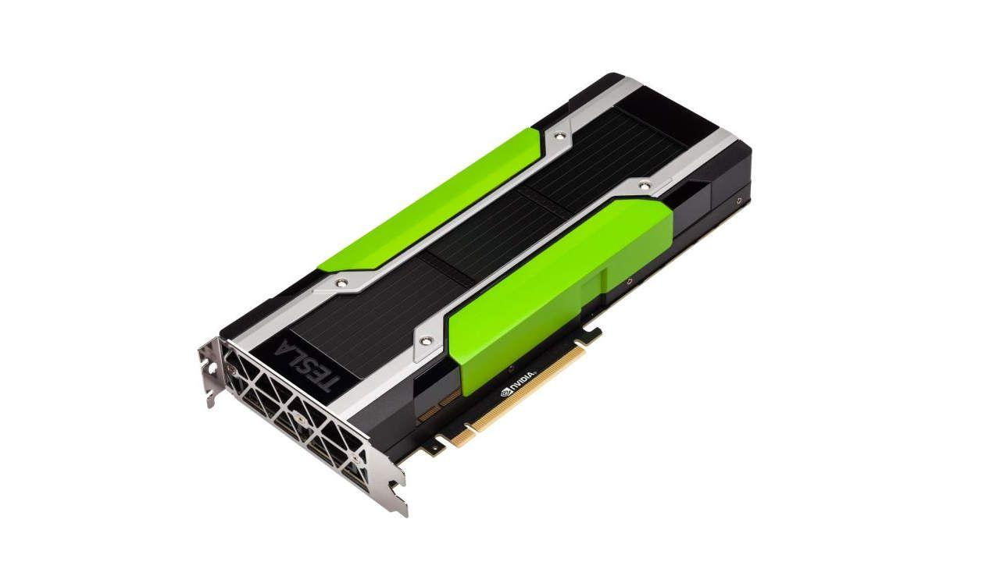

## Table of Contents

## What is a GPU and what does it do?

A GPU, or Graphics Processing Unit, is a special kind of computer chip that helps make pictures and videos look good on your computer or gaming console. It's really good at handling lots of little tasks at the same time, which is why it's perfect for making graphics. When you play a game or watch a movie, the GPU takes the basic information from the computer and turns it into smooth, colorful images on your screen.

Besides making games and videos look better, GPUs are also used for other things. They are very important in things like artificial intelligence and scientific research because they can do a lot of calculations very quickly. For example, scientists might use GPUs to study how molecules move or to predict the weather. So, while GPUs started out mainly for graphics, they've become really useful in many different areas.

## How does a GPU differ from a CPU?

A GPU and a CPU are both important parts of a computer, but they do different jobs. A CPU, or Central Processing Unit, is like the brain of the computer. It handles a lot of different tasks, one after the other, and is good at doing things quickly but one at a time. It's great for running your computer's operating system, opening programs, and doing everyday tasks like writing emails or browsing the web.

On the other hand, a GPU is specialized for handling graphics and doing many tasks at the same time. It has lots of small processing units that work together to make images and videos look smooth and detailed. While a CPU might be better at managing your computer's overall operations, a GPU shines when it comes to things like gaming, video editing, or running complex simulations because it can handle a huge number of calculations all at once.

In simple terms, think of a CPU as a fast chef who can cook one dish at a time really well, and a GPU as a team of chefs who can all cook different parts of a meal at the same time. Both are essential, but they're good at different things.

## What are the main components of a GPU?

A GPU has several important parts that help it do its job. The first key part is the Graphics Processing Cores, also called CUDA cores in NVIDIA GPUs or Stream Processors in AMD GPUs. These are like the workers of the GPU. They do all the math needed to make images and videos look good. The more cores a GPU has, the more it can do at once, making it better for tasks like gaming or video editing.

Another important part is the Memory, often called VRAM (Video RAM). This is like the GPU's short-term memory. It stores all the information the GPU needs to create and show images quickly. The more VRAM a GPU has, the more detailed and complex the images it can handle. There's also the GPU Clock Speed, which is how fast the GPU can do its work. A higher clock speed means the GPU can finish tasks faster.

Lastly, there's the ROPs (Raster Operations Pipelines) and Texture Mapping Units (TMUs). ROPs help finish the images by adding colors and details, while TMUs handle textures, making things like walls or clothes look realistic. All these parts work together to make the GPU powerful and efficient at creating and showing graphics.

## How does GPU architecture impact performance?

GPU architecture is super important for how fast and well a GPU can do its job. The way the GPU is built inside, like how many cores it has and how fast they can work, really affects how quickly it can make and show images. For example, if a GPU has a lot of cores, it can do many things at the same time, which is great for games or making videos. Also, the clock speed, which is like how fast the GPU can think, makes a big difference. A higher clock speed means the GPU can finish its work faster, making everything smoother and quicker.

Another part of the architecture that matters is the memory, or VRAM. This is like the GPU's short-term memory, and it needs to be fast and big enough to handle all the information needed for making images. If the VRAM is too small, the GPU might struggle with very detailed or big images. The way the GPU is designed to use its memory also affects performance. Some GPUs are better at moving data around quickly, which helps them work more efficiently. So, the overall design and how all these parts work together really decide how good a GPU is at its job.

## What are the different types of GPUs available in the market?

There are mainly two types of GPUs you can find in the market: integrated GPUs and dedicated GPUs. Integrated GPUs are built right into the computer's main chip, the CPU. They are good enough for everyday tasks like browsing the web, watching videos, and some light gaming. They don't use much power, which is great for laptops and small devices, but they can't handle heavy graphics work very well. On the other hand, dedicated GPUs are separate chips that are made just for graphics. They are much more powerful and are used for gaming, video editing, and other tasks that need a lot of graphics power. They use more power and can make your computer run hotter, but they are much better at handling complex images and videos.

There are also different brands of GPUs, with NVIDIA and AMD being the most popular. NVIDIA GPUs, like the ones in the GeForce series, are known for their high performance and are often used in gaming and professional work. They have technologies like ray tracing, which makes games look more realistic. AMD GPUs, like those in the Radeon series, are also very good and often offer better value for money. They are strong in both gaming and professional applications too. Both brands have different models, from entry-level GPUs that are good for basic tasks to high-end ones that can handle the most demanding games and software.

## How do GPUs enhance gaming experiences?

GPUs make games look and run better. They do this by handling all the graphics work, like drawing the game world, characters, and special effects. When you play a game, the GPU takes the basic information from the game and turns it into smooth, colorful images on your screen. It can make games run at higher frame rates, which means the game feels smoother and more responsive. It also lets games have more detailed graphics, like realistic lighting and shadows, which make the game world look more lifelike and immersive.

Besides making games look good, GPUs also help with things like ray tracing. Ray tracing is a technology that makes light in games look more real, with accurate reflections and shadows. This can make games feel more realistic and exciting. GPUs can also handle other advanced features like anti-aliasing, which makes edges in games look smoother, and high-resolution textures, which make everything from the ground to the characters look more detailed. All these things together make your gaming experience much better and more enjoyable.

## What is GPU rendering and how is it used in graphics?

GPU rendering is when a computer uses its graphics card to make pictures and videos. It's like the GPU is an artist that takes simple shapes and colors and turns them into detailed images really fast. When you're playing a game or watching a movie, the GPU works hard to make everything look smooth and realistic. It does this by figuring out where all the light and shadows should go, how things should look from different angles, and how to make everything move smoothly.

In graphics, GPU rendering is super important because it lets computers show really detailed and lifelike images. For example, in video games, the GPU makes the game world look real by adding things like reflections on water or shadows from trees. It can also make movies and animations look better by handling complex scenes with lots of characters and special effects. So, whether you're gaming, watching a movie, or working on a graphic design project, GPU rendering helps make everything look as good as possible.

## How do GPUs contribute to artificial intelligence and machine learning?

GPUs help a lot in [artificial intelligence](/wiki/ai-artificial-intelligence) and [machine learning](/wiki/machine-learning) because they are really good at doing many calculations at the same time. When you're training a computer to learn something new, like recognizing pictures or understanding speech, it needs to do a lot of math. GPUs can handle this math much faster than regular computer chips, which makes the learning process quicker. This is why many people use GPUs when they are working on AI projects. They can speed up the training of big models, making it easier to create smart systems that can do things like translate languages or drive cars.

Besides speeding up the training, GPUs also help in using AI models once they're ready. For example, if you have a smart system that can recognize faces in pictures, the GPU can help it do this quickly and accurately. This is important for things like security cameras or smartphone apps that need to work in real-time. So, GPUs are not just for making games look good; they are also key tools in making AI and machine learning work better and faster.

## What are the key considerations when choosing a GPU for a specific task?

When choosing a GPU for a specific task, you need to think about what you're going to use it for. If you're a gamer, you'll want a GPU that can handle high frame rates and detailed graphics. Look for one with a lot of cores and fast memory, which will help your games run smoothly and look great. If you're into video editing or 3D modeling, you'll need a GPU with a lot of VRAM to handle big files and complex projects. The more VRAM, the better it can manage detailed work without slowing down.

Another thing to consider is your budget and the power your computer can handle. High-end GPUs can be expensive, but they offer the best performance. If you're on a tight budget, there are still good GPUs that can do a lot without costing too much. Also, make sure your computer's power supply can handle the GPU you choose. Some GPUs use a lot of power and need a strong power supply to work properly. So, think about what you need the GPU for, how much you can spend, and what your computer can support when [picking](/wiki/asset-class-picking) the right one.

## How can one optimize GPU performance?

To make your GPU work better, you can start by updating its drivers. Drivers are like instructions that help your computer talk to the GPU, and new ones can fix problems and make things run smoother. Also, make sure your computer stays cool. GPUs can get hot when they work hard, and if they get too hot, they might slow down to cool off. You can help by cleaning your computer to get rid of dust and maybe adding more fans or better cooling if needed.

Another way to boost GPU performance is by tweaking game or program settings. If you're playing a game, you can lower some graphics settings to make it easier for the GPU to handle. Things like turning down the resolution or reducing details like shadows and textures can help the game run faster. Also, make sure no other big programs are running at the same time, because they can use up resources that your GPU needs. By doing these simple things, you can help your GPU work its best.

## What are the latest advancements in GPU technology?

The latest advancements in GPU technology have made them even better at handling graphics and doing complex tasks. One big advancement is ray tracing, which makes light in games and movies look more real. It can show accurate reflections and shadows, making everything look more lifelike. Another cool thing is that GPUs are getting better at handling artificial intelligence and machine learning. They can now process big AI models much faster, which helps in things like self-driving cars and smart home devices.

Also, GPUs are becoming more energy-efficient. Newer models use less power while still being very powerful, which is great for laptops and other devices where battery life matters. Manufacturers like NVIDIA and AMD are also working on new designs that pack more cores into smaller spaces, making GPUs smaller but still very strong. These advancements are making GPUs more versatile and useful in all sorts of new ways, from gaming to scientific research.

## How do GPUs play a role in parallel computing and data processing?

GPUs are really good at parallel computing, which means they can do a lot of things at the same time. This is because GPUs have many small processing units, called cores, that work together. When you need to do a big job, like sorting a huge list of numbers or running a complex simulation, a GPU can split the job into smaller pieces and let each core work on a piece at the same time. This makes the job finish much faster than if a single CPU had to do it all by itself. So, GPUs are like a team of workers that can tackle big tasks quickly.

In data processing, GPUs are also very helpful. They can handle big sets of data, like the kind you find in scientific research or business analytics, much faster than a CPU. For example, if you're trying to analyze a lot of information to find patterns or make predictions, a GPU can go through the data quickly and help you get results faster. This is why GPUs are used in things like weather forecasting, where you need to process a lot of data to predict what the weather will be like. So, GPUs make data processing quicker and more efficient, which is really important in many fields.

## What are the benefits of using GPUs in algorithmic trading?

Algorithmic trading has become increasingly reliant on the ability to process large datasets swiftly and accurately, and GPUs play a pivotal role in meeting these demands. Their inherent parallel processing power allows them to handle multiple computations simultaneously, significantly enhancing the efficiency of data processing tasks. This capability is especially crucial in improving the accuracy of predictive models, which rely on processing vast amounts of historical and real-time data to identify patterns and make forecasts.

GPUs accelerate the speed and efficiency of executing trades by leveraging their massive parallelism. This capability reduces the time needed to execute complex calculations and simulations, which can be a bottleneck in trading operations. Faster computations enable quicker decision-making, vital for capturing fleeting market opportunities. This improvement can be quantified using the formula:

$$
\text{Execution Time} = \frac{\text{Number of Operations}}{\text{Operations per Second}}
$$

With GPUs, the number of operations per second skyrockets, thereby reducing the overall execution time dramatically and enabling timely trade executions.

Latency is another critical [factor](/wiki/factor-investing) in high-frequency trading environments where trades are executed in fractions of a second. Any delay can lead to significant financial losses. GPUs help minimize latency issues by processing data in parallel streams, reducing the time taken from data reception to trade execution. The reduction in latency not only ensures the trades are executed at the best possible prices but also enhances the strategy's overall profitability.

Financial institutions utilizing GPUs can thus swiftly react to market changes, outpacing competitors who rely on traditional CPU-based systems. This competitive edge is fundamental in the fast-paced world of trading, where speed and precision are paramount.

## References & Further Reading

[1]: Bergstra, J., Bardenet, R., Bengio, Y., & Kégl, B. (2011). ["Algorithms for Hyper-Parameter Optimization."](https://papers.nips.cc/paper_files/paper/2011/hash/86e8f7ab32cfd12577bc2619bc635690-Abstract.html) Advances in Neural Information Processing Systems 24.

[2]: ["Advances in Financial Machine Learning"](https://www.amazon.com/Advances-Financial-Machine-Learning-Marcos/dp/1119482089) by Marcos Lopez de Prado

[3]: ["Evidence-Based Technical Analysis: Applying the Scientific Method and Statistical Inference to Trading Signals"](https://www.wiley.com/en-gb/Evidence+Based+Technical+Analysis:+Applying+the+Scientific+Method+and+Statistical+Inference+to+Trading+Signals-p-9780470008744) by David Aronson

[4]: ["Machine Learning for Algorithmic Trading"](https://www.amazon.com/Machine-Learning-Algorithmic-Trading-intelligence/dp/9918608013) by Stefan Jansen

[5]: ["Quantitative Trading: How to Build Your Own Algorithmic Trading Business"](https://www.amazon.com/Quantitative-Trading-Build-Algorithmic-Business/dp/0470284889) by Ernest P. Chan