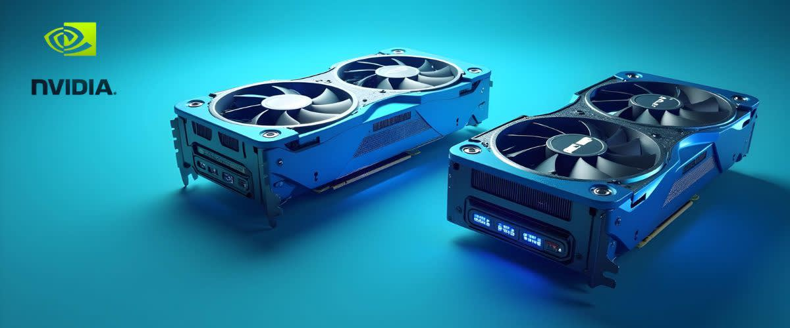

Algorithmic trading has become a cornerstone of modern financial markets, representing a significant shift from traditional trading practices. By leveraging computer algorithms to execute trades based on pre-defined criteria, traders can analyze vast datasets and make decisions at lightning speed. This approach not only optimizes trading efficiency but also minimizes human error, thereby increasing the potential for profit.

Central to this evolution is the Graphics Processing Unit (GPU), originally designed to accelerate the rendering of images for video games. Unlike the Central Processing Unit (CPU), which typically handles a few computing tasks at high speeds, the GPU is engineered to perform many tasks simultaneously, making it highly effective for parallel processing. Its ability to juggle thousands of threads concurrently has expanded its traditional roles beyond gaming, now serving critical functions in areas like artificial intelligence, machine learning, and complex computations.



In algorithmic trading, GPUs offer substantial benefits. Their robust processing power can drastically reduce the time required for backtesting strategies, improve the accuracy of predictive models, and handle extensive datasets rapidly. This capability is particularly valuable for developing sophisticated algorithms that must analyze real-time data to make split-second trading decisions. As high-frequency trading (HFT) continues to grow, the demand for technology which can process and react to market changes in near real-time is paramount. GPUs cater to this need effectively, ensuring that traders can gain a competitive edge. 

In summary, while GPUs were once relegated to assisting in graphical computations, their role in advancing algorithmic trading cannot be understated. As financial markets continue to evolve, the integration of such powerful technologies is set to redefine the landscape, offering unparalleled opportunities for innovation and efficiency.


## Table of Contents


## Understanding GPUs and Their Core Capabilities

Graphics Processing Units (GPUs) have become a cornerstone of modern computational advancements, distinguished by their unique architectural design and capabilities, setting them apart from the traditional Central Processing Units (CPUs). At their core, GPUs are specialized hardware designed primarily for rendering images and processing vast amounts of data efficiently, thanks to their parallel processing prowess.

Architecturally, GPUs differ from CPUs in the way they handle information. A CPU typically features a few cores optimized for sequential serial processing, which is ideal for tasks that require high single-thread performance, such as running operating systems and complex calculations. In contrast, a GPU comprises thousands of smaller, efficient cores designed for handling multiple tasks simultaneously. This architectural design enables GPUs to process multiple threads at once, excelling in parallel processing tasks.

Parallel processing, a core capability of GPUs, involves executing multiple operations simultaneously, significantly boosting performance for tasks that can be broken into smaller, independent operations. This capability arises from the SIMD (Single Instruction, Multiple Data) architecture, allowing a single operation to be performed on multiple data points concurrently. For instance, consider matrix operations frequently used in machine learning and computer graphics:

```python
import numpy as np

# Example of vector addition using parallel processing paradigms
vector_a = np.array([1, 2, 3, 4])
vector_b = np.array([5, 6, 7, 8])
vector_c = vector_a + vector_b
```

In this example, the vector addition can leverage the parallel processing capability of GPUs to perform the addition operation on multiple data points at once, resulting in substantial speed improvements compared to serial processing.

Beyond computational graphics, GPUs have found transformative applications in numerous industries. In scientific research, they are deployed for complex simulations and data analysis, significantly speeding up computations that would take prohibitively long on CPUs. The healthcare sector benefits from GPUs in imaging technologies, enhancing the speed and accuracy of diagnostic processes. In the automotive industry, GPUs power various AI-driven applications, such as autonomous driving systems and advanced driver-assistance systems (ADAS), by processing large streams of sensor data in real-time.

These examples of GPU utilization in diverse sectors highlight their potential to enhance processes through improved computational efficiency and parallelism. The capabilities of GPUs set a precedent for their adoption in financial trading, where the need for rapid data processing and real-time analysis is critical for success. By leveraging the architectural strengths of GPUs, industries can achieve high-performance computing essential for innovation and development.


## The Intersection of GPUs and Algo Trading

Algorithmic trading, a method that uses computer programs to execute trades at speeds and frequencies that are impossible for human traders, has seen substantial enhancement with the introduction of GPUs. Originally leveraged for gaming and graphics rendering, GPUs have found a niche in [algorithmic trading](/wiki/algorithmic-trading) due to their unparalleled ability to handle complex computations.

Historically, the application of GPUs in algorithmic trading began as their architecture proved highly effective for specific tasks within financial computations. Unlike CPUs, which handle one task at a time sequentially, GPUs excel at parallel processing—executing numerous calculations simultaneously. This capability transformed their use in trading from experimental to essential, especially for tasks requiring vast computational power and speed.

**Enhancing Backtesting and Simulation**

Backtesting involves simulating a trading strategy using historical data to gauge its effectiveness before deploying it in live markets. This process can be computationally intensive, especially as the [volume](/wiki/volume-trading-strategy) of data and complexity of strategies increase. GPUs significantly accelerate this process by processing large datasets more efficiently than CPUs, thus allowing more thorough and faster strategy evaluations. For instance, while running a Monte Carlo simulation—a method used to estimate the probability of different outcomes in a process that cannot easily be predicted due to the intervention of random variables—the parallel processing capabilities of GPUs allow for multiple simulations to be conducted simultaneously. This reduces the time needed to generate statistically significant results.

In Python, a simple parallel processing framework that illustrates the potential of GPU for financial computations can look like this:

```python
import numpy as np
from numba import cuda

@cuda.jit
def calculate_returns(prices, returns):
    i = cuda.grid(1)
    if i < prices.size - 1:
        returns[i] = (prices[i+1] - prices[i]) / prices[i]

# Example usage
prices = np.array([...], dtype=np.float32)  # Input historical price data
returns = np.zeros(prices.size - 1, dtype=np.float32)
calculate_returns[blockspergrid, threadsperblock](prices, returns)
```

**Processing Complex Algorithms for Real-Time Decisions**

The ability of GPUs to handle complex algorithms efficiently is crucial for real-time trading decisions. High-frequency trading ([HFT](/wiki/high-frequency-trading-strategies)), where the speed of execution can determine a strategy’s success, benefits immensely from the reduced latency and increased processing capability offered by GPUs. Their power to execute many operations in parallel allows sophisticated algorithms—such as [machine learning](/wiki/machine-learning) models that may require constant retraining and adjustment based on new data—to operate in real time.

Furthermore, this capacity for rapid computation translates into an enhanced capability to manage and analyze complex datasets quickly. In trading scenarios where market signals must be identified and acted upon within fractions of a second, the deployment of GPUs can increase competitiveness by providing actionable insights more swiftly than traditional CPU-based systems.

In conclusion, the intersection of GPUs and algorithmic trading marks a significant evolution in the financial markets' computational capabilities. By harnessing the power of GPUs, traders can perform extensive backtests, execute advanced simulations, and process real-time data with remarkable speed, thus enabling more effective and informed trading strategies. As the technology continues to evolve, its integration is likely to become even more entrenched in the world of finance.


## Benefits of Using GPUs in Algo Trading

Algorithmic trading has become increasingly reliant on the ability to process large datasets swiftly and accurately, and GPUs play a pivotal role in meeting these demands. Their inherent parallel processing power allows them to handle multiple computations simultaneously, significantly enhancing the efficiency of data processing tasks. This capability is especially crucial in improving the accuracy of predictive models, which rely on processing vast amounts of historical and real-time data to identify patterns and make forecasts.

GPUs accelerate the speed and efficiency of executing trades by leveraging their massive parallelism. This capability reduces the time needed to execute complex calculations and simulations, which can be a bottleneck in trading operations. Faster computations enable quicker decision-making, vital for capturing fleeting market opportunities. This improvement can be quantified using the formula:

$$
\text{Execution Time} = \frac{\text{Number of Operations}}{\text{Operations per Second}}
$$

With GPUs, the number of operations per second skyrockets, thereby reducing the overall execution time dramatically and enabling timely trade executions.

Latency is another critical [factor](/wiki/factor-investing) in high-frequency trading environments where trades are executed in fractions of a second. Any delay can lead to significant financial losses. GPUs help minimize latency issues by processing data in parallel streams, reducing the time taken from data reception to trade execution. The reduction in latency not only ensures the trades are executed at the best possible prices but also enhances the strategy's overall profitability.

Financial institutions utilizing GPUs can thus swiftly react to market changes, outpacing competitors who rely on traditional CPU-based systems. This competitive edge is fundamental in the fast-paced world of trading, where speed and precision are paramount.


## Challenges and Considerations

When adopting GPUs for algorithmic trading, several challenges and considerations arise that can impact the transition's effectiveness and efficiency. One of the primary challenges is integration and compatibility. Many existing trading systems are built around CPU-based architectures, and transitioning to a GPU-centric model may require significant changes in software and hardware infrastructure. This could involve updating or replacing existing code, reconfiguring data flow paths, and ensuring that the GPU can effectively communicate with other components of the trading system. Compatibility issues may also surface, particularly with software libraries and tools that may not yet be optimized for GPU processing.

Another major consideration is the cost implications of transitioning to a GPU-based infrastructure. While GPUs offer high-performance capabilities, their initial investment can be substantial. This includes the cost of purchasing the hardware itself, which can be quite high, especially for financial firms that require high-end GPUs capable of handling large volumes of data in real-time. Additionally, there might be costs associated with upgrading other parts of the trading infrastructure to support GPU integration, such as power supplies, cooling systems, and data storage solutions. The total cost must be weighed against the potential gains in trading performance to ascertain the financial viability of the switch.

Furthermore, utilizing GPUs effectively demands specialized knowledge and skills. Financial firms must either invest in hiring skilled personnel or provide existing staff with the necessary training. This includes understanding GPU architectures, programming languages, and frameworks such as CUDA or OpenCL, and developing new algorithms optimized for parallel processing. Developing and maintaining software that can leverage the full power of GPUs requires expertise in both finance and high-performance computing. Consequently, the human resource investment is a critical factor when considering the shift to GPU-enhanced algorithmic trading.

Overall, while GPUs present a promising avenue for enhancing trading capabilities, firms must carefully evaluate these challenges and considerations to ensure a smooth and cost-effective transition.


## Real-Life Examples and Case Studies

A notable example of successful GPU integration in algorithmic trading is found in the implementation by Renaissance Technologies, a renowned quant [hedge fund](/wiki/hedge-fund-trading-strategies) recognized for its extensive use of advanced technology in trading. The firm incorporated GPUs into their trading systems to enhance processing speeds and improve the efficiency of executing complex quantitative models.

### Results and Outcomes

The introduction of GPUs led to significant improvements in [backtesting](/wiki/backtesting) and real-time analytics. By leveraging the parallel processing capabilities of GPUs, Renaissance Technologies was able to reduce the time required for backtesting from several hours to minutes. This acceleration in processing enabled the firm to run more simulations and refine their strategies with increased accuracy, ultimately leading to better predictive models and more informed trading decisions.

Moreover, the enhanced computational power facilitated by GPUs allowed Renaissance Technologies to analyze larger datasets at a faster pace. This capability proved crucial in identifying market trends and anomalies, which are often fleeting and require prompt action to capitalize on trading opportunities. As a result, the firm experienced improved trading outcomes, characterized by higher returns and reduced risks.

### Lessons Learned and Best Practices

Several key lessons emerged from Renaissance Technologies’ experience with GPU integration:

1. **Infrastructure Compatibility**: Ensuring that existing systems are compatible with GPU technology is essential. Renaissance Technologies had to invest in upgrading their infrastructure to accommodate the high-performance demands of GPUs. This step proved crucial for optimizing their computational resources and avoiding bottlenecks.

2. **Skill Development**: The transition to a GPU-based system necessitated the acquisition of new skills among their technical teams. Training programs and hiring specialists familiar with GPU programming were integral to their successful adoption. Utilizing languages and frameworks such as CUDA (Compute Unified Device Architecture) helped the team in writing efficient GPU-accelerated code.

3. **Strategic Allocation**: Determining which parts of their algorithmic processes could benefit the most from GPU acceleration was vital. By strategically allocating GPU resources to tasks requiring heavy parallel computation, Renaissance Technologies maximized their investment and minimized unnecessary use of resources.

4. **Balancing Cost and Performance**: Although GPUs offer enhanced performance, they can also be costly. Renaissance Technologies had to carefully evaluate the cost-benefit ratio, ensuring that the performance gains justified the expenses involved in upgrading to a GPU-based system.

These lessons underscore the importance of careful planning and execution when integrating advanced technologies like GPUs into trading systems. For firms aiming to enhance their algorithmic trading capabilities, adopting these best practices can lead to significant improvements in performance and profitability.


## Future Trends and Developments

As GPU technology evolves, it continues to play a transformative role not only in trading but across various financial applications. One prominent emerging trend involves the use of GPUs in risk management and compliance tasks. By leveraging their superior computational power, GPUs can process vast amounts of financial data rapidly, enabling firms to conduct real-time risk assessments and ensure adherence to regulatory standards promptly. This can enhance operational efficiency, especially important in an era where financial institutions face increasing scrutiny and tighter regulations.

Moreover, GPUs are becoming integral to [artificial intelligence](/wiki/ai-artificial-intelligence) (AI) and machine learning (ML) applications within finance. Their capability to handle parallel processing tasks efficiently makes them ideal for training complex models used in credit scoring, fraud detection, and customer sentiment analysis. The financial industry is increasingly integrating AI-driven insights to refine product offerings and personalize customer experiences, and GPUs provide the necessary computational backbone to support these advancements.

Looking to future developments, the evolution of GPU architectures promises further enhancements in speed and energy efficiency. Innovations such as tensor cores, designed to accelerate AI and ML tasks, are poised to significantly boost the ability of GPUs to handle sophisticated algorithms rapidly. This is particularly beneficial for algorithmic trading, where milliseconds can determine competitive advantage.

Additionally, quantum computing holds potential synergies with GPU development. While still in nascent stages, the integration of quantum computing concepts could eventually enhance the problem-solving capabilities of GPUs, facilitating even more complex simulations and financial modeling. Such advancements might redefine trading strategies, allowing for unprecedented analysis capabilities and optimization techniques that are currently computationally prohibitive.

In conclusion, as GPUs continue to evolve, their expanding role across financial applications challenges firms to adapt progressively. With advancements in GPU technology, from AI integration to potential quantum innovations, the relationship between technology and trading strategies will likely become more intricate, paving the way for more agile, responsive, and sophisticated trading environments.


## Conclusion

The integration of Graphics Processing Units (GPUs) into algorithmic trading marks a significant advancement in the financial sector, offering a substantial boost to trading performance through their inherent capabilities. GPUs are equipped to handle complex calculations at speeds far superior to traditional CPUs, primarily due to their parallel processing architecture. This capability is particularly beneficial in algorithmic trading, where strategies often involve the processing of large datasets and require rapid execution to capitalize on market opportunities. By leveraging GPUs, traders can achieve enhanced accuracy in predictive models, enabling more informed decision-making and improved execution of trades.

While technology in the form of GPUs provides a robust platform for efficient trading, strategic insights remain equally important to achieve optimal outcomes. The key lies in harmonizing cutting-edge technology with sound trading strategies, ensuring that the computational power of GPUs complements rather than overshadows the human element of trading. This balance can be the difference between merely following trends and strategically navigating the complex dynamics of financial markets.

Financial firms are encouraged to explore and invest in GPU technology, recognizing the transformative potential it holds for algorithmic trading. Incorporating GPUs not only mitigates latency issues crucial in high-frequency trading environments but also positions firms at the forefront of technological innovation. As the financial landscape continues to evolve, embracing such advancements will likely yield significant competitive advantages, driving growth and profitability in the trading sector.

## References & Further Reading

[1]: Bergstra, J., Bardenet, R., Bengio, Y., & Kégl, B. (2011). ["Algorithms for Hyper-Parameter Optimization."](https://papers.nips.cc/paper_files/paper/2011/hash/86e8f7ab32cfd12577bc2619bc635690-Abstract.html) Advances in Neural Information Processing Systems 24.

[2]: ["Advances in Financial Machine Learning"](https://www.amazon.com/Advances-Financial-Machine-Learning-Marcos/dp/1119482089) by Marcos Lopez de Prado

[3]: ["Evidence-Based Technical Analysis: Applying the Scientific Method and Statistical Inference to Trading Signals"](https://www.wiley.com/en-gb/Evidence+Based+Technical+Analysis:+Applying+the+Scientific+Method+and+Statistical+Inference+to+Trading+Signals-p-9780470008744) by David Aronson

[4]: ["Machine Learning for Algorithmic Trading"](https://www.amazon.com/Machine-Learning-Algorithmic-Trading-intelligence/dp/9918608013) by Stefan Jansen

[5]: ["Quantitative Trading: How to Build Your Own Algorithmic Trading Business"](https://www.amazon.com/Quantitative-Trading-Build-Algorithmic-Business/dp/0470284889) by Ernest P. Chan