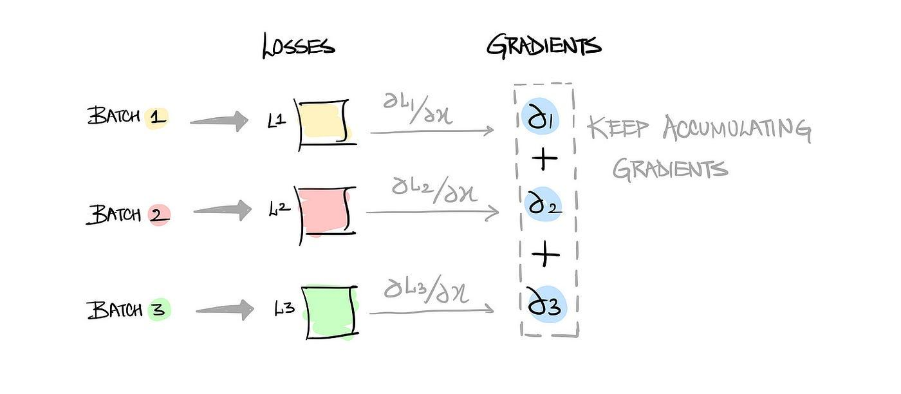

## Table of Contents

## What is gradient accumulation in machine learning?

Gradient accumulation is a technique used in machine learning to train models on large datasets or with limited computational resources. When training a neural network, the gradient of the loss function with respect to the model's parameters is calculated and used to update the parameters. However, if the batch size is small, the gradient can be noisy and lead to unstable training. Gradient accumulation helps by accumulating the gradients over several small batches before performing a parameter update. This effectively increases the batch size without requiring more memory, leading to more stable and efficient training.

To implement gradient accumulation, the gradients are calculated for each small batch and added to a running total. After a specified number of batches, the accumulated gradient is used to update the model's parameters. For example, if you want to simulate a batch size of 32 but can only fit 8 examples in memory at a time, you would accumulate the gradients over 4 small batches before performing an update. This can be expressed mathematically as $$ \text{accumulated_gradient} = \sum_{i=1}^{n} \nabla L(\theta, x_i, y_i) $$, where $$ n $$ is the number of small batches, $$ \nabla L $$ is the gradient of the loss function, $$ \theta $$ are the model parameters, and $$ x_i, y_i $$ are the input and target for the $$ i $$-th batch. By using gradient accumulation, you can achieve the benefits of larger batch sizes while working within the constraints of your available computational resources.

## Why is gradient accumulation useful in training neural networks?

Gradient accumulation is useful in training neural networks because it allows you to use larger effective batch sizes without needing more memory. When you train a neural network, you usually update the model's parameters after processing a batch of data. If your computer can't handle big batches because of memory limits, you can use smaller batches. But small batches can make the training process noisy and unstable. Gradient accumulation helps by adding up the gradients from several small batches before updating the model. This way, you can train your model as if you were using a larger batch, which makes the training more stable and efficient.

For example, if you want to train with a batch size of 32 but your computer can only handle 8 examples at a time, you can accumulate the gradients over 4 small batches. The math behind this is simple: you add up the gradients from each small batch. After 4 batches, you use the total gradient to update your model. This can be written as $$ \text{accumulated_gradient} = \sum_{i=1}^{n} \nabla L(\theta, x_i, y_i) $$, where $$ n $$ is the number of small batches, $$ \nabla L $$ is the gradient of the loss function, $$ \theta $$ are the model parameters, and $$ x_i, y_i $$ are the input and target for the $$ i $$-th batch. By doing this, you get the benefits of a larger batch size without needing more memory, which is especially helpful when working with big datasets or limited resources.

## How does gradient accumulation affect the batch size during training?

Gradient accumulation lets you train a [neural network](/wiki/neural-network) as if you were using a bigger batch size, even though you're actually using smaller batches. When you train a model, you usually update its parameters after looking at a batch of data. If your computer can't handle big batches because it doesn't have enough memory, you can use smaller batches. But small batches can make the training process noisy and unstable. Gradient accumulation helps by adding up the gradients from several small batches before updating the model. This way, you can train your model as if you were using a larger batch, making the training more stable and efficient.

For example, if you want to train with a batch size of 32 but your computer can only handle 8 examples at a time, you can accumulate the gradients over 4 small batches. The math behind this is simple: you add up the gradients from each small batch. After 4 batches, you use the total gradient to update your model. This can be written as $$ \text{accumulated_gradient} = \sum_{i=1}^{n} \nabla L(\theta, x_i, y_i) $$, where $$ n $$ is the number of small batches, $$ \nabla L $$ is the gradient of the loss function, $$ \theta $$ are the model parameters, and $$ x_i, y_i $$ are the input and target for the $$ i $$-th batch. By doing this, you get the benefits of a larger batch size without needing more memory, which is especially helpful when working with big datasets or limited resources.

## What are the steps to implement gradient accumulation in a typical deep learning framework?

To implement gradient accumulation in a typical [deep learning](/wiki/deep-learning) framework, you start by setting up your model and optimizer as usual. Then, you decide how many small batches you want to accumulate before updating the model's parameters. Let's say you want to simulate a batch size of 32 but can only handle 8 examples at a time. You would set up a loop to process 4 small batches before doing a parameter update. In each iteration of the loop, you calculate the gradient of the loss function for the current small batch and add it to a running total of gradients. After you've gone through all 4 small batches, you use the accumulated gradient to update your model's parameters. This can be written as $$ \text{accumulated_gradient} = \sum_{i=1}^{n} \nabla L(\theta, x_i, y_i) $$, where $$ n $$ is the number of small batches, $$ \nabla L $$ is the gradient of the loss function, $$ \theta $$ are the model parameters, and $$ x_i, y_i $$ are the input and target for the $$ i $$-th batch.

Here's how you might implement this in code, using PyTorch as an example:

```python
import torch
import torch.nn as nn
import torch.optim as optim

# Define your model, loss function, and optimizer
model = YourModel()
criterion = nn.CrossEntropyLoss()
optimizer = optim.Adam(model.parameters(), lr=0.001)

# Set the number of accumulation steps
accumulation_steps = 4

# Training loop
for epoch in range(num_epochs):
    for i, (inputs, labels) in enumerate(train_loader):
        outputs = model(inputs)
        loss = criterion(outputs, labels)

        # Normalize the loss to account for the accumulation
        loss = loss / accumulation_steps

        # Backpropagate the loss
        loss.backward()

        # Update the parameters every accumulation_steps iterations
        if (i + 1) % accumulation_steps == 0:
            optimizer.step()
            optimizer.zero_grad()
```

In this example, we divide the loss by the number of accumulation steps before backpropagation to ensure that the gradients are scaled correctly. After accumulating gradients over the specified number of steps, we call `optimizer.step()` to update the model's parameters and `optimizer.zero_grad()` to reset the gradients for the next accumulation cycle. This approach allows you to train your model with the benefits of a larger effective batch size, even when working with limited memory resources.

## Can you explain the concept of effective batch size in the context of gradient accumulation?

Effective batch size in the context of gradient accumulation is the total number of examples you use to update your model's parameters at one time. When you use gradient accumulation, you break down a larger batch into smaller ones. You add up the gradients from these smaller batches before updating the model. For example, if you want to train with a batch size of 32 but can only handle 8 examples at a time, you can process 4 smaller batches of 8 examples each. The effective batch size here would be 32, because you're using the gradients from 32 examples to update your model.

This technique helps you train your model as if you were using a larger batch size, even when your computer can't handle big batches due to memory limits. The math behind this is simple: you add up the gradients from each small batch. After 4 batches, you use the total gradient to update your model. This can be written as $$ \text{accumulated_gradient} = \sum_{i=1}^{n} \nabla L(\theta, x_i, y_i) $$, where $$ n $$ is the number of small batches, $$ \nabla L $$ is the gradient of the loss function, $$ \theta $$ are the model parameters, and $$ x_i, y_i $$ are the input and target for the $$ i $$-th batch. By doing this, you get the benefits of a larger batch size without needing more memory, which is especially helpful when working with big datasets or limited resources.

## How does gradient accumulation help in dealing with memory constraints?

Gradient accumulation helps you train a neural network when your computer doesn't have enough memory to handle large batches of data. When you train a model, you usually update its parameters after looking at a batch of data. If you can only handle small batches because of memory limits, the updates can be noisy and unstable. Gradient accumulation solves this by letting you add up the gradients from several small batches before updating the model. This way, you can train as if you were using a larger batch size, making the training more stable and efficient.

For example, if you want to train with a batch size of 32 but your computer can only handle 8 examples at a time, you can accumulate the gradients over 4 small batches. The math behind this is simple: you add up the gradients from each small batch. After 4 batches, you use the total gradient to update your model. This can be written as $$ \text{accumulated_gradient} = \sum_{i=1}^{n} \nabla L(\theta, x_i, y_i) $$, where $$ n $$ is the number of small batches, $$ \nabla L $$ is the gradient of the loss function, $$ \theta $$ are the model parameters, and $$ x_i, y_i $$ are the input and target for the $$ i $$-th batch. By doing this, you get the benefits of a larger batch size without needing more memory, which is especially helpful when working with big datasets or limited resources.

## What are the potential drawbacks of using gradient accumulation?

Using gradient accumulation can have some downsides. One big issue is that it makes training take longer. Instead of updating the model's parameters after each small batch, you have to wait until you've gone through several batches to make an update. This means the training process can be slower, especially if you're using a lot of small batches to get to your effective batch size.

Another potential problem is that gradient accumulation can make the training process more complicated. You have to keep track of how many batches you've gone through before you update the model. This can add extra steps to your training loop, and if you're not careful, you might make mistakes in your code. For example, if you forget to divide the loss by the number of accumulation steps before backpropagation, your gradients might be too large, which can make training unstable.

## How does gradient accumulation interact with learning rate scheduling?

Gradient accumulation can affect learning rate scheduling because it changes how often you update the model's parameters. When you use gradient accumulation, you don't update the model after every small batch. Instead, you wait until you've gone through several small batches. This means that the learning rate scheduler, which usually adjusts the learning rate based on the number of updates, might need to be adjusted to account for the fewer updates. For example, if you're using a scheduler that decreases the learning rate every 100 updates, you might need to change it to decrease every 100 effective batch updates instead.

To handle this, you can modify your learning rate scheduler to consider the effective batch size. If you're accumulating gradients over 4 small batches to simulate a larger batch size, you would count one effective update for every 4 small batches. This way, the scheduler will adjust the learning rate based on the number of effective updates rather than the number of small batch updates. For example, if you're using a scheduler in PyTorch, you might adjust it like this: ```python
scheduler.step(epoch + i / accumulation_steps)
``` where `accumulation_steps` is the number of small batches you accumulate before updating the model. This ensures that the learning rate is adjusted at the right time, based on the effective batch size.

## Can gradient accumulation be used with any optimization algorithm, or are there specific ones it works best with?

Gradient accumulation can be used with any optimization algorithm, including popular ones like Stochastic Gradient Descent (SGD), Adam, and RMSprop. The key idea is to accumulate gradients over several small batches before updating the model's parameters. This means you can still use your favorite optimizer, whether it's SGD or something more advanced like Adam, without changing how it works. The only thing you need to do is make sure you're dividing the loss by the number of accumulation steps before backpropagation, so the gradients are scaled correctly.

For example, if you're using Adam as your optimizer and you want to accumulate gradients over 4 small batches, you would still use Adam to update the model's parameters, but you'd do it less often. After accumulating the gradients, you'd use the total gradient to update the model. This can be written as $$ \text{accumulated_gradient} = \sum_{i=1}^{n} \nabla L(\theta, x_i, y_i) $$, where $$ n $$ is the number of small batches, $$ \nabla L $$ is the gradient of the loss function, $$ \theta $$ are the model parameters, and $$ x_i, y_i $$ are the input and target for the $$ i $$-th batch. By doing this, you get the benefits of a larger batch size without needing more memory, which is especially helpful when working with big datasets or limited resources.

## How can one determine the optimal number of accumulation steps for a given model and dataset?

Finding the best number of accumulation steps for a model and dataset involves a bit of trial and error. You want to balance between using a large enough effective batch size to make training stable and not making the training process too slow. Start by choosing a small number of accumulation steps, like 2 or 4, and see how your model trains. If the training seems too noisy or unstable, try increasing the number of steps to get a larger effective batch size. Keep an eye on how long it takes to train and how well the model performs. If the training time becomes too long, you might need to reduce the number of steps.

One way to figure out the right number of accumulation steps is to monitor the model's performance on a validation set. As you change the number of steps, check if the model's accuracy or loss on the validation set improves. If you see better results with more steps, but the training time is still okay, you might have found a good number. If the performance doesn't improve much, or if the training time becomes too long, you might need to adjust. Remember, the optimal number can depend on the model, the dataset, and the computational resources you have. So, it's important to experiment and find what works best for your specific situation.

## What impact does gradient accumulation have on the training dynamics and convergence of a model?

Gradient accumulation changes how a model trains by letting you use a bigger effective batch size without needing more memory. When you train a model, you usually update its parameters after looking at a batch of data. If you can only handle small batches because of memory limits, the updates can be noisy and unstable. Gradient accumulation solves this by letting you add up the gradients from several small batches before updating the model. This way, you can train as if you were using a larger batch size, making the training more stable and efficient. For example, if you want to train with a batch size of 32 but your computer can only handle 8 examples at a time, you can accumulate the gradients over 4 small batches. The math behind this is simple: you add up the gradients from each small batch. After 4 batches, you use the total gradient to update your model. This can be written as $$ \text{accumulated_gradient} = \sum_{i=1}^{n} \nabla L(\theta, x_i, y_i) $$, where $$ n $$ is the number of small batches, $$ \nabla L $$ is the gradient of the loss function, $$ \theta $$ are the model parameters, and $$ x_i, y_i $$ are the input and target for the $$ i $$-th batch.

Using gradient accumulation can make the training process slower because you're not updating the model after every small batch. Instead, you have to wait until you've gone through several batches to make an update. This means the training process can take longer, especially if you're using a lot of small batches to get to your effective batch size. However, the trade-off is often worth it because the model can converge to a better solution with a larger effective batch size. The key is to find the right balance between training time and model performance. If you're using a learning rate scheduler, you might need to adjust it to account for the fewer updates. For example, if you're using a scheduler in PyTorch, you might adjust it like this: ```python
scheduler.step(epoch + i / accumulation_steps)
``` where `accumulation_steps` is the number of small batches you accumulate before updating the model. This ensures that the learning rate is adjusted at the right time, based on the effective batch size.

## Are there any advanced techniques or variations of gradient accumulation that can enhance model performance?

Gradient accumulation can be enhanced with a few advanced techniques to boost model performance. One approach is to use adaptive gradient accumulation, where the number of accumulation steps changes during training. This can help the model start with smaller effective batch sizes to explore the parameter space more thoroughly and then increase the batch size as training progresses to speed up convergence. Another technique is to combine gradient accumulation with mixed precision training, which uses lower precision data types (like float16) for most computations to save memory and speed up training. This can be especially useful when working with large models and datasets, as it allows for even larger effective batch sizes.

Another variation is to use gradient accumulation with techniques like gradient clipping, which helps prevent exploding gradients by limiting the magnitude of gradients during backpropagation. This can make training more stable, especially when using large effective batch sizes. You can implement gradient clipping in PyTorch like this: ```python
torch.nn.utils.clip_grad_norm_(model.parameters(), max_norm=1.0)
```. By combining these advanced techniques with gradient accumulation, you can improve the training dynamics and potentially achieve better model performance, even with limited computational resources.

## References & Further Reading

[1]: Goodfellow, I., Bengio, Y., & Courville, A. (2016). ["Deep Learning."](https://link.springer.com/article/10.1007/s10710-017-9314-z) MIT Press. Provides a comprehensive introduction to the field of deep learning, discussing various techniques, including gradient accumulation.

[2]: Bottou, L. (2012). ["Stochastic Gradient Descent Tricks."](http://leon.bottou.org/publications/pdf/tricks-2012.pdf) In: Neural Networks: Tricks of the Trade. Discusses various optimization methods in gradient descent, which can be related to gradient accumulation techniques.

[3]: Ruder, S. (2016). ["An Overview of Gradient Descent Optimization Algorithms."](https://arxiv.org/abs/1609.04747) arXiv:1609.04747. An extensive overview of optimization algorithms, including insights into how techniques like gradient accumulation can affect optimization.

[4]: Micikevicius, P., Narang, S., Alben, J., Diamos, G., Elsen, E., Garcia, D., ... & Shoeybi, M. (2018). ["Mixed precision training."](https://arxiv.org/abs/1710.03740) arXiv:1710.03740. This paper discusses mixed precision training, which can be used in conjunction with gradient accumulation to improve training efficiency.

[5]: Paszke, A., Gross, S., Massa, F., Lerer, A., Bradbury, J., Chanan, G., ... & Chintala, S. (2019). ["PyTorch: An Imperative Style, High-Performance Deep Learning Library."](https://arxiv.org/abs/1912.01703) arXiv:1912.01703. This paper introduces PyTorch, a popular deep learning framework that supports gradient accumulation and other advanced training techniques.