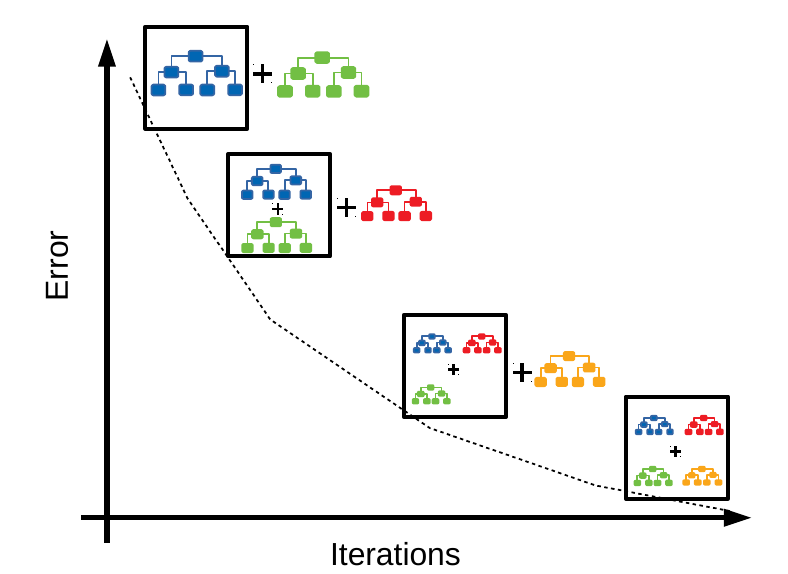

## Table of Contents

## What is a Gradient Boosted Tree?

A Gradient Boosted Tree is a type of machine learning model that's really good at predicting things. It works by combining lots of simple decision trees into one strong model. Imagine each decision tree as a weak learner that makes predictions, but isn't very accurate on its own. By adding these trees together in a smart way, the model can make much better predictions. The "gradient" part means that the model learns from its mistakes step by step, trying to correct them with each new tree it adds.

The way it builds these trees is pretty clever. It starts with one tree and then adds more trees one at a time. Each new tree tries to fix the errors made by the previous trees. This is done using a method called gradient descent, where the model looks at how wrong its predictions are and adjusts to make them better. Over time, as more trees are added, the model gets better and better at making accurate predictions. This makes Gradient Boosted Trees very powerful for tasks like predicting house prices or figuring out if an email is spam.

## How does Gradient Boosting work?

Gradient Boosting is a way to make predictions better by using lots of simple decision trees. Imagine you're trying to guess how much a house costs. You start with one tree that makes a guess, but it's not very accurate. So, you add another tree that looks at the mistakes the first tree made and tries to fix them. You keep adding more trees, each one focusing on the errors of all the trees before it. This process continues until you have a bunch of trees working together to make a really good guess.

The key to making this work is something called gradient descent. When each new tree is added, the model uses gradient descent to figure out how to make the next tree better at fixing the mistakes of the previous ones. It's like if you were trying to walk down a hill in the fog. You take a step, see if you're going down, and if not, you adjust your direction. In Gradient Boosting, the model keeps adjusting the direction of its predictions to get closer to the right answer. This step-by-step improvement is what makes Gradient Boosting so powerful.

To sum it up, Gradient Boosting builds a strong prediction model by combining many weak decision trees. Each new tree focuses on the errors made by the previous trees, using gradient descent to figure out how to improve. Over time, this creates a model that's really good at making accurate predictions, whether it's for guessing house prices or figuring out if an email is spam.

## What are the key components of a Gradient Boosted Tree?

A Gradient Boosted Tree is made up of several important parts that work together to make good predictions. The main part is the decision trees. These are simple models that split data into different groups based on certain rules. In a Gradient Boosted Tree, you start with one decision tree, and then you add more trees one by one. Each new tree tries to fix the mistakes made by the trees that came before it. This process of adding trees and fixing errors is what makes the model better over time.

The other key part is gradient descent. This is a way for the model to learn from its mistakes. When a new tree is added, the model uses gradient descent to figure out how to make the tree better at fixing the errors of the previous trees. It's like trying to walk down a hill in the fog. You take a step, see if you're going down, and if not, you adjust your direction. In Gradient Boosted Trees, the model keeps adjusting the direction of its predictions to get closer to the right answer. This step-by-step improvement is what makes Gradient Boosting so powerful.

The final important part is the learning rate. This controls how much each new tree can change the overall prediction. A smaller learning rate means the model learns more slowly but can be more accurate in the end. It's like taking smaller steps down the hill, which might take longer but helps you avoid big mistakes. By carefully choosing the learning rate and adding trees one at a time, a Gradient Boosted Tree can become very good at making predictions, whether it's for guessing house prices or figuring out if an email is spam.

## What are the advantages of using Gradient Boosted Trees over other machine learning models?

Gradient Boosted Trees are really good at making accurate predictions because they combine many simple decision trees in a smart way. Each new tree tries to fix the mistakes made by the trees that came before it, which helps the model get better over time. This step-by-step improvement means that Gradient Boosted Trees can often make more accurate guesses than other models, like simple decision trees or even neural networks, especially when you have a lot of data to learn from. They are also good at handling different types of data, whether it's numbers or categories, which makes them very useful for many different kinds of problems.

Another advantage is that Gradient Boosted Trees can explain their predictions in a way that's easy to understand. Each decision tree in the model is made up of simple rules, like "if the house has more than 3 bedrooms, then it's more expensive." By looking at these rules, you can see why the model made a certain prediction. This is different from some other models, like neural networks, which can be hard to understand because they work like a black box. Being able to explain predictions is important for things like figuring out why a bank loan was denied or why a patient was diagnosed with a certain illness.

## How do you choose the right number of trees in a Gradient Boosted model?

Choosing the right number of trees in a Gradient Boosted model is important for making sure it works well without taking too long to run. You start with a small number of trees and keep adding more until the model stops getting better at making predictions. This is called "early stopping." You can use a separate set of data, called a validation set, to check how well the model is doing as you add more trees. If the model's performance on the validation set stops improving, you can stop adding trees because adding more won't help.

The number of trees also depends on other settings in the model, like the learning rate. A smaller learning rate means the model learns more slowly, so you might need more trees to reach the same level of accuracy. But using too many trees can make the model take longer to run and might even make it overfit, which means it works well on the data it was trained on but not on new data. So, you need to find a balance. A good way to do this is to try different numbers of trees and see which one works best on your validation set.

## What is the role of learning rate in Gradient Boosting?

The learning rate in Gradient Boosting controls how much each new tree can change the overall prediction. Think of it like taking steps down a hill. If the learning rate is small, you take smaller steps, which means the model learns more slowly but can be more accurate in the end. A smaller learning rate helps the model avoid making big mistakes and can lead to better predictions, but it might take longer to train the model because you need more trees to reach the same level of accuracy.

On the other hand, a larger learning rate means you take bigger steps, so the model learns faster. This can be good if you want to train the model quickly, but it can also make the model less accurate because it might overshoot the best solution. The right learning rate depends on your specific problem and data. You might need to try different learning rates to see which one works best for your model. A common approach is to start with a small learning rate and increase it if the model is taking too long to train, or decrease it if the model is not accurate enough.

## How does Gradient Boosting handle overfitting?

Gradient Boosting handles overfitting by using a few smart tricks. One trick is called early stopping. This means you keep adding trees to the model until it stops getting better at making predictions on a separate set of data called the validation set. If the model's performance on the validation set stops improving, you stop adding trees. This helps prevent the model from getting too complicated and overfitting to the training data.

Another way Gradient Boosting prevents overfitting is by using a small learning rate. The learning rate controls how much each new tree can change the overall prediction. A smaller learning rate means the model learns more slowly, taking smaller steps toward the best solution. This helps the model avoid making big mistakes and can lead to better predictions that work well on new data, not just the data it was trained on. By carefully choosing the learning rate and using early stopping, Gradient Boosting can create a model that is both accurate and good at handling new data.

## What are some common hyperparameters to tune in Gradient Boosted Trees?

When you're trying to make a Gradient Boosted Tree model work better, there are a few important settings you can change. These settings are called hyperparameters. One of the most important ones is the number of trees. You want to find the right balance so the model is accurate but doesn't take too long to run. Another key setting is the learning rate, which controls how much each new tree can change the overall prediction. A smaller learning rate can make the model more accurate but might take longer to train. You also need to think about the depth of each tree, which is how many layers of decisions each tree can have. Deeper trees can make the model more complex and possibly overfit, so you need to be careful with this setting.

There are a few other settings you might want to change too. One is the minimum number of samples needed to split a node in a tree. This helps control how detailed the trees get. If you set it too low, the trees might get too complex and overfit. If you set it too high, the trees might be too simple and not capture all the important patterns in the data. Another setting is the maximum number of features that can be considered when making a split in a tree. This can help speed up the model and prevent overfitting by not letting the trees get too focused on any one feature. By carefully adjusting these settings, you can make your Gradient Boosted Tree model work better for your specific problem.

## How can Gradient Boosted Trees be applied to regression problems?

Gradient Boosted Trees can be used for regression problems, which means they can predict numbers like house prices or temperatures. In a regression problem, the model tries to guess a number as close as possible to the real answer. To do this, the Gradient Boosted Tree starts with one simple decision tree that makes a guess. Then, it adds more trees one by one, each trying to fix the mistakes made by the trees before it. The model uses something called gradient descent to figure out how to make each new tree better at fixing the errors. Over time, as more trees are added, the model gets better at guessing the right number.

The key to making Gradient Boosted Trees work well for regression is to carefully choose the right settings, like the number of trees and the learning rate. The number of trees controls how many simple decision trees the model combines. You want enough trees to make accurate guesses but not so many that the model takes too long to run. The learning rate controls how much each new tree can change the overall prediction. A smaller learning rate means the model learns more slowly but can be more accurate in the end. By adjusting these settings and using the model's ability to learn from its mistakes, Gradient Boosted Trees can make very good guesses for regression problems.

## How can Gradient Boosted Trees be used for classification tasks?

Gradient Boosted Trees can be used for classification tasks, where the goal is to put things into different groups, like sorting emails into spam or not spam. The model starts with one decision tree that makes a guess about which group something belongs to. Then, it adds more trees one by one. Each new tree tries to fix the mistakes made by the trees before it. The model uses a method called gradient descent to figure out how to make each new tree better at fixing these errors. Over time, as more trees are added, the model gets better at putting things into the right groups.

To make Gradient Boosted Trees work well for classification, you need to choose the right settings, like the number of trees and the learning rate. The number of trees controls how many simple decision trees the model combines. You want enough trees to make accurate guesses but not so many that the model takes too long to run. The learning rate controls how much each new tree can change the overall prediction. A smaller learning rate means the model learns more slowly but can be more accurate in the end. By adjusting these settings and using the model's ability to learn from its mistakes, Gradient Boosted Trees can be very good at classifying things into different groups.

## What are some advanced techniques to improve the performance of Gradient Boosted Trees?

One advanced technique to improve the performance of Gradient Boosted Trees is to use feature engineering. This means creating new features or changing existing ones to help the model make better predictions. For example, if you're trying to predict house prices, you might create a new feature that combines the number of bedrooms and bathrooms into a single "total rooms" feature. This can help the model find patterns in the data more easily. Another technique is to use cross-validation to find the best settings for the model. Cross-validation means splitting your data into different parts, training the model on some parts, and testing it on others. This helps you see how well the model will work on new data and choose the best settings, like the number of trees or the learning rate, to make it as accurate as possible.

Another way to improve Gradient Boosted Trees is to use regularization. Regularization helps prevent the model from overfitting, which means it stops the model from getting too focused on the training data and not working well on new data. One type of regularization is called shrinkage, where you multiply the predictions of each tree by a small number, usually less than 1. This makes the model learn more slowly and can lead to better predictions. Another type of regularization is called subsampling, where you use only a part of the data to train each tree. This can make the model more diverse and less likely to overfit. By using these advanced techniques, you can make your Gradient Boosted Tree model work better and make more accurate predictions.

## How do Gradient Boosted Trees compare to Random Forests, and in what scenarios might one be preferred over the other?

Gradient Boosted Trees and Random Forests are both types of [machine learning](/wiki/machine-learning) models that use decision trees, but they work in different ways. Gradient Boosted Trees build a strong model by adding trees one at a time, with each new tree trying to fix the mistakes made by the previous ones. This step-by-step improvement can make Gradient Boosted Trees very accurate, but it can also take longer to train because the model needs to keep adjusting its predictions. On the other hand, Random Forests create a bunch of decision trees at the same time, and each tree makes its own guess. The final prediction is the average of all the guesses from the different trees. This makes Random Forests faster to train and less likely to overfit, but they might not be as accurate as Gradient Boosted Trees for some problems.

When choosing between Gradient Boosted Trees and Random Forests, it depends on what you need. If you want a model that is really accurate and you have a lot of time to train it, Gradient Boosted Trees might be the better choice. They are especially good at handling complex patterns in the data and can be very useful for tasks like predicting house prices or figuring out if an email is spam. But if you need a model that trains quickly and is less likely to overfit, Random Forests might be better. They are often used when you have a lot of data and want a model that is easy to understand and works well on new data. So, the choice between the two depends on whether you care more about accuracy or speed and simplicity.