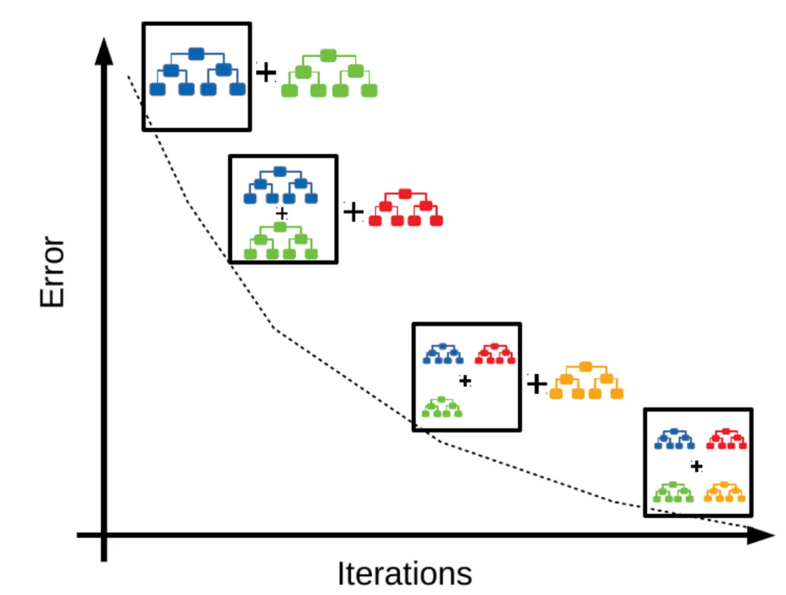

## Table of Contents

## What is Gradient Boosting in machine learning?

Gradient Boosting is a powerful machine learning technique used for both regression and classification problems. It works by building a series of decision trees, each one trying to correct the errors made by the previous ones. The idea is to combine many weak models, which are not very accurate on their own, into a strong model that performs much better. This is done by focusing on the residuals, or the differences between the predicted and actual values, and trying to minimize these errors step by step.

The process starts with an initial model, usually a simple one like the average of the target variable. Then, new trees are added one at a time, and each new tree is trained to predict the residuals of the combined model up to that point. The predictions from all the trees are then combined, with each tree's contribution weighted according to its performance. This method is called "gradient" boosting because it uses gradient descent to minimize the loss function, which measures how wrong the model's predictions are. The final model is a weighted sum of all the trees, and it can make very accurate predictions by learning from its mistakes iteratively.

A popular implementation of gradient boosting is the XGBoost algorithm, which is known for its speed and performance. It includes additional features like regularization to prevent overfitting, and it can handle missing data efficiently. Gradient boosting is widely used in data science competitions and real-world applications because it often outperforms other machine learning methods, especially when the data is complex and the relationships between variables are not straightforward.

## How does Gradient Boosting differ from other ensemble methods like Random Forests?

Gradient Boosting and Random Forests are both ensemble methods, meaning they combine multiple decision trees to make predictions, but they do so in different ways. In Random Forests, many trees are built independently, each on a random subset of the data and features. The final prediction is made by taking a vote from all the trees, where each tree has an equal say. This method helps reduce overfitting by averaging out the errors of individual trees, making Random Forests robust and less sensitive to noise in the data.

On the other hand, Gradient Boosting builds trees sequentially, where each new tree tries to correct the errors made by the previous ones. Instead of voting equally, the trees in Gradient Boosting are weighted according to their performance, with better-performing trees having a larger influence on the final prediction. This approach can lead to very accurate models because it focuses on the hardest-to-predict cases, but it requires careful tuning to avoid overfitting. While Random Forests are simpler to use and often good enough, Gradient Boosting can provide superior results when properly optimized.

To illustrate the difference, consider how each method approaches a simple regression problem. In a Random Forest, if one tree predicts a value of 10 and another predicts 20, the final prediction might be the average, say 15. In contrast, Gradient Boosting might start with an initial prediction, say 5, then add trees that adjust this prediction. If the first tree adds 3 and the second adds 2, the final prediction would be $$5 + 3 + 2 = 10$$. This sequential correction allows Gradient Boosting to potentially capture more complex patterns in the data.

## What are the basic components of a Gradient Boosting algorithm?

Gradient Boosting works by creating a series of decision trees. Each tree is built to fix the mistakes made by the trees that came before it. The first tree starts with a simple guess, like the average of what you're trying to predict. Then, the next tree looks at the difference between this guess and the actual values, called residuals. It tries to predict these residuals to make the overall prediction better. This process repeats, with each new tree focusing on the errors left by the previous ones, gradually improving the model's accuracy.

The predictions from all the trees are added together to make the final prediction. Each tree's contribution is weighted, so trees that do a better job at correcting errors have a bigger impact on the final result. This weighting is done using a technique called gradient descent, which helps minimize the total error of the model. The formula for the final prediction in a regression problem can be written as $$F(x) = F_0(x) + \eta \sum_{m=1}^{M} h_m(x)$$, where $$F_0(x)$$ is the initial guess, $$\eta$$ is the learning rate, $$h_m(x)$$ are the predictions from each tree, and $$M$$ is the total number of trees.

There are a few key settings to adjust in Gradient Boosting. The learning rate, or $$\eta$$, controls how much each tree contributes to the final model. A smaller learning rate means slower learning but can lead to a better final model. The number of trees, or $$M$$, affects how complex the model can be. More trees can make the model more accurate but also increase the risk of overfitting. Regularization techniques, like limiting the size of the trees or adding penalties to the model's complexity, can help prevent overfitting and make the model more generalizable to new data.

## Can you explain the concept of boosting and how it applies to Gradient Boosting?

Boosting is a way to make a bunch of weak models into a strong one. Imagine you have a team of people who aren't very good at guessing the weight of a pumpkin. If you let them guess one at a time and each person tries to fix the mistakes of the last guesser, the team can get better and better at guessing. That's what boosting does with models. It starts with a simple model, then adds more models, each one trying to correct the errors of the ones before it. By doing this, the final model can become very accurate.

In Gradient Boosting, this idea is used with decision trees. The first tree makes a guess, like the average weight of the pumpkins. Then, the next tree looks at how wrong the first guess was and tries to fix those mistakes. Each new tree focuses on the errors left by the previous trees, slowly making the overall guess better. The final prediction is a sum of all the trees' guesses, with each tree's guess weighted by how well it did at fixing the errors. This process is called "gradient" boosting because it uses a math technique called gradient descent to figure out how to make the model better. The formula for the final prediction in a regression problem can be written as $$F(x) = F_0(x) + \eta \sum_{m=1}^{M} h_m(x)$$, where $$F_0(x)$$ is the first guess, $$\eta$$ is how much each tree's guess counts, $$h_m(x)$$ are the guesses from each tree, and $$M$$ is the total number of trees.

## What is the role of the loss function in Gradient Boosting?

The loss function in Gradient Boosting is like a scorekeeper that tells the algorithm how well it's doing. It measures the difference between the model's predictions and the actual values. The goal is to make this difference as small as possible. By using the loss function, Gradient Boosting can figure out where it's making mistakes and then build new trees to fix those mistakes. This process keeps going, with each new tree trying to reduce the loss function a bit more, making the overall model better and better.

The loss function is key because it guides the gradient descent process. Gradient descent is a way to find the best path to lower the loss function. In Gradient Boosting, the algorithm looks at the gradient of the loss function, which shows the direction to go to reduce the loss. Each new tree is built to follow this direction, trying to minimize the loss as much as possible. The formula for updating the model in each step can be written as $$F_m(x) = F_{m-1}(x) + \eta h_m(x)$$, where $$F_{m-1}(x)$$ is the current model, $$\eta$$ is the learning rate, and $$h_m(x)$$ is the new tree's prediction. By following the gradient and adding these trees, the model can get closer and closer to the best possible predictions.

## How does the learning rate affect the performance of a Gradient Boosting model?

The learning rate in a Gradient Boosting model is like a dial that controls how fast the model learns. It's called $$\eta$$ and it decides how much each new tree's prediction counts towards the final prediction. If you set the learning rate high, the model learns quickly, but it might make big jumps and miss the best solution. If you set it low, the model learns slowly, taking small steps towards the best solution, which can lead to a more accurate final model but takes longer to train.

Choosing the right learning rate is important because it affects how well the model performs. A high learning rate can make the model overfit, meaning it does well on the training data but not on new data. A low learning rate can help prevent overfitting, making the model more generalizable. The formula for updating the model in each step is $$F_m(x) = F_{m-1}(x) + \eta h_m(x)$$, where $$F_{m-1}(x)$$ is the current model, $$\eta$$ is the learning rate, and $$h_m(x)$$ is the new tree's prediction. By adjusting the learning rate, you can find a balance between speed and accuracy, helping the model perform its best.

## What are the advantages of using Gradient Boosting over traditional decision trees?

Gradient Boosting is better than traditional decision trees because it uses many trees to make predictions, not just one. In a traditional decision tree, you make a single tree and use it to predict things. But with Gradient Boosting, you start with one tree, then add more trees, each one fixing the mistakes of the last one. This means the final prediction is a lot more accurate because it's based on the combined effort of many trees. The formula for the final prediction in Gradient Boosting can be written as $$F(x) = F_0(x) + \eta \sum_{m=1}^{M} h_m(x)$$, where $$F_0(x)$$ is the first tree, $$\eta$$ is how much each tree's guess counts, $$h_m(x)$$ are the guesses from each tree, and $$M$$ is the total number of trees.

Another advantage of Gradient Boosting is that it can handle complex patterns in the data better than a single decision tree. A single tree might be good at finding simple patterns, but it can miss the more complicated ones. Gradient Boosting builds trees one after another, focusing on the errors left by the previous trees. This way, it can learn from its mistakes and capture more subtle relationships in the data. This makes it a powerful tool for tasks where the relationships between variables are not straightforward, leading to better predictions overall.

## How can overfitting be prevented in Gradient Boosting models?

Overfitting in Gradient Boosting models can be prevented by adjusting the learning rate, which is like a dial that controls how fast the model learns. If the learning rate is too high, the model might learn too much from the training data and not do well on new data. By setting the learning rate lower, the model learns more slowly and takes smaller steps towards the best solution, which can help prevent overfitting. The formula for updating the model in each step is $$F_m(x) = F_{m-1}(x) + \eta h_m(x)$$, where $$F_{m-1}(x)$$ is the current model, $$\eta$$ is the learning rate, and $$h_m(x)$$ is the new tree's prediction.

Another way to prevent overfitting is by using regularization techniques. Regularization adds a penalty to the model's complexity, which can stop it from getting too complicated and fitting the training data too closely. This can be done by limiting the size of the trees or by adding penalties to the model's complexity. By doing this, the model becomes more generalizable and performs better on new data.

## What are some popular implementations of Gradient Boosting, such as XGBoost and LightGBM?

XGBoost and LightGBM are two popular implementations of Gradient Boosting that are widely used because they are fast and work well. XGBoost, which stands for eXtreme Gradient Boosting, is known for its speed and performance. It uses a technique called regularization to prevent overfitting, which means it can handle missing data efficiently and make the model more generalizable. XGBoost builds trees one at a time, with each new tree trying to fix the mistakes of the previous ones. The formula for the final prediction in XGBoost can be written as $$F(x) = F_0(x) + \eta \sum_{m=1}^{M} h_m(x)$$, where $$F_0(x)$$ is the first guess, $$\eta$$ is the learning rate, $$h_m(x)$$ are the guesses from each tree, and $$M$$ is the total number of trees.

LightGBM, which stands for Light Gradient Boosting Machine, is another implementation that's known for being even faster than XGBoost. It uses a different way of building trees called leaf-wise growth, which can lead to better performance, especially with large datasets. LightGBM also includes features like regularization to prevent overfitting, making it a good choice for many [machine learning](/wiki/machine-learning) tasks. Both XGBoost and LightGBM are popular in data science competitions and real-world applications because they can handle complex data and often give better results than other methods.

## How do you tune hyperparameters in a Gradient Boosting model for optimal performance?

Tuning hyperparameters in a Gradient Boosting model means adjusting settings to make it work as well as possible. One important setting is the learning rate, which controls how fast the model learns. A lower learning rate can help prevent overfitting, making the model more generalizable to new data. Another key setting is the number of trees, which affects how complex the model can be. More trees can make the model more accurate but also increase the risk of overfitting. You can use a technique called cross-validation to test different settings and see which ones give the best results. This involves splitting the data into parts, training the model on some parts, and testing it on others to make sure it works well on different data.

Regularization is another way to tune the model. It adds a penalty to the model's complexity, which can stop it from getting too complicated and fitting the training data too closely. This can be done by limiting the size of the trees or by adding penalties to the model's complexity. The formula for updating the model in each step can be written as $$F_m(x) = F_{m-1}(x) + \eta h_m(x)$$, where $$F_{m-1}(x)$$ is the current model, $$\eta$$ is the learning rate, and $$h_m(x)$$ is the new tree's prediction. By adjusting these settings, you can find a balance between speed and accuracy, helping the model perform its best.

## What are some advanced techniques used in Gradient Boosting, like histogram-based algorithms?

Histogram-based algorithms in Gradient Boosting are a way to make the model work faster and handle big data better. Instead of looking at every single data point when building trees, these algorithms group the data into bins, like sorting items into different boxes. This makes it quicker to find the best way to split the data in each tree. For example, XGBoost and LightGBM use histogram-based methods to speed up their tree-building process. By using these bins, the model can process large datasets more efficiently and still make accurate predictions.

One popular histogram-based method is used in LightGBM, which builds trees in a different way called leaf-wise growth. Instead of growing trees level by level, LightGBM grows them leaf by leaf, which can lead to better performance, especially with big data. This method, combined with histogram-based algorithms, helps LightGBM run faster and handle more complex data than traditional Gradient Boosting methods. The formula for updating the model in each step can be written as $$F_m(x) = F_{m-1}(x) + \eta h_m(x)$$, where $$F_{m-1}(x)$$ is the current model, $$\eta$$ is the learning rate, and $$h_m(x)$$ is the new tree's prediction. By using these advanced techniques, Gradient Boosting models can be tuned to work even better and handle more challenging tasks.

## Can you discuss a real-world application where Gradient Boosting provided significant improvements over other methods?

In the world of online advertising, a company called Criteo used Gradient Boosting to predict whether a user would click on an ad. They had a huge amount of data, with millions of ads shown every day. Traditional methods like logistic regression struggled to handle this data and make accurate predictions. But when Criteo switched to using XGBoost, a type of Gradient Boosting, they saw a big improvement. XGBoost could handle the large dataset efficiently and make better predictions about which ads users would click on. This led to more effective ad targeting and higher click-through rates, which meant more money for the company.

Another example is in the healthcare industry, where Gradient Boosting was used to predict patient readmissions. A hospital wanted to know which patients were likely to come back after being discharged, so they could provide better care and reduce costs. They tried using traditional decision trees, but the predictions were not accurate enough. When they switched to LightGBM, another type of Gradient Boosting, they found that it could capture more complex patterns in the patient data. LightGBM's ability to handle large datasets and its fast processing speed made it a better choice. As a result, the hospital was able to predict readmissions more accurately, leading to improved patient care and lower costs.