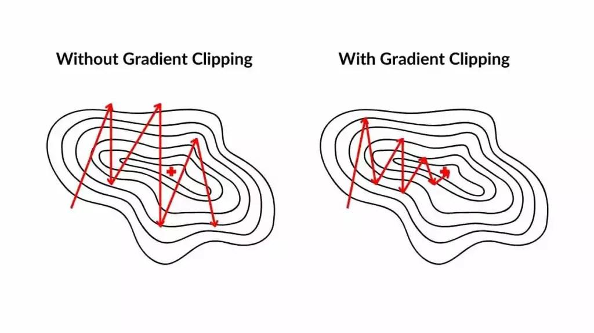

## Table of Contents

## What is gradient clipping in machine learning?

Gradient clipping is a technique used in machine learning to prevent the gradients from getting too large during training. When training a neural network, the gradients are used to update the model's weights. If the gradients are too large, they can cause the updates to be too big, which can lead to unstable training or even make the model fail to learn properly. By clipping the gradients, we set a maximum value that the gradients can take, ensuring that the updates remain within a manageable range.

To implement gradient clipping, we typically set a threshold value. If the gradient's magnitude exceeds this threshold, we scale it down so that it equals the threshold. This can be done using different methods, such as clipping the norm of the gradient or clipping the individual components of the gradient. For example, if we are clipping the norm of the gradient, we might use a formula like $$ \text{gradient}_{\text{clipped}} = \text{threshold} \cdot \frac{\text{gradient}}{\|\text{gradient}\|} $$ if the norm of the gradient is larger than the threshold. This helps to keep the training process stable and can improve the model's performance.

## Why is gradient clipping necessary in neural networks?

Gradient clipping is necessary in neural networks because it helps keep the training process stable. When a neural network is learning, it uses gradients to update its weights. Sometimes, these gradients can become very large, which can cause the updates to be too big. This can make the training unstable, and the network might not learn properly. By using gradient clipping, we set a limit on how big the gradients can get. This means the updates stay within a safe range, helping the network to learn more smoothly.

For example, if the gradient's size is bigger than a certain threshold, we can scale it down to that threshold. This can be done by calculating the norm of the gradient and adjusting it if necessary. If the norm of the gradient is larger than the threshold, we use a formula like $$ \text{gradient}_{\text{clipped}} = \text{threshold} \cdot \frac{\text{gradient}}{\|\text{gradient}\|} $$ to clip it. This way, even if the gradients start to grow too large, they are kept under control, which helps the neural network to train more effectively and reach better performance.

## How does gradient clipping help in preventing the exploding gradient problem?

Gradient clipping helps prevent the exploding gradient problem by setting a limit on how big the gradients can get. When training a [neural network](/wiki/neural-network), gradients are used to update the weights of the network. If these gradients become too large, they can cause the updates to be too big, making the training unstable. This is known as the exploding gradient problem. By using gradient clipping, we make sure that the gradients don't get too big, which keeps the training process stable and helps the network learn better.

To [clip](/wiki/clip) the gradients, we set a threshold value. If the size of a gradient is bigger than this threshold, we scale it down to the threshold. For example, if the norm of the gradient is larger than the threshold, we can use a formula like $$ \text{gradient}_{\text{clipped}} = \text{threshold} \cdot \frac{\text{gradient}}{\|\text{gradient}\|} $$ to clip it. This way, even if the gradients start to grow too large, they are kept under control. This helps the neural network to train more effectively and reach better performance without running into the exploding gradient problem.

## What are the different types of gradient clipping techniques?

Gradient clipping can be done in different ways. One way is called norm clipping. This method looks at the overall size of the gradient, called the norm. If the norm is bigger than a certain number, we shrink the whole gradient to make it smaller. We use a formula like $$ \text{gradient}_{\text{clipped}} = \text{threshold} \cdot \frac{\text{gradient}}{\|\text{gradient}\|} $$ to do this. This helps keep the training stable by making sure the gradient's total size stays within a safe limit.

Another way is called value clipping. In this method, we look at each part of the gradient one by one. If any part is bigger than a certain number, we set it to that number. If any part is smaller than a negative of that number, we set it to that negative number. This way, we make sure no single part of the gradient gets too big or too small. Both norm clipping and value clipping help stop the gradients from getting too large, which can make the training of the neural network smoother and more effective.

## How do you implement gradient clipping in popular deep learning frameworks like TensorFlow or PyTorch?

In TensorFlow, gradient clipping can be implemented using the `tf.clip_by_value` or `tf.clip_by_norm` functions. To use `tf.clip_by_value`, you specify a minimum and maximum value, and any gradient values outside this range are set to the minimum or maximum. For example, if you want to clip gradients between -1 and 1, you can use `tf.clip_by_value(gradients, -1, 1)`. On the other hand, `tf.clip_by_norm` clips the gradients based on their norm. If the norm of the gradient exceeds a specified threshold, the gradient is scaled down so that its norm equals the threshold. You can use it like this: `tf.clip_by_norm(gradients, clip_norm=1.0)`.

In PyTorch, gradient clipping is typically done using the `torch.nn.utils.clip_grad_norm_` or `torch.nn.utils.clip_grad_value_` functions. The `clip_grad_norm_` function clips the gradients based on their norm. You provide the model's parameters and a maximum norm value, and PyTorch will scale down the gradients if necessary. For example, you can use `torch.nn.utils.clip_grad_norm_(model.parameters(), max_norm=1.0)`. The `clip_grad_value_` function clips the gradients based on their absolute value. You provide the model's parameters and a maximum value, and any gradient values exceeding this are set to the maximum value. For instance, `torch.nn.utils.clip_grad_value_(model.parameters(), clip_value=1.0)` will clip the gradients to a maximum value of 1.0.

Both methods help keep the training of neural networks stable by preventing gradients from getting too large, which can lead to the exploding gradient problem. By using these functions, you can ensure that your model learns more effectively and reaches better performance.

## What are the potential drawbacks of using gradient clipping?

Gradient clipping can sometimes make the training process slower. When you clip the gradients, you are setting a limit on how much the model can change at each step. This can make the model take smaller steps than it needs to, which means it might take longer to reach the best solution. If the threshold for clipping is set too low, it can really slow down the training because the model can't take big enough steps to learn quickly.

Another potential problem with gradient clipping is that it might hide other issues in the model. If the gradients are getting too big, it could be a sign that something else is wrong, like the learning rate being too high or the model being too complex. By clipping the gradients, you might stop the model from getting worse, but you might also miss the chance to fix the real problem. This means you need to be careful and check other parts of the model to make sure everything is working as it should.

## How does the choice of clipping threshold affect model training?

The choice of the clipping threshold can have a big impact on how well a model trains. If the threshold is set too high, it might not do much to stop the gradients from getting too big. This means the exploding gradient problem could still happen, making the training unstable. On the other hand, if the threshold is set too low, it can make the model take very small steps during training. This can slow down the learning process because the model can't make big enough changes to reach the best solution quickly.

Finding the right clipping threshold is a bit like finding the right balance. You want it to be high enough to let the model learn quickly, but not so high that the gradients get out of control. A good way to find the best threshold is to try different values and see which one works best for your model. For example, if you are using norm clipping, you might start with a threshold of 1.0 and see how the model trains. If the training is still unstable, you might try a lower threshold like 0.5. If the training is too slow, you might try a higher threshold like 1.5. The goal is to find a threshold that keeps the training stable and helps the model learn as fast as possible.

## Can gradient clipping be used in conjunction with other optimization techniques?

Gradient clipping can definitely be used with other optimization techniques to make training a neural network even better. For example, you can use gradient clipping along with learning rate schedules. A learning rate schedule changes the learning rate over time, and when you use it with gradient clipping, it can help the model learn more smoothly. The clipping keeps the gradients from getting too big, while the changing learning rate helps the model take the right size steps at different parts of the training. This can make the whole process more stable and help the model reach a better solution.

Another technique that works well with gradient clipping is [momentum](/wiki/momentum). Momentum helps the model keep moving in the same direction, even if the gradients change a lot. When you use momentum with gradient clipping, the clipping stops the gradients from getting too big, and the momentum helps the model keep learning in a good direction. This can make the training faster and more stable. By combining gradient clipping with these other methods, you can help your model learn better and avoid problems like the exploding gradient problem.

## What are some real-world scenarios where gradient clipping significantly improved model performance?

In natural language processing, gradient clipping has been really helpful when training large language models. These models often have a lot of layers and can be hard to train because the gradients can get very big. By using gradient clipping, researchers have been able to train these models more easily. For example, when training models like transformers, which are used for tasks like translating languages or understanding text, gradient clipping helps keep the training stable. This means the models can learn better and give more accurate answers. A common way to do this is by using norm clipping, where the gradient's size is limited with a formula like $$ \text{gradient}_{\text{clipped}} = \text{threshold} \cdot \frac{\text{gradient}}{\|\text{gradient}\|} $$. This helps make sure the model keeps learning without running into big problems.

In the field of [reinforcement learning](/wiki/reinforcement-learning), gradient clipping has also made a big difference. Training [agents](/wiki/agents) to play games or solve tasks can be tricky because the rewards can change a lot, which can make the gradients grow very large. By using gradient clipping, researchers have been able to train these agents more effectively. For instance, when training agents to play complex games like Go or chess, gradient clipping helps keep the training stable. This allows the agents to learn strategies better and perform better in the game. By setting a limit on how big the gradients can get, the training process becomes smoother, and the agents can reach higher levels of performance.

## How does gradient clipping interact with learning rate schedules?

Gradient clipping and learning rate schedules work together to make training a neural network smoother and more effective. A learning rate schedule changes the learning rate over time, helping the model take the right size steps at different parts of the training. When you use gradient clipping with a learning rate schedule, the clipping keeps the gradients from getting too big, while the changing learning rate helps the model learn at the right pace. This combination can make the training more stable because the gradients are controlled, and the learning rate is adjusted to fit the needs of the model at different stages.

For example, if the learning rate starts high and then gets smaller over time, gradient clipping can prevent the large gradients that might happen at the beginning from causing problems. By using a formula like $$ \text{gradient}_{\text{clipped}} = \text{threshold} \cdot \frac{\text{gradient}}{\|\text{gradient}\|} $$ to clip the gradients, you can make sure the model keeps learning without running into the exploding gradient problem. This way, the model can take advantage of the high learning rate to learn quickly at first and then slow down to fine-tune its performance, all while keeping the training stable.

## What advanced strategies can be used to dynamically adjust the clipping threshold during training?

One advanced strategy for dynamically adjusting the clipping threshold during training is to monitor the gradient norms and adjust the threshold based on their behavior. You can start with a higher threshold and gradually lower it if you notice that the gradients are consistently hitting the threshold. This helps the model to take larger steps early in training when the gradients might be more variable, and then take smaller, more controlled steps as the training progresses and the gradients become more stable. For example, you might use a formula like $$ \text{new_threshold} = \text{current_threshold} \cdot \alpha $$ where $$\alpha$$ is a decay [factor](/wiki/factor-investing) less than 1, to slowly decrease the threshold over time.

Another strategy involves using adaptive clipping thresholds based on the training dynamics. You can track the average gradient norm over a certain number of steps and adjust the threshold to be a multiple of this average. This way, the threshold adapts to the specific characteristics of your training data and model, allowing for more tailored control of the gradients. If the average gradient norm starts to increase, you might increase the threshold slightly to allow for larger updates, or decrease it if the norm decreases, to keep the training stable. This can be implemented using code like:

```python
average_norm = moving_average(grad_norms, window_size)
new_threshold = clip_multiplier * average_norm
```

By using these dynamic strategies, you can better manage the gradients throughout the training process, potentially leading to faster convergence and better model performance.

## How can the effectiveness of gradient clipping be quantitatively measured and compared across different models?

To measure and compare the effectiveness of gradient clipping across different models, you can look at how stable the training process is and how well the model performs. One way to do this is by tracking the gradient norms during training. If the gradients are often hitting the clipping threshold, it might mean the threshold is too low, which could slow down the training. On the other hand, if the gradients rarely hit the threshold, it might mean the threshold is too high, and the model might be at risk of the exploding gradient problem. By comparing the frequency and size of the clipped gradients across models, you can see which clipping strategy works best for each model.

Another way to measure the effectiveness of gradient clipping is by looking at the model's performance metrics, like accuracy or loss. You can train the same model with different clipping thresholds and see how the performance changes. For example, you might use a formula like $$ \text{gradient}_{\text{clipped}} = \text{threshold} \cdot \frac{\text{gradient}}{\|\text{gradient}\|} $$ to clip the gradients and then compare the final accuracy or loss of the model. If one threshold leads to better performance, that suggests it's a more effective clipping strategy for that model. By doing this comparison across different models, you can find the best clipping approach for each one.

## References & Further Reading

[1]: Pascanu, R., Mikolov, T., & Bengio, Y. (2013). ["On the Difficulty of Training Recurrent Neural Networks."](https://arxiv.org/abs/1211.5063) Proceedings of the 30th International Conference on Machine Learning.

[2]: Goodfellow, I., Bengio, Y., & Courville, A. (2016). ["Deep Learning."](https://www.deeplearningbook.org/) MIT Press.

[3]: Sutskever, I., Martens, J., Dahl, G., & Hinton, G. (2013). ["On the importance of initialization and momentum in deep learning."](https://proceedings.mlr.press/v28/sutskever13.html) Proceedings of the 30th International Conference on Machine Learning.

[4]: Zhang, Y., & LeCun, Y. (2015). ["Text Understanding from Scratch."](https://arxiv.org/abs/1502.01710) arXiv:1502.01710.

[5]: He, K., Zhang, X., Ren, S., & Sun, J. (2016). ["Deep Residual Learning for Image Recognition."](https://ieeexplore.ieee.org/document/7780459) Proceedings of the IEEE Conference on Computer Vision and Pattern Recognition (CVPR).

[6]: Hochreiter, S., & Schmidhuber, J. (1997). ["Long Short-term Memory."](https://ieeexplore.ieee.org/abstract/document/6795963) Neural Computation, 9(8), 1735-1780.

[7]: Graves, A., Mohamed, A., & Hinton, G. (2013). ["Speech Recognition with Deep Recurrent Neural Networks."](https://arxiv.org/pdf/1303.5778) 2013 IEEE International Conference on Acoustics, Speech and Signal Processing.