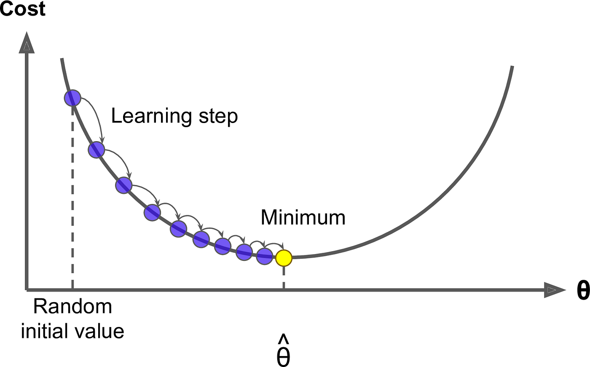

## Table of Contents

## What is Gradient Descent in the context of machine learning?

Gradient Descent is a way to make machine learning models better. Imagine you're trying to find the lowest point in a valley covered in fog. You can't see the whole valley, but you can feel the slope under your feet. You keep walking downhill, adjusting your direction based on how steep the ground feels. In machine learning, the "valley" is the error of the model, and walking downhill means adjusting the model's parameters to reduce this error. The "slope" you feel is the gradient, which tells you how to change the parameters to make the error smaller.

The process works like this: you start with some initial guesses for the model's parameters. Then, you calculate the gradient of the error with respect to these parameters. The gradient shows you the direction in which the error increases most rapidly. By moving in the opposite direction, you can reduce the error. You keep doing this, taking small steps (controlled by a learning rate) until you reach a point where the error is as small as possible. This method is widely used because it's simple and works well for many types of models, but it can be slow and might get stuck in places that aren't the very lowest point if the valley has many small dips.

## How does Gradient Descent help in optimizing a model?

Gradient Descent helps in optimizing a model by finding the best values for the model's parameters that minimize the error. Think of the error as a hilly landscape, and the goal is to find the lowest point. Gradient Descent does this by starting at a random spot on the landscape and then taking small steps downhill. Each step is guided by the gradient, which is like a compass telling you which way is downhill. The gradient is calculated using the derivative of the error with respect to the parameters, showing how the error changes as you tweak the parameters. By following the negative gradient, you move towards lower error values.

The process continues until you reach a point where moving in any direction would not decrease the error further. This point is called a local minimum, and if you're lucky, it's also the global minimum, the very lowest point on the landscape. The size of the steps you take is controlled by the learning rate, which you set at the beginning. If it's too big, you might overshoot the minimum and jump around; if it's too small, you'll take forever to get there. By carefully adjusting the learning rate and using techniques like momentum, you can make Gradient Descent more efficient and effective in finding the best parameters for your model.

## What are the different types of Gradient Descent algorithms?

There are three main types of Gradient Descent algorithms: Batch Gradient Descent, Stochastic Gradient Descent, and Mini-batch Gradient Descent. Batch Gradient Descent uses the entire dataset to compute the gradient of the cost function in each iteration. This method is very accurate but can be slow and memory-intensive, especially with large datasets. In contrast, Stochastic Gradient Descent (SGD) uses only one randomly chosen example from the dataset to calculate the gradient and update the parameters in each iteration. This makes SGD much faster and suitable for online learning, but it can be noisy and less stable, as the updates might not always point towards the global minimum.

Mini-batch Gradient Descent is a compromise between Batch and Stochastic Gradient Descent. It uses a small, randomly selected subset of the data (called a mini-batch) to compute the gradient and update the parameters. This approach balances the accuracy of Batch Gradient Descent with the speed of Stochastic Gradient Descent. Mini-batch Gradient Descent is commonly used in practice because it converges more smoothly and can take advantage of hardware optimizations like GPU acceleration. Each of these methods has its own advantages and is chosen based on the specific needs of the problem, such as the size of the dataset and the computational resources available.

## Can you explain the concept of learning rate in Gradient Descent?

The learning rate in Gradient Descent is like the size of the steps you take when you're trying to find the lowest point in a valley. If you take big steps (a high learning rate), you might reach the bottom faster, but you also risk overshooting and missing the lowest point. On the other hand, if you take tiny steps (a low learning rate), you'll be more careful and less likely to miss the bottom, but it will take you much longer to get there. The learning rate is a number, usually between 0 and 1, that you set before you start the Gradient Descent process. It's a balance: you want it big enough to make progress quickly, but not so big that you jump around and never settle down.

Choosing the right learning rate is important because it affects how well and how fast your model learns. If the learning rate is too high, the model might not converge to the best solution, and if it's too low, the model might take too long to reach a good solution. Sometimes, people use techniques like learning rate schedules, where the learning rate changes over time. For example, you might start with a high learning rate to make quick progress and then slowly decrease it to fine-tune the model. The goal is always to find the learning rate that helps your model learn as efficiently and effectively as possible.

## What is the role of the cost function in Gradient Descent?

The cost function in Gradient Descent is like a map that tells you how well your model is doing. It's a way to measure the error between what your model predicts and what the actual data says. When you're trying to make your model better, you want to find the settings (parameters) that make this error as small as possible. The cost function helps you do this by giving you a number that you can use to guide your steps towards the best settings.

In Gradient Descent, you use the cost function to figure out which way to move your parameters. You do this by calculating the gradient, which is the slope of the cost function. The gradient tells you which way the error is increasing the fastest. By moving your parameters in the opposite direction of the gradient, you can make the error smaller. This process keeps going until you can't make the error any smaller, which means you've found the best settings for your model.

## How does Batch Gradient Descent differ from Stochastic Gradient Descent?

Batch Gradient Descent and Stochastic Gradient Descent are two ways to make a [machine learning](/wiki/machine-learning) model better, but they do it differently. Batch Gradient Descent uses all the data you have at once to figure out how to change the model's settings to make it better. It calculates the error for all the data and then uses that to adjust the settings. This method is very accurate because it uses all the information available, but it can be slow and use a lot of memory, especially if you have a lot of data.

On the other hand, Stochastic Gradient Descent (SGD) takes a different approach. Instead of using all the data at once, SGD picks just one piece of data at a time to figure out how to change the model's settings. This makes SGD much faster because it doesn't need to look at all the data in each step. However, because it's only using one piece of data at a time, the changes it makes can be a bit random and might not always point the model in the best direction. But over time, as it goes through more data, SGD can still find a good solution, and it's especially useful when you have a lot of data or when you're learning from data as it comes in.

## What are the advantages and disadvantages of using Mini-batch Gradient Descent?

Mini-batch Gradient Descent is a good middle ground between Batch Gradient Descent and Stochastic Gradient Descent. It takes a small group of data points, called a mini-batch, to calculate the gradient and update the model's settings. This method is faster than Batch Gradient Descent because it doesn't need to look at all the data at once, and it's more stable than Stochastic Gradient Descent because it uses more than one data point at a time. This balance makes Mini-batch Gradient Descent work well on many different types of computers, including those with special chips like GPUs that can do many calculations at once.

However, Mini-batch Gradient Descent also has its downsides. Choosing the right size for the mini-batch can be tricky. If the mini-batch is too small, the updates might be too random and not point the model in the best direction. If it's too big, it might slow down the learning process and use more memory. Also, Mini-batch Gradient Descent can still get stuck in places that aren't the very best solution, just like the other methods. But overall, it's a popular choice because it often gives a good balance between speed and accuracy.

## How can one address the issue of local minima in Gradient Descent?

When using Gradient Descent to make a model better, you might run into a problem called local minima. Imagine you're in a valley trying to find the lowest point, but there are many small dips along the way. If you get stuck in one of these dips, you might think you've found the lowest point, but there could be an even lower spot somewhere else. In machine learning, these local minima can stop your model from being as good as it could be because it gets stuck and doesn't keep looking for a better solution.

To help avoid getting stuck in local minima, people use different tricks. One common trick is to use a technique called "[momentum](/wiki/momentum)." Momentum helps the model keep moving even if it hits a small dip, kind of like a ball rolling down a hill. It keeps the model going in the right direction and can help it jump out of local minima to find a better spot. Another trick is to start the model from different places on the "landscape" and see which starting point leads to the best result. By trying different starting points, you increase the chance of finding the global minimum, the very best solution for your model.

## What techniques can be used to improve the convergence of Gradient Descent?

To make Gradient Descent work better and find the best solution faster, you can use a few smart tricks. One trick is to change the learning rate as you go along. You can start with a big learning rate to make quick progress and then slowly make it smaller to fine-tune your model. This is called a learning rate schedule. Another trick is to use momentum. Momentum is like giving your model a push to keep it moving in the right direction, even if it hits a small bump. It helps the model not get stuck and keeps it moving towards the best solution.

Another way to help Gradient Descent is to use a technique called adaptive learning rates. Methods like AdaGrad, RMSprop, and Adam change the learning rate for each parameter in your model based on how much it's been changing. This can make the learning process faster and more stable. For example, Adam is popular because it combines the ideas of momentum and adaptive learning rates, making it good at finding the best solution quickly. By using these techniques, you can make your model learn faster and find the best settings more easily.

## How does Gradient Descent apply to neural networks?

In neural networks, Gradient Descent is used to train the network by finding the best values for its weights and biases. Imagine a [neural network](/wiki/neural-network) as a complicated machine with many knobs and dials that you need to adjust to make it work well. The goal is to adjust these knobs and dials (weights and biases) so that the network can make the best predictions. Gradient Descent helps by figuring out which way to turn each knob to make the predictions better. It does this by calculating the gradient of the loss function, which tells how much each weight and bias affects the error. By following the negative gradient, the network's weights and biases are updated to reduce the error, step by step, until the network performs as well as possible.

The process of using Gradient Descent in neural networks involves a technique called backpropagation. Backpropagation is like a smart way of figuring out how each weight and bias contributed to the final error. It starts at the end of the network, where the predictions are made, and works backward to figure out how each part of the network affected the error. This information is used to calculate the gradient, and then Gradient Descent uses this gradient to update the weights and biases. By repeating this process many times, the neural network learns to make better and better predictions. This is why Gradient Descent is so important in training neural networks—it helps them learn from data and improve over time.

## What are some advanced variants of Gradient Descent used in deep learning?

In [deep learning](/wiki/deep-learning), advanced variants of Gradient Descent have been developed to make training neural networks faster and more efficient. One popular variant is called Adam, which stands for Adaptive Moment Estimation. Adam combines the ideas of momentum and adaptive learning rates. Momentum helps the model keep moving in the right direction, even if it hits small bumps, while adaptive learning rates change for each parameter based on how much it's been changing. This combination makes Adam good at finding the best solution quickly. Another variant is RMSprop, which also uses adaptive learning rates but focuses on reducing the impact of past gradients to help the model learn more smoothly.

Another advanced variant is called AdaGrad, which stands for Adaptive Gradient Algorithm. AdaGrad adapts the learning rate for each parameter, making larger updates for less frequent parameters and smaller updates for frequent ones. This can be useful for sparse data, where some features appear more often than others. However, AdaGrad can slow down over time because it keeps adding up past gradients. To address this, a variant called AdaDelta was developed, which uses a moving window of past gradients instead of accumulating them all, making the learning process more stable and efficient.

These advanced variants of Gradient Descent are important because they help neural networks learn faster and better. They adjust the learning process on the fly, making it easier to train deep networks that can handle complex tasks like image recognition or natural language processing. By using these methods, researchers and engineers can build more powerful models that can learn from large amounts of data more effectively.

## How can one implement Gradient Descent from scratch in Python?

To implement Gradient Descent from scratch in Python, you need to define a cost function and then update the parameters of your model based on the gradient of this cost function. Let's say you're trying to fit a simple linear regression model, where you want to find the best values for the slope (m) and the y-intercept (b) to minimize the mean squared error. The cost function for this would be the average of the squared differences between the predicted and actual values. You would then calculate the gradient of this cost function with respect to m and b, and use these gradients to update m and b in the opposite direction of the gradient to minimize the error.

Here's how you can do it in Python:

```python
import numpy as np

# Sample data
X = np.array([1, 2, 3, 4, 5])
y = np.array([2, 4, 5, 4, 5])

# Initialize parameters
m = 0
b = 0
learning_rate = 0.01
num_iterations = 1000

# Gradient Descent
for i in range(num_iterations):
    # Calculate predictions
    y_pred = m * X + b

    # Calculate gradients
    dm = (-2/X.size) * np.sum(X * (y - y_pred))
    db = (-2/X.size) * np.sum(y - y_pred)

    # Update parameters
    m = m - learning_rate * dm
    b = b - learning_rate * db

print(f"Final m: {m}, Final b: {b}")
```

In this code, we start with some initial values for m and b, and then iterate through the data multiple times. In each iteration, we calculate the predictions using the current values of m and b, then compute the gradients of the cost function with respect to m and b. These gradients tell us how to change m and b to reduce the error. We then update m and b by moving them in the opposite direction of the gradients, scaled by the learning rate. After many iterations, we should end up with values of m and b that make our model fit the data well.