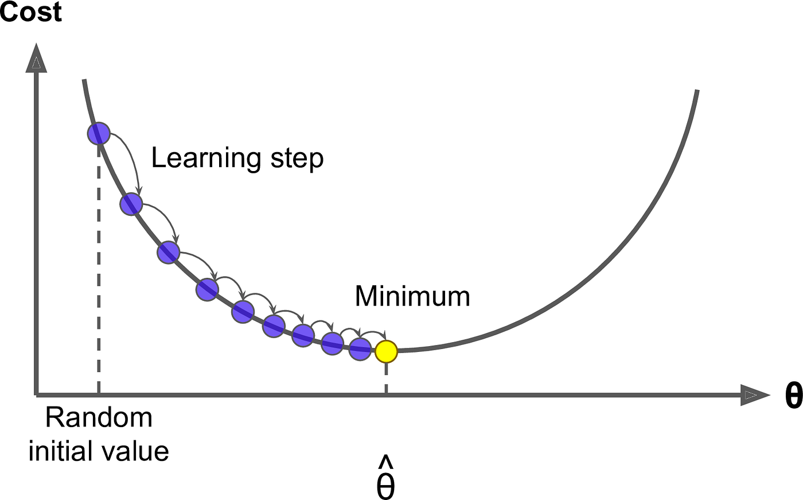

## Table of Contents

## What is gradient in the context of machine learning?

In machine learning, the gradient is a key concept used in training models, especially in algorithms like gradient descent. It's essentially a vector that points in the direction of the steepest increase of a function. Imagine you're standing on a hill and you want to know the direction to climb up the fastest. The gradient tells you that direction. In the context of machine learning, the function we're dealing with is often the loss function, which measures how bad our model's predictions are. The goal is to minimize this function, so we use the gradient to find the direction that reduces the loss the most.

To understand how the gradient works in practice, consider the gradient descent algorithm. This algorithm iteratively adjusts the parameters of the model to minimize the loss function. At each step, it calculates the gradient of the loss function with respect to the model's parameters. The gradient tells us how to change the parameters to reduce the loss. Mathematically, if our loss function is $$L(\theta)$$, where $$\theta$$ represents the model's parameters, the gradient is $$\nabla L(\theta)$$. The update rule for gradient descent can be written as $$\theta = \theta - \alpha \nabla L(\theta)$$, where $$\alpha$$ is the learning rate, a small number that controls how big the steps are. By following the negative gradient, the algorithm moves towards the minimum of the loss function, improving the model's performance over time.

## How is gradient used in optimization algorithms?

In optimization algorithms, the gradient is like a guide that shows the best way to move to improve a situation. Imagine you're trying to find the lowest point in a valley. The gradient tells you which way to walk downhill the fastest. In machine learning, this "valley" is the loss function, which tells us how bad our model's predictions are. We want to find the lowest point in this valley, which means making our model's predictions as good as possible. The gradient helps us do this by showing us the direction to move our model's parameters to reduce the loss.

The most common way to use the gradient in optimization is through an algorithm called gradient descent. This algorithm works by taking small steps in the direction of the negative gradient. If our loss function is $$L(\theta)$$, where $$\theta$$ represents the model's parameters, the gradient is $$\nabla L(\theta)$$. The update rule for gradient descent can be written as $$\theta = \theta - \alpha \nabla L(\theta)$$, where $$\alpha$$ is the learning rate, a small number that controls how big the steps are. By following the negative gradient, the algorithm moves towards the minimum of the loss function, improving the model's performance over time.

## What is gradient descent and why is it important in machine learning?

Gradient descent is a way to make [machine learning](/wiki/machine-learning) models better. Imagine you're trying to find the lowest point in a valley. The gradient tells you which way to walk downhill the fastest. In machine learning, this "valley" is called the loss function, which shows how bad our model's guesses are. We want to make our model's guesses as good as possible, so we use gradient descent to find the lowest point in this valley. The way it works is by taking small steps in the direction that makes the loss function smaller. If our loss function is $$L(\theta)$$, where $$\theta$$ represents the model's parameters, the gradient is $$\nabla L(\theta)$$. The update rule for gradient descent can be written as $$\theta = \theta - \alpha \nabla L(\theta)$$, where $$\alpha$$ is the learning rate, a small number that controls how big the steps are.

Gradient descent is important in machine learning because it helps us train our models. By using the gradient to guide the model's parameters towards the best possible values, we can make our model's predictions more accurate. This process is like fine-tuning a radio to get the clearest signal. Without gradient descent, it would be much harder to improve our models because we wouldn't know which direction to adjust the parameters. So, gradient descent is a key tool that makes machine learning possible and effective.

## Can you explain the difference between batch gradient descent, stochastic gradient descent, and mini-batch gradient descent?

Batch gradient descent, stochastic gradient descent, and mini-batch gradient descent are different ways to use the gradient to improve machine learning models. Batch gradient descent uses the entire dataset to calculate the gradient and update the model's parameters. This means it takes one big step after looking at all the data. It can be slow and might need a lot of memory, but it gives a very accurate direction to move. The update rule for batch gradient descent is $$ \theta = \theta - \alpha \nabla L(\theta) $$, where $$ \theta $$ are the model's parameters, $$ \alpha $$ is the learning rate, and $$ \nabla L(\theta) $$ is the gradient of the loss function calculated over the entire dataset.

Stochastic gradient descent (SGD) is different because it looks at just one example at a time to calculate the gradient and update the parameters. This means it takes many small steps, each based on a single data point. SGD can be faster and use less memory than batch gradient descent, but the steps might be a bit more random and less accurate. The update rule for SGD is $$ \theta = \theta - \alpha \nabla L(\theta_i) $$, where $$ \theta_i $$ is the gradient calculated from the i-th example. Mini-batch gradient descent tries to balance the two by using a small group of examples, called a mini-batch, to calculate the gradient and update the parameters. This method is often faster than batch gradient descent and more stable than SGD. The update rule for mini-batch gradient descent is $$ \theta = \theta - \alpha \nabla L(\theta_{mini-batch}) $$, where $$ \theta_{mini-batch} $$ is the gradient calculated from the mini-batch of examples.

## How does learning rate affect gradient descent?

The learning rate in gradient descent is like the size of the steps you take when walking downhill. If the learning rate is too big, you might take huge steps and jump over the lowest point, making it hard to find the best solution. On the other hand, if the learning rate is too small, you'll take tiny steps, and it might take a long time to reach the bottom. The learning rate, often called $$ \alpha $$, controls how much the model's parameters change with each update. The update rule for gradient descent is $$ \theta = \theta - \alpha \nabla L(\theta) $$, where $$ \theta $$ are the model's parameters, and $$ \nabla L(\theta) $$ is the gradient of the loss function. Choosing the right learning rate is important to make sure the model improves quickly and accurately.

Finding the right learning rate can be tricky. Sometimes, people start with a big learning rate and slowly make it smaller as the model gets better. This is called learning rate decay or scheduling. Other times, they might try different learning rates and see which one works best. If the learning rate is too big, the loss function might start to go up and down a lot, a problem called oscillation. If it's too small, the loss might go down very slowly, a problem called slow convergence. Getting the learning rate just right helps the model learn faster and find the best solution more reliably.

## What are some common challenges faced when using gradient descent?

One common challenge with gradient descent is choosing the right learning rate. If the learning rate is too big, the model might jump over the best solution, making the loss function go up and down a lot. This is called oscillation. On the other hand, if the learning rate is too small, the model might take tiny steps and take a long time to find the best solution. This is called slow convergence. The learning rate, often called $$ \alpha $$, controls how much the model's parameters change with each update. The update rule for gradient descent is $$ \theta = \theta - \alpha \nabla L(\theta) $$, where $$ \theta $$ are the model's parameters, and $$ \nabla L(\theta) $$ is the gradient of the loss function. Finding the right learning rate can be tricky, and people often try different values or use techniques like learning rate decay to get it right.

Another challenge is dealing with local minima and saddle points. Imagine you're trying to find the lowest point in a valley, but there are smaller valleys along the way. These smaller valleys are called local minima, and they can trap the model, making it think it's found the best solution when it hasn't. Saddle points are spots where the gradient is zero, but it's not the lowest point. These can slow down the model's progress because the gradient tells the model to stay still. To deal with these problems, people use techniques like [momentum](/wiki/momentum), which helps the model keep moving even when it hits a local minimum or saddle point, or they might use different optimization algorithms like Adam or RMSprop, which can navigate these tricky spots better.

Finally, the choice between batch, stochastic, and mini-batch gradient descent can also be challenging. Batch gradient descent uses the whole dataset to calculate the gradient, which can be slow and memory-intensive but gives a very accurate direction to move. Stochastic gradient descent (SGD) uses just one example at a time, making it faster and using less memory, but the steps can be more random and less accurate. Mini-batch gradient descent tries to balance the two by using a small group of examples, called a mini-batch, to calculate the gradient. This method is often faster than batch gradient descent and more stable than SGD. The choice depends on the specific problem and the resources available, and sometimes people need to try different methods to see which one works best for their model.

## How can one address the problem of vanishing gradients in deep learning?

Vanishing gradients happen in [deep learning](/wiki/deep-learning) when the gradients become very small as they go through many layers of a [neural network](/wiki/neural-network). This makes it hard for the network to learn because the updates to the weights become tiny, and the network can't improve. One way to fix this is by using different activation functions. For example, instead of using the sigmoid function, which can squash the gradients, you can use the ReLU (Rectified Linear Unit) function. The ReLU function is $$ f(x) = \max(0, x) $$, and it helps keep the gradients from getting too small. Another way to deal with vanishing gradients is by using techniques like batch normalization. Batch normalization normalizes the inputs to each layer, which helps keep the gradients stable and prevents them from vanishing.

Another approach to tackle vanishing gradients is by using different architectures, like residual networks (ResNets). ResNets have special connections called skip connections that allow the gradients to flow directly through the network, bypassing some layers. This helps keep the gradients from getting too small as they go through the network. Also, using optimization algorithms like Adam can help. Adam adjusts the learning rate for each parameter, which can help the network learn even when the gradients are small. By using these methods, you can make sure your deep learning model keeps learning and doesn't get stuck because of vanishing gradients.

## What is the role of gradients in backpropagation?

In backpropagation, gradients are like messengers that tell the neural network how to improve. Imagine you're trying to find the best path through a maze. The gradients show you which way to go to get closer to the [exit](/wiki/exit-strategy). In a neural network, the "exit" is the lowest point of the loss function, which tells us how bad our predictions are. The gradients are calculated by moving backward through the network, starting from the output layer and going all the way to the input layer. This process helps the network understand how much each weight and bias affects the final prediction, so it can adjust them to make better guesses.

The way gradients work in backpropagation is through a series of steps. First, the network makes a prediction and calculates the loss. Then, it uses the chain rule from calculus to find out how each weight and bias contributed to the loss. The gradient of the loss with respect to a weight or bias tells us how to change that weight or bias to reduce the loss. The update rule for backpropagation is $$ \theta = \theta - \alpha \nabla L(\theta) $$, where $$ \theta $$ are the weights or biases, $$ \alpha $$ is the learning rate, and $$ \nabla L(\theta) $$ is the gradient of the loss function. By following the gradients, the network can slowly adjust its weights and biases to make better and better predictions.

## Can you describe some advanced optimization techniques that utilize gradients?

One advanced optimization technique that uses gradients is called Adam (Adaptive Moment Estimation). Adam is like a smart helper that adjusts the learning rate for each weight in the neural network. It keeps track of not just the gradient but also the average of the gradients over time. This helps it figure out the best way to move the weights to reduce the loss. The update rule for Adam is a bit more complex than simple gradient descent, but it helps the network learn faster and more reliably. By using Adam, the network can navigate tricky spots like local minima and saddle points better, making it a popular choice for many deep learning tasks.

Another technique is called RMSprop (Root Mean Square Propagation). RMSprop is like a special tool that helps the network take bigger steps when the gradients are small and smaller steps when the gradients are big. It does this by keeping track of the average of the squared gradients over time. This helps smooth out the updates and prevents the network from jumping around too much. The update rule for RMSprop involves dividing the gradient by the square root of the average of the squared gradients, which helps stabilize the learning process. RMSprop is especially useful when dealing with noisy gradients, making it another effective method for optimizing neural networks.

## How do gradients contribute to the training of neural networks?

Gradients are like guides that help neural networks learn. Imagine you're trying to find the lowest point in a valley. The gradient tells you which way to walk downhill the fastest. In a neural network, this "valley" is the loss function, which shows how bad the network's guesses are. The network wants to make its guesses as good as possible, so it uses gradients to find the lowest point in this valley. The way it works is by taking small steps in the direction that makes the loss smaller. If our loss function is $$ L(\theta) $$, where $$ \theta $$ represents the network's weights, the gradient is $$ \nabla L(\theta) $$. The update rule for the weights is $$ \theta = \theta - \alpha \nabla L(\theta) $$, where $$ \alpha $$ is the learning rate, a small number that controls how big the steps are. By following the gradients, the network can slowly adjust its weights to make better and better guesses.

Gradients are crucial in a process called backpropagation, which is how neural networks figure out how to improve. In backpropagation, the network makes a guess and calculates the loss. Then, it uses the chain rule from calculus to find out how each weight and bias contributed to the loss. The gradient of the loss with respect to a weight or bias tells the network how to change that weight or bias to reduce the loss. By moving backward through the network, starting from the output layer and going all the way to the input layer, the gradients help the network understand how to adjust its weights and biases to make better predictions. This process repeats over and over, with the network getting better each time, until it can make very accurate guesses.

## What are gradient boosting machines and how do they work?

Gradient boosting machines are a way to make predictions by combining many simple models into one strong model. Imagine you're trying to guess how many people will come to a party. You start with a simple guess, then you make another guess to fix the mistakes of the first one, and you keep doing this, each time getting a little better. In gradient boosting, these simple guesses are called decision trees. Each tree tries to fix the mistakes of the trees that came before it. The final prediction is a combination of all these trees, weighted so that the trees that do a better job at fixing mistakes have more say in the final answer.

The way gradient boosting works is by using gradients to figure out how to make each new tree. The gradient tells the machine which direction to go to make the predictions better. If the loss function is $$ L(y, \hat{y}) $$, where $$ y $$ is the true value and $$ \hat{y} $$ is the predicted value, the gradient of the loss with respect to the prediction tells the machine how to change the prediction to reduce the loss. Each new tree is built to predict the negative gradient of the loss, which means it tries to fix the mistakes of the current model. By adding these trees one by one, and adjusting them using the gradients, the model gets better and better at making predictions.

## How can one implement gradient-based methods in popular machine learning frameworks like TensorFlow or PyTorch?

In TensorFlow, implementing gradient-based methods like gradient descent is straightforward. You start by defining your model, loss function, and the optimizer you want to use. For example, if you're using gradient descent, you can use the `tf.keras.optimizers.SGD` optimizer. Once you've set up your model and loss, you can use `tf.GradientTape` to calculate the gradients. This tool records the operations you perform, allowing you to compute the gradient of the loss with respect to the model's parameters. After calculating the gradients, you apply them to update the model's parameters using the optimizer. Here's a simple example of how to do this:

```python
import tensorflow as tf

# Define the model
model = tf.keras.Sequential([...])  # Your model architecture

# Define the loss function
loss_fn = tf.keras.losses.MeanSquaredError()

# Define the optimizer
optimizer = tf.keras.optimizers.SGD(learning_rate=0.01)

# Training loop
for epoch in range(epochs):
    with tf.GradientTape() as tape:
        predictions = model(inputs)
        loss = loss_fn(labels, predictions)

    gradients = tape.gradient(loss, model.trainable_variables)
    optimizer.apply_gradients(zip(gradients, model.trainable_variables))
```

In PyTorch, implementing gradient-based methods is similarly intuitive. You begin by defining your model as a subclass of `nn.Module`, your loss function, and your optimizer, such as `torch.optim.SGD` for gradient descent. PyTorch automatically calculates the gradients for you through its autograd system. You just need to set `requires_grad=True` for the model's parameters, and PyTorch will keep track of the gradients during the forward pass. After computing the loss, you call `loss.backward()` to calculate the gradients, and then `optimizer.step()` to update the model's parameters. Here's how you might set this up:

```python
import torch
import torch.nn as nn
import torch.optim as optim

# Define the model
class MyModel(nn.Module):
    def __init__(self):
        super(MyModel, self).__init__()
        self.layers = nn.Sequential([...])  # Your model architecture

    def forward(self, x):
        return self.layers(x)

model = MyModel()

# Define the loss function and optimizer
loss_fn = nn.MSELoss()
optimizer = optim.SGD(model.parameters(), lr=0.01)

# Training loop
for epoch in range(epochs):
    optimizer.zero_grad()  # Clear the gradients
    predictions = model(inputs)
    loss = loss_fn(predictions, labels)
    loss.backward()  # Compute the gradients
    optimizer.step()  # Update the parameters
```