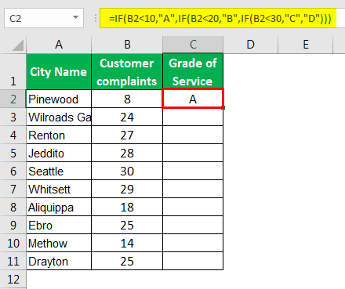

Algorithmic trading is revolutionizing how financial markets operate, enabling traders to execute orders rapidly based on pre-defined criteria. By leveraging cutting-edge technology and sophisticated algorithms, traders are increasingly relying on data-driven strategies to optimize trading decisions, enhance profitability, and minimize human error. This shift has made algorithmic trading an indispensable tool for institutional investors and individual traders alike, allowing them to capitalize on opportunities with unparalleled speed and precision.

Understanding the certification process for algorithmic trading and grading certificates for commodities is essential for aspiring traders. Both processes aim to assure quality and adherence to established standards, albeit in different contexts. Algorithmic trading certification equips traders with the necessary skills to navigate complex financial markets, covering aspects such as strategy development, risk management, and performance optimization. Conversely, grading certificates for commodities serve as a critical quality assurance mechanism, establishing the authenticity and grade of commodities that are crucial for fulfilling futures contracts.



This article explores the intricacies of grading certificates, their importance in the commodities market, and how the certification process can influence the world of algorithmic trading. By examining these interconnected domains, we aim to provide insights that highlight the significance of quality assurance mechanisms in both trading practices and commodity exchanges. Through a nuanced discussion, this article will illustrate how these certifications contribute to enhanced market efficiency, reduced counterparty risk, and increased trust among market participants.

## Table of Contents

## What is a Grading Certificate?

A grading certificate is an essential document in the commodities market, particularly within futures trading. It serves as an official endorsement of the quality and authenticity of a commodity, providing assurance to buyers and sellers about the asset's compliance with exchange standards. This compliance is crucial as it establishes the commodity as exchange-grade, which is vital for the seamless fulfillment of futures contracts. Such certificates help maintain the integrity of the commodities market by ensuring that only commodities that meet specified quality criteria are traded.

The issuance of grading certificates is restricted to authorized inspectors or agencies, which possess the expertise and equipment necessary to evaluate and certify the quality of goods. The methods employed to assess commodities can vary significantly depending on the type of commodity being examined. These methods may include physical inspection, chemical analysis, or advanced technological procedures such as spectroscopy or radiographic tests.

Grading certificates are indispensable in trading environments because they offer a standardized benchmark against which all trades can be measured. This uniformity helps mitigate the risk for traders by reducing uncertainties associated with the commodity's quality, thus facilitating smoother transaction processes and maintaining market stability. Overall, grading certificates play a significant role in enabling efficient and reliable trading within the commodities market.

## The Certification Process for Grading Certificates

The certification process for grading certificates is critical to ensuring that commodities trading within futures markets adheres to predefined quality standards. This process involves a thorough inspection and rigorous testing of goods, guided by criteria established by commodities exchanges. The variability in commodities necessitates diverse testing methodologies to accurately evaluate each type's unique characteristics.

For instance, the authenticity and quality of oil are commonly assessed through chemical assays. These assays evaluate the composition and properties of the oil, such as sulfur content and API gravity, to determine its suitability for market trading. A typical chemical assay for oil might include the following steps:

1. **Sample Collection**: Representative samples of the oil are collected.
2. **Analytical Testing**: Various tests are conducted to measure the chemical properties, such as gas chromatography for hydrocarbon composition.
3. **Quality Comparison**: Results are compared to established quality benchmarks required by the exchange.

Similarly, in the case of precious metals, methods such as x-ray fluorescence (XRF) are employed to verify the purity and elemental composition. XRF offers a non-destructive means to ascertain whether a metal meets the required purity levels for trading:

```python
def analyze_purity(sample_data):
    desired_purity_levels = {'gold': 99.9, 'silver': 99.5}  # Define benchmarks
    for metal, purity in sample_data.items():
        if purity < desired_purity_levels[metal]:
            return f"{metal} does not meet exchange standards."
    return "All metals meet the required standards."

# Example usage
sample_data = {'gold': 99.8, 'silver': 99.6}
print(analyze_purity(sample_data))
```

The purpose of these certification processes is not only to verify quality but also to guarantee that commodities possess the attributes necessary for futures trading. Commodities that achieve exchange-grade status through grading certificates provide traders with the confidence that they are engaging with products that meet strict industry standards.

Quality assurance via grading certificates minimizes the risk of contract disputes or financial loss associated with substandard goods. By certifying commodities, exchanges ensure that only products with verified quality enter the market, thus maintaining market integrity and stability. This verification aligns with the stringent requirements of trading mechanisms, including algorithmic platforms that rely on consistent data quality and commodity standards.

## Impact of Grading Certificates on Algorithmic Trading

Algorithmic trading has emerged as a transformative force in financial markets, fundamentally altering how trades are executed by employing sophisticated algorithms that utilize pre-defined criteria. The reliability of these algorithms hinges on the accuracy and authenticity of the data they process, particularly in the context of commodities trading. Grading certificates play a pivotal role in this ecosystem by providing verified information on commodity quality, thus ensuring the integrity and standardization necessary for algorithmic strategies to function effectively.

Certified commodities serve as a cornerstone for [algorithmic trading](/wiki/algorithmic-trading) strategies. These certificates authenticate the quality and standardization of commodities, thereby giving traders confidence that their algorithms operate on genuine and consistent data. The standardization enabled by grading certificates facilitates the precise execution of trades, as algorithms can be programmed to include specific quality criteria in their decision-making processes.

Furthermore, grading certificates are instrumental in mitigating risks associated with futures trading. By confirming the quality of the underlying commodity, these certificates reduce the likelihood of defaults, which can occur if the delivered commodity fails to meet the stipulated standards in the futures contract. This risk mitigation is crucial for algorithmic trading, which requires a high level of consistency and reliability in the automated execution of trades. As a result, grading certificates align seamlessly with the stringent demands of algorithmic trading, providing the necessary assurance of quality and reducing the potential for financial discrepancies.

The profound impact of grading certificates on algorithmic trading is further underscored by their role in enhancing data accuracy. In algorithmic systems, any discrepancy in commodity quality can lead to significant errors in trade execution and strategy outcomes. Grading certificates ensure that the data fed into trading algorithms is not only accurate but also reflective of the commodity’s true value, thereby supporting optimal trading performance.

In summary, grading certificates are indispensable to the smooth functioning of algorithmic trading in commodities markets. They offer a verified and standardized reference that is integral to the accurate execution of trading algorithms, significantly reducing risks and enhancing data reliability. This assurance of quality and authenticity is vital for traders leveraging algorithmic strategies, ensuring they can participate in the futures market with confidence and precision.

## Algorithmic Trading Certification Process

Obtaining a certification in algorithmic trading is a multi-faceted process designed to equip individuals with the expertise required to successfully navigate the complexities of modern financial markets. Such certifications demand a comprehensive understanding of advanced trading strategies, market structures, and the coding skills necessary to develop and test algorithms.

A pivotal component of these certifications is learning advanced trading strategies. This involves understanding statistical [arbitrage](/wiki/arbitrage), market-making strategies, and trend-following systems, among others. Each strategy has its theoretical underpinnings and practical applications, which are critical for formulating effective algorithmic approaches. 

Understanding market structures is another essential part of the certification process. This involves gaining insight into how different types of markets operate, including equities, futures, [forex](/wiki/forex-system), and options markets. Knowledge of order types, market microstructure, and the roles of different market participants is crucial for creating algorithms that can efficiently interact with these markets.

Coding techniques form the technical backbone of algorithmic trading. Proficiency in programming languages such as Python, R, or C++ is generally required. These languages are used to construct algorithms that can execute trades based on predefined criteria. Here's a simple example of a moving average crossover strategy in Python:

```python
import pandas as pd
import numpy as np

def moving_average_crossover(prices, short_window=40, long_window=100):
    # Calculate moving averages
    signals = pd.DataFrame(index=prices.index)
    signals['signal'] = 0.0
    signals['short_mavg'] = prices['Close'].rolling(window=short_window, min_periods=1, center=False).mean()
    signals['long_mavg'] = prices['Close'].rolling(window=long_window, min_periods=1, center=False).mean()

    # Generate signals
    signals['signal'][short_window:] = np.where(signals['short_mavg'][short_window:] > signals['long_mavg'][short_window:], 1.0, 0.0)

    # Generate trading orders
    signals['positions'] = signals['signal'].diff()
    return signals
```

Certification courses often incorporate practical components like live trading, allowing participants to apply their knowledge in real-time market conditions. Strategy development workshops and performance optimization sessions are typically part of these programs, helping candidates to hone their skills in creating and refining trading algorithms for maximum efficiency and reliability.

Through this rigorous process, certified algorithmic traders gain the ability to construct, test, and optimize trading algorithms effectively. They are trained to consider factors such as latency, execution risk, and slippage, which are critical for successful automated trading. This expertise enables them to make data-driven decisions that align with their trading objectives, ensuring they are well-prepared to engage dynamically with the global financial markets.

## Conclusion

Grading certificates and the algorithmic trading certification process are integral components of modern trading practices. Grading certificates provide the essential verification of commodity quality and authenticity, ensuring that the commodities traded meet predefined exchange-grade standards. This level of quality assurance is vital for maintaining the integrity of futures markets, reducing the risk of counterparty default, and ensuring smooth trading operations. For participants in these markets, especially those employing algorithmic trading strategies, reliable data is crucial. Grading certificates contribute to this reliability by certifying that the commodities involved adhere to stringent quality criteria.

On the other hand, the algorithmic trading certification process equips traders with the skills necessary to navigate the complexities of today's financial markets. Certification programs typically cover advanced trading strategies, market structures, and the programming skills required to implement algorithmic systems. This knowledge base allows traders to develop, test, and optimize trading algorithms effectively, enhancing their ability to capitalize on market opportunities.

Together, these certification processes uphold industry standards and prepare traders to meet market demands efficiently. For aspiring traders, investing in relevant certifications can be a strategic decision, enhancing their ability to succeed in competitive markets. This investment not only builds competency but also increases market confidence, leading to more informed and strategic trading decisions.

## References & Further Reading

[1]: Bergstra, J., Bardenet, R., Bengio, Y., & Kégl, B. (2011). ["Algorithms for Hyper-Parameter Optimization."](https://dl.acm.org/doi/10.5555/2986459.2986743) Advances in Neural Information Processing Systems 24.

[2]: ["Advances in Financial Machine Learning"](https://www.amazon.com/Advances-Financial-Machine-Learning-Marcos/dp/1119482089) by Marcos Lopez de Prado

[3]: ["Evidence-Based Technical Analysis: Applying the Scientific Method and Statistical Inference to Trading Signals"](https://www.amazon.com/Evidence-Based-Technical-Analysis-Scientific-Statistical/dp/0470008741) by David Aronson

[4]: ["Machine Learning for Algorithmic Trading"](https://github.com/stefan-jansen/machine-learning-for-trading) by Stefan Jansen

[5]: ["Quantitative Trading: How to Build Your Own Algorithmic Trading Business"](https://www.amazon.com/Quantitative-Trading-Build-Algorithmic-Business/dp/1119800064) by Ernest P. Chan