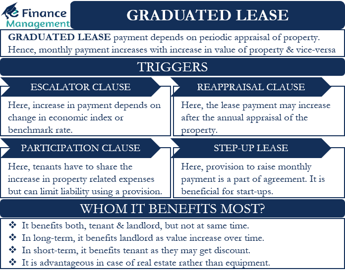

## Table of Contents

## What is a graduated lease?

A graduated lease is a type of rental agreement where the rent amount changes over time. Instead of paying the same amount every month, the rent goes up or down according to a schedule that is set when you sign the lease. This can be helpful for tenants who expect their income to increase in the future, as they can plan for higher rent payments.

Usually, a graduated lease starts with a lower rent and then increases at certain times, like every year. This can make it easier for someone to move into a place they might not be able to afford right away. Landlords might like graduated leases because they know their income from the property will go up over time, which can help them plan their finances better.

## How does a graduated lease differ from a standard lease?

A graduated lease and a standard lease are different in how they handle rent payments. In a standard lease, the rent stays the same every month for the whole time you're renting. This means you know exactly how much you'll pay each month from the start until the end of your lease. It's simple and predictable, which can be good if you like to know your costs won't change.

On the other hand, a graduated lease changes the rent over time. It usually starts with a lower rent and then goes up at certain times, like every year. This can help if you expect to earn more money in the future because you can plan for the higher rent. It's good for people who want to move into a place they can't quite afford at first but will be able to afford later. Landlords might like it too because they know their income will increase over time.

## What are the key components of a graduated lease?

A graduated lease has a few important parts that make it different from other leases. The first part is the schedule of rent changes. This schedule tells you when the rent will go up or down and by how much. It's usually set at the beginning of the lease, so everyone knows what to expect. The second part is the starting rent, which is often lower than what you'd pay on a standard lease. This lower rent at the start makes it easier for people to move in even if they can't afford the full rent right away.

The third part of a graduated lease is the length of the lease. Just like any lease, a graduated lease will say how long you can stay in the place before you need to sign a new lease or leave. The fourth part is any rules or conditions that come with the lease. These could be about taking care of the place, what you can do with it, or how you can end the lease early if you need to. All these parts work together to make a graduated lease helpful for people who expect their money situation to change over time.

## Who typically benefits from a graduated lease?

Tenants who expect their income to grow in the future often benefit from a graduated lease. It starts with a lower rent, which makes it easier for them to move into a place they might not be able to afford right away. As their income goes up, they can handle the higher rent that comes later in the lease. This kind of lease can be a good fit for students who will start working after they finish school, or for people starting a new job with a plan to earn more money over time.

Landlords can also benefit from a graduated lease. They know that their income from the property will increase over time, which helps them plan their finances better. It can make their property more attractive to tenants who are looking for a place to rent but need a bit of time before they can pay more. This way, landlords can keep their property rented out and see a steady increase in their rental income without having to find new tenants as often.

## Can you explain how rent increases are structured in a graduated lease?

In a graduated lease, rent increases are set up on a schedule that is agreed upon when you sign the lease. This schedule says when the rent will go up and by how much. For example, the rent might stay the same for the first year, then go up by 5% every year after that. This way, everyone knows exactly what to expect, and there are no surprises. The increases are usually planned to happen at the same time every year, like on the anniversary of the lease start date.

The idea behind this structure is to help tenants who expect their income to grow over time. They can start with a lower rent and then pay more as they earn more money. This makes it easier for them to move into a nicer place or a place they couldn't afford right away. Landlords like this too because they know their income from the property will go up without having to find new tenants all the time.

## What are the advantages of a graduated lease for tenants?

A graduated lease can be really helpful for tenants who expect to earn more money in the future. It starts with a lower rent, so it's easier for them to move into a place they might not be able to afford right away. As their income goes up, they can handle the higher rent that comes later in the lease. This can be a good fit for students who will start working after they finish school or for people starting a new job with a plan to earn more money over time.

Another advantage is that tenants know exactly when and how much the rent will go up. This makes it easier for them to plan their budget. They can see the whole schedule of rent increases from the start, so there are no surprises. This kind of lease can help tenants feel more secure about their housing costs, knowing that they'll be able to afford the place as their income grows.

## What are the advantages of a graduated lease for landlords?

Landlords benefit from a graduated lease because they know their income from the property will go up over time. This makes it easier for them to plan their finances. They can count on the rent increasing at set times, which helps them predict how much money they will make in the future. This can be especially helpful for landlords who rely on the rental income to pay for things like mortgages or property upkeep.

Another advantage for landlords is that a graduated lease can make their property more attractive to tenants. People who expect their income to grow might choose a place with a graduated lease because it starts with a lower rent. This means landlords can keep their property rented out for longer periods without having to find new tenants as often. A stable tenant who stays longer is good for landlords because it saves them the time and money they would spend on finding and screening new renters.

## In what types of properties are graduated leases commonly used?

Graduated leases are often used in properties where tenants expect their income to grow over time. These can be apartments or houses in cities where young professionals or students live. Young professionals might start with a lower salary and expect to earn more as they get promotions or change jobs. Students might finish their studies and start working, which means they will have more money to pay higher rent later.

Landlords of these properties like graduated leases because they can attract tenants who want to move into a nicer place but can't afford the full rent right away. This is common in places with a lot of new businesses or universities. Graduated leases help landlords keep their properties rented out for longer because tenants are more likely to stay when they know their rent will go up slowly over time.

## How can a graduated lease impact a tenant's budgeting and financial planning?

A graduated lease can help tenants plan their money better. When you know the rent will start low and go up slowly, you can make a budget that works with your growing income. For example, if you're a student or starting a new job, you can move into a nice place without worrying too much about the rent at first. As you start [earning](/wiki/earning-announcement) more money, you can handle the higher rent because you planned for it. This makes it easier to save money or spend on other things you need.

But, a graduated lease also means you need to be ready for the rent to go up. You have to think about these increases when you make your budget. If you don't plan for the higher rent, it might be hard to pay the bills later. So, it's important to look at the whole lease and know when and how much the rent will increase. This way, you can make sure you'll still be able to afford the place as the rent goes up.

## What are the potential risks or disadvantages of a graduated lease for tenants?

A graduated lease can be tricky for tenants if they don't plan well. The rent goes up over time, and if a tenant's income doesn't grow as expected, they might struggle to pay the higher rent later. For example, if someone loses their job or doesn't get the raise they were hoping for, the increasing rent could become too much to handle. This could lead to financial stress or even having to move out before the lease is up.

Another risk is that tenants might feel locked into a place because the rent is going to increase. If they want to move for a new job or other reasons, they might have to pay a higher rent somewhere else or break the lease, which can be costly. Also, if the rent increases are too big, tenants might find it hard to budget for other important things like food, bills, and savings. So, while a graduated lease can help at the start, it's important for tenants to think about the future and make sure they can afford the place as the rent goes up.

## How should a tenant negotiate the terms of a graduated lease?

When negotiating the terms of a graduated lease, a tenant should start by understanding their own financial situation and future income growth. They need to know how much they can afford to pay at the start of the lease and how much they expect to earn later. With this in mind, they can talk to the landlord about the starting rent and the schedule of rent increases. It's important to be clear about when and how much the rent will go up, so there are no surprises later.

A tenant can ask for a lower starting rent if they think it will help them move in without too much stress. They can also try to negotiate smaller rent increases or longer periods between increases. This can make the lease more manageable over time. Being honest and open with the landlord about their financial plans can help both sides agree on terms that work well for everyone.

## What legal considerations should be taken into account when drafting a graduated lease?

When drafting a graduated lease, it's important to make sure it follows the laws in your area. Each place has its own rules about how much rent can go up and how often it can change. You need to check these rules to make sure the rent increases in the lease are legal. It's also a good idea to include all the details about the rent increases in the lease, like when they will happen and by how much. This helps keep everything clear and stops any disagreements later.

Another thing to think about is how to handle any problems that might come up. The lease should say what happens if a tenant can't pay the higher rent or if they want to leave before the lease is over. It's good to have clear rules about ending the lease early and any fees that might come with it. Also, make sure the lease is written in a way that everyone can understand, so there's no confusion about what the tenant and landlord have agreed to.

## What is a Graduated Lease?

A graduated lease is a specialized lease agreement in which rent payments are structured to increase at predetermined intervals throughout the lease term. This approach contrasts with fixed leases, where tenants pay the same amount of rent monthly or annually without alterations, regardless of external financial conditions. The adjustment mechanism in graduated leases typically relies on specific triggers, such as inflation rates, market conditions, or other economic indicators, allowing for flexibility and adaptability in the financial agreement.

Implementation of a graduated lease could be guided by different economic factors. For example, a common approach might involve aligning rent increments with the Consumer Price Index (CPI) to protect landlords from inflation. If the CPI increases by a certain percentage, the rent adjustment could reflect this change, ensuring that the rent value remains consistent with market value. 

In a mathematical expression, the new rent ($R_n$) at a given period could be calculated as:

$$
R_n = R_{base} \times (1 + i)^n
$$

where:
- $R_{base}$ is the base rent,
- $i$ represents the rate of increase applicable at each interval,
- $n$ is the number of intervals completed.

Graduated leases are advantageous in several ways. For landlords, these leases provide a strategic mechanism to secure increasing revenue over time, aligning rental income with economic conditions. This can be particularly beneficial in areas experiencing rapid market appreciation, where fixed leases might result in substantial revenue loss over time. 

For tenants, graduated leases initially offer lower payment responsibilities, which can be useful when entering new markets or securing premises in economically volatile areas. They also provide clarity on future financial commitments, helping businesses plan budgets with greater foresight. The structured increase in rent allows tenants to anticipate future costs and mesh this knowledge into long-term financial strategies, thereby minimizing unforeseen financial distress.

Graduated leases represent a balancing act of flexibility and structure, offering lessees and lessors the ability to navigate evolving economic landscapes while planning for the future with more certainty. This flexibility is particularly pertinent in commercial real estate, where longer-term planning and financial adaptability are key for both property managers and tenants.

## References & Further Reading

[1]: Bergstra, J., Bardenet, R., Bengio, Y., & Kégl, B. (2011). ["Algorithms for Hyper-Parameter Optimization."](https://dl.acm.org/doi/10.5555/2986459.2986743) Advances in Neural Information Processing Systems 24.

[2]: ["Advances in Financial Machine Learning"](https://www.amazon.com/Advances-Financial-Machine-Learning-Marcos/dp/1119482089) by Marcos Lopez de Prado

[3]: ["Evidence-Based Technical Analysis: Applying the Scientific Method and Statistical Inference to Trading Signals"](https://www.amazon.com/Evidence-Based-Technical-Analysis-Scientific-Statistical/dp/0470008741) by David Aronson

[4]: ["Machine Learning for Algorithmic Trading"](https://github.com/stefan-jansen/machine-learning-for-trading) by Stefan Jansen

[5]: ["Quantitative Trading: How to Build Your Own Algorithmic Trading Business"](https://www.amazon.com/Quantitative-Trading-Build-Algorithmic-Business/dp/1119800064) by Ernest P. Chan