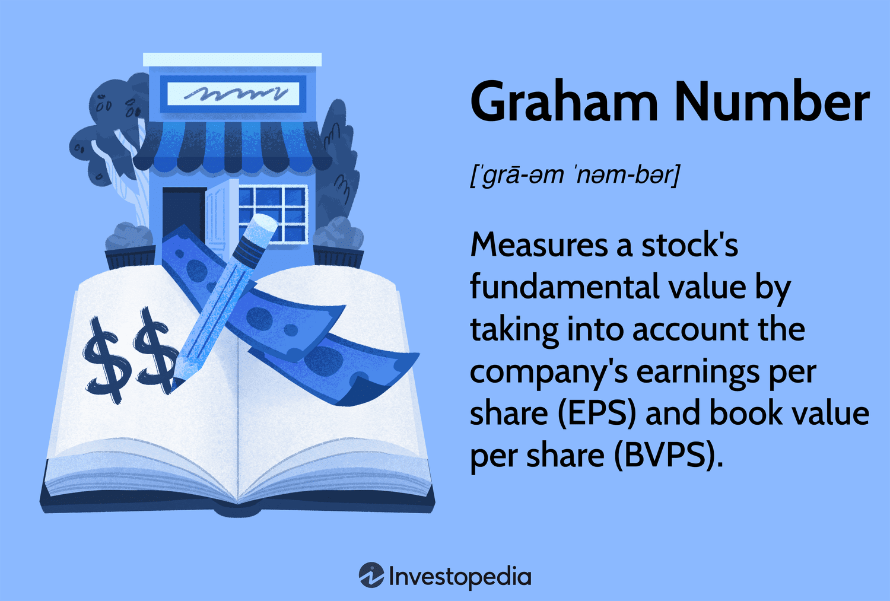

## Table of Contents

## What is the Graham Number?

The Graham Number is a way to figure out if a stock is a good buy. It was created by a smart investor named Benjamin Graham. The number helps you see if a stock's price is too high or a good deal. To find the Graham Number, you need to know two things about a company: its earnings per share (EPS) and its book value per share (BVPS). You then use a special math formula: Graham Number = square root of (22.5 x EPS x BVPS).

Using the Graham Number is simple. If the stock's current price is less than the Graham Number, the stock might be undervalued, meaning it could be a good buy. If the stock's price is higher than the Graham Number, it might be overvalued, and you might want to wait for a better price. This number is especially useful for value investors who look for stocks that are priced lower than their true worth.

## Who developed the Graham Number?

The Graham Number was developed by Benjamin Graham. He was a famous investor and teacher who helped people learn how to pick good stocks. Benjamin Graham wrote a very important book called "The Intelligent Investor," which many people still use to learn about investing.

The Graham Number is a tool that helps investors decide if a stock is a good buy. It uses simple math to see if a stock's price is too high or a good deal. By looking at a company's earnings per share and book value per share, the Graham Number can tell you if a stock might be undervalued or overvalued. This makes it easier for people to make smart choices about which stocks to buy.

## What is the formula for calculating the Graham Number?

The Graham Number is a way to see if a stock is priced right. To find it, you need to know two things about a company: its earnings per share (EPS) and its book value per share (BVPS). The formula for the Graham Number is simple: you take the square root of 22.5 times the EPS times the BVPS. So, it looks like this: Graham Number = square root of (22.5 x EPS x BVPS).

Using the Graham Number helps you decide if a stock is a good buy. If the stock's current price is less than the Graham Number, the stock might be undervalued, meaning it could be a good time to buy it. On the other hand, if the stock's price is higher than the Graham Number, it might be overvalued, and you might want to wait for a better price. This tool is really useful for value investors who look for stocks that are priced lower than their true worth.

## What financial data is needed to use the Graham Number?

To use the Graham Number, you need to know two pieces of financial information about a company: its earnings per share (EPS) and its book value per share (BVPS). Earnings per share is the amount of money a company makes for each share of its stock. Book value per share is the total value of the company's assets minus its liabilities, divided by the number of shares.

Once you have these two numbers, you can calculate the Graham Number by using a simple formula. The formula is the square root of 22.5 times the EPS times the BVPS. This gives you a value that you can compare to the current stock price to see if the stock might be a good buy. If the stock's price is less than the Graham Number, it might be undervalued, making it a potentially good investment. If the stock's price is higher than the Graham Number, it might be overvalued, and you might want to wait for a better price.

## How do you interpret the Graham Number?

The Graham Number helps you figure out if a stock is a good deal. It's like a tool that tells you if a stock's price is too high or if it's a bargain. To use it, you compare the Graham Number to the stock's current price. If the stock's price is less than the Graham Number, that means the stock might be undervalued. It could be a good time to buy because the stock is cheaper than what it's really worth.

On the other hand, if the stock's price is higher than the Graham Number, it might be overvalued. This means the stock's price is more than what it's really worth, and you might want to wait for a better price before buying. The Graham Number is really useful for people who like to find stocks that are priced lower than their true value. It helps them make smart choices about when to buy stocks.

## Can you provide a simple example of calculating the Graham Number for a company?

Let's say there's a company called ABC Corp. ABC Corp has an earnings per share (EPS) of $2 and a book value per share (BVPS) of $15. To find the Graham Number for ABC Corp, we need to use a special math formula. The formula is the square root of 22.5 times the EPS times the BVPS. So, for ABC Corp, we do this: Graham Number = square root of (22.5 x 2 x 15). 

When we do the math, we get: Graham Number = square root of (22.5 x 2 x 15) = square root of 675 = about 26. Now, let's say ABC Corp's stock is currently selling for $20 per share. Since $20 is less than the Graham Number of $26, ABC Corp's stock might be undervalued. This means it could be a good time to buy the stock because it's cheaper than what it's really worth.

## What are the key assumptions behind the Graham Number?

The Graham Number is based on some important ideas. One big idea is that a stock's value can be figured out by looking at the company's earnings and its book value. The number assumes that these two things, earnings per share and book value per share, give a good picture of what the company is really worth. It also uses a special number, 22.5, which comes from another idea called the price-to-earnings ratio. This number helps to keep things balanced and make the Graham Number work well for many different companies.

Another key assumption is that the stock market can sometimes get things wrong. The Graham Number is meant to help find stocks that are cheaper than they should be. It assumes that if a stock's price is lower than the Graham Number, the stock might be a good buy because it's undervalued. This means the market hasn't seen the true value of the company yet. But, it's important to remember that the Graham Number is just one tool, and it doesn't take into account everything that might affect a stock's price, like future growth or other risks.

## How does the Graham Number help in value investing?

The Graham Number is a big help for value investors because it gives them a simple way to see if a stock is a good deal. Value investors are always looking for stocks that are priced lower than what they're really worth. The Graham Number does this by using a company's earnings per share and book value per share to figure out a fair price for the stock. If the stock's current price is less than the Graham Number, it might be undervalued, meaning it could be a good time to buy.

Using the Graham Number, value investors can make smarter choices about which stocks to buy. It's like having a special tool that helps you find bargains in the stock market. If the Graham Number shows that a stock is cheaper than it should be, a value investor might decide to buy it, hoping that other people will eventually see the true value of the company and the stock price will go up. This way, the Graham Number helps value investors find good opportunities and possibly make more money in the long run.

## What are the limitations of using the Graham Number?

The Graham Number is a helpful tool, but it has some limits. One big limit is that it only looks at a company's earnings per share and book value per share. It doesn't take into account other important things like how fast the company is growing, what its future plans are, or any special risks it might face. This means the Graham Number might say a stock is a good buy, but there could be other reasons why the stock's price is low, like problems with the company or the industry it's in.

Another limit is that the Graham Number uses a fixed number, 22.5, in its formula. This number comes from a general idea about what a good price-to-earnings ratio should be, but it might not work well for every company. Different companies in different industries can have very different normal price-to-earnings ratios. So, the Graham Number might not be as useful for companies that don't fit the usual pattern. It's important to use the Graham Number along with other tools and do more research before deciding to buy a stock.

## How does the Graham Number compare to other valuation metrics like P/E ratio or DCF analysis?

The Graham Number is different from other valuation metrics like the P/E ratio and DCF analysis because it uses a simple formula that only needs two pieces of information: earnings per share and book value per share. The P/E ratio, on the other hand, looks at a company's stock price compared to its earnings per share. It helps investors see how much they're paying for each dollar of the company's earnings. The Graham Number goes a step further by also considering the book value, which can give a more complete picture of the company's worth. But, the Graham Number is easier to calculate and understand than the P/E ratio because it gives you one number to compare to the stock price.

DCF analysis, or Discounted Cash Flow analysis, is a lot more complicated than the Graham Number. It tries to figure out what a company is worth by looking at all the money it's expected to make in the future, and then figuring out what that money is worth today. DCF analysis takes into account things like growth rates, how much money the company will make, and how risky it is. This makes it a very detailed way to value a company, but it also needs a lot more information and guesses about the future. The Graham Number doesn't look at future earnings or growth, so it's simpler and quicker to use, but it might not be as accurate for companies that are expected to grow a lot in the future.

## Are there any adjustments or modifications commonly made to the Graham Number formula?

Sometimes, people make changes to the Graham Number formula to make it work better for different companies. One common change is using a different number instead of 22.5. This number comes from the idea of a good price-to-earnings ratio, but not every company fits this idea. So, some people might use a different number that they think is better for the company they're looking at. This can help make the Graham Number more useful for companies in different industries or with different growth rates.

Another change people might make is to use different measures of earnings and book value. The basic Graham Number uses earnings per share and book value per share, but some people might use adjusted earnings or a different way to figure out book value. This can help give a more accurate picture of what the company is really worth. By making these changes, people can use the Graham Number in a way that fits their own investing style and the specific company they're looking at.

## How has the effectiveness of the Graham Number changed over time in different market conditions?

The Graham Number has been a helpful tool for value investors since it was created by Benjamin Graham. But how well it works can change depending on what's happening in the stock market. In times when the market is calm and stocks are priced in a normal way, the Graham Number can be a good way to find stocks that are a good deal. It helps investors spot companies that might be undervalued because their stock prices are lower than what the Graham Number says they should be.

However, the Graham Number might not work as well when the market is going through big changes or when stock prices are very high or very low. For example, during a big market bubble, stock prices can be much higher than what the Graham Number suggests, making it hard to find good deals. On the other hand, during a big market crash, many stocks might look undervalued according to the Graham Number, but it can be hard to know which ones will recover. So, while the Graham Number is a useful tool, it's important to use it along with other ways of looking at stocks and to think about what's happening in the market at the time.

## What are the key financial metrics in investment?

Financial metrics serve as critical indicators for assessing a company's financial health and overall performance. Among the commonly used metrics are Earnings Per Share (EPS), Price-to-Earnings (P/E) ratio, and Return on Equity (ROE). Each provides distinct insights into a company's valuation, profitability, and potential for future growth, offering investors robust tools to assess investment opportunities.

**Earnings Per Share (EPS)** is perhaps the most recognized metric, representing the portion of a company's profit allocated to each outstanding share of common stock. It is calculated as:

$$
\text{EPS} = \frac{\text{Net Income} - \text{Dividends on Preferred Stock}}{\text{Average Outstanding Shares}}
$$

EPS provides a straightforward view of profitability, helping investors gauge the financial strength of a company. An increasing EPS indicates improved profitability, often leading to a rise in stock prices, and making it a useful metric for identifying potentially undervalued stocks.

**Price-to-Earnings (P/E) Ratio** is another essential metric used to determine a company's valuation. It is calculated by dividing the market value per share by the earnings per share (EPS):

$$
\text{P/E Ratio} = \frac{\text{Market Value per Share}}{\text{EPS}}
$$

A high P/E ratio may suggest that a company’s stock is overvalued, or that investors are expecting high growth rates in the future. Conversely, a low P/E ratio could indicate undervaluation, potentially offering buying opportunities. However, it's important to consider industry norms, as acceptable P/E ratios can vary significantly across sectors.

**Return on Equity (ROE)** measures a company's profitability relative to shareholders' equity, reflecting how efficiently a company uses investors' funds to generate earnings growth. The formula is:

$$
\text{ROE} = \frac{\text{Net Income}}{\text{Shareholders' Equity}}
$$

ROE is particularly useful for comparing the financial performance of companies in the same industry. A higher ROE indicates that a company is effectively using the investments made by its shareholders, thus offering a reliable metric for forecasting future financial performance.

Incorporating these financial metrics into investment strategies can significantly enhance portfolio management by enabling investors to make data-driven decisions. A thorough understanding of these metrics aids in forecasting a company’s future performance and potential market behavior. By evaluating EPS, P/E ratio, and ROE, investors can better identify stocks that are either undervalued, signaling a buying opportunity, or overvalued, indicating a potential sell-off.

Given the complexity and dynamic nature of financial markets, these metrics form the bedrock of sound investment analysis. They provide structured, quantitative measures that, when used in concert, empower investors to optimize their strategies and achieve more robust returns.

## What is the Graham Number: A Fundamental Valuation Metric?

The Graham Number is a prominent valuation metric that stems from the pioneering work of Benjamin Graham, a key figure in the development of value investing. The purpose of this metric is to calculate the lowest price for a stock based on its earnings and book value, providing investors with a conservative estimate of a stock's intrinsic value. This calculation allows investors to identify potentially undervalued stocks, presenting opportunities for growth in line with Graham's investment philosophy, which emphasizes safety of capital and a reasonable return on it.

The formula for the Graham Number is as follows:

$$
\text{Graham Number} = \sqrt{22.5 \times \text{EPS} \times \text{BVPS}}
$$

Where:
- EPS stands for Earnings Per Share, representing a company's profitability on a per-share basis.
- BVPS refers to Book Value Per Share, which indicates the net asset value attributed to each share.

The [factor](/wiki/factor-investing) of 22.5 in the formula is derived from Graham's assumption of an acceptable P/E ratio of 15 and a P/B ratio of 1.5, with the product of these ratios (15 * 1.5) equating to 22.5. This multiplier is employed to ensure a conservative evaluation of a stock's value, adhering to Graham's principle of maintaining a margin of safety in investments.

Investors employ the Graham Number metric to discern stocks that are trading below their calculated intrinsic value, indicating potential undervaluation. By doing so, they can target stocks that offer both a lower risk profile and potential for appreciation, thereby contributing to the construction of a growth-oriented portfolio.

Understanding and applying the Graham Number is an essential skill for value investors, as it encapsulates a time-tested approach to identifying stocks with inherent value. By integrating this metric into their analysis, investors can make informed decisions that align with a strategy aimed at maximizing long-term returns while minimizing risk.

## References & Further Reading

[1]: ["The Intelligent Investor: The Definitive Book on Value Investing."](https://www.amazon.com/Intelligent-Investor-Definitive-Investing-Essentials/dp/0060555661) by Benjamin Graham

[2]: ["Security Analysis: Sixth Edition, Foreword by Warren Buffett"](https://www.amazon.com/Security-Analysis-Foreword-Buffett-Editions/dp/0071592539) by Benjamin Graham and David Dodd

[3]: Gu, S., Kelly, B., & Xiu, D. (2020). ["Empirical Asset Pricing via Machine Learning."](https://www.nber.org/papers/w25398) The Review of Financial Studies, 33(5), 2223-2273.

[4]: Narang, R. K. (2013). ["Inside the Black Box: A Simple Guide to Quantitative and High-Frequency Trading."](https://onlinelibrary.wiley.com/doi/book/10.1002/9781118662717) Wiley Finance.

[5]: ["Algorithmic Trading: Winning Strategies and Their Rationale"](https://www.amazon.com/Algorithmic-Trading-Winning-Strategies-Rationale-ebook/dp/B00CY5HC0U) by Ernie Chan

[6]: Lo, A. W., & MacKinlay, A. C. (1990). ["When Are Contrarian Profits Due to Stock Market Overreaction?"](https://www.jstor.org/stable/2962020) The Review of Financial Studies, 3(2), 175-205.