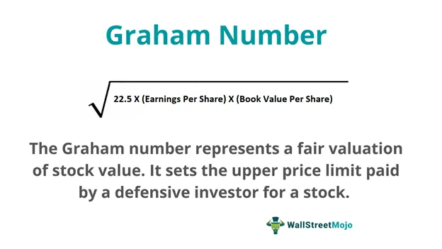

In today's fast-evolving financial markets, investment analysis plays a crucial role in aiding investors to make well-informed decisions. As markets become increasingly complex and interconnected, understanding fundamental financial metrics is essential for evaluating investment opportunities and assessing potential risk. Among these metrics, the Graham Number stands out as a significant tool, enabling investors to determine the fair value of stocks based on earnings and book value. This traditional method continues to hold relevance even in modern trading approaches, particularly in algorithmic trading.

Algorithmic trading represents a cutting-edge advancement in investment analysis, utilizing sophisticated algorithms for executing trades at speeds and efficiencies unattainable through manual processes. By integrating financial metrics with algorithmic strategies, investors can enhance their decision-making processes, optimize strategies, and aim for better returns.



Knowledge of financial metrics and their application in algorithmic trading not only empowers investors to adapt to market dynamics but also equips them with tools to refine their strategies for optimal performance. This guide endeavors to provide both seasoned traders and newcomers with practical insights into leveraging these concepts effectively, fostering a deeper comprehension of investment analysis in contemporary markets.

## Table of Contents

## Understanding Investment Analysis

Investment analysis is a crucial process for evaluating assets to determine their potential as investments. This process incorporates a wide range of components to ensure that investment decisions are informed and effective. One of the primary elements of investment analysis is the thorough examination of financial statements. These documents provide critical insights into a company's financial health, including its revenue, expenses, profit margins, and cash flow. Analyzing financial statements allows investors to assess whether an asset is performing well financially and to forecast its future performance.

In addition to financial statements, market trends play a significant role in investment analysis. Market trends involve the study of stock market patterns, investor behavior, and the overall direction in which the market is moving. Understanding these trends helps investors anticipate market movements, identify opportunities, and make timely investment decisions.

Economic factors are another key component of investment analysis. These include interest rates, inflation rates, and economic growth indicators, which can significantly influence investment outcomes. By evaluating these factors, investors can anticipate changes in the economic environment and adjust their investment strategies accordingly.

The primary goal of investment analysis is to maximize returns while minimizing risks. Investors achieve this by incorporating both qualitative and quantitative assessments into their evaluations. Qualitative assessments include analyzing management effectiveness, competitive positioning, and industry outlook. In contrast, quantitative assessments involve numerical data analysis for precise decision-making.

With the advent of technology, investment analysis increasingly relies on data-driven methods. The use of advanced analytics, [machine learning](/wiki/machine-learning), and [artificial intelligence](/wiki/ai-artificial-intelligence) enables investors to process vast amounts of data with greater accuracy and speed. These technological advancements allow investors to identify patterns and trends that might not be apparent through traditional methods.

In conclusion, investment analysis is an integral part of making informed investment decisions. By evaluating financial statements, market trends, and economic factors, and incorporating both qualitative and quantitative assessments, investors can optimize their strategies to achieve better returns while managing risks. As technology continues to evolve, data-driven methods will play an ever-increasing role in the investment analysis process, providing investors with powerful tools to navigate the complexities of modern financial markets.

## Key Financial Metrics in Investment

Financial metrics serve as critical indicators for assessing a company's financial health and overall performance. Among the commonly used metrics are Earnings Per Share (EPS), Price-to-Earnings (P/E) ratio, and Return on Equity (ROE). Each provides distinct insights into a company's valuation, profitability, and potential for future growth, offering investors robust tools to assess investment opportunities.

**Earnings Per Share (EPS)** is perhaps the most recognized metric, representing the portion of a company's profit allocated to each outstanding share of common stock. It is calculated as:

$$
\text{EPS} = \frac{\text{Net Income} - \text{Dividends on Preferred Stock}}{\text{Average Outstanding Shares}}
$$

EPS provides a straightforward view of profitability, helping investors gauge the financial strength of a company. An increasing EPS indicates improved profitability, often leading to a rise in stock prices, and making it a useful metric for identifying potentially undervalued stocks.

**Price-to-Earnings (P/E) Ratio** is another essential metric used to determine a company's valuation. It is calculated by dividing the market value per share by the earnings per share (EPS):

$$
\text{P/E Ratio} = \frac{\text{Market Value per Share}}{\text{EPS}}
$$

A high P/E ratio may suggest that a company’s stock is overvalued, or that investors are expecting high growth rates in the future. Conversely, a low P/E ratio could indicate undervaluation, potentially offering buying opportunities. However, it's important to consider industry norms, as acceptable P/E ratios can vary significantly across sectors.

**Return on Equity (ROE)** measures a company's profitability relative to shareholders' equity, reflecting how efficiently a company uses investors' funds to generate earnings growth. The formula is:

$$
\text{ROE} = \frac{\text{Net Income}}{\text{Shareholders' Equity}}
$$

ROE is particularly useful for comparing the financial performance of companies in the same industry. A higher ROE indicates that a company is effectively using the investments made by its shareholders, thus offering a reliable metric for forecasting future financial performance.

Incorporating these financial metrics into investment strategies can significantly enhance portfolio management by enabling investors to make data-driven decisions. A thorough understanding of these metrics aids in forecasting a company’s future performance and potential market behavior. By evaluating EPS, P/E ratio, and ROE, investors can better identify stocks that are either undervalued, signaling a buying opportunity, or overvalued, indicating a potential sell-off.

Given the complexity and dynamic nature of financial markets, these metrics form the bedrock of sound investment analysis. They provide structured, quantitative measures that, when used in concert, empower investors to optimize their strategies and achieve more robust returns.

## The Graham Number: A Fundamental Valuation Metric

The Graham Number is a prominent valuation metric that stems from the pioneering work of Benjamin Graham, a key figure in the development of value investing. The purpose of this metric is to calculate the lowest price for a stock based on its earnings and book value, providing investors with a conservative estimate of a stock's intrinsic value. This calculation allows investors to identify potentially undervalued stocks, presenting opportunities for growth in line with Graham's investment philosophy, which emphasizes safety of capital and a reasonable return on it.

The formula for the Graham Number is as follows:

$$
\text{Graham Number} = \sqrt{22.5 \times \text{EPS} \times \text{BVPS}}
$$

Where:
- EPS stands for Earnings Per Share, representing a company's profitability on a per-share basis.
- BVPS refers to Book Value Per Share, which indicates the net asset value attributed to each share.

The [factor](/wiki/factor-investing) of 22.5 in the formula is derived from Graham's assumption of an acceptable P/E ratio of 15 and a P/B ratio of 1.5, with the product of these ratios (15 * 1.5) equating to 22.5. This multiplier is employed to ensure a conservative evaluation of a stock's value, adhering to Graham's principle of maintaining a margin of safety in investments.

Investors employ the Graham Number metric to discern stocks that are trading below their calculated intrinsic value, indicating potential undervaluation. By doing so, they can target stocks that offer both a lower risk profile and potential for appreciation, thereby contributing to the construction of a growth-oriented portfolio.

Understanding and applying the Graham Number is an essential skill for value investors, as it encapsulates a time-tested approach to identifying stocks with inherent value. By integrating this metric into their analysis, investors can make informed decisions that align with a strategy aimed at maximizing long-term returns while minimizing risk.

## Algorithmic Trading: Leveraging Metrics for Automated Investment

Algorithmic trading has revolutionized the financial markets by automating trading decisions through pre-designed algorithms. These sophisticated programs utilize a multitude of financial metrics to optimize investment decisions, ensuring enhanced precision and speed of execution.

At the core of [algorithmic trading](/wiki/algorithmic-trading) is the dependency on reliable financial metrics, which serve as vital indicators for making informed investment choices. Metrics such as Earnings Per Share (EPS), Price-to-Earnings (P/E) ratio, Return on Equity (ROE), and even comprehensive valuation tools like the Graham Number, are integrated into algorithms to evaluate potential investments systematically.

One of the primary advantages of algorithmic trading lies in its ability to process vast amounts of real-time data rapidly and execute decisions with precision that is difficult for humans to achieve. For instance, algorithms can react to market conditions instantaneously, capturing opportunities or mitigating risks much faster than manual trading methods.

Moreover, financial metrics such as the Graham Number—which combines earnings per share and book value per share to assess stock value—can be programmed within these trading algorithms. This allows for the systematic identification of undervalued stocks, enhancing the efficiency of decision-making processes.

Consider a simple Python snippet that incorporates the Graham Number calculation into an algorithm:

```python
def calculate_graham_number(eps, book_value_per_share):
    graham_number = (22.5 * eps * book_value_per_share) ** 0.5
    return graham_number

# Example usage
eps = 5.0  # Example earning per share
book_value_per_share = 50.0  # Example book value per share
graham_number = calculate_graham_number(eps, book_value_per_share)

print(f"The Graham Number for the stock is: {graham_number}")
```

Here, traders can simply input the EPS and book value per share to compute the Graham Number, assisting in the quick appraisal of stocks within their automated trading strategies.

However, algorithmic trading comes with complexities and risks. Understanding the intricacies of these automated systems is crucial. Challenges such as data quality, the risk of over-optimization, and the need for robust risk management frameworks are inherent. Traders must remain cautious of market over-reliance on algorithm-driven predictions and acknowledge the limitations these systems might have, especially in erratic or unpredictable market conditions.

In conclusion, while algorithmic trading offers numerous advantages in terms of speed and accuracy, traders must possess a thorough understanding of both financial metrics and algorithmic logic. They should also maintain a balanced perspective, complementing automation with informed human oversight to navigate the multifaceted challenges of modern financial markets.

## Integrating Financial Metrics and Algorithmic Trading

Integrating financial metrics with algorithmic trading offers significant potential for enhancing investment strategies. At the core of this integration lies the ability to optimize decision-making by systematically analyzing large data sets and executing trades automatically based on precise criteria. The synergy of these elements can yield more efficient and effective investment outcomes.

One of the primary advantages of combining financial metrics with algorithmic trading is the capacity for back-testing. This process involves applying trading strategies to historical data to evaluate their potential efficacy before real-world application. By doing so, investors can ascertain the reliability of their strategies, enabling adjustments and refinements to optimize performance. Back-testing helps to mitigate risks by spotlighting potential failures, thus enhancing the robustness of investment strategies.

Moreover, the dynamic nature of financial markets requires that strategies be responsive to shifts and anomalies. Integrating financial metrics into algorithmic systems enables real-time analysis and rapid adjustments to strategies as market conditions fluctuate. For example, incorporating a metric like the Graham Number into an algorithm allows the system to evaluate stocks and adjust investment portfolios in milliseconds, responding to new data inputs and market movements.

Successful implementation of this integration necessitates a precise balance of quantitative analysis with algorithmic execution. Quantitative methods interpret financial metrics, offering a basis for informed decision-making, while algorithmic systems ensure that trades conform to these metrics with high precision and speed. This combination can provide investors with a competitive edge, often translating to consistent performance across diverse market environments.

To fully leverage this integration, investors may utilize programming languages like Python to develop and refine these algorithms. For instance, one might use Python's libraries, such as Pandas for data manipulation and NumPy for numerical calculations, to construct and test algorithms. By integrating coding with financial analysis, investors can create tailored strategies that are dynamic and adaptable to continuous market evolution.

Overall, integrating financial metrics with algorithmic trading cultivates an environment where strategies are not only efficient but also highly adaptive. This fusion holds the promise of achieving consistent investment performance by aligning financial insights with automated precision in rapidly changing markets.

## Challenges and Considerations

Algorithmic trading, while revolutionary in its approach to automating investment decisions, introduces a range of challenges that practitioners must navigate carefully. One of the most critical issues is the potential risk associated with over-reliance on historical data. Algorithms primarily operate on historical patterns to predict future market trends; however, markets are influenced by countless variables, and past performance does not guarantee future results. Hence, algorithms may falter in unprecedented market conditions, highlighting the importance of ensuring that models are not solely dependent on historical data without incorporating real-time adjustments and diverse data sources.

Data irregularities can further complicate algorithmic trading strategies. Inaccurate or incomplete data can lead to incorrect trading decisions, emphasizing the need for robust data management and validation processes. Trading algorithms must be designed to handle anomalies and ensure that decisions are made based on reliable data inputs.

Regulatory and ethical considerations are also paramount in algorithmic trading. Different jurisdictions impose varying levels of regulation on trading activities, and compliance is necessary to avoid legal repercussions. Moreover, ethical concerns such as market manipulation attempts, flash crashes, and the potential exclusion of retail investors due to high-frequency trading must be addressed. Introducing ethical guidelines within algorithmic frameworks will help maintain market integrity and fairness.

Human oversight remains indispensable in mitigating the systemic risks associated with automated trading systems. While algorithms can process and analyze data with unparalleled speed, human intuition and judgment are irreplaceable in interpreting complex scenarios that require strategic discretion. The integration of human intervention ensures that trading strategies remain adaptable to unforeseen events or anomalies that purely automated systems might overlook.

Finally, the dynamic nature of financial markets necessitates continuous strategy assessment and evolution. Investors must regularly review and update their algorithmic models to reflect recent technological advancements, market structures, and economic shifts. Keeping strategies current is essential in capitalizing on emerging opportunities while mitigating risks effectively. By maintaining a balanced approach between automated efficiency and adaptive strategy refinement, investors can better navigate the multifaceted landscape of algorithmic trading.

## Conclusion

Investment analysis, financial metrics, and algorithmic trading form a triad of essential knowledge for modern investors, creating a comprehensive framework that incorporates both traditional and advanced methodologies. The Graham Number, a pivotal valuation metric derived from the principles of Benjamin Graham, showcases how traditional measure can seamlessly integrate with contemporary trading technologies. This harmonization between historical valuation techniques and modern computational tools allows investors to identify undervalued stocks effectively, potentially leading to substantial returns.

By leveraging insights from these domains, investors can navigate the complexities of financial markets with greater confidence. Understanding key financial metrics not only aids in assessing a company's performance and potential but also enhances the strategic application of algorithmic trading. The precision and speed provided by algorithmic systems enable investors to respond swiftly to market changes, ensuring they stay competitive in today’s fast-paced trading environments.

Being informed and adaptable is crucial for capitalizing on future investment opportunities. As market dynamics continue to evolve, maintaining an up-to-date knowledge base and refining strategies are imperative to achieving sustainable success. In particular, the integration of data analytics and algorithmic methodologies facilitates a more dynamic approach to investment, accommodating the intricacies of fluctuating market conditions and data-driven decision-making.

As technology advances, the approach investors take must also adapt. By embracing new tools and methodologies, while anchoring them in proven financial principles like those embodied by the Graham Number, investors are well-positioned to maximize their success. This adaptability not only fosters resilience against potential risks but also paves the way for consistent performance and competitive advantage in the ever-evolving financial landscape.

## References & Further Reading

[1]: ["The Intelligent Investor: The Definitive Book on Value Investing."](https://www.amazon.com/Intelligent-Investor-Definitive-Investing-Essentials/dp/0060555661) by Benjamin Graham

[2]: ["Security Analysis: Sixth Edition, Foreword by Warren Buffett"](https://www.amazon.com/Security-Analysis-Foreword-Buffett-Editions/dp/0071592539) by Benjamin Graham and David Dodd

[3]: Gu, S., Kelly, B., & Xiu, D. (2020). ["Empirical Asset Pricing via Machine Learning."](https://www.nber.org/papers/w25398) The Review of Financial Studies, 33(5), 2223-2273.

[4]: Narang, R. K. (2013). ["Inside the Black Box: A Simple Guide to Quantitative and High-Frequency Trading."](https://onlinelibrary.wiley.com/doi/book/10.1002/9781118662717) Wiley Finance.

[5]: ["Algorithmic Trading: Winning Strategies and Their Rationale"](https://www.amazon.com/Algorithmic-Trading-Winning-Strategies-Rationale-ebook/dp/B00CY5HC0U) by Ernie Chan

[6]: Lo, A. W., & MacKinlay, A. C. (1990). ["When Are Contrarian Profits Due to Stock Market Overreaction?"](https://www.jstor.org/stable/2962020) The Review of Financial Studies, 3(2), 175-205.