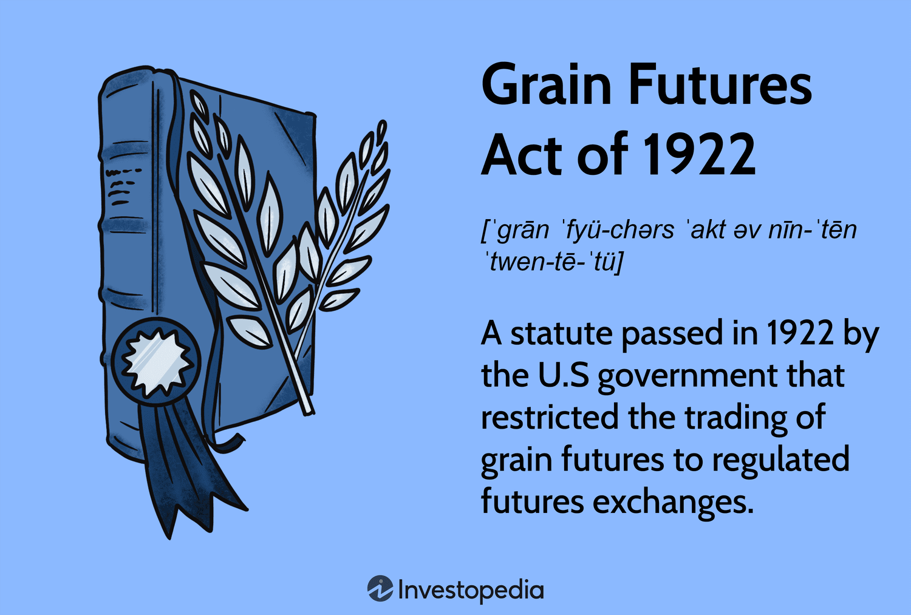

The 1922 Grain Futures Act represents a pivotal moment in the history of commodity trading, specifically targeting the regulation of grain futures. This federal legislation was designed to address and mitigate issues inherent in unregulated markets, which had long been susceptible to fraud and manipulation. By mandating that all grain futures be traded on regulated exchanges, the Act significantly enhanced market transparency and fostered a more secure trading environment. This move marked a foundational step in the development of federal oversight in the United States commodity markets, setting a precedent for subsequent regulatory frameworks.

The significance of the Grain Futures Act lies not only in its regulatory impact but also in its role as a precursor to future legislation, such as the Commodity Exchange Act of 1936. It laid the groundwork for the establishment of mechanisms and institutions that ensure fair trading practices and protect the interests of participants within the market. This regulatory foresight has continued relevance, influencing modern trading practices and ensuring the integrity of commodity exchanges.

In addition to examining the historical context and influence of the 1922 Grain Futures Act, this article will explore the evolution of trading strategies, particularly focusing on the emergence of algorithmic trading in the commodities market. With technological advancements, algorithmic trading has become an integral part of modern financial markets, offering increased speed and efficiency in executing trades. This evolution reflects an ongoing trend toward greater market sophistication and highlights the necessity for continued regulatory vigilance to balance innovation with the need for market safeguards.

Through a comprehensive analysis, the intersections between historical legislation and contemporary trading innovations will be illuminated, providing investors with insights into the origins and development of current market structures. It is crucial to understand how the principles and regulatory standards established by early legislative efforts continue to shape today's trading environment, offering a stable and transparent marketplace for commodity traders worldwide.

## Table of Contents

## The Grain Futures Act of 1922: A Historical Overview

The Grain Futures Act of 1922 was an essential federal statute enacted to regulate grain futures trading in the United States. Prior to its implementation, the commodity markets, particularly those trading grain futures, were rife with fraudulent activities and market manipulation. The Act was introduced to address these issues by mandating that all grain futures be traded on regulated exchanges. This requirement significantly enhanced market transparency and curbed the potential for manipulation that previously plagued the sector.

One of the key features of the Grain Futures Act was the establishment of an agency within the U.S. Department of Agriculture to oversee its administration. This represented a significant development in federal regulation of commodity markets, as it marked the first time that a governmental body was directly involved in the oversight of futures trading. The agency was tasked with ensuring compliance with the new regulations, which contributed to a more organized and trustworthy marketplace.

The enactment of the Grain Futures Act was closely connected to the historical context of its time. It was introduced shortly after the United States Supreme Court declared the Futures Trading Act of 1921 unconstitutional. The earlier Act had attempted to regulate futures trading by imposing a tax on grain futures transactions not conducted on designated markets. However, its reliance on taxation as a regulatory tool led to its downfall when it was challenged legally and found to exceed the powers granted to Congress under the U.S. Constitution.

In response to the void left by the 1921 Act, the Grain Futures Act was crafted to establish more direct regulatory oversight without the constitutional challenges posed by the previous legislation. By focusing on the regulation of exchanges and fostering conditions for fair trading practices, the 1922 Act laid the groundwork for the future development of commodity trading laws in the United States. Its emphasis on regulatory oversight and transparency influenced subsequent legislative efforts, including the Commodity Exchange Act of 1936, and eventually facilitated the foundation of the Commodity Futures Trading Commission (CFTC) in 1974. These measures have collectively cemented the importance of federal regulation in safeguarding the integrity and efficiency of commodity markets.

## Motivation Behind the Grain Futures Act

The Grain Futures Act of 1922 emerged in response to rampant fraud and manipulation in the commodity markets, particularly through the operations of 'bucket shops'. Bucket shops were illicit establishments where individuals could place bets on the rise and fall of commodity prices without involving actual commodities or contracts on regulated exchanges. These operations operated outside the boundaries of legitimate market trading, often manipulating prices and engaging in fraudulent activities that distorted the overall market integrity.

The pervasive nature of bucket shops posed significant challenges to legitimate trading platforms. Despite various efforts by exchanges like the Chicago Board of Trade to regulate and eliminate such malpractice, they found it increasingly difficult to combat these issues independently. The Chicago Board of Trade, an essential player in the commodity market, attempted to self-regulate by setting rules and ethical guidelines, yet the lack of federal oversight made enforcement difficult and limited the scope of any meaningful reform.

Due to these challenges, federal intervention was deemed necessary to establish fair trading practices and protect legitimate market participants. The Grain Futures Act represented this intervention by mandating that all grain futures trading occur on regulated exchanges, thereby reducing the scope for manipulation and ensuring greater transparency. This legislative move brought with it a rigorous framework that aimed to eliminate the fraudulent practices that had plagued the industry. The Act set clear guidelines and empowered the federal government, through the U.S. Department of Agriculture, to enforce regulations effectively across the commodity markets. 

This transition from self-regulation to federal oversight marked a transformative period in commodity trading history. By addressing the loopholes exploited by bucket shops, the Grain Futures Act laid the groundwork for a more secure and trustworthy marketplace, an essential step toward restoring investor confidence and maintaining market stability.

## Impact and Legacy of the Grain Futures Act

The Grain Futures Act of 1922 marked a significant legislative step in the regulation of commodity markets, particularly grain futures. This Act laid the groundwork for future market regulations by introducing structured oversight, which was pivotal in transforming the nature of commodity trading in the United States. As such, it served as a precursor to the Commodity Exchange Act of 1936, which further expanded and formalized regulatory frameworks.

One of the primary achievements of the Grain Futures Act was its rigorous emphasis on transparency and regulation. By mandating that all grain futures be traded on regulated exchanges, the Act targeted and mitigated issues related to market manipulation and fraudulent practices, which had plagued the industry. The requirement for regulated exchanges not only ensured greater market transparency but also promoted investor confidence by facilitating a more secure and trustworthy trading environment.

The institutional framework established by the Grain Futures Act eventually contributed to the creation of the Commodity Futures Trading Commission (CFTC) in 1974. The CFTC was endowed with broader powers to enforce commodities regulation across multiple markets, thus extending the regulatory philosophy initiated by the Grain Futures Act. By laying down such foundational structures, the Act presaged the evolution of comprehensive commodity trading regulations, ensuring sustained market integrity and stability.

The long-term effects of the Grain Futures Act on U.S. commodity markets have been profound. Since its enactment, the U.S. has witnessed significant growth in market size and complexity, largely due to the stable and regulated environment rooted in the Act's principles. It also acted as an institutional model, influencing not just national legislation but also international approaches to commodity market regulation. The Grain Futures Act's legacy continues to resonate today, acting as a historical reminder of the importance of regulation in maintaining fair trading practices and safeguarding market participants' interests.

## Algorithmic Trading in Commodity Markets

Algorithmic trading in commodity markets represents a significant progression from traditional manual trading methods. With technological advancements, algorithmic strategies have emerged as essential tools for trading grain futures, offering benefits such as increased speed and enhanced efficiency. These strategies leverage sophisticated computer programs to execute trades based on pre-defined criteria, allowing traders to take advantage of small price discrepancies across different markets and time frames.

A typical [algorithmic trading](/wiki/algorithmic-trading) strategy in commodity markets involves identifying trading signals from past price data and executing trades automatically when these signals indicate potential market opportunities. This process significantly reduces human error and emotional bias, creating a more systematic approach to trading.

The transition from manual to algorithmic trading illustrates the increasing sophistication of financial markets and underscores the necessity for ongoing regulatory adjustments. Algorithmic trading's reliance on high-frequency data processing and rapid execution of trades requires substantial investments in technology and infrastructure. This evolution has necessitated new regulatory frameworks to address issues such as market abuse, systemic risks, and the potential for flash crashes, wherein rapid price movements occur due to errant algorithmic trading behaviors.

Regulatory bodies, such as the Commodity Futures Trading Commission (CFTC), have implemented rules to ensure the integrity and stability of algorithmic trading. These include regulations around risk management, the testing of algorithms, and preserving audit trails of trading activities. The challenge is striking a balance between encouraging innovation in trading technology and maintaining the safeguards necessary to prevent market manipulations and ensure transparency.

Algorithmic trading offers several advantages, including the ability to process vast quantities of data in real time, thereby enabling traders to capitalize on fleeting market opportunities. Algorithms can work 24/7, scanning markets and making trades at speeds much faster than any human trader, ultimately leading to better [liquidity](/wiki/liquidity-risk-premium) and tighter bid-ask spreads in the market.

As algorithmic trading continues to expand in scope and complexity, it highlights the need for robust regulatory measures to protect market participants and preserve market fairness. Traders and regulators alike must navigate the balance of fostering technological innovation while safeguarding market integrity, ensuring that the evolution of trading remains aligned with the foundational principles established by early regulatory efforts like the Grain Futures Act of 1922.

## Conclusion

The 1922 Grain Futures Act marked a pivotal moment in the history of commodity trading, serving as a catalyst for the development of a more structured and equitable market environment. This legislation exemplified the necessity of regulatory frameworks to ensure transparency and integrity, principles that continue to hold significance in the trading world today. By mandating that grain futures be traded on regulated exchanges, the Act laid down a foundation for secure trading practices, minimizing opportunities for manipulation and fraudulent activities that plagued the markets prior to its enactment. 

As technology advances and algorithmic trading becomes increasingly integral to commodity markets, the core principles established by the Grain Futures Act maintain their relevance. These foundational regulations provide a framework within which modern technological innovations can occur safely and efficiently. The balance between embracing technological advancements and maintaining robust regulatory measures remains crucial to safeguarding market integrity.

For contemporary investors, the structured regulatory environment made possible by early legislative efforts like the 1922 Grain Futures Act enables more informed decision-making and increased confidence in the markets. The Act not only defined the parameters within which trading must operate, but also highlighted the ongoing need for vigilant oversight in adapting to new market challenges. As such, investors can take solace in the regulated systems that have evolved from these pioneering efforts, ensuring that markets remain both fair and resilient in the face of ongoing innovations.

## References & Further Reading

[1]: Markham, Jerry W. (1987). ["The History of Commodity Futures Trading and Its Regulation."](https://uknowledge.uky.edu/cgi/viewcontent.cgi?article=1931&context=klj) Praeger Publishers.

[2]: Hieronymus, Thomas A. (1977). ["Economics of Futures Trading for Commercial and Personal Profit."](https://archive.org/details/economicsoffutur0000hier) Commodity Research Bureau.

[3]: Labuszewski, John W., et al. (2010). ["The CME Group Risk Management Handbook: Products and Applications."](https://books.google.com/books/about/The_CME_Group_Risk_Management_Handbook.html?id=bBqHGZ4wa0kC) Wiley, providing insights into modern futures trading practices rooted in regulatory frameworks.

[4]: Pirrong, Craig. (1995). ["The Self-Regulation of Commodity Exchanges: The Case of Market Manipulation."](https://www.jstor.org/stable/725820?googleloggedin=true) Journal of Law and Economics, examining regulation and market manipulation issues relevant to historical and current commodity market practices.

[5]: Irwin, Scott H., and Sanders, Dwight R. (2011). ["Index Funds, Financialization, and Commodity Futures Markets."](https://onlinelibrary.wiley.com/doi/abs/10.1093/aepp/ppq032) Applied Economic Perspectives and Policy, discussing trading evolution and regulatory need.

[6]: CFTC. (n.d.). ["History of the CFTC."](https://www.cftc.gov/About/HistoryoftheCFTC/history_precftc.html) U.S. Commodity Futures Trading Commission. 

[7]: "A Century of Futures Trading in the United States: Performance and Prospects" by James E. McWilliams, Stanford University, detailing the historical progression and future of U.S. futures trading.