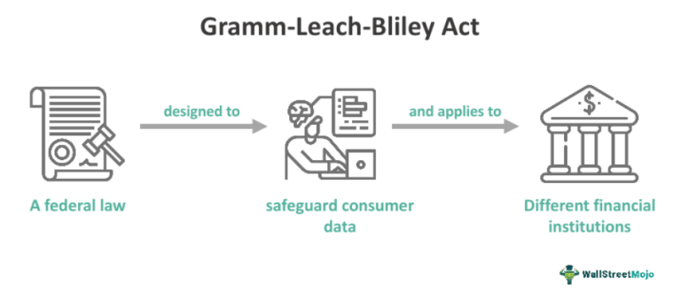

The passage of the Gramm-Leach-Bliley Act (GLBA) in 1999 marked a pivotal shift in the financial services sector. This legislative milestone significantly reshaped the banking landscape by repealing crucial sections of the Glass-Steagall Act, a set of regulations that had previously established firm boundaries between commercial banking, securities, and insurance services for decades. The main objective of the GLBA was to modernize and expand the financial services industry, granting banks the ability to offer a comprehensive suite of services, including insurance and investment products, alongside traditional banking offerings.

The act's enactment was a response to the rapidly evolving financial market dynamics at the turn of the century, reflecting the need for regulatory frameworks that accommodated the convergence of banking and non-banking financial services. By dismantling the long-standing barriers imposed by the Glass-Steagall Act, GLBA paved the way for financial institutions to diversify their service portfolios, thereby fostering the growth of large financial conglomerates capable of providing end-to-end financial solutions to consumers.

Understanding the Gramm-Leach-Bliley Act is crucial for professionals dealing with financial regulation and banking legislation, as it continues to exert significant influence over the organization and operation of financial institutions today. Moreover, its implications are particularly relevant when considering emerging financial trends, such as algorithmic trading, which rely on the integrated services framework enabled by the GLBA. This article aims to examine the purpose and impacts of the GLBA, as well as its intersections with modern financial technologies, highlighting its enduring legacy in shaping the global financial landscape.

## Table of Contents

## Background of the Gramm-Leach-Bliley Act

The Gramm-Leach-Bliley Act (GLBA), formally known as the Financial Services Modernization Act, was enacted under President Bill Clinton's administration on November 12, 1999. The primary objective of GLBA was to dismantle the longstanding barriers established by the Glass-Steagall Act of 1933, which had enforced a separation between commercial banking, investment banking, and insurance services. This strategic repeal was largely in response to the evolving demands and complexity of the financial landscape towards the end of the 20th century.

Prior to GLBA, the Glass-Steagall Act had imposed significant limitations on financial institutions, restricting their ability to diversify and expand into non-banking financial services. These restrictions became increasingly incompatible with the global financial environment that was becoming more interconnected and technologically advanced. By removing these barriers, GLBA aimed to modernize the financial services sector, thus facilitating the emergence of financial conglomerates that could offer a comprehensive suite of services, including banking, securities, and insurance under one corporate umbrella.

This legislative shift was not merely about deregulation; it also introduced specific regulatory requirements to ensure that the broader array of services offered by financial institutions maintained the stability and integrity of the financial system. The act laid the foundation for financial institutions to evolve into multi-functional entities, setting the stage for the financial conglomerates we see today. This move was designed to enhance competitiveness within the U.S. financial services industry, but it also necessitated enhanced regulatory frameworks to address potential risks associated with such a transformative change.

## Key Provisions of GLBA

The Gramm-Leach-Bliley Act (GLBA) played a pivotal role in reshaping the financial landscape by dismantling the long-standing Glass-Steagall Act restrictions, thereby allowing banks to engage in both the securities and insurance sectors. This legal framework marked a substantial shift towards financial services integration, permitting institutions to diversify their service offerings. 

One essential provision of the GLBA specifies that bank managers or service personnel are permitted to manage only specific types of financial products. This stipulation helps maintain a level of specialization within financial institutions, thereby aiming to prevent conflicts of interest that could arise from handling diverse financial operations simultaneously.

The Act also mandates that financial institutions clearly disclose their information-sharing practices to consumers. Transparency in data handling is a cornerstone of the framework, reflecting an effort to safeguard consumer interests in an increasingly complex financial ecosystem. Through this requirement, the Act seeks to build trust between consumers and financial entities by ensuring that individuals are informed of how their data might be exchanged or utilized.

Further bolstering consumer protection, the GLBA introduces robust privacy requirements geared towards securing sensitive consumer financial data. Under these provisions, consumers are offered opt-out options, enabling them to restrict the sharing of their personal information with third parties. This opt-out mechanism empowers consumers with greater control over their data, aligning with broader trends toward enhancing consumer rights in the digital era. 

While the emphasis on privacy and transparency is designed to protect consumers, it also imposes compliance obligations on financial institutions. They must implement systems and processes that not only meet legislative standards but also adapt to evolving privacy norms and expectations. Through these key provisions, the GLBA continues to influence the regulatory landscape, underscoring the delicate balance between innovation in financial services and the imperative of consumer protection.

## Impact on Banking Legislation

The Gramm-Leach-Bliley Act (GLBA) significantly altered the financial landscape by dismantling the barriers erected by the Glass-Steagall Act of 1933, thus reshaping the structure of financial services. One of the most notable outcomes of the GLBA was the facilitation of mega-mergers, exemplified by the formation of financial giants such as Citigroup through the merger of Citicorp and Travelers Group. This legislative change allowed for the creation of financial holding companies capable of offering a comprehensive array of services, including banking, securities, and insurance.

The GLBA expanded the scope and operations of financial institutions, leading to greater profitability and services diversification. By enabling banks to combine with securities firms and insurance companies, the Act ushered in a new era of financial services integration. This consolidation offered consumers a one-stop shop for their financial needs while simultaneously permitting institutions to exploit synergies that came with such integration.

In terms of regulatory oversight, the GLBA empowered the Federal Reserve with enhanced supervisory authority over financial holding companies. The Fed's role extended to ensuring that these entities operated in a manner consistent with maintaining the safety and soundness of the overall financial system. In particular, the Act required these companies to be well capitalized and adequately managed, thereby striving to mitigate potential risks associated with their broader operational scope.

However, the Act was not without controversy. Despite its intentions to modernize and stabilize the financial industry, the GLBA sparked a series of debates regarding financial ethics, conflicts of interest, and systemic risks. Critics argued that the convergence of banking and non-banking services might lead to conflicts of interest, where decisions in one sector could adversely affect another. The possibility of such conflicts raised concerns over whether the pursuit of profits could undermine the fiduciary duties owed to clients.

Moreover, the creation of vast financial entities under the GLBA umbrella led to apprehensions about systemic risk—large interconnected firms posed the risk of creating a "too big to fail" scenario. This systemic risk became a focal point during the 2007-2008 financial crisis, as policymakers and regulators grappled with the complexities and repercussions of such large-scale financial integrations. The ensuing scrutiny highlighted the need for balanced regulation that both fosters innovation and ensures adequate safeguards against financial instabilities.

## GLBA and Consumer Privacy

The Gramm-Leach-Bliley Act (GLBA) places a significant emphasis on the protection of consumer data privacy, recognizing the importance of safeguarding sensitive information within the financial sector. One of its primary consumer-focused provisions is the requirement for financial institutions to clearly communicate how customer data is utilized and shared. Customers must be informed about the information-sharing practices and provided with the option to limit or opt-out of sharing personal details with third parties. This transparency is intended to empower consumers with greater control over their personal financial information.

GLBA introduced the Financial Privacy Rule, which mandates comprehensive compliance requirements for businesses. These requirements necessitate that financial institutions develop and implement procedures to secure customer data, ensuring it is protected from unauthorized access or misuse. Institutions must also designate personnel responsible for enforcing data protection measures and regularly maintaining privacy policies. The implementation of this rule signifies a regulatory effort to prioritize consumer privacy in the financial services industry.

However, despite these legislative measures, there continues to be an active discussion regarding the sufficiency of the privacy protections established by GLBA. Critics argue that the opt-out provision may not fully protect consumer interests, as it requires consumers to take action to safeguard their privacy proactively. Additionally, the evolving landscape of digital financial services and data breaches presents new challenges that may not be adequately addressed by existing regulations. Continuous technological advancements necessitate ongoing evaluation and potential revisions to enhance data privacy protections, ensuring they meet the demands of a fast-changing financial environment.

## Interplay with Algorithmic Trading

The Gramm-Leach-Bliley Act (GLBA) has played a fundamental role in shaping the landscape for [algorithmic trading](/wiki/algorithmic-trading) by enabling a more integrated approach to financial services. The Act allowed the combination of commercial banking, investment banking, and insurance services under one financial institution. This consolidation paved the way for the development of sophisticated algorithmic trading, as institutions could now harness a wider array of financial data and products.

Algorithmic trading, which employs mathematical models and algorithms to execute trades at high speeds, has benefited from the infrastructure changes initiated by GLBA. With financial institutions offering a diverse range of services, the availability of data streams and financial instruments necessary for complex trading strategies has significantly improved. This has led to the proliferation of algorithmic trading strategies that can analyze market conditions and execute orders far more efficiently than traditional manual trading methods.

However, the integration of services introduces challenges related to market manipulation and ethical concerns. Algorithmic trading can, at times, lead to market disturbances, such as flash crashes, where rapid buy and sell orders create extreme [volatility](/wiki/volatility-trading-strategies). As a result, financial regulators are increasingly focusing on the need for robust oversight and mechanisms to prevent abusive practices like spoofing and layering.

Additionally, the Act's implications for data security are critical, given that algorithmic trading relies heavily on data integrity and confidentiality. Ensuring that massive datasets are protected from breaches is paramount for maintaining financial stability. The possibility of systemic risks arising from algorithmic trading necessitates ongoing regulatory updates to address these vulnerabilities effectively.

Thus, the GLBA has not only facilitated the growth of algorithmic trading but also highlighted the need for continuous monitoring and evolution of regulatory frameworks to safeguard financial markets against new-era risks.

## Criticisms and Future Outlook

The Gramm-Leach-Bliley Act (GLBA) has faced criticism, particularly in the context of its alleged contribution to the 2007-2008 financial crisis. Detractors argue that the Act facilitated risky financial practices by allowing the formation of large financial conglomerates, which led to institutions becoming "too big to fail." The repeal of key provisions of the Glass-Steagall Act is often pinpointed as a [factor](/wiki/factor-investing) that contributed to the lack of necessary regulatory oversight, enabling excessive risk-taking and complex financial products. This led to systemic vulnerabilities that became evident during the financial crisis.

Critics have suggested that reinstating certain Glass-Steagall-like restrictions could prevent such scenarios in the future by segregating commercial banking from investment activities. This separation could potentially limit conflicts of interest and reduce systemic risk. Furthermore, the conglomerate structures encouraged by GLBA have complicated regulatory oversight, making it challenging for regulators to monitor and manage systemic risks effectively.

The rapid development of financial technology (fintech) and the rise of algorithmic trading also present significant challenges to the existing framework established by GLBA. The integration of traditional banking services with cutting-edge technological solutions necessitates a reevaluation of existing regulatory provisions. Algorithmic trading, in particular, poses potential risks related to market stability and data security, issues that may not have been fully anticipated by GLBA's original architects.

As the financial landscape continues to evolve, there is a growing need for modifications to GLBA to address these emerging threats and harness opportunities offered by technological advancements. The legacy of GLBA underscores the importance of balancing innovation in financial services with robust oversight to safeguard consumer interests and maintain the integrity of the financial system.

Financial professionals must understand GLBA's historical context and its future trajectory, especially as they navigate the increasingly complex and technologically driven financial environment. This understanding will be critical to ensuring that the regulatory framework evolves in tandem with financial innovations, thereby promoting a stable and secure financial system.

## Conclusion

The Gramm-Leach-Bliley Act (GLBA) stands as a pivotal legislative framework that has significantly influenced financial regulation and reshaped banking operations. By allowing the convergence of banking, securities, and insurance services, GLBA fostered an environment conducive to financial innovation and integration. 

This integration, however, also highlighted the critical need for effective consumer protection measures, as the enhanced financial service offerings carried increased risks of privacy breaches and conflicts of interest. Ensuring a balance between innovation and consumer protection remains crucial, as financial institutions leverage the opportunities afforded by GLBA to expand their service portfolios.

Simultaneously, the complexities introduced by this integration continue to evolve with technological advancements, particularly with the emergence of algorithmic trading and fintech solutions. These technologies have transformed trading dynamics and data management, necessitating ongoing vigilance in regulatory frameworks to address potential risks such as market manipulation and systemic instability.

To effectively navigate these challenges, future amendments to GLBA may be essential. Such modifications should aim to strengthen oversight mechanisms and privacy safeguards while accommodating the transformative trends in technology-driven financial services. As the financial landscape progresses, understanding and adapting to GLBA's legacy is indispensable for professionals seeking to manage contemporary complexities in the industry.

## References & Further Reading

[1]: ["The Gramm-Leach-Bliley Act Shatters Glass-Steagall"](https://www.federalreservehistory.org/essays/gramm-leach-bliley-act) - Federal Reserve History

[2]: ["The Repeal of Glass-Steagall and the Advent of Broad Banking"](https://www.jstor.org/stable/pdf/2647102.pdf) - ScienceDirect

[3]: ["A Financial History of the United States"](https://www.amazon.com/Financial-History-United-States-set/dp/0765607301) by Jerry W. Markham

[4]: ["Anatomy of the Glass-Steagall Act: Challenges for Financial Reform"](https://www.history.com/topics/great-depression/glass-steagall-act) - Journal of Financial Regulation

[5]: ["Systemic Risk and the Financial Crisis: A Primer"](https://elischolar.library.yale.edu/cgi/viewcontent.cgi?article=2185&context=ypfs-documents) - The Brookings Institution