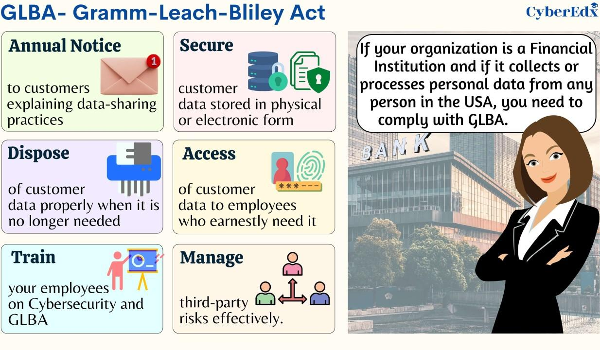

## Table of Contents

## What is the Gramm-Leach-Bliley Act of 1999?

The Gramm-Leach-Bliley Act of 1999, also known as the Financial Services Modernization Act, is a law passed by the United States Congress. It allows banks, insurance companies, and securities firms to merge and offer a wider range of financial services. Before this law, these types of companies were kept separate. The act was named after its sponsors, Senators Phil Gramm, Thomas J. Bliley Jr., and Representative Jim Leach.

The law also includes rules to protect consumers' personal financial information. It requires financial institutions to explain their information-sharing practices to their customers and to protect their customers' data. This means that banks and other financial companies must tell people how they use and share their personal information, and they must keep that information safe. The Gramm-Leach-Bliley Act has been important in shaping how financial services are provided and regulated in the United States.

## What was the primary purpose behind the enactment of the Gramm-Leach-Bliley Act?

The main goal of the Gramm-Leach-Bliley Act was to let banks, insurance companies, and stock firms join together and offer more types of financial services. Before this law, these businesses had to stay separate. By allowing them to merge, the act aimed to create bigger and more competitive financial companies that could offer a wider range of services to customers.

Another important part of the act was to protect people's personal financial information. The law made it a rule for financial companies to tell their customers how they share their information and to keep that information safe. This was to make sure that customers' private details were not misused or exposed.

## How did the Gramm-Leach-Bliley Act change the financial services industry?

The Gramm-Leach-Bliley Act changed the financial services industry by letting banks, insurance companies, and stock firms merge together. Before this law, these companies had to stay separate. This meant they could only offer their own specific services. After the act, they could join forces and offer a bigger range of financial products and services to their customers. This made the financial industry more competitive and allowed big companies to grow even bigger.

The act also brought new rules to protect people's personal financial information. Financial companies now had to tell their customers how they share their information and make sure it stays safe. This was important because it helped customers feel more secure about their private details. The changes from the Gramm-Leach-Bliley Act helped shape how financial services work in the United States, making the industry more connected and focused on protecting customer information.

## What were the key provisions of the Gramm-Leach-Bliley Act?

The Gramm-Leach-Bliley Act let banks, insurance companies, and stock firms merge together. Before this law, these businesses had to stay separate. This meant they could only offer their own specific services. After the act, they could join forces and offer a bigger range of financial products and services to their customers. This made the financial industry more competitive and allowed big companies to grow even bigger.

The act also set new rules to protect people's personal financial information. Financial companies now had to tell their customers how they share their information and make sure it stays safe. This was important because it helped customers feel more secure about their private details. The changes from the Gramm-Leach-Bliley Act helped shape how financial services work in the United States, making the industry more connected and focused on protecting customer information.

## How does the Gramm-Leach-Bliley Act affect consumer privacy?

The Gramm-Leach-Bliley Act helps protect consumer privacy by making financial companies tell their customers how they share their personal information. Before this law, people didn't always know how their private details were being used. Now, banks and other financial firms have to be clear about their information-sharing practices. This means customers can make better choices about who they trust with their money and personal data.

The act also requires financial companies to keep customers' information safe. They must have strong security measures in place to protect against data breaches and other threats. This helps prevent personal information from being stolen or misused. By setting these rules, the Gramm-Leach-Bliley Act makes sure that financial companies take consumer privacy seriously and work to keep their customers' data secure.

## What are the implications of the Gramm-Leach-Bliley Act on financial institutions' structure?

The Gramm-Leach-Bliley Act changed the way financial institutions are structured by allowing banks, insurance companies, and stock firms to merge together. Before this law, these types of businesses had to stay separate and could only offer their own specific services. After the act, they could join forces and offer a wider range of financial products and services to their customers. This made the financial industry more competitive and allowed big companies to grow even bigger. The act helped create large financial conglomerates that could provide everything from banking to insurance to investment services under one roof.

This change in structure also meant that financial institutions had to follow new rules to protect consumer privacy. The act made it a requirement for these companies to be clear about how they share customers' personal information. They had to tell their customers about their information-sharing practices and make sure that personal data was kept safe. This was important because it helped customers feel more secure about their private details. Overall, the Gramm-Leach-Bliley Act reshaped the financial industry by allowing more integration and emphasizing the importance of protecting customer information.

## How did the Gramm-Leach-Bliley Act repeal previous legislation, specifically the Glass-Steagall Act?

The Gramm-Leach-Bliley Act changed a big rule from the past called the Glass-Steagall Act. The Glass-Steagall Act was a law from the 1930s that made banks keep their regular banking separate from their investment banking. This meant banks that took people's savings and checking accounts couldn't also deal with stocks and risky investments. But the Gramm-Leach-Bliley Act took away this rule, letting banks mix these services together. This change let banks, insurance companies, and stock firms merge and offer more types of financial services to their customers.

By getting rid of the Glass-Steagall Act, the Gramm-Leach-Bliley Act made it easier for big financial companies to grow and offer more services. This was good for competition because it let companies get bigger and offer more choices to customers. But it also meant that banks could take more risks with people's money, which some people worried could lead to problems. The change helped shape the financial industry by allowing more integration and letting big financial conglomerates form, which could provide everything from banking to insurance to investment services under one roof.

## What role did the Gramm-Leach-Bliley Act play in the financial crisis of 2007-2008?

The Gramm-Leach-Bliley Act played a part in the financial crisis of 2007-2008 because it let banks mix their regular banking with risky investments. Before this law, the Glass-Steagall Act kept these activities separate. But after the Gramm-Leach-Bliley Act, banks could do both, which meant they could take more risks with people's money. This led to big banks growing even bigger and taking on more risky investments, like the ones tied to housing loans. When these risky investments started to fail, it caused big problems for the banks and the whole economy.

Some people think that if the Glass-Steagall Act had still been in place, the financial crisis might not have been as bad. They say that separating regular banking from investment banking could have stopped banks from taking too many risks. But others argue that the Gramm-Leach-Bliley Act wasn't the only reason for the crisis. There were many other things that went wrong, like banks giving out too many risky loans and not having enough rules to stop them. Still, the act's role in letting banks mix their services is seen as one piece of the puzzle that led to the financial crisis.

## How has the enforcement of the Gramm-Leach-Bliley Act evolved since its passage?

Since the Gramm-Leach-Bliley Act was passed in 1999, the way it is enforced has changed over time. The main group that makes sure banks and other financial companies follow the rules is the Federal Trade Commission (FTC). The FTC works with other agencies like the Federal Reserve and the Securities and Exchange Commission to keep an eye on how financial companies handle customer information. Over the years, these agencies have made their rules clearer and stricter to make sure companies are protecting people's privacy better. They've also started doing more checks and giving out bigger fines when companies don't follow the rules.

Another big change is how the act has been updated to fit new technology. As more people started using the internet and mobile banking, the rules had to change to cover these new ways of handling information. The FTC and other agencies have added new guidelines to make sure that online and mobile banking are just as safe as regular banking. They've also worked to make sure that financial companies are ready to deal with new kinds of risks, like data breaches and cyber attacks. All these changes show that the enforcement of the Gramm-Leach-Bliley Act keeps evolving to keep up with the changing world of finance and technology.

## What are the criticisms and defenses of the Gramm-Leach-Bliley Act from economic and regulatory perspectives?

Critics of the Gramm-Leach-Bliley Act say it helped cause the 2007-2008 financial crisis. They argue that by letting banks mix regular banking with risky investments, the act let banks take too many risks. Before the act, the Glass-Steagall Act kept these activities separate, which some people think could have stopped the crisis from happening. Critics also say the act didn't have enough rules to stop banks from doing risky things. They worry that big banks got too powerful and could hurt the economy if they made bad choices.

Defenders of the Gramm-Leach-Bliley Act say it wasn't the main reason for the financial crisis. They argue that many other things went wrong, like banks giving out too many risky loans and not having enough rules to stop them. Defenders believe the act helped make the financial industry more competitive by letting banks offer more services. They say it helped customers by giving them more choices and better services. From a regulatory perspective, defenders point out that the act set new rules to protect people's privacy, which is important for keeping customers' information safe.

## How has the Gramm-Leach-Bliley Act influenced international financial regulation?

The Gramm-Leach-Bliley Act has had an impact on how other countries think about and make rules for their financial systems. When the United States let banks, insurance companies, and stock firms merge together, other countries started to think about doing the same thing. They saw that letting these companies join forces could make their financial industries stronger and more competitive. But they also looked at the problems the U.S. had, like the financial crisis, and tried to make rules that would help them avoid those issues.

Some countries decided to keep their banks and other financial companies separate, like how it was in the U.S. before the Gramm-Leach-Bliley Act. They worried that mixing these services could lead to too much risk and trouble. But other countries went ahead and changed their rules to be more like the U.S. after the act. They wanted to make their financial industries grow and offer more services to people. So, the Gramm-Leach-Bliley Act helped shape how other countries think about and make their financial rules.

## What future legislative changes might be considered in relation to the Gramm-Leach-Bliley Act?

In the future, lawmakers might think about bringing back some of the rules from the Glass-Steagall Act to make banks safer. After the financial crisis, some people said that mixing regular banking with risky investments was a bad idea. They might want to separate these activities again so banks can't take too many risks with people's money. This could help stop another big financial crisis from happening. Lawmakers would need to think carefully about how to do this without making it hard for banks to offer good services to their customers.

Another thing lawmakers might look at is making the rules about protecting people's privacy even stronger. As more people use the internet and mobile banking, there are new ways for their information to be stolen or misused. Lawmakers could update the Gramm-Leach-Bliley Act to make sure financial companies have even better ways to keep customer information safe. They might also want to make the rules clearer and easier for people to understand, so everyone knows how their personal details are being used and shared.

## References & Further Reading

[1]: ["The Gramm-Leach-Bliley Act Shatters Glass-Steagall"](https://www.federalreservehistory.org/essays/gramm-leach-bliley-act) - Federal Reserve History

[2]: ["The Repeal of Glass-Steagall and the Advent of Broad Banking"](https://www.jstor.org/stable/pdf/2647102.pdf) - ScienceDirect

[3]: ["A Financial History of the United States"](https://www.amazon.com/Financial-History-United-States-set/dp/0765607301) by Jerry W. Markham

[4]: ["Anatomy of the Glass-Steagall Act: Challenges for Financial Reform"](https://www.history.com/topics/great-depression/glass-steagall-act) - Journal of Financial Regulation

[5]: ["Systemic Risk and the Financial Crisis: A Primer"](https://elischolar.library.yale.edu/cgi/viewcontent.cgi?article=2185&context=ypfs-documents) - The Brookings Institution