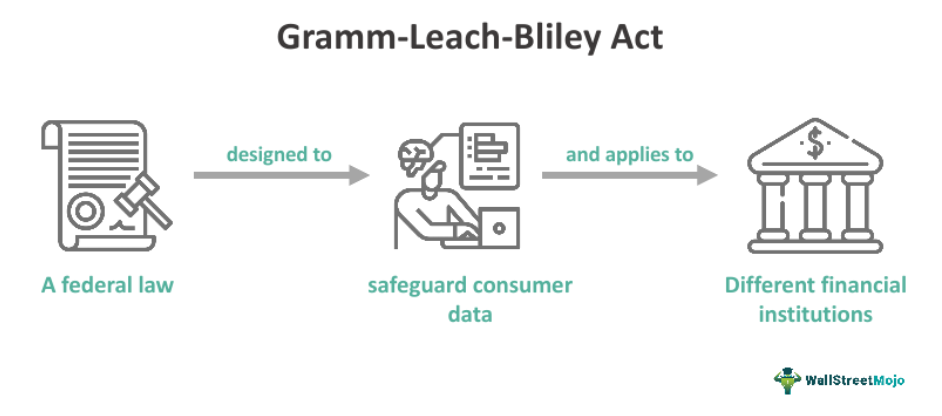

The Gramm-Leach-Bliley Act (GLBA) of 1999, also referred to as the Financial Services Modernization Act, signified a significant transition in the regulatory landscape of financial institutions in the United States. This landmark legislation enabled the convergence of different financial services, permitting banks, insurance companies, and securities firms to transcend traditional boundaries and offer a comprehensive suite of services. This legal shift marked the dismantling of specific segments of the Glass-Steagall Act, which had, since 1933, enforced a strict separation between commercial banking and securities operations.

The enactment of the GLBA presented a more integrated financial environment, significantly influencing the structure and operations of financial firms. One aspect of the GLBA that deserves attention is its role in fostering financial market innovations, notably the emergence of algorithmic trading. By breaking down previous barriers that isolated financial sectors, the Act allowed for greater collaboration and sharing of technologies, which were instrumental in the development and proliferation of algorithmic trading techniques.



This article intends to analyze the historical background, central provisions, and the enduring impacts of the GLBA, while particularly emphasizing its contribution to modern financial markets' evolution. Through this examination, we aim to provide a comprehensive understanding of how the Gramm-Leach-Bliley Act has reshaped the dynamics of financial services and market operations.

## Table of Contents

## Background of the Gramm-Leach-Bliley Act

The financial landscape of the late 20th century in the United States was marked by significant transformations, underpinned by a growing advocacy for deregulation. This period was characterized by various economic downturns, which exposed the ineffectiveness and inflexibility of the existing regulatory frameworks. The longstanding Glass-Steagall Act of 1933, established during the Great Depression, enforced a strict separation between commercial banking and securities activities. Over time, this demarcation was perceived as increasingly burdensome and impractical, given the rapidly evolving financial markets and the demands for more comprehensive financial services.

Advancements in technology during the 1980s and 1990s, alongside intensifying global financial competition, compelled financial institutions to pursue innovative avenues and broaden their service offerings. The desire to navigate a more interconnected financial world spurred efforts to rethink and restructure regulatory provisions that inhibited growth and responsiveness.

Introduced by Senator Phil Gramm, Congressman Jim Leach, and Congressman Thomas Bliley, the Gramm-Leach-Bliley Act (GLBA) emerged as a legislative response to these changes. This Act aimed to dismantle certain restrictions of the Glass-Steagall Act, facilitating an environment where banks, securities firms, and insurance companies could operate collaboratively. By allowing these entities to merge and offer a diverse array of financial services, the GLBA sought to enhance market competition and increase consumer choice. This legislative shift was not only an acknowledgment of the transformed economic and technological landscape but also a proactive step towards aligning with global financial practices.

## Key Provisions and Impacts of the GLBA

The Gramm-Leach-Bliley Act (GLBA) significantly altered the regulatory landscape of financial services in the United States by establishing new parameters for the operation of financial institutions. One of the major provisions of the GLBA was the creation of financial holding companies (FHCs). This legislative move enabled banks, securities firms, and insurance companies to operate under a single corporate structure, providing a broader array of financial services than was previously allowed. Before the GLBA, such consolidation was restricted under the Glass-Steagall Act, which mandated a separation between commercial banking and securities activities.

Under the GLBA, substantial sections of the Glass-Steagall Act were repealed, removing several barriers that had kept commercial and investment banking separate since the Great Depression. This allowed banks to participate in both types of activities, dramatically broadening their operational capabilities. As a result, institutions were able to expand their services and build diversified portfolios, potentially improving competitive advantages and consumer offerings.

Another critical component of the GLBA was its introduction of privacy protections for consumers. The Act required financial institutions to clearly communicate their policies on sharing consumer data and implement reasonable measures to safeguard this information. Such provisions were implemented to address growing concerns about data security and privacy in the expanding digital economy.

The GLBA’s deregulation facilitated the expansion and merger activity among financial services entities, contributing to the emergence of large financial conglomerates. This shift allowed for the integration of services and the possibility for institutions to leverage synergies across different financial sectors. While this created opportunities for economies of scale and scope, it also raised concerns about systemic risks associated with such vast and interconnected entities.

In summation, the GLBA’s key provisions reshaped the financial services industry by increasing the operational latitude of banking institutions and introducing critical privacy protections, ultimately contributing to the prevalent landscape of financial conglomerates. These changes had lasting impacts on the financial sector, influencing patterns of competition, innovation, and risk management.

## Algorithmic Trading and Financial Innovation

The deregulation standards established by the Gramm-Leach-Bliley Act (GLBA) provided an environment conducive to financial innovation, facilitating the development and widespread adoption of [algorithmic trading](/wiki/algorithmic-trading). This technological advancement has fundamentally transformed financial markets by enabling the execution of orders at speeds and frequencies unattainable by human traders. Algorithmic trading employs sophisticated algorithms that analyze market data to make rapid trading decisions, exploiting pricing inefficiencies and optimizing execution strategies.

The GLBA's allowance for the integration of services previously restricted under the Glass-Steagall Act catalyzed the modernization of financial infrastructures. By permitting banks, securities firms, and insurance companies to consolidate into financial holding companies, the legislation fostered an environment where technology and expertise from various sectors could be shared and collectively optimized. This collaborative framework was instrumental in advancing trading methodologies that form the backbone of contemporary financial systems.

For instance, algorithms designed for evaluating credit risk, traditionally used by banks, started leveraging data analytics techniques developed within securities and investment firms. Similarly, the programming and computational expertise originating from various sectors allowed for the creation of complex models used in algorithmic trading. These models are now able to process extensive datasets in real-time, implementing strategies such as statistical [arbitrage](/wiki/arbitrage), [market making](/wiki/market-making), and high-frequency trading.

Algorithmic trading strategies often involve leveraging advanced statistical techniques and [machine learning](/wiki/machine-learning) algorithms. For example, a basic strategy may use a moving average crossover to trigger buy and sell signals based on market trends. More advanced implementations might employ machine learning models to predict short-term price movements based on historical data.

```python
import numpy as np
import pandas as pd

# Simulating a simple moving average crossover strategy
def moving_average_crossover(data, short_window=40, long_window=100):
    signals = pd.DataFrame(index=data.index)
    signals['signal'] = 0.0

    # Create short and long simple moving averages
    signals['short_mavg'] = data['close'].rolling(window=short_window, min_periods=1, center=False).mean()
    signals['long_mavg'] = data['close'].rolling(window=long_window, min_periods=1, center=False).mean()

    # Create signals
    signals['signal'][short_window:] = np.where(signals['short_mavg'][short_window:] > signals['long_mavg'][short_window:], 1.0, 0.0)   

    # Generate trading orders
    signals['positions'] = signals['signal'].diff()

    return signals
```

The above code snippet represents a basic example of a moving average crossover strategy, which is an entry-level technique in algorithmic trading. More sophisticated implementations could integrate sentiment analysis, natural language processing, or neural networks to enhance predictive accuracy.

The adoption of such tools in financial markets underscores the revolutionary impact of the GLBA, which laid the groundwork for these technological advancements. As the financial landscape continues to evolve, the integration and interoperability fostered by the GLBA remain pivotal, highlighting the need for balancing innovation with regulatory oversight to ensure market stability and integrity.

## Controversies and the Great Recession

Critics of the Gramm-Leach-Bliley Act (GLBA) argue that its deregulation played a significant role in the financial excesses that precipitated the 2008 financial crisis. The Act effectively dismantled the longstanding separation between commercial and investment banking, established by the Glass-Steagall Act, thus allowing for a convergence of distinct financial services under the same institutional roof. This consolidation is believed to have increased systemic risk, as traditional banks, which historically focused on deposits and loans, ventured into potentially speculative activities alongside their investment banking operations. The mingling of these functions may have led to a conflict of interest and contributed to excessive risk-taking behaviors.

Proponents of this viewpoint highlight that, with the barriers removed, banks could leverage commercial banking deposits to fund higher-risk investment ventures. This environment allegedly fostered a culture of aggressive financial strategies and complex financial products, exemplified by mortgage-backed securities, which played a central role in the financial downturn. The lack of clear separation meant that the failure of one component within a financial holding company could potentially jeopardize its entire structure, amplifying the risk of systemic failure.

Conversely, some economists and former legislators present a different perspective, suggesting that the GLBA may have helped diversify risk among financial institutions. By enabling a wider array of services and the creation of financial conglomerates, the Act offered banks the ability to offset losses in one sector with gains in another. In theory, this should have led to a more balanced risk exposure.

The debates surrounding the role of the GLBA in the financial crisis center around these contrasting viewpoints. Critics focus on the potential for increased speculation and shared risk, while some defenders of the Act point to the strengths of diversified service offerings. The aftermath of the 2008 crisis prompted significant regulatory reconsiderations, culminating in legislation such as the Dodd-Frank Wall Street Reform and Consumer Protection Act, aimed at addressing the pitfalls identified in the preceding deregulation era. These ongoing discussions underscore the complexity of balancing financial innovation with the need for robust oversight to prevent future crises.

## Legacy and Future of Financial Modernization

The Gramm-Leach-Bliley Act (GLBA) of 1999 remains a significant piece of legislation in shaping the U.S. financial landscape. Its impact is reflected in the ongoing dynamics of financial modernization and regulatory adaptation. Enacted to dismantle barriers set by previous regulations, such as the Glass-Steagall Act, it enabled unprecedented integration of banking, securities, and insurance services. This broad regulatory change facilitated the formation and growth of financial conglomerates, previously constrained by legal and structural divides.

In the aftermath of the 2008 financial crisis, the Dodd-Frank Wall Street Reform and Consumer Protection Act of 2010 addressed several concerns associated with the deregulation introduced by the GLBA. The Dodd-Frank Act sought to enhance financial stability through increased oversight and by reducing the risk posed by large, interconnected financial institutions. As a response to the GLBA's created landscape, Dodd-Frank aimed to re-establish checks and balances, emphasizing transparency and consumer protection.

The legacy of the GLBA continues to inform contemporary debates on financial regulation. Lessons from the Act emphasize the need to balance innovation with prudent oversight. Policymakers often refer to the GLBA era to understand the consequences of extensive deregulation and to ensure lessons learned inform future regulatory frameworks.

Future financial modernization efforts focus on maintaining competitiveness while safeguarding against systemic risks. As financial markets evolve with technology advancements, such as fintech innovations, understanding the GLBA's impact shapes crucial elements in designing regulatory strategies. This involves evaluating the effectiveness of current regulations, anticipating future challenges, and being adaptive to technological disruptions that redefine traditional financial services.

The GLBA instigated a transformation that underscores an ongoing dialogue about regulatory frameworks. Such dialogue seeks to balance fostering innovation with implementing adequate oversight to protect the financial system's integrity and stability. This reflective approach continues to guide policy formulation, supporting a financial ecosystem capable of sustaining economic growth and stability while embracing new advancements.

## Conclusion

The 1999 Gramm-Leach-Bliley Act (GLBA) played a crucial role in redefining the U.S. financial sector by dismantling regulatory barriers that had been in place since the Great Depression. By facilitating the integration of banks, insurance companies, and securities firms, the Act significantly enhanced industry competitiveness. However, this deregulatory movement also introduced challenges, notably concerning consumer protection and systemic risk. Over two decades later, the GLBA continues to be a point of contention in financial policy debates, as regulators and industry stakeholders address both its legacy and its limitations.

In the current financial landscape, marked by rapid technological advancements and the introduction of complex financial products, the GLBA's influence remains evident. The consolidation and flexibility it promoted have allowed for the emergence of dynamic financial conglomerates capable of offering diversified services. Yet, this same integration poses ongoing regulatory challenges, particularly in ensuring adequate oversight and stability.

As financial markets become increasingly sophisticated, there is a critical need to understand the GLBA's contributions and limitations. This understanding is essential for developing regulatory frameworks that not only foster innovation but also protect against potential instabilities. The continuous evolution of the financial ecosystem underscores the necessity of balancing regulatory oversight with the freedom to innovate, ensuring that the lessons learned from the GLBA inform future financial modernization efforts.

## References & Further Reading

[1]: ["The Gramm-Leach-Bliley Act and Financial Regulation"](https://en.wikipedia.org/wiki/Gramm%E2%80%93Leach%E2%80%93Bliley_Act) in the Journal of Economic Perspectives

[2]: ["The Financial Crisis and the Failure of Regulation"](https://link.springer.com/book/10.1007/978-3-030-05680-3) by Frederic S. Mishkin, Brookings Institution

[3]: ["After the Glass-Steagall Act: Reform and Consolidation in the Banking Industry"](https://www.cato.org/policy-analysis/repeal-glass-steagall-act-myth-reality) in the Journal of Financial Services Research

[4]: ["Algorithmic Trading and DMA: An Introduction to Direct Access Trading Strategies"](https://archive.org/details/algorithmictradi0000john) by Barry Johnson

[5]: ["The Impact of the Gramm-Leach-Bliley Act on the Financial Services Industry"](https://www.researchgate.net/publication/226400428_The_Impact_of_the_Gramm-Leach-Bliley_Act_on_the_Financial_Service_Industry) by Kenneth E. Scott, ResearchGate