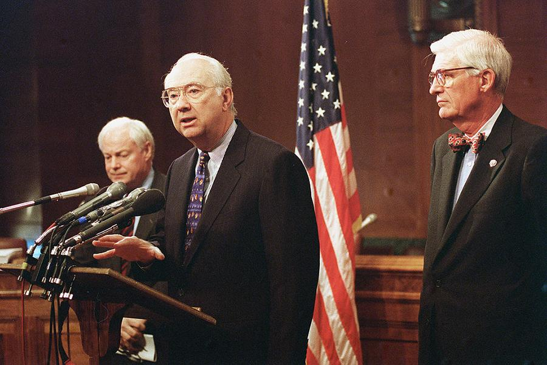

## Table of Contents

## What is the Gramm-Leach-Bliley Act of 1999?

The Gramm-Leach-Bliley Act, also known as the Financial Services Modernization Act of 1999, is a law in the United States that changed how banks and financial companies work. Before this law, banks, insurance companies, and investment firms were mostly separate. The Act allowed these different types of financial companies to merge and offer a wider range of services under one roof. This meant that a bank could now sell insurance or offer investment advice, which was not allowed before.

The law also includes rules to protect people's personal financial information. It requires financial institutions to explain their privacy policies to customers and give them a chance to opt out of having their information shared with other companies. This part of the law is important because it helps keep people's financial details safe and private. Overall, the Gramm-Leach-Bliley Act changed the financial industry by allowing more flexibility and competition, while also setting standards for privacy and security.

## What was the primary purpose of the Gramm-Leach-Bliley Act?

The main goal of the Gramm-Leach-Bliley Act, passed in 1999, was to change the rules about how banks and other financial companies could work together. Before this law, banks, insurance companies, and investment firms had to stay separate. The Act let these different types of financial companies join together and offer more services to customers. This meant that a bank could now sell insurance or give investment advice, which helped them grow and compete better.

Another important part of the Gramm-Leach-Bliley Act was to protect people's personal financial information. The law made it a rule for financial companies to tell their customers about their privacy policies. It also gave people the right to stop their information from being shared with other companies. This was important because it helped keep people's financial details safe and private, even as the financial industry changed and grew.

## How did the Gramm-Leach-Bliley Act change the financial industry?

The Gramm-Leach-Bliley Act changed the financial industry by letting banks, insurance companies, and investment firms work together more easily. Before the Act, these different types of financial companies had to stay separate. But after the law was passed, they could join forces and offer more services to customers. This meant that a bank could start selling insurance or giving investment advice, which was not allowed before. The Act helped financial companies grow bigger and compete better with each other.

Another big change from the Gramm-Leach-Bliley Act was about protecting people's personal financial information. The law made it a rule for financial companies to tell their customers about their privacy policies. It also gave people the right to stop their information from being shared with other companies. This was important because it helped keep people's financial details safe and private, even as the financial industry changed and grew. The Act made sure that while companies could offer more services, they also had to be careful with customers' private information.

## What are the key components of the Gramm-Leach-Bliley Act?

The Gramm-Leach-Bliley Act, passed in 1999, changed the rules for banks, insurance companies, and investment firms. Before the Act, these companies had to stay separate. But after the law was passed, they could work together and offer more services to customers. This meant that a bank could start selling insurance or giving investment advice, which was not allowed before. The Act helped financial companies grow bigger and compete better with each other. It made it easier for them to offer a wide range of services under one roof, which was good for customers who wanted all their financial needs met in one place.

Another important part of the Gramm-Leach-Bliley Act was about protecting people's personal financial information. The law made it a rule for financial companies to tell their customers about their privacy policies. It also gave people the right to stop their information from being shared with other companies. This was important because it helped keep people's financial details safe and private, even as the financial industry changed and grew. The Act made sure that while companies could offer more services, they also had to be careful with customers' private information.

## Who were the main proponents and opponents of the Gramm-Leach-Bliley Act?

The main proponents of the Gramm-Leach-Bliley Act were big financial companies and some politicians who believed that letting banks, insurance companies, and investment firms work together would help the economy grow. They thought that if these companies could offer more services, they could compete better and give customers more choices. Senators Phil Gramm, Thomas J. Bliley Jr., and Richard Shelby were some of the key politicians who supported the Act. Big banks like Citigroup also pushed for the law because they wanted to expand their business.

The main opponents of the Gramm-Leach-Bliley Act were some consumer groups and politicians who worried about the risks of letting financial companies get too big and powerful. They were concerned that if big banks could do everything, it might lead to problems if one part of a big company failed. Some people also worried that the law might not do enough to protect people's privacy. Senator Paul Wellstone was a strong opponent of the Act, and consumer groups like the Consumer Federation of America spoke out against it too. They thought the law might hurt regular people by making the financial system less safe and more complicated.

## How does the Gramm-Leach-Bliley Act affect consumer privacy?

The Gramm-Leach-Bliley Act affects consumer privacy by making rules for how financial companies handle personal information. Before this law, financial companies could share your information with other businesses without telling you. But after the Act, they have to tell you about their privacy policies. This means they need to explain how they use your information and with whom they might share it. You also get the right to say "no" to having your information shared with other companies. This part of the law helps keep your financial details safe and private.

Even though the Act helps protect your privacy, it also lets financial companies work together more easily. This means they can offer more services, like banks selling insurance or giving investment advice. While this can be good for customers because they get more choices, it also means more companies might have access to your personal information. The Gramm-Leach-Bliley Act tries to balance these changes by making sure financial companies are clear about their privacy practices and give you control over your information.

## What are the requirements for financial institutions under the Gramm-Leach-Bliley Act?

The Gramm-Leach-Bliley Act requires financial institutions to tell their customers about their privacy policies. This means they have to explain how they use and share personal financial information. Customers get to see this information when they start doing business with the company and every year after that. If the company wants to share your information with other companies, they have to give you a chance to say "no" to that sharing. This helps keep your personal information private and safe.

Financial institutions also have to keep your information secure. They need to have safeguards in place to protect against things like hacking or losing your data. If there's a problem, like a data breach, they have to tell you about it. This part of the law makes sure that companies are careful with your information and take steps to keep it safe. Overall, the Gramm-Leach-Bliley Act makes sure that while financial companies can offer more services, they also have to be clear and careful with your personal information.

## How did the Gramm-Leach-Bliley Act repeal parts of the Glass-Steagall Act?

The Gramm-Leach-Bliley Act, passed in 1999, changed the rules that were set by the Glass-Steagall Act, which was a law from 1933. The Glass-Steagall Act had rules that kept banks, insurance companies, and investment firms separate. It was made to stop banks from taking too many risks with people's money. But the Gramm-Leach-Bliley Act took away some of these rules. It let banks, insurance companies, and investment firms work together and offer more services to customers. This meant that a bank could start selling insurance or giving investment advice, which was not allowed before.

By repealing parts of the Glass-Steagall Act, the Gramm-Leach-Bliley Act made it easier for big financial companies to grow and compete. It allowed them to offer a wide range of services under one roof, which was good for customers who wanted all their financial needs met in one place. But some people worried that letting these companies get bigger and more powerful might lead to problems if one part of a big company failed. The Gramm-Leach-Bliley Act tried to balance these changes by making sure financial companies were clear about their privacy practices and gave customers control over their personal information.

## What has been the impact of the Gramm-Leach-Bliley Act on the U.S. economy?

The Gramm-Leach-Bliley Act has had a big impact on the U.S. economy by letting banks, insurance companies, and investment firms work together more easily. Before the Act, these companies had to stay separate. But after the law was passed, they could join forces and offer more services to customers. This meant that a bank could start selling insurance or giving investment advice, which helped them grow bigger and compete better. The Act made it easier for financial companies to offer a wide range of services under one roof, which was good for customers who wanted all their financial needs met in one place. This change helped the economy grow because it made the financial industry more flexible and competitive.

However, the Gramm-Leach-Bliley Act also had some downsides. Some people worried that letting financial companies get too big and powerful might lead to problems if one part of a big company failed. This worry came true during the 2008 financial crisis, when big banks that had grown because of the Act faced big problems. The crisis showed that letting banks do more things could make the economy less stable. But the Act also had good parts, like rules to protect people's personal financial information. It made financial companies tell their customers about their privacy policies and gave people the right to stop their information from being shared with other companies. This helped keep people's financial details safe and private, even as the financial industry changed and grew.

## How does the Gramm-Leach-Bliley Act relate to the financial crisis of 2007-2008?

The Gramm-Leach-Bliley Act helped cause the 2007-2008 financial crisis by letting banks, insurance companies, and investment firms work together more easily. Before the Act, these companies had to stay separate. But after the law was passed, they could join forces and offer more services to customers. This meant that a bank could start selling insurance or giving investment advice, which helped them grow bigger and take more risks. Some people worried that letting financial companies get too big and powerful might lead to problems if one part of a big company failed. This worry came true during the financial crisis, when big banks that had grown because of the Act faced big problems.

The crisis showed that letting banks do more things could make the economy less stable. Big banks like Lehman Brothers and AIG got into trouble because they took too many risks. The Gramm-Leach-Bliley Act made it easier for them to grow and take these risks, which helped cause the financial crisis. But the Act also had good parts, like rules to protect people's personal financial information. It made financial companies tell their customers about their privacy policies and gave people the right to stop their information from being shared with other companies. This helped keep people's financial details safe and private, even as the financial industry changed and grew.

## What amendments or updates have been made to the Gramm-Leach-Bliley Act since its passage?

Since the Gramm-Leach-Bliley Act was passed in 1999, there have been some changes to it. One big change came with the Dodd-Frank Wall Street Reform and Consumer Protection Act in 2010. This new law was made after the 2007-2008 financial crisis to make the financial system safer. It added more rules to the Gramm-Leach-Bliley Act, like making banks do more to keep their customers' information safe. The Dodd-Frank Act also made the Federal Reserve and other government groups watch banks more closely to make sure they don't take too many risks.

Another change to the Gramm-Leach-Bliley Act came in 2015 with the Fixing America's Surface Transportation (FAST) Act. This law added a rule that financial companies have to tell people if their information might be shared with other companies. It also made it easier for people to say "no" to having their information shared. These changes were made to make sure that while financial companies can offer more services, they also have to be careful with customers' private information. Overall, the updates to the Gramm-Leach-Bliley Act have tried to balance the need for a strong financial industry with the need to protect people's privacy and keep the economy safe.

## How is the Gramm-Leach-Bliley Act enforced and what are the penalties for non-compliance?

The Gramm-Leach-Bliley Act is enforced by different government agencies like the Federal Trade Commission (FTC), the Office of the Comptroller of the Currency (OCC), and the Federal Reserve. These agencies make sure that banks and other financial companies follow the rules about privacy and security. If a company does not follow the rules, the agencies can do things like start investigations, ask for reports, and do surprise checks. They can also make the company fix any problems they find. This helps make sure that financial companies are careful with people's private information and follow the law.

If a financial company does not follow the Gramm-Leach-Bliley Act, they can face penalties. The penalties can be fines, which can be a lot of money, depending on how bad the problem is. The government can also make the company pay for any harm they caused to people whose information was not kept safe. In really bad cases, the government might stop the company from doing business until they fix the problems. These penalties help make sure that financial companies take the rules seriously and work hard to protect people's privacy.

## References & Further Reading

[1]: ["The Gramm-Leach-Bliley Act and Financial Regulation"](https://en.wikipedia.org/wiki/Gramm%E2%80%93Leach%E2%80%93Bliley_Act) in the Journal of Economic Perspectives

[2]: ["The Financial Crisis and the Failure of Regulation"](https://link.springer.com/book/10.1007/978-3-030-05680-3) by Frederic S. Mishkin, Brookings Institution

[3]: ["After the Glass-Steagall Act: Reform and Consolidation in the Banking Industry"](https://www.cato.org/policy-analysis/repeal-glass-steagall-act-myth-reality) in the Journal of Financial Services Research

[4]: ["Algorithmic Trading and DMA: An Introduction to Direct Access Trading Strategies"](https://archive.org/details/algorithmictradi0000john) by Barry Johnson

[5]: ["The Impact of the Gramm-Leach-Bliley Act on the Financial Services Industry"](https://www.researchgate.net/publication/226400428_The_Impact_of_the_Gramm-Leach-Bliley_Act_on_the_Financial_Service_Industry) by Kenneth E. Scott, ResearchGate