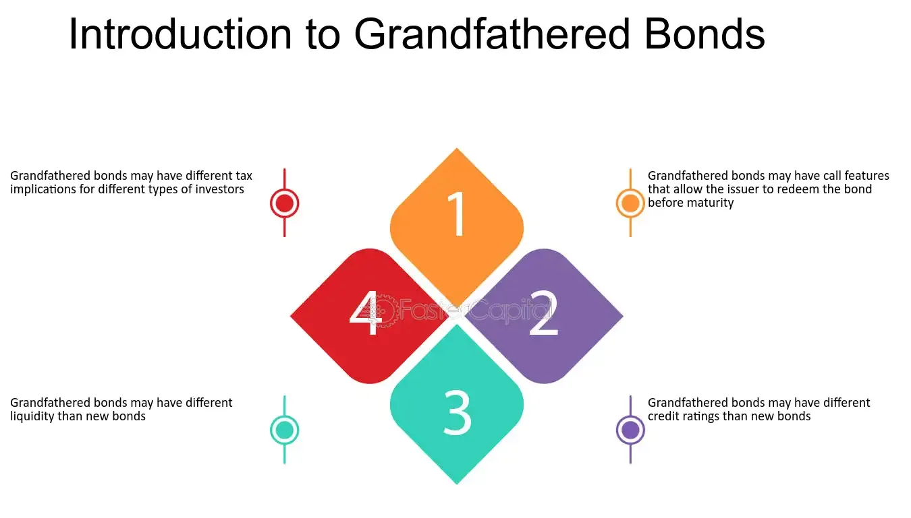

## Table of Contents

## What is a grandfathered bond?

A grandfathered bond is a type of bond that was issued before certain rules or laws changed. These bonds are allowed to keep their old rules even after the new laws come into effect. This is called being "grandfathered in." For example, if a new tax law makes bond interest taxable, bonds issued before this law might still be tax-free.

This concept is important because it helps people and companies keep the benefits they had when they bought the bond. It can make a big difference in how much money they get from their investment. Grandfathered bonds can be found in many areas, like municipal bonds or corporate bonds, depending on what rules changed.

## How does a grandfathered bond differ from a regular bond?

A grandfathered bond is different from a regular bond because it follows old rules that were in place when it was issued. These old rules might be more beneficial than the new rules that apply to regular bonds issued after a certain date. For example, if a new law says that bond interest will be taxed, a grandfathered bond might still be tax-free because it was issued before the law changed.

Regular bonds, on the other hand, must follow the current laws and regulations at the time they are issued. This means they might not have the same benefits as grandfathered bonds. If someone buys a regular bond after a new tax law, they will have to pay taxes on the interest they earn, unlike someone who holds a grandfathered bond.

## What are the origins of the term 'grandfathered' in relation to bonds?

The term 'grandfathered' comes from the idea of protecting rights or privileges that someone already has. It started with a law in the United States called the 'Grandfather Clause.' This law was made in the late 1800s to let people vote if their grandfathers could vote before the Civil War. Even though new voting rules were made, these people could still vote because of their grandfathers. 

In the world of bonds, the term 'grandfathered' means that a bond keeps the old rules it had when it was first issued. This happens even if new laws or rules change later. For example, if a new law says bond interest must be taxed, a bond issued before this law can still be tax-free. This helps people and companies keep the benefits they had when they bought the bond.

## What are the typical characteristics of a grandfathered bond?

A grandfathered bond is a bond that was issued before certain rules changed. Because it was issued earlier, it gets to keep the old rules even after new laws come into effect. This means that a grandfathered bond might have benefits that new bonds don't have. For example, if a new law says that bond interest must be taxed, a grandfathered bond might still be tax-free. This makes the bond more valuable to the person who owns it.

The main thing about a grandfathered bond is that it keeps the same rules it had when it was first issued. This can be important for people who bought the bond because they planned on those rules staying the same. If the rules change and make new bonds less beneficial, the grandfathered bond can still give the owner the benefits they expected when they bought it. This helps keep their investment plan working the way they wanted it to.

## Why might an investor choose a grandfathered bond over other types of investments?

An investor might choose a grandfathered bond because it can offer better benefits than new bonds. For example, if a new law makes bond interest taxable, a grandfathered bond might still be tax-free. This means the investor can keep more of the money they earn from the bond. Also, since the bond keeps the old rules, the investor knows exactly what to expect, which can make planning easier and less risky.

Another reason is that grandfathered bonds can be more valuable because they are rare. Not many bonds get to keep old, better rules after laws change. So, if an investor finds a grandfathered bond, it might be a good chance to get a special investment that others don't have. This can make their investment portfolio stronger and more unique.

## What are the tax implications of investing in grandfathered bonds?

When you invest in a grandfathered bond, the tax rules that apply are the ones from when the bond was first issued. This means if a new law says that bond interest should be taxed, a grandfathered bond might still be tax-free. This can save you money because you get to keep all the interest you earn without paying taxes on it. It's like getting a special deal that new bonds don't have.

This tax advantage can make grandfathered bonds very attractive. If you're trying to grow your money without losing a big chunk to taxes, these bonds can be a good choice. But remember, even though grandfathered bonds have this benefit, they still need to fit into your overall investment plan. Always think about your goals and how these bonds can help you reach them.

## How do grandfathered bonds affect portfolio diversification?

Grandfathered bonds can help with portfolio diversification because they are different from new bonds. Since they follow old rules, they might have benefits that new bonds don't have. For example, if a grandfathered bond is tax-free and new bonds are taxable, adding a grandfathered bond to your portfolio can give you a way to earn money without paying taxes. This can make your investments more balanced because you're not just relying on one type of bond.

Including grandfathered bonds can also make your portfolio less risky. Because they keep the old rules, you know exactly what to expect from them. This can be comforting when other parts of your portfolio might be affected by new laws or market changes. By having a mix of different types of investments, like grandfathered bonds, you spread out your risk and can protect your money better.

## What are the risks associated with holding grandfathered bonds?

Holding grandfathered bonds can have some risks. One risk is that the bond might be harder to sell. Since grandfathered bonds are special and not many people have them, finding someone who wants to buy one can be tough. This means if you need to get your money out of the bond quickly, it might be hard to do.

Another risk is that the rules that made the bond grandfathered might change again. Even though the bond was supposed to keep its old rules, sometimes new laws can affect old bonds too. If this happens, the grandfathered bond might lose its special benefits, like being tax-free. This could make the bond less valuable and affect how much money you make from it.

## How have regulatory changes impacted the issuance and trading of grandfathered bonds?

Regulatory changes can make it harder to issue new grandfathered bonds. When laws change, new bonds have to follow the new rules. This means that only bonds issued before the law changed can be grandfathered. Because of this, fewer and fewer grandfathered bonds are issued over time. This makes them rarer and can make them more valuable to investors who want the old benefits.

These changes can also affect how grandfathered bonds are traded. Since they are rarer, there might be fewer people who want to buy them. This can make it harder to sell a grandfathered bond if you need to. Also, if new laws come that change the rules for old bonds too, the grandfathered bonds might lose their special benefits. This could make them less valuable and affect how much money people are willing to pay for them.

## What strategies can be used to optimize the returns from grandfathered bonds?

One way to get the most out of grandfathered bonds is to hold onto them until they mature. Since these bonds keep their old rules, they can give you benefits that new bonds don't have. For example, if your grandfathered bond is tax-free and new bonds are taxable, you can save money on taxes by keeping the old bond. By waiting until the bond matures, you make sure you get all the interest without losing any to taxes.

Another strategy is to buy more grandfathered bonds if you can find them. Because they are rare, not everyone can get them. If you find a chance to buy one, it could be a good investment. Adding more grandfathered bonds to your portfolio can make it stronger and help you earn more money without paying as much in taxes. Just make sure the bonds fit with your overall investment plan and goals.

## How do grandfathered bonds fit into the broader fixed income market?

Grandfathered bonds are a special part of the fixed income market. They are bonds that were issued before certain rules changed, so they get to keep their old benefits. This makes them different from most other bonds in the market, which have to follow the new rules. For example, if a new law makes bond interest taxable, grandfathered bonds might still be tax-free. This can make them more valuable to investors who want to save money on taxes.

In the fixed income market, grandfathered bonds can help investors diversify their portfolios. Because they are rare and have special benefits, they can add a unique element to an investor's mix of investments. This can help balance out the risks from other types of bonds or investments. However, since they are harder to find and sell, investors need to think carefully about how grandfathered bonds fit into their overall investment plan.

## What future trends might affect the viability and attractiveness of grandfathered bonds?

Future trends could make grandfathered bonds less common and harder to find. As more time passes, fewer of these bonds will be around because they were issued before certain rules changed. New laws might also affect old bonds, making them lose their special benefits. If this happens, grandfathered bonds might not be as attractive to investors because they won't be as different from new bonds. Also, if the economy changes a lot, people might want to invest in other things that seem safer or more profitable.

On the other hand, if the rules stay the same and grandfathered bonds keep their benefits, they could still be very attractive. Investors who want to save money on taxes might still look for these bonds. They could be seen as a good way to diversify a portfolio because they are rare and have special advantages. But, because they are hard to find and sell, investors will need to be smart about how they use grandfathered bonds in their investment plans.

## What is the understanding of bonds and their functionality?

Bonds represent a crucial component in the landscape of fixed-income securities. These instruments are essentially loans provided by investors to various entities, predominantly corporate or governmental. When an investor purchases a bond, they are lending money to the issuer in exchange for periodic interest payments, known as coupons, and the return of the bond's face value at maturity. This process of regular interest distribution alongside capital preservation upon maturity makes bonds a popular choice among investors seeking stable income streams.

Several key concepts form the backbone of bond investing. Firstly, the yield of a bond is a critical measure, reflecting the return an investor can expect relative to its purchase price or current market value. Yield can be calculated using the formula: 

$$
\text{Yield} = \frac{\text{Coupon Payment}}{\text{Current Market Price}}
$$

Maturity denotes the time frame over which the bond will provide interest payments before repaying the principal amount. Bonds can range from short-term instruments, maturing in less than a year, to long-term options, extending over several decades. The coupon rate is another vital metric, indicating the annual interest payment as a percentage of the bond's face value. 

Credit rating is a financial indicator assigned by rating agencies that assesses the creditworthiness of the bond issuer and their ability to meet financial obligations. A higher credit rating suggests a lower risk of default, which generally correlates with lower yields, while a lower credit rating implies higher risk and, consequently, potentially higher yields. 

There exists a diverse array of bonds that cater to different investor objectives and risk appetites. Corporate bonds are issued by companies seeking to raise capital for various projects or operational needs. In contrast, government bonds are issued by national governments and are generally perceived as low-risk due to the backing of sovereign states. Municipal bonds, issued by local or state governments, offer potential tax advantages and are typically used to fund public projects.

Each category of bonds presents a unique risk-return profile, making them suitable for a wide array of portfolio strategies. Investors can tailor their bond investments in accordance with their risk tolerance, investment horizon, and income requirements, making bonds a versatile tool in financial planning.

## References & Further Reading

Fabozzi, F. J. (2008). *Bond Markets, Analysis, and Strategies*. Pearson. This book provides a comprehensive examination of bond markets, integrating theoretical and practical aspects. It covers fixed-income instruments in depth, offering insights into valuation, risk analysis, and strategies for management. A valuable resource for understanding bond market dynamics and investment strategies.

Gomber, P., et al. (2011). *High-Frequency Trading.* In Market Engineering. This reference discusses the technological and operational aspects of high-frequency trading ([HFT](/wiki/high-frequency-trading-strategies)), detailing the strategies and mechanisms that drive this fast-paced segment of the financial markets. Exploring the implications of HFT on market efficiency and stability, it serves as a critical read for those interested in the intersection of technology and finance.

De Prado, M. L. (2018). *Advances in Financial Machine Learning*. Wiley. This work is pivotal for those interested in applying [machine learning](/wiki/machine-learning) techniques to finance. It introduces innovations in data processing, predictive modeling, and strategy formulation. The book includes practical examples and code, focusing on improving financial forecasts and [algorithmic trading](/wiki/algorithmic-trading) strategies through machine learning.

Chan, E. P. (2009). *Quantitative Trading: How to Build Your Own Algorithmic Trading Business*. Wiley Trading. This guide is essential for anyone aiming to enter algorithmic trading. It offers a detailed framework for developing and deploying [quantitative trading](/wiki/quantitative-trading) strategies, including risk management and execution. With a focus on Python, it gives practical guidance on infrastructure, strategies, and the business aspects of launching a trading venture.

