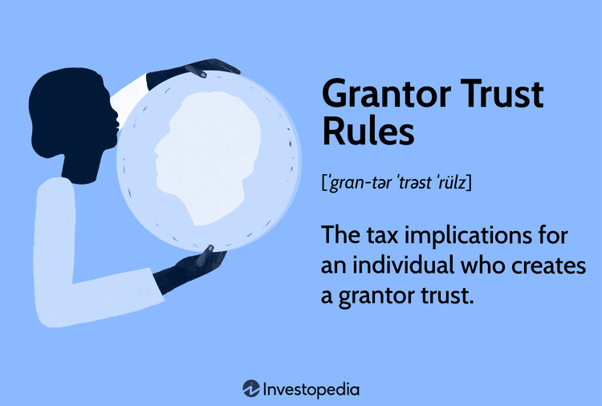

Understanding the intricacies of the financial and legal landscapes is crucial for professionals involved in grantor trust law and algorithmic trading. These two fields, while distinct, often intersect in ways that require a sophisticated grasp of both domains to navigate effectively. Grantor trusts, as an estate planning tool, offer individuals significant tax advantages and strategic asset management options. However, these advantages are accompanied by a complex network of legal obligations and responsibilities that must be managed diligently to ensure compliance and optimized trust performance.

In parallel, algorithmic trading, which employs automated systems to execute trades based on predetermined criteria, has become a cornerstone of modern financial markets. The rapid pace of technological advancements has transformed trading practices, necessitating a profound understanding of these technologies not only by those designing and implementing algorithms but also by legal professionals tasked with ensuring their compliance with regulatory standards.



This article will explore the significant legal roles within grantor trust law, focusing on the responsibilities and interactions of key players such as the grantor, trustee, and beneficiary. It will also dissect how these roles impact algorithmic trading, highlighting the symbiotic relationship between legal frameworks and financial technologies. The deployment of algorithmic trading strategies must align meticulously with legal and regulatory frameworks to prevent compliance issues and secure efficient trading operations.

With the continual evolution of technology and regulations, the intersection of law and algorithmic trading demands a nuanced understanding. Professionals in this field must stay abreast of current developments to effectively guide strategies and safeguard against legal risks. This introduction sets the stage for a comprehensive examination of these complex subjects, underscoring the importance of integrating legal expertise with technological innovation to achieve optimal financial outcomes.

## Table of Contents

## Legal Framework of Grantor Trusts

Grantor trusts are integral to estate planning due to their potential to provide tax benefits and flexible asset management strategies. They are unique in that the grantor, the person establishing the trust, retains certain powers or interests, which cause the trust's income to be taxable to the grantor rather than the trust itself. This characteristic can offer specific advantages but also means navigating complex legal structures.

The structure of a grantor trust is fundamentally defined by the Internal Revenue Code sections [IRC §671-§679](https://www.law.cornell.edu/uscode/text/26/subtitle-A/chapter-1/subchapter-J/part-I/subpart-E). These sections outline situations where the grantor is recognized as the owner of the trust for tax purposes. Typically, a grantor trust allows the grantor to exercise control over the trust’s income or principal, such as through the ability to revoke the trust or modify beneficiaries, which keeps tax responsibilities with the grantor. This control can be beneficial for estate tax minimization because the income generated is taxed at the grantor's personal tax rate, potentially allowing assets within the trust to grow tax-deferred.

The primary purpose of establishing such a trust is often to achieve specific financial and estate planning goals. These may include reducing estate tax liability, managing assets for beneficiaries, and creating a controlled income distribution plan. In structuring an effective grantor trust, legal professionals must focus on aligning the grantor’s intentions with IRS regulations. This often involves drafting trust documents that clearly outline the powers retained by the grantor, such as the power to substitute trust assets or to borrow from the trust without adequate interest, which maintains the grantor's ownership status for tax purposes.

One must also consider the legal obligations imposed by grantor trusts. The trustee, responsible for managing the trust's assets, must adhere to fiduciary duties, ensuring the grantor’s directives are followed while also considering the interests of the beneficiaries. This includes providing the Internal Revenue Service (IRS) with appropriate tax filings, such as Forms 1041 and 1099, which report any income and distributions in alignment with the trust’s tax treatment.

Additionally, legal professionals must ensure compliance with other applicable regulations and tax treaties if the trust involves cross-border elements. Complexities arise when addressing foreign grantor trust rules, which may impose different tax treatment or reporting obligations if the grantor or beneficiaries are foreign persons.

In summary, understanding grantor trust law is vital for both composing precise legal documentation and advising clients on the potential implications of their estate planning choices. The foundational elements of grantor trust law encompass not only the structural setup but also the legal ramifications involving taxes and asset management, pivotal for achieving optimized estate planning solutions.

## Critical Legal Roles in Grantor Trust Management

In managing a grantor trust, three critical legal roles must be clearly delineated and understood in order to ensure compliance and optimize trust performance: the grantor, the trustee, and the beneficiary. Each role is accompanied by distinct legal duties and responsibilities that necessitate precise coordination and understanding.

The grantor, also known as the settlor, is the individual who creates the trust and transfers assets into it. This role is pivotal as it involves establishing the trust terms, which dictate how the trust operates, the designated trustee, and the beneficiaries. Furthermore, in the context of a grantor trust, the grantor retains certain powers or benefits, which have significant tax implications. The trust's income is typically reported on the grantor’s personal tax returns, as per U.S. tax law, primarily due to the Internal Revenue Code Sections 671 to 679, emphasizing the critical legal consideration of tax liability that the grantor must manage.

The trustee holds the fiduciary responsibility of managing the trust in accordance with its terms and the best interests of the beneficiaries. This role is arguably the most complex, as it involves administering trust assets, making investment decisions, and managing distributions according to the trust document. The trustee must also maintain accurate financial records and ensure timely reporting to tax authorities, beneficiaries, and, if applicable, courts. Legal responsibilities also necessitate that the trustee avoids any conflicts of interest and acts with utmost integrity, loyalty, and prudence, as dictated by trust law. Should the trustee fail in their duties, they may be exposed to legal liabilities or removal from their role.

Beneficiaries are the recipients of the trust’s benefits, whether financial distributions or other defined advantages. Their legal role includes the right to receive information about the trust and its management, as outlined by the trust terms and relevant jurisdictional laws. In some cases, they have the power to challenge the trustee’s management if it's believed to breach fiduciary duties or contravene the trust’s guidelines. Beneficiaries must also consider the tax implications of receiving trust distributions, as these may affect their personal tax situation.

The dynamics of interaction between these roles are further complicated by the specific provisions detailed in the trust instrument, which can alter standard responsibilities and rights. Legal frameworks ensure these roles operate within regulatory compliance, providing a structured approach to dispute resolution, amendment of trust terms, and potential dissolution of the trust under certain conditions. Understanding these dynamics is critical for legal professionals advising clients involved in grantor trusts, as mismanagement or misinterpretation of these roles can lead to significant legal and financial repercussions.

## Algorithmic Trading: An Overview

Algorithmic trading, commonly referred to as algo trading, has become a cornerstone of modern financial markets. It involves using computer algorithms to automate the decision-making process for trading stocks and other financial instruments. These algorithms are designed to execute trades at speeds and frequencies that are impossible for human traders.

The essence of [algorithmic trading](/wiki/algorithmic-trading) lies in its efficiency and precision. By using predefined criteria such as timing, price, and quantity, these systems can swiftly analyze and process vast amounts of market data to optimize trading outcomes. This not only enhances the [liquidity](/wiki/liquidity-risk-premium) of financial markets but also reduces transaction costs due to tighter spreads—benefitting both institutional and retail investors.

Over the past few decades, the growth of algorithmic trading has been exponential. According to a 2019 report by the Bank for International Settlements, automated trading systems accounted for nearly 70% of trading [volume](/wiki/volume-trading-strategy) in certain equity markets [source: Bank for International Settlements]. This growth is fueled by advancements in technology, increased computational power, and the availability of high-speed internet, all of which contribute to faster and more accurate data processing.

Despite its advantages, algorithmic trading poses significant challenges. The competitive nature of this trading method can exacerbate market [volatility](/wiki/volatility-trading-strategies), particularly during periods of economic uncertainty. Legal professionals must consider these potential risks as they oversee compliance with various regulations. For instance, the European Union's Markets in Financial Instruments Directive II (MiFID II) provides a comprehensive framework to ensure transparency and promote fair trading practices, mandating rigorous testing and documentation of algorithms to prevent market abuse.

For legal professionals working in financial markets, comprehending the intricacies of algo trading is crucial. They need to understand the technical aspects behind algorithms to address legal challenges related to market manipulation, data usage, and intellectual property rights. Furthermore, with regulators around the globe continually updating their frameworks to catch up with technological advancements, the legal landscape surrounding algorithmic trading remains dynamic. Staying informed and adaptable is essential for navigating this evolving terrain.

In summary, algorithmic trading is a vital component of today’s financial ecosystem. It brings unparalleled efficiency and speed to trading practices, although it simultaneously introduces new legal and regulatory considerations. Legal experts play a pivotal role in balancing innovation with compliance, ensuring that the financial markets remain robust and fair.

## Impact of Legal Considerations on Algorithmic Trading

Algorithmic trading involves the use of automated systems to execute financial trades, necessitating strict adherence to legal and regulatory frameworks. Failure to align trading strategies with these frameworks can lead to significant compliance issues. This section explores the key legal considerations that impact algorithmic trading, including securities law, trading regulations, and intellectual property concerns.

Securities law is a fundamental legal consideration for algorithmic trading. Securities laws are designed to protect investors by ensuring market transparency, fair trading practices, and the integrity of financial markets. Traders must comply with regulations set forth by governing bodies such as the U.S. Securities and Exchange Commission (SEC) and the Financial Industry Regulatory Authority (FINRA). These bodies enforce rules related to market manipulation, insider trading, and the disclosure of information that can materially affect a trading decision. For example, the use of non-public information about a company to influence trading decisions is prohibited under insider trading rules. Algorithmic trading systems must be programmed to comply with these regulations, which requires a solid understanding of relevant securities laws.

Trading regulations are critical in shaping the operations of algorithmic trading systems. These regulations govern how trades are executed, reported, and monitored, with the aim of maintaining orderly and fair markets. For instance, the European Securities and Markets Authority (ESMA) enforces the Markets in Financial Instruments Directive (MiFID II), which sets stringent requirements for algorithmic trading activities in Europe. MiFID II mandates that trading firms implement robust risk controls, maintain detailed records of their trading activities, and ensure the integrity of their algorithms. Compliance with such regulations is essential for mitigating risks associated with high-frequency trading, such as flash crashes and market distortions.

Intellectual property concerns also play a significant role in algorithmic trading. Trading algorithms are considered proprietary technologies, and firms invest considerable resources in developing them. Protecting the intellectual property rights of these algorithms is vital to preserve their competitive advantage. Legal frameworks protect these rights through patents, copyrights, and trade secrets. However, the challenge lies in balancing the protection of proprietary algorithms with the need for transparency and compliance. Firms must navigate trade secrets and patent law to ensure their algorithms remain confidential while complying with regulatory requirements for disclosure.

Synthesizing these legal considerations is crucial for developing compliant and effective algorithmic trading strategies. By systematically integrating securities law, trading regulations, and intellectual property rights into the design and operation of their trading systems, financial firms can optimize their trading performance while ensuring regulatory compliance. This requires a multi-disciplinary approach that combines legal expertise with technological innovation. For instance, when developing algorithmic trading strategies, legal professionals can collaborate with software developers to incorporate compliance checkpoints within the algorithm's code, ensuring that trading decisions adhere to regulatory constraints.

In Python, compliance checkpoints can be coded to monitor trading activities and ensure adherence to regulations. Here is a simple example:

```python
def compliance_check(trade_data):
    # Check for compliance with market manipulation rules
    if trade_data['volume'] > MAX_TRADE_VOLUME:
        raise Exception("Trade volume exceeds regulatory limits")

    # Check for insider trading compliance
    if trade_data['information'] == "non-public":
        raise Exception("Insider trading detected")

    return "Trade is compliant"

trade_data = {
    'volume': 1000,           # Example trade volume
    'information': "public"   # Example information type
}

try:
    status = compliance_check(trade_data)
    print(status)
except Exception as e:
    print("Compliance error:", e)
```

This Python script is a rudimentary example of how compliance checks can be embedded into an algorithmic trading system to ensure adherence to trading regulations and securities law. By embedding such checks, firms can preemptively identify potential compliance issues and take corrective actions before executing trades.

In conclusion, the impact of legal considerations on algorithmic trading is profound and necessitates a thorough understanding and application of securities law, trading regulations, and intellectual property rights. By integrating these legal frameworks into algorithmic trading strategies, firms can achieve regulatory compliance, safeguard their intellectual property, and enhance their trading efficiency.

## Integrating Legal Roles with Algorithmic Trading

The integration of legal expertise in the development and management of algorithmic trading systems is critical to ensuring compliance and optimizing performance. Legal professionals play a pivotal role in aligning these systems with existing legal frameworks, particularly concerning securities laws, intellectual property rights, and data privacy. The convergence of grantor trust law and algorithmic trading requires an insightful approach where legal and financial objectives are synchronized.

One primary consideration for this integration is understanding how fiduciary responsibilities under grantor trust law can influence algorithmic trading strategies. Legal professionals must ensure that the fiduciary duties inherent in trusts, such as the duty of care and loyalty, are not compromised by the automated nature of algorithmic trading systems. This involves implementing robust compliance mechanisms to monitor trading activities and ensure adherence to legal obligations.

Moreover, legal advisors are essential in safeguarding the intellectual property of algorithmic trading algorithms. These algorithms, often the product of significant research and development, must be protected against unauthorized use and replication. Patent filings and proprietary rights through copyright law are critical measures to secure intellectual property. Legal experts must also navigate the complexities of licensing agreements when trading systems incorporate third-party software or data feeds.

Data privacy is another critical area where legal and technological considerations intersect. The massive data sets used in algorithmic trading necessitate stringent controls to comply with regulations such as the General Data Protection Regulation (GDPR) in the European Union or the California Consumer Privacy Act (CCPA). Legal professionals are tasked with ensuring that data collection, storage, and usage by trading algorithms comply with these privacy laws, necessitating collaboration with IT departments to implement necessary safeguards.

Risk management strategies are also integral to the successful integration of legal roles in algorithmic trading. Legal experts need to evaluate potential legal liabilities associated with algorithmic missteps, such as unintended market manipulations or breaches of contract. They must ensure that risk assessment protocols are in place, aiding in the development of strategies that mitigate these risks, such as implementing fail-safes and conducting rigorous system testing under various market conditions.

To highlight the synergy between legal frameworks and technological advancement, consider creating a compliance checklist that legal teams can use when developing algorithmic trading systems. Such a checklist might include sections for verifying compliance with securities regulations, intellectual property protections, and data privacy standards. Python scripts could be used to automate parts of this compliance verification, leveraging libraries like `pandas` for data processing and `pytest` for automated testing of compliance checks.

In conclusion, integrating legal roles within the domain of algorithmic trading is not only about meeting regulatory requirements but also about harnessing legal expertise to drive innovation and secure competitive advantages. A cohesive approach, where legal obligations align seamlessly with trading objectives, is essential for achieving durable success in rapidly evolving financial markets.

## Conclusion

The intricate relationship between legal roles in grantor trust law and their implications for algorithmic trading highlights the critical need for seamless integration across these domains. As financial technologies evolve, legal professionals must remain vigilant and adaptable, staying informed of both technological advancements and regulatory changes to offer valid and comprehensive guidance. The dynamic nature of these fields necessitates an ongoing commitment to legal and technological education to ensure compliance and capture optimal financial outcomes.

The intersection of grantor trust law and algorithmic trading serves as a powerful example of how legal frameworks can influence and be influenced by technological innovation. Legal professionals must not only understand the granular details of trust law but also appreciate how these details interact with the automated and rapid world of algorithmic trading. Recognizing the potential pitfalls and opportunities that arise from this interaction can lead to more effective strategies and solutions.

In conclusion, the necessity of bridging the gap between legal knowledge and technological innovation is essential for unlocking synergies that can lead to improved financial strategies. By integrating legal expertise with cutting-edge technologies, practitioners can foster environments that are responsive to emerging trends, ensuring both legal compliance and financial success.

## References and Further Reading

1. **Legal Texts on Grantor Trusts**: For readers interested in grantor trust law, "The Complete Book of Grantor Trusts" by Jerold I. Horn offers a comprehensive guide. This text covers the establishment, management, and taxation of grantor trusts, providing detailed explanations suitable for both legal practitioners and individuals involved in estate planning.

2. **Tax Implications and Grantor Trusts**: The article "Grantor Trust Rules: An Overview" from the Tax Management Estates, Gifts, and Trusts Journal is an essential read for understanding the tax rules associated with these trusts. It elaborates on the Internal Revenue Code sections relevant to grantor trusts, offering strategic insights for managing tax liabilities effectively.

3. **Algorithmic Trading Fundamentals**: "Algorithmic Trading: Winning Strategies and Their Rationale" by Ernest P. Chan is a seminal book that introduces the core principles of algorithmic trading. It discusses the development and implementation of trading algorithms and examines the mathematical models essential for successful trading strategies.

4. **Regulations in Algorithmic Trading**: The U.S. Securities and Exchange Commission (SEC) provides extensive resources on the regulatory framework governing algorithmic trading. The SEC’s website offers updates on compliance requirements and resources to ensure trading activities align with legal expectations.

5. **Financial Technologies and Legal Challenges**: "Financial Regulations and Technology" by John Armour and Luca Enriques tackles the intersection of financial innovation and regulatory challenges. It is a crucial resource for understanding how legal frameworks adapt to technological advancements in trading and financial markets.

6. **Intellectual Property in Algorithmic Trading**: The Journal of Financial Markets publishes articles on the implications of intellectual property rights in finance. Researchers and practitioners can explore how intellectual property laws impact the development and protection of trading algorithms, providing a nuanced view of legal considerations in technology-driven markets.

These resources offer a robust foundation for readers seeking to deepen their understanding of grantor trusts and algorithmic trading, emphasizing the importance of staying informed on both legal and technological fronts.

## References & Further Reading

[1]: Bergstra, J., Bardenet, R., Bengio, Y., & Kégl, B. (2011). ["Algorithms for Hyper-Parameter Optimization."](https://papers.nips.cc/paper/4443-algorithms-for-hyper-parameter-optimization) Advances in Neural Information Processing Systems 24.

[2]: ["Advances in Financial Machine Learning"](https://www.amazon.com/Advances-Financial-Machine-Learning-Marcos/dp/1119482089) by Marcos Lopez de Prado

[3]: ["Evidence-Based Technical Analysis: Applying the Scientific Method and Statistical Inference to Trading Signals"](https://www.amazon.com/Evidence-Based-Technical-Analysis-Scientific-Statistical/dp/0470008741) by David Aronson

[4]: ["Machine Learning for Algorithmic Trading"](https://github.com/stefan-jansen/machine-learning-for-trading) by Stefan Jansen

[5]: ["Quantitative Trading: How to Build Your Own Algorithmic Trading Business"](https://www.amazon.com/Quantitative-Trading-Build-Algorithmic-Business/dp/1119800064) by Ernest P. Chan