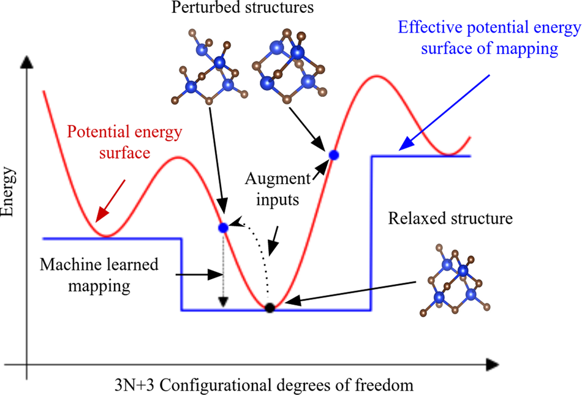

## Table of Contents

## What is graph data augmentation in the context of machine learning?

Graph data augmentation is a technique used in machine learning to improve the performance of models that work with graph-structured data. Graphs are made up of nodes and edges, where nodes can represent things like people in a social network, and edges can represent connections between them. In graph data augmentation, we create new or modified versions of these graphs to help the model learn better. This is similar to how we might flip or rotate images to train image recognition models. By adding more varied data, the model can become more robust and better at understanding different patterns and relationships within the data.

There are several ways to perform graph data augmentation. One common method is to add or remove nodes and edges randomly. For example, we might add a new edge between two nodes that weren't connected before, or remove an existing edge. Another method is to change the features of the nodes, like altering the attributes of a person in a social network. These changes help the model see different scenarios and learn to generalize better. By using these techniques, we can make our graph-based machine learning models more effective and reliable, especially when we don't have a lot of data to start with.

## Why is graph data augmentation important for improving machine learning models?

Graph data augmentation is important for improving machine learning models because it helps the models learn from more varied data. When we only have a small amount of data, the model might not see all the possible ways that nodes and edges can connect. By adding new or changing existing parts of the graph, we can show the model different scenarios. This makes the model better at understanding and predicting patterns, even if it sees something new that it hasn't seen before.

Using graph [data augmentation](/wiki/data-augmentation) also makes the model more robust. When we add or remove nodes and edges, or change the features of the nodes, we are essentially teaching the model to handle changes and noise in the data. This is important because real-world data is often messy and can change over time. By training the model with augmented data, it becomes better at dealing with these changes and making accurate predictions, which is crucial for many applications like social network analysis or drug discovery.

## What are the basic techniques used in graph data augmentation?

Graph data augmentation involves several basic techniques that help improve [machine learning](/wiki/machine-learning) models. One common technique is adding or removing edges. By adding new edges between nodes that were not originally connected, we can create new paths and connections in the graph. This helps the model learn about different ways nodes can be related. On the other hand, removing edges can break existing paths and force the model to find new ways to navigate the graph. This technique is useful because it shows the model different possible structures of the graph.

Another technique is adding or removing nodes. Adding new nodes can introduce new elements into the graph, which can represent new people in a social network or new compounds in a chemical graph. Removing nodes can simulate scenarios where certain elements are no longer present, helping the model learn to adapt to changes. Both of these actions help the model understand how the absence or presence of nodes can affect the overall structure and relationships within the graph.

Lastly, changing the features of nodes is also a key technique. In a graph where nodes have attributes, like age or interests in a social network, altering these attributes can create new variations of the graph. For instance, changing the age of a person or their interests can help the model learn how these changes impact their connections with others. This technique is crucial because it allows the model to generalize better across different scenarios, making it more robust and effective in real-world applications.

## How does canonical partition contribute to graph data augmentation?

Canonical partition is a way to split a graph into smaller parts that are easier to understand and work with. It's like sorting a big pile of toys into smaller groups based on their type or color. In graph data augmentation, using canonical partition helps us make new versions of the graph by mixing and matching these smaller parts. This can create new connections and patterns that the machine learning model hasn't seen before, which helps it learn better.

For example, if we have a graph representing a social network, we can use canonical partition to group people based on their interests. Then, we can swap these groups between different versions of the graph. This way, the model sees new combinations of people and their connections, which can make it better at understanding how different groups interact. By using canonical partition in this way, we can improve the model's ability to generalize and handle new data, making it more effective in real-world situations.

## What is local augmentation and how is it applied to graphs?

Local augmentation is a way to make small changes to a graph to help a machine learning model learn better. Instead of changing the whole graph at once, local augmentation focuses on making tweaks to small parts of the graph. This can be done by adding or removing edges between nearby nodes, or slightly changing the features of a single node. By doing this, we show the model different small scenarios it might see in real life, which helps it understand the graph better.

For example, in a social network graph, local augmentation might mean adding a new friendship between two people who are already friends with the same person. This small change can help the model learn how new connections might form in a social network. By making these small changes, we can create many different versions of the graph without changing its overall structure too much. This makes the model more robust and able to handle new data it hasn't seen before.

## Can you explain the difference between global and local graph augmentation techniques?

Global graph augmentation techniques involve making big changes to the whole graph at once. Imagine you have a picture of a big tree, and you decide to swap out the entire tree for a different one. That's like global augmentation. In a graph, this might mean adding or removing a lot of nodes and edges all over the graph, or changing the features of many nodes at the same time. By doing this, you create a completely new version of the graph, which can help the machine learning model see different big patterns and structures.

Local graph augmentation, on the other hand, focuses on making small changes to just a part of the graph. It's like if you took that same picture of a tree and only changed a few leaves or branches. In a graph, this could mean adding or removing just a few edges between nearby nodes, or tweaking the features of a single node. These small changes help the model learn about small, local patterns and relationships in the graph, without changing the overall structure too much. By using local augmentation, the model can become better at understanding how small changes might affect the graph.

Both global and local graph augmentation techniques are important for training machine learning models. Global augmentation helps the model see different overall structures, while local augmentation helps it understand small, detailed changes. Together, they make the model more robust and able to handle new data it hasn't seen before.

## How do you evaluate the effectiveness of graph data augmentation methods?

To evaluate the effectiveness of graph data augmentation methods, we look at how much the machine learning model improves after using the augmented data. We do this by comparing the model's performance before and after augmentation. We might use metrics like accuracy, which tells us how often the model's predictions are correct, or F1 score, which balances precision and recall. We also check if the model is better at handling new, unseen data by testing it on a separate set of graphs that it hasn't seen during training. If the model performs better with the augmented data, then the augmentation method is effective.

Another way to evaluate graph data augmentation is by looking at how well the model generalizes. This means we want to see if the model can make good predictions on different types of graphs, not just the ones it was trained on. We can measure this by using a technique called cross-validation, where we split the data into different parts and train the model multiple times, each time using a different part for testing. If the model's performance stays consistent across these different tests, it suggests that the augmentation method has helped the model learn important patterns that apply to many different graphs.

## What are some common challenges faced when implementing graph data augmentation?

One common challenge when implementing graph data augmentation is maintaining the original meaning of the graph. When we add or remove nodes and edges, we need to make sure that these changes still make sense in the context of what the graph represents. For example, in a social network, adding a random friendship between two people who have nothing in common might not reflect real-world relationships. This can lead to the model learning from unrealistic data, which can hurt its performance when it tries to make predictions on real data.

Another challenge is balancing the amount of augmentation. If we change the graph too little, the model might not see enough new patterns to learn from, and the augmentation won't be very effective. On the other hand, if we change the graph too much, we might end up with data that is too different from the original, which can confuse the model and make it harder for it to learn useful patterns. Finding the right balance is key to making sure the augmentation helps the model improve without overwhelming it with too many changes.

## How can graph data augmentation be integrated into existing machine learning pipelines?

To integrate graph data augmentation into existing machine learning pipelines, you start by identifying where in the pipeline the augmentation should happen. Usually, this is done before the model is trained, right after the data is preprocessed. You can add a step in your pipeline where you apply augmentation techniques like adding or removing edges and nodes, or changing node features. This new step will create multiple versions of your original graph data, which you can then use to train your model. By doing this, you make sure the model sees a variety of data, which can help it learn better and perform well on new data.

Once you have added the augmentation step, you need to adjust your training process to handle the augmented data. This might mean changing how you split your data into training and validation sets, or how you feed the data into your model. For example, you could use a technique called cross-validation to test the model on different versions of the augmented data. This helps you see if the augmentation is making the model better at generalizing to new graphs. By carefully integrating graph data augmentation into your pipeline, you can improve your model's performance without needing to completely change how you train it.

## What advanced strategies exist for graph data augmentation beyond canonical partition and local augmentation?

One advanced strategy for graph data augmentation is using generative models, like Graph Generative Adversarial Networks (Graph GANs). These models can create entirely new graphs that look similar to the original ones. By training a model to generate new graphs, you can get a lot of new data to train your machine learning model. This can be especially helpful if you don't have a lot of data to start with. The idea is that the generated graphs will help your model see more examples and learn better patterns.

Another advanced technique is using graph diffusion processes. This involves spreading changes across the graph in a way that mimics how information or influence might spread in real life. For example, if you change a node's feature, you can also slightly change the features of its neighbors to reflect how the change might affect them. This can help the model learn about how changes in one part of the graph might impact other parts. By using these strategies, you can create more realistic and varied augmented data, which can make your machine learning model more robust and effective.

## How does graph data augmentation impact the performance of graph neural networks?

Graph data augmentation helps graph neural networks (GNNs) perform better by giving them more data to learn from. When you have more data, the GNN can see different ways nodes and edges can connect, which helps it understand the graph better. For example, if you add or remove edges in a social network graph, the GNN can learn how new friendships might form or how the network might change over time. This makes the model more flexible and able to handle new situations it hasn't seen before.

Using graph data augmentation also makes GNNs more robust. By changing small parts of the graph, like adding a new edge or tweaking a node's features, the model learns to deal with noise and changes in the data. This is important because real-world data is often messy and can change a lot. By training the GNN with augmented data, it becomes better at making accurate predictions even when the graph it's working with is different from the one it was trained on. This makes GNNs more reliable and useful for tasks like predicting how diseases spread in a network or understanding chemical reactions.

## What future research directions are promising in the field of graph data augmentation?

One promising direction for future research in graph data augmentation is the development of more advanced generative models. Researchers could focus on creating better Graph Generative Adversarial Networks (Graph GANs) that can generate more realistic and diverse graphs. These models could learn to mimic the patterns and structures of real-world graphs more accurately, which would provide high-quality augmented data for training graph neural networks. By improving these generative models, we could make graph neural networks even more effective at tasks like drug discovery or social network analysis.

Another exciting area is the exploration of adaptive augmentation techniques. Instead of using the same augmentation methods for all graphs, future research could develop methods that change based on the specific characteristics of each graph. For example, if a graph is very dense, the augmentation might focus on removing edges to create more variety. If a graph is sparse, the augmentation might add more edges. This adaptive approach could help graph neural networks learn more efficiently and perform better on a wider range of graph types. By tailoring the augmentation to the graph's structure, we could improve the model's ability to generalize and handle new data.

## References & Further Reading

[1]: Rong, Y., Huang, W., Xu, T., & Huang, J. (2020). ["DropEdge: Towards Deep Graph Convolutional Networks on Node Classification."](https://arxiv.org/abs/1907.10903) arXiv preprint arXiv:1907.10903.

[2]: You, J., Ying, R., & Leskovec, J. (2018). ["Graph Contrastive Learning with Augmentations."](https://dl.acm.org/doi/abs/10.5555/3495724.3496212) Advances in Neural Information Processing Systems (NeurIPS).

[3]: Hamilton, W., Ying, Z., & Leskovec, J. (2017). ["Inductive Representation Learning on Large Graphs."](https://arxiv.org/abs/1706.02216) Advances in Neural Information Processing Systems 30 (NeurIPS 2017).

[4]: Wu, Z., Pan, S., Chen, F., Long, G., Zhang, C., & Yu, P. S. (2021). ["A Comprehensive Survey on Graph Neural Networks."](https://arxiv.org/abs/1901.00596) IEEE Transactions on Neural Networks and Learning Systems, 32(1), 4-24.

[5]: Velickovic, P., Cucurull, G., Casanova, A., Romero, A., Lio, P., & Bengio, Y. (2018). ["Graph Attention Networks."](https://arxiv.org/abs/1710.10903) International Conference on Learning Representations (ICLR).

[6]: Zhang, Z., Cui, P., & Zhu, W. (2020). ["Deep Learning on Graphs: A Survey."](https://ieeexplore.ieee.org/document/9039675) IEEE Transactions on Knowledge and Data Engineering, 34(1), 249-270.

[7]: Xu, K., Hu, W., Leskovec, J., & Jegelka, S. (2019). ["How Powerful are Graph Neural Networks?"](https://arxiv.org/abs/1810.00826) International Conference on Learning Representations (ICLR).